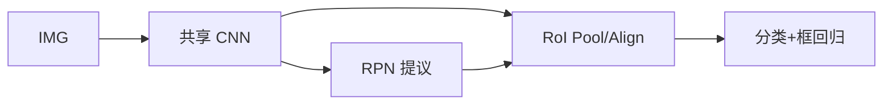

# R-CNN 族（R-CNN / Fast R-CNN / Faster R-CNN）

## 一句话定义

**两阶段检测**先产生候选区域，再对区域做分类与框回归；从 R-CNN 的独立 CNN 分类，经 Fast 的共享卷积与 RoI Pooling，到 Faster 的 **RPN** 内生提议，形成可端到端训练的经典精度路线。

## 英文缩写速查

| 缩写 | 英文全称 | 简要说明 |
|------|----------|----------|
| R-CNN | Region-based CNN | 区域提议+CNN 分类开端 |
| RoI | Region of Interest | 候选区域 |
| RPN | Region Proposal Network | Faster 的提议网络 |
| NMS | Non-Maximum Suppression | 抑制重叠框 |
| mAP | mean Average Precision | 检测精度指标 |

## 为什么重要

- 课程 3.2.1：理解单阶段检测与 DETR 之前，应先掌握两阶段基线。
- Faster R-CNN + FPN 长期是高精度离线标注/抓取感知的参照实现。

## 主要技术路线

| 路线 | 关键机制 | 典型用途 |
|------|----------|----------|
| R-CNN | 外部提议 + 每区独立 CNN | 历史基线、教学 |
| Fast R-CNN | 共享卷积 + RoI Pooling | 精度向两阶段 |
| Faster R-CNN | RPN 端到端提议 | 高精度离线检测/标注 |
| + FPN / Cascade | 多尺度与级联 refinement | 现代两阶段默认增强 |

## 核心原理

| 版本 | 关键变化 |
|------|----------|
| R-CNN | Selective Search 提议 → 每区裁剪缩放 → CNN+SVM |
| Fast R-CNN | 整图卷积 + RoI Pooling + 多任务损失 |
| Faster R-CNN | RPN 替代外部提议，与检测头共享骨干 |

## 工程实践

| 项 | 建议 |
|----|------|
| 框架 | Detectron2 / MMDetection Faster R-CNN |
| 机器人 | 高精度离线可以；闭环实时可改用单阶段检测器或 RT-DETR |
| 训练 | 预训练 ImageNet/COCO；注意 RoI Align |

## 局限与风险

延迟高于单阶段；提案数量与 NMS 超参敏感。端到端集合预测见 [DETR](../entities/detr.md)。

## 关联页面

- [目标检测评价指标](../concepts/object-detection-metrics.md)
- [Vision Backbones](../concepts/vision-backbones.md)

- [Object Detection](./object-detection.md)
- [YOLO](../entities/paper-yolo-unified-realtime-detection.md)
- [RetinaNet](../entities/retinanet.md)
- [Transformer CV 课程策展](../entities/transformer-cv-curriculum.md)

## 参考来源

- [Transformer 视觉应用课程大纲](../../sources/courses/transformer_cv_applications_syllabus.md)

## 推荐继续阅读

- [Faster R-CNN (NeurIPS 2015) arXiv:1506.01497](https://arxiv.org/abs/1506.01497)
