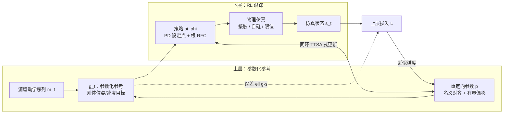

# ReActor（物理感知 RL 运动重定向）

**ReActor**（*Reinforcement Learning for Physics-Aware Motion Retargeting*，Müller 等，SIGGRAPH 2026 预印本 arXiv:2605.06593）把「人体运动学参考 → 目标机器人可执行参考」写成**物理仿真内**的联合求解：不是先离线做纯几何重定向再把结果交给下游，而是让**可学习的重定向参数**与**跟踪策略**在同一个双层目标下协同更新，使接触、自碰与脚滑等约束由仿真与奖励**内生化**。

## 为什么重要

- **伪影位置前移**：脚滑、自穿模、关节急动往往源于「运动学前端」与「动力学世界」脱节；把重定向放进带接触的仿真闭环，直接对准下游模仿学习对**参考可跟踪性**的需求。
- **与跟踪模仿的分工**：DeepMimic 类工作假设已有合理的形态内参考；ReActor 明确承担**跨形态生成参考**这一前置问题，并用 RFC 等松弛手段换得跨数据集单策略训练的可行性。
- **优化代价**：双层问题若严格对收敛后的下层求敏度，计算上极重；论文利用**误差仅依赖 \((\mathbf{g}-\mathbf{s})\) 形式**与对策略响应的标量近似，得到**无 Hessian 逆**的上层梯度估计，使单环交替更新可落地。

## 主要技术路线

| 层级 | 变量 | 作用 |
|------|------|------|
| **上层** | 重定向参数 \(\mathbf{p}\)（有界刚体偏移、全局尺度、逐运动竖直修正等） | 将源轨迹 \(\mathbf{m}_t\) 映射为参数化参考 \(\mathbf{g}_t(\mathbf{p})\)，最小化仿真 rollout 与 \(\mathbf{g}\) 的加权位姿/速度误差 |
| **下层** | 策略 \(\pi_\phi\) | 在 PD + 可选根残差力矩下最大化跟踪奖励，产生 \(\mathbf{s}_t\) |

用户输入主要是**标定姿态下的稀疏语义刚体对**与根对应；无需手工规定完整接触时间表。

## 流程总览（Mermaid）

## 与常见路线的关系

- **相对 GMR 等纯运动学重定向**：GMR 优先解决几何对齐与实时性；ReActor 把「像不像」与「仿真里跟不跟得上、有没有物理伪影」绑在同一目标里，更贴近「为 RL/IL 造参考」的终点指标。
- **相对 NMR**：NMR 用 **CEPR** 把 GMR 输出拉进仿真，再训练**独立前向网络**做快速推断；ReActor 不显式训练大网络，而是**在线联合优化 \(\mathbf{p}\) 与跟踪策略**，强调双层结构与近似梯度的算法侧贡献。
- **相对可微控制类（如 DOC）**：同属「物理一致参考」思路，但下层用 **RL** 处理非光滑接触与非可微项，上层梯度走**工程化近似**而非完整隐函数定理链。

## 局限与阅读时注意点

- **RFC 与动力学松弛**：根残差力矩降低跨动作、跨形态训练难度，但与「完全物理一致的人体动力学复现」不是同一目标；阅读实验需区分**参考质量指标**与**是否零辅助力**。
- **近似梯度假设**：\(\alpha\) 标量化策略响应对参考变化的灵敏度是算法核心假设，分布外形态或奖励重塑时需评估稳定性。
- **算力与调参**：单环双层 + 大规模动作库的训练成本高于单次运动学重定向；是否优于「高质量运动学 + 下游专用 tracking」取决于数据与硬件预算。

## 关联页面

- [Motion Retargeting（动作重定向）](../concepts/motion-retargeting.md) — 任务定义与分类坐标。
- [GMR（通用动作重定向）](./motion-retargeting-gmr.md) — 运动学前端基线与工程生态。
- [NMR（神经运动重定向与人形全身控制）](./neural-motion-retargeting-nmr.md) — 学习式整段映射 + 仿真修补监督的另一条主线。
- [DeepMimic](./deepmimic.md) — 「跟踪固定参考」的经典 RL 设定，可与本文「先造参考」对照。
- [Imitation Learning](./imitation-learning.md) — 下游如何利用高质量参考与奖励 shaping。
- [Locomotion](../tasks/locomotion.md) — 四足与人形步态参考在任务层的落点。

## 推荐继续阅读

- arXiv 摘要页：<https://arxiv.org/abs/2605.06593>
- arXiv HTML 全文：<https://arxiv.org/html/2605.06593v1>
- ACM Digital Library（正式录用信息以 TOG / SIGGRAPH 条目为准）：<https://doi.org/10.1145/3811378>

## 参考来源

- [reactor_rl_physics_aware_motion_retargeting（本入库摘录）](../../sources/papers/reactor_rl_physics_aware_motion_retargeting.md)
