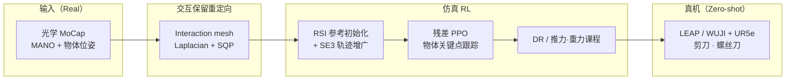

# REGRIND（重定向引导灵巧操作 RL）

**REGRIND**（*REtargeting-Guided ReINforcement learning for Dexterous manipulation*，Feng 等，arXiv:[2607.11874](https://arxiv.org/abs/2607.11874)，Cornell + Amazon FAR）把人形 WBT 上已验证的 **「重定向参考 + RL 跟踪」** 极简配方扩展到 **contact-rich 灵巧工具操作**（论文索引见 [REGRIND 论文实体页](../entities/paper-regrind-dexterous-manipulation.md)）。从 **单次光学动捕** 人手–物体演示出发，先做 **交互保留重定向**，再在仿真中用 **残差 RL** 跟踪 **物体-centric 关键点**，经 **系统辨识** 后 **零样本** 部署到 **LEAP / WUJI** 手，完成剪刀开合、螺丝刀旋转等任务。

## 英文缩写速查

| 缩写 | 英文全称 | 简要说明 |
|------|----------|----------|
| REGRIND | REtargeting-Guided ReINforcement learning for Dexterous manipulation | 本文方法名 |
| RL | Reinforcement Learning | 仿真中残差策略学习 |
| MoCap | Motion Capture | 光学动捕采集人手与物体位姿 |
| RSI | Reference State Initialization | 从参考轨迹采样 episode 初态以引导探索 |
| DR | Domain Randomization | 随机化摩擦、增益等以缩小 sim2real 间隙 |
| MANO | hand Model with Articulated and Non-rigid deformations | 21 点手部参数化模型 |

## 为什么重要

- **验证「重定向 + RL」能否跨到灵巧接触操作：** 相对 teleop-on-robot 或纯仿真 RL，REGRIND 用 **人类 MoCap** 作唯一演示，证明 **interaction-preserving retargeting** 对 downstream RL 与 sim2real 的关键性（相对 DexMachina、Mink IK 基线 scissors 任务 SR 从 **0–22%** 到 **~99%** 仿真 / **9/10** 真机）。
- **极简但完整的 real-to-sim-to-real 闭环：** 不重训 VLA、不依赖大规模机器人数据；把 **接触语义** 写进重定向 mesh，把 **任务进度** 写进物体关键点奖励，把 **探索** 交给 RSI + 训练时 SE(3) 增广。
- **系统总结灵巧 sim2real 难点：** 论文指出 manipulation 对摩擦、柔顺、几何误差 **比 loco 更敏感**；成功需 **观测/动作空间、DR/课程、系统辨识** 与 **交互保留参考** 共同作用。

## 主要技术路线

| 模块 | 输入 / 决策 | 作用 |
|------|-------------|------|
| **人类演示采集** | MANO 关键点 + 物体 6D（+ 铰接角） | 单次光学 MoCap；剪刀用 ARCTIC，螺丝刀自采 |
| **Interaction mesh 重定向** | 人手/物体语义关键点、机器人 URDF | Delaunay 四面体 mesh；最小化 Laplacian 形变能 + 平滑；Drake SQP + MOSEK；继承 OmniRetarget  formulation |
| **残差 RL 跟踪** | 重定向名义关节 $\bar{q}_t$、MoCap 物体观测 | $q^{\text{target}}=\bar{q}_t+\alpha\odot\pi_\theta$ → PD；**物体关键点**指数跟踪奖励 |
| **RSI + 动态增广** | 重定向轨迹分布 $\mu$ | 从参考采样重启；初始物体 ±5 cm / ±30° 时对整条参考做插值 SE(3) warp（不重解重定向） |
| **Sim2Real** | 仿真 DR、推力/重力课程 | 真机 MoCap 馈物体位姿；**系统辨识**；WUJI-Scissors 仍失败（非反驱 + mesh 误差） |

## 流程总览（Mermaid）

## 与常见路线的关系

- **相对 OmniRetarget / TopoRetarget：** 同用 **interaction mesh + Laplacian** 保留 hand–object 局部关系；REGRIND 强调 **单次演示 → 工具操作 RL → 真机** 全链，并给出与 **DexMachina、SPIDER** 的对照实验。
- **相对 SPIDER：** REGRIND 实验中 SPIDER 的 MPC 式动力学轨迹 **偏离演示、不适合 residual RL 初始化**（四任务仿真 SR **0%**）；REGRIND 选择 **运动学交互保留 + 闭环 RL** 修补动力学与 sim2real。
- **相对 DexMachina：** 后者 functional retargeting **不含交互 mesh**；scissors 等复杂几何任务仿真/真机 SR 显著低于 REGRIND，且真机易 **过度激进、利用仿真 artifact**。
- **相对人形 BeyondMimic 类 WBT：** 共享 **重定向参考 + residual tracking**，但 REGRIND 奖励与观测围绕 **物体关键点** 与 **接触丰富工具**，并专论 manipulation sim2real 敏感性。

## 实验要点（论文 Table 1–3）

| 设置 | REGRIND 主张 | 阅读提示 |
|------|--------------|----------|
| 仿真四任务 SR | **98.7–99.8%** | vs DexMachina scissors **0–22%**，Mink IK+RL **0–3%** |
| 真机（演示初态） | LEAP 剪刀 **9/10**，螺丝刀 **10/10**；WUJI 螺丝刀 **9/10** | WUJI-Scissors **0/10** |
| 初态泛化（±5 cm / ±30°） | 与演示初态性能接近（Table 3） | 增广在 RL 训练时动态生成 |

## 局限与风险

- **部署依赖 MoCap 物体状态：** 论文明确下一步需蒸馏为 **vision-based** 策略。
- **系统辨识不可省略：** 摩擦、增益、几何误差在 sustained contact 下快速累积。
- **单演示覆盖有限：** SE(3) 增广改善初态鲁棒性，但不等于新物体/新技能泛化。
- **embodiment 与资产：** LEAP 需放大工具；WUJI 剪刀失败提示 **网格与非反驱** 对 contact-rich 任务的硬约束。

## 关联页面

- [TopoRetarget（交互保留灵巧重定向）](./toporetarget-interaction-preserving-dexterous-retargeting.md) — 同族 interaction mesh + 下游 RL，侧重 Pen-Spin / Wuji 转笔。
- [SPIDER（物理感知采样式灵巧重定向）](./spider-physics-informed-dexterous-retargeting.md) — REGRIND 对照基线：并行仿真采样动力学 refinement。
- [OmniRetarget](../entities/paper-hrl-stack-03-omniretarget.md) — interaction mesh  formulation 来源。
- [Motion Retargeting Pipeline](../concepts/motion-retargeting-pipeline.md) — 本方法在「人类演示 → 参考 → RL」段的落点。
- [Manipulation（操作）](../tasks/manipulation.md) — contact-rich 工具操作任务背景。

## 推荐继续阅读

- 论文摘要页：<https://arxiv.org/abs/2607.11874>
- 项目首页（视频）：<https://www.yunhaifeng.com/REGRIND/>
- 官方代码：<https://github.com/yunhaif/regrind>

## 参考来源

- [regrind_arxiv_2607_11874（本入库摘录）](../../sources/papers/regrind_arxiv_2607_11874.md)
- [regrind-project-yunhaifeng（项目页索引）](../../sources/sites/regrind-project-yunhaifeng.md)
- [regrind（官方仓库）](../../sources/repos/regrind.md)
