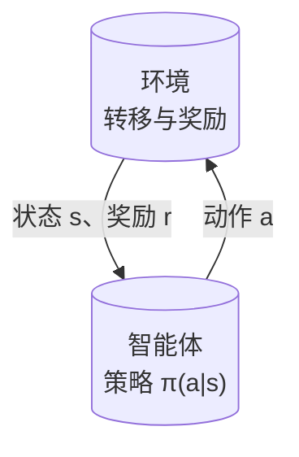
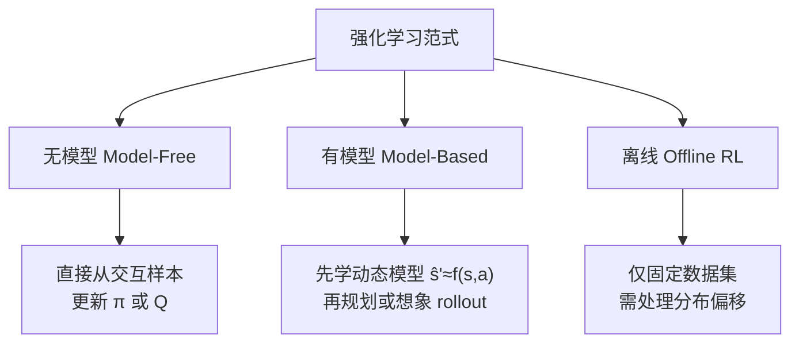
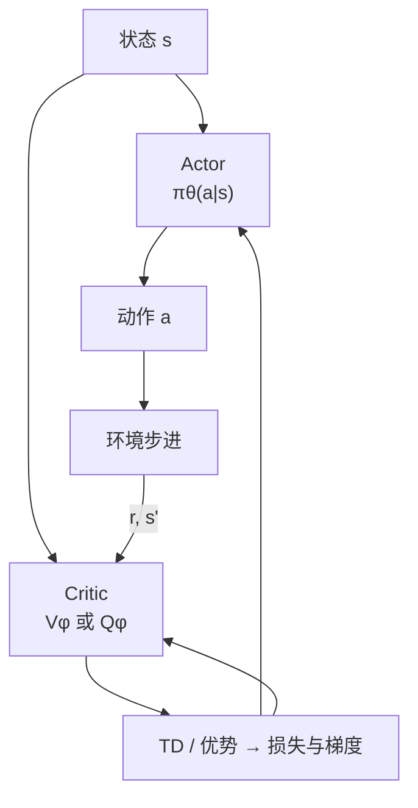

# Reinforcement Learning (RL, 强化学习)

**强化学习 (Reinforcement Learning)**：通过与环境交互，以最大化累积奖励 (Reward) 为目标学习决策策略的机器学习范式。

## 一句话定义

不需要告诉机器人“怎么做”，只需要告诉它“做得好不好”，让它自己从 PPO 等算法中摸索出最优动作序列。

## 核心框架：MDP

强化学习问题通常建模为马尔可夫决策过程 (MDP)：

- **状态** $s$：机器人当前感知到的环境信息
- **动作** $a$：机器人可以采取的行动
- **奖励** $r$：环境给机器人的反馈信号
- **策略** $\pi(a|s)$：在每个状态下选择动作的规则
- **折扣因子** $\gamma$：未来奖励的重要性

目标：找到最优策略 $\pi^*$ 最大化期望累积折扣奖励。

下面用流程图表示 **智能体–环境闭环**：每一步由当前状态选动作，环境返回奖励与下一状态，循环构成 MDP 上的数据流。



## 主要分类

从「是否显式学环境模型」与「是否允许在线与环境交互」两个角度，可把常见 RL 路线粗分为三类（下图与后文小节一一对应）：



### 无模型（Model-Free RL）
不学习环境模型，直接从交互数据学习策略。这是目前人形机器人 Locomotion 最主流的方法。

代表算法：
- **Policy Gradient (策略梯度)**：直接优化策略。
    - **PPO (Proximal Policy Optimization)**：目前工业界和学术界最稳健、最常用的策略梯度算法。
    - **[deepmimic](deepmimic.md)**：经典的显式轨迹跟踪模仿学习。
    - **[amp-reward](amp-reward.md)**：基于判别器的对抗性动作先验学习。
    - **[ase](ase.md) / [smp](smp.md)**：更先进的层次化技能嵌入与生成式动作先验。
    - **BRRL / BPO (2026)**：有界重要性比强化学习，为 PPO 提供理论支撑并提升训练稳定性。
    - **REINFORCE**：最基础的策略梯度方法。
- **Q-Learning**：学习状态-动作价值函数 (Q-function)。
    - **DQN**：深度 Q 网络，适用于离散动作。
- **Actor-Critic (行动者-评论家)**：结合两者优势。
    - **PPO**：通常以 Actor-Critic 架构实现。
    - **SAC (Soft Actor-Critic)**：样本效率极高的 Off-policy 算法。
    -     **TD3**：改进的 DDPG。

**Actor–Critic** 同时维护策略网络与价值网络；Critic 提供 bootstrap / 优势估计，Actor 据此更新策略。信息流可概括为：



### 有模型（Model-Based）
先学习环境动态模型，再用模型做 planning。

代表：
- Dreamer, MuZero, PETS, MBRL

### 离线强化学习（Offline RL）
从固定数据集中学习，不允许和环境交互。

代表：CQL, IQL, Decision Transformer

## 在机器人控制中的典型应用

- 四足/双足行走
- 人形机器人全身控制
- 机械臂操作
- 多指灵巧手操作

## 优势

- 能处理高维状态/动作空间
- 不需要精确建模
- 能发现人工难以设计的复杂策略

## 局限

- Sample efficiency 低（需要大量交互）
- Reward 设计困难
- 安全性难以保证（尤其是真实机器人上）
- 训练不稳定
- **全流式（batch=1、无 replay）** 时，单步梯度尺度噪声无法被 minibatch 平均，价值与策略头易出现过大/过小交替更新；近年工作用 **意图更新（intentional updates）** 在输出空间反解步长以稳定跟踪，见 [Intentional Updates for Streaming RL](./intentional-updates-streaming-rl.md)。

## Model-Free vs Model-Based 对比

| 维度 | Model-Free RL | Model-Based RL |
|------|--------------|----------------|
| **代表算法** | PPO, SAC, TD3 | Dreamer, MBPO, PETS, TD-MPC |
| **样本效率** | 低（需大量真实交互） | 高（模型生成虚拟经验） |
| **渐近性能** | ✅ 理论上最优 | ⚠️ 受模型精度限制 |
| **实现复杂度** | ✅ 低 | ❌ 高（学模型 + 策略） |
| **计算开销** | ✅ 推理直接 | ❌ 推理时需规划 |
| **机器人应用** | Locomotion（高频控制） | 操作任务、真实机器人少样本 |
| **Sim2Real** | 依赖域随机化 | 适配模块（RMA 类） |

两者不互斥：Model-Based 方法（如 RMA Adaptation Module）常与 Model-Free 策略结合。

下图为两种范式的 **数据与决策主干** 对比（省略实现细节；真实系统常混合使用）。

```mermaid
flowchart LR
  subgraph MF["Model-Free"]
    direction TB
    I1[交互轨迹] --> U1[直接更新<br/>π 或 Q]
    U1 --> I1
  end
  subgraph MB["Model-Based"]
    direction TB
    I2[交互轨迹] --> M[学习模型<br/>ŝ'≈f(s,a)]
    M --> P[规划 / 想象 rollout]
    P --> Pi[策略或动作选择]
    Pi --> I2
  end
```

## 和其他方法的关系

- **vs 模仿学习**：RL 自己探索，IL 跟随专家。IL 样本效率高但依赖专家数据；RL 可超越专家但训练难。见 [RL vs IL 对比](../comparisons/rl-vs-il.md)。
- **vs 最优控制**：RL model-free，最优控制 model-based。两者在 [Model-Based RL](./model-based-rl.md) 中逐渐融合。
- **vs 深度学习**：现代机器人 RL 通常用 [深度学习基础](../concepts/deep-learning-foundations.md) 中的神经网络做策略/价值函数逼近。
- **vs WBC**：RL 学习型，WBC 优化型。见 [WBC vs RL](../comparisons/wbc-vs-rl.md)。

## 参考来源
- [sources/papers/intentional_streaming_rl.md](../../sources/papers/intentional_streaming_rl.md) — 流式 RL 意图更新（Intentional TD / PG）ingest 档案
- [KungFuAthleteBot](../../sources/papers/kung_fu_athlete_bot.md)

- Sutton & Barto, *Reinforcement Learning: An Introduction* — RL 标准教材，MDP 框架基础
- Schulman et al., *Proximal Policy Optimization Algorithms* — 机器人领域最常用的 policy gradient 算法
- Ao et al., *Bounded Ratio Reinforcement Learning* (2026) — BRRL / BPO，策略优化新进展
- [sources/papers/policy_optimization.md](../../sources/papers/policy_optimization.md) — 策略优化（PPO/SAC/BRRL）ingest 档案
- [sources/papers/locomotion_rl.md](../../sources/papers/locomotion_rl.md) — locomotion RL ingest 摘要（AMP/ASE 等）
- [sources/papers/sim2real.md](../../sources/papers/sim2real.md) — sim2real 与策略迁移相关论文摘录
- [Locomotion RL 论文导航](../../references/papers/locomotion-rl.md) — 机器人 RL 应用论文集合
- [机器人论文阅读笔记：PPO](https://imchong.github.io/Humanoid_Robot_Learning_Paper_Notebooks/papers/01_Foundational_RL/PPO_Proximal_Policy_Optimization/PPO_Proximal_Policy_Optimization.html)
- [机器人论文阅读笔记：AMP](https://imchong.github.io/Humanoid_Robot_Learning_Paper_Notebooks/papers/01_Foundational_RL/AMP_Adversarial_Motion_Priors_for_Stylized_Physics-Based_Character_Control/AMP_Adversarial_Motion_Priors_for_Stylized_Physics-Based_Character_Control.html)
- [机器人论文阅读笔记：ASE](https://imchong.github.io/Humanoid_Robot_Learning_Paper_Notebooks/papers/01_Foundational_RL/ASE_Adversarial_Skill_Embeddings_for_Large-Scale_Motion_Control/ASE_Adversarial_Skill_Embeddings_for_Large-Scale_Motion_Control.html)

## 关联页面
- [深度学习基础](../concepts/deep-learning-foundations.md)

- [Intentional Updates for Streaming RL](./intentional-updates-streaming-rl.md) — batch=1、无 replay 时的步长与稳定跟踪
- [Imitation Learning](./imitation-learning.md)
- [Sim2Real](../concepts/sim2real.md)
- [Whole-Body Control](../concepts/whole-body-control.md)
- [Locomotion](../tasks/locomotion.md)
- [WBC vs RL](../comparisons/wbc-vs-rl.md)
- [Model-Based RL](./model-based-rl.md) — 利用世界模型提升样本效率
- [Hindsight Experience Replay (HER)](./her.md) — 解决稀疏奖励任务的技巧
- [Multi-Agent RL (MARL)](./marl.md) — 多机器人协同与竞争
- [Generalized Advantage Estimation (GAE)](./gae.md) — 优势函数估计标准方法
- [Safe RL](../methods/safe-rl.md) — 满足硬安全约束的 RL 训练
- [RL vs Imitation Learning](../comparisons/rl-vs-il.md)（与 IL 的系统性对比）
- [PPO vs SAC](../comparisons/ppo-vs-sac.md)（on-policy vs off-policy 算法的系统性对比）
- [Curriculum Learning](../concepts/curriculum-learning.md) — 课程学习：解决稀疏奖励和训练效率问题的重要训练策略
- [Query：人形机器人 RL 实战 Cookbook](../queries/humanoid-rl-cookbook.md)
- [Bellman 方程](../formalizations/bellman-equation.md) — 所有 RL 算法的数学根基：最优值函数满足 Bellman 最优方程
- [MDP](../formalizations/mdp.md) — RL 的形式化框架，Bellman 方程定义在 MDP 上

## 继续深挖入口

如果你想沿着 RL 继续往下挖，建议从这里进入：

- [Robot Learning Overview](../overview/robot-learning-overview.md) — 机器人学习全景

### 论文入口
- [Locomotion RL 论文导航](../../references/papers/locomotion-rl.md)
- [Survey Papers](../../references/papers/survey-papers.md)

### 开源框架入口
- [RL Frameworks](../../references/repos/rl-frameworks.md)
- [Simulation](../../references/repos/simulation.md)
