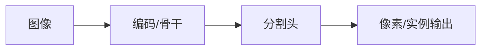

# SegNet

## 一句话定义

SegNet 用编码器池化索引指导解码器非对称上采样，节省存储的同时恢复边界，是早期高效语义分割架构。

## 英文缩写速查

| 缩写 | 英文全称 | 简要说明 |
|------|----------|----------|
| SegNet | SegNet | 池化索引上采样分割网 |
| Pool idx | Pooling Indices | 记录最大值位置 |
| Encoder | Encoder | VGG 式卷积编码 |
| mIoU | mean IoU | 评测指标 |
| Memory | Memory footprint | 相对保存全特征图更省 |

## 为什么重要

- 课程 4.2 的 CNN 分割主线节点，为理解 SETR/SegFormer 提供对照。
- 机器人侧仍大量使用 U-Net/Mask R-CNN 类结构做缺陷、可抓取与语义图层。

## 主要技术路线

| 路线 | 机制 | 说明 |
|------|------|------|
| SegNet | 池化索引上采样 | 省显存边界恢复 |
| 编码器变体 | VGG 式骨干 | 与分类网权重共享 |
| 对比转置卷积 | 索引 vs 学习上采样 | 参数量权衡 |

## 核心原理

解码器不学习密集转置卷积权重，而根据编码器 max-pool 索引把特征放回原位置再卷积细化。

## 工程实践

| 项 | 建议 |
|----|------|
| 数据 | ADE20K/Cityscapes/自有掩码；注意类别映射 |
| 损失 | 交叉熵 / Dice / 辅助头按论文配置 |
| 部署 | 测全分辨率延迟；机载可降输入尺寸 |

## 局限与风险

CNN 分割受感受野与多尺度模块设计约束；开放集与提示分割需看 SAM/SEEM。标注噪声会直接体现在边界指标上。

## 关联页面

- [分割任务分类](../concepts/image-segmentation-taxonomy.md)
- [SETR](../entities/setr.md)
- [SegFormer](../entities/segformer.md)
- [Transformer CV 课程策展](../entities/transformer-cv-curriculum.md)

## 参考来源

- [Transformer 视觉应用课程大纲](../../sources/courses/transformer_cv_applications_syllabus.md)

## 推荐继续阅读

- [原论文](https://arxiv.org/abs/1511.00561)
