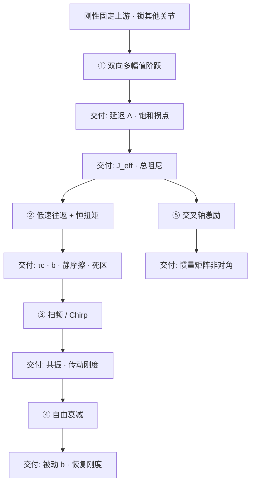

# Sim2Real Joint SysID Experiment Design（关节动力学辨识实验设计）

**Sim2Real 关节动力学辨识实验设计**：在把 $J_{\mathrm{eff}}$、摩擦、延迟、饱和写进仿真之前，先设计让每个参数暴露在**独有现象**里的工况。它回答「这组实验能不能把参数分开」，不是「用 OLS 还是 CMA-ES」（那是 [关节执行器参数辨识](./joint-actuator-parameter-identification.md)）。

## 一句话定义

**观测只约束输入–输出映射；纠缠参数要换实验而不是换优化器。延迟先于惯量，摩擦先于动态段，柔性放最后。**

## 英文缩写速查

| 缩写 | 英文全称 | 简要说明 |
|------|----------|----------|
| SysID | System Identification | 用真机数据校准仿真/控制模型参数 |
| PD | Proportional–Derivative | 位置环 $K_p$、$K_d$；本页默认关节控制模式 |
| Chirp | Chirp Signal | 频率随时间连续扫过的正弦激励 |
| FRF | Frequency Response Function | 扭矩→位置的幅频/相频；扫频或 Chirp 的产物 |
| Sim2Real | Simulation to Real | 仿真策略迁移到真机；本页服务其物理基准 |
| IMU | Inertial Measurement Unit | 用基座反向运动判断固定是否足够 |

## 为什么重要

强化学习策略从仿真上真机，常见麻烦不是「某个参数差了一点」，而是几个参数的影响长得太像：惯量偏大与延迟未建模都让响应变晚；摩擦与阻尼都让曲线衰减更快。盯着一条曲线调到贴合，换幅值、方向或关节后又崩。

整机行走一次失败只给一个标量（摔或不摔），却要反推几十个参数。单关节实验把未知量降一个数量级，把观测量变成连续曲线——但若实验本身分不开参数，再强的拟合也只是换一套伪装。

## 核心原理

### 单关节 PD 闭环只给两个数

无机械弹簧时，恢复刚度全由控制器 $K_p$；总阻尼是 $K_d$ 与被动黏性 $b$ 之和。闭环

$$
\omega_n=\sqrt{K_p/J_{\mathrm{eff}}},\qquad \zeta=\frac{K_d+b}{2\sqrt{K_p J_{\mathrm{eff}}}}
$$

**$\omega_n$ 是时间尺度，$\zeta$ 是形状。** 只动 $K_d$ 不改 $\omega_n$，但会改上升/调节时间。按阶跃幅值与 $\omega_n$ 归一化后，线性响应被 $(\omega_n,\zeta,\Delta)$ 唯一确定。不同幅值归一化曲线不重合，本身就是非线性证据。

$J_{\mathrm{eff}}$ 含连杆惯量 **加上** 转子/减速器折算项 $J_r G^2$。高减速比时后者常是主项；仿真 `armature` 就是这项物理量，随手改等于改时间尺度。见 [Armature Modeling](../concepts/armature-modeling.md) 与 [连杆 vs 转子惯量](../concepts/robot-link-and-rotor-inertia.md)。

### 未进二阶模型、但指纹不同的项

| 项 | 时域指纹 | 为何能分开 |
|----|----------|------------|
| 纯延迟 $\Delta$ | 整段平移；阶跃后头 $\Delta$ 秒扭矩为零 | 频域只改相位、不改幅值；与幅值/增益无关 |
| 摩擦 | 小阶跃占主导 | $\tau_c$ 与幅值无关，驱动力矩正比于幅值 |
| 饱和 | 有阈值；超过后变慢、峰值受限 | 软件扭矩与限幅后扭矩分岔 → 剔除该段 |
| 链路增益 $k_t$ | 不改形状、只缩放力矩 | 与 $J$ 完全等价；位置曲线给出 $J/k_t$ 而非 $J$ |

$\Delta$ 是通信、计算、驱动器、电机带宽的**合成等效量**，不是某一段的物理时间。$k_t$ 未必是常数（随工作点/转速变）。

### 三条原则

**原则一：实验约束映射，不约束参数。** 位置 PD 下把 $J,K_p,K_d$ 同时乘 $\alpha$，轨迹不变——这不是精度问题，是结构性不可辨识。扭矩通道里 $K_p$ 无法被约掉，所以记录里扭矩不能省。

**原则二：分开两个参数，必须找到它们表现不同的工况。** 近似不可辨识时，换实验或换观测量，不要换更强优化器。

| 纠缠的一对 | 阶跃里为什么分不开 | 什么工况能分开 |
|------------|--------------------|----------------|
| $\Delta$ ↔ $J$ | 都让响应「变晚」 | 扭矩起效时刻；或频域（延迟只改相位） |
| 库仑 $\tau_c$ ↔ 黏性 $b$ | 单向速度段常数力矩可被线性项拟合 | 多档恒定低速：截距差 vs 斜率 |
| 静摩擦/死区 ↔ 低 $K_p$ | 都表现为「走不到位」 | 多幅值：摩擦相对影响 $\propto 1/A$ |
| 控制器 $K_d$ ↔ 机械 $b$ | 位置曲线只看到二者之和 | 扫多个 $K_d$，外推到 $K_d=0$ |
| 结构柔性 ↔ 大阻尼 | 都让振荡衰减「不对」 | 扫频：柔性有局部峰谷，阻尼全局压平 |
| 惯量耦合 ↔ 两独立关节 | 单轴只看到对角投影 | 交叉轴：一轴输入看另一轴输出 |

**原则三：按可分离程度排序，逐级固定。** 每一级把上一级当已知量；顺序反了，未建模误差会被后面的参数吸收。

## 主要技术路线

按可分离程度从前往后，不要把全部参数一次丢给优化器。估完之后的拟合算法（OLS / CMA-ES）见 [关节执行器参数辨识](./joint-actuator-parameter-identification.md)。

| 路线 | 机制 | 交付 | 需要什么 |
|------|------|------|----------|
| ① 双向多幅值阶跃 | 时间戳定 $\Delta$，再拟合 $(\omega_n,\zeta)$ | 延迟、饱和拐点、$J_{\mathrm{eff}}$、总阻尼 | 最好有扭矩通道 |
| ② 低速往返 + 恒扭矩 | 准静态让惯量项消失 | $\tau_c$、$b$、静摩擦、死区（分方向） | 恒速或缓增力矩 |
| ③ 扫频 / Chirp | 频域指纹分离延迟/惯量、柔性/大阻尼 | 共振、传动刚度、结构阻尼 | 小幅扭矩激励更干净 |
| ④ 自由衰减 | 齐次方程读特征根；扫 $K_d$ 外推 $b$ | 被动阻尼、恢复刚度 | 能安全回摆的关节 |
| ⑤ 交叉轴激励 | 一轴输入看另一轴 $\tau$ | 惯量矩阵非对角 | 并联机构 |

## 流程总览

越靠前越不依赖模型假设。回归验证对不上某类特征时，回到交付该特征的那一级重测，而不是在下游反复调参。

## 工程实践

### 实验前提（每一条对应一种污染机制）

- **刚性固定上游连杆**：自由基座把 $J_{\mathrm{eff}}$ 退化成约化惯量 $I_b I_\ell/(I_b+I_\ell)$，同一力矩加速度更大，会被误判为惯量偏小。踝（下游轻）可在 IMU 验证后仅悬挂；膝/髋必须刚性固定躯干。吊带只作保护，不要把吊摆自由度拟合进关节参数。
- 其他关节锁死；正反两方向；幅值/速度分档；避开限位与持续饱和；每条件重复 ≥3 次；控制/状态/日志同一时间戳。
- **记录量**：位置目标或扭矩指令、实际位置/速度、软件扭矩、限幅后扭矩、电机反馈扭矩或电流、电机角、当前增益、温度、电压。

### ① 阶跃：入口，但只是入口

从小幅值逐级放大，为超调、延迟续走、制动距离和重复波动留裕量。撞限位等于切换成另一套接触动力学，该段作废。

**有可信扭矩时**，摩擦与重力另行测定后，在明显加速且未饱和窗对 $\tau \approx J\alpha + \mathrm{bias}$ 线性回归，斜率即 $J$。不要逐点相除（$\alpha$ 过零会炸）。这条开环路与延迟无关。

**只有位置时**，起始段是二次曲线 $q\approx (K_p A/(2J))t^2$，贴地一小段看起来像「晚启动」。优化器会加大 $J$ 来伪装 $\Delta$。能读扭矩时间戳就直接量 $\Delta$；否则对多组幅值/增益把「越过小阈值的时间」对 $1/\sqrt{K_p A}$ 作图，**截距才是 $\Delta$**。然后把 $\Delta$ 固定，用整段归一化曲线拟合 $(\omega_n,\zeta)$，超调/峰值时间只当初值。正负方向或不同幅值无法共享参数 → 承认方向性/饱和/位置相关，而不是强迫常数模型。

由 $K_p$ 反算 $J$ 时，增益必须折算到关节侧，且隐含 $k_t=1$。若 $k_t\neq 1$，得到的是 $J/k_t$。闭环路径（靠 $K_p$）与开环路径（靠扭矩×加速度）误差源不同，应当交叉校验：闭环偏大优先怀疑未建模延迟或 $k_t$；开环偏大优先怀疑摩擦扣除不足。

### ② 低速往返与恒扭矩：把摩擦单独逼出来

单次阶跃速度单向，库仑项退化成常数偏置，可被黏性项替代。破解：库仑与 $|\dot q|$ 无关，黏性与速度成正比。多档恒速把扭矩对速度作图——**截距差是库仑，斜率是黏性**；过零弯曲/回线提示 Stribeck、死区或回差。速度模式最干净；只有位置环时用低频三角波（分段恒速），正弦只在过零附近近似恒速。换向加减速段丢掉。

恒扭矩：重力补偿后从零缓增力矩，记录首次持续运动的阈值。启动后力矩回落仍能维持低速，本身就是 $F_s>F_c$ 的证据。正负阈值半差给摩擦、半和给偏置；多姿态可再分重力（随姿态变）与预紧（不变）。不要用「稳态误差 × $K_p$」反推摩擦：窗口结束时可能还在回落，且不同位置的重力/预载无法分离。

模型细节见 [Joint Friction Models](../concepts/joint-friction-models.md)。

### ③ 频域：延迟 vs 惯量、柔性 vs 大阻尼

| 机制 | 幅频 | 相频 |
|------|------|------|
| 纯延迟 $e^{-j\omega\Delta}$ | 不变 | 随 $\omega$ 线性下滑 |
| 纯惯量 $1/(J s^2)$ | $-40\,\mathrm{dB/dec}$ | 恒为 $-180^\circ$ |
| 柔性 | 局部共振峰 / 反共振谷 | 该频段额外相位 |
| 加大阻尼 | 整条曲线被压平 | 无尖峰 |

优先小幅**扭矩**激励，测的才接近开环机械对象。位置目标得到的是闭环，共振峰位置由 $K_p$ 决定，不等于机械模态。共振处放大约 $1/(2\zeta)$，必须设自动中止。Chirp 效率高，但扫得太快测到的不是稳态；宜先离散扫频找安全频段。

### ④ 自由衰减：从总阻尼里剥 $b$

撤激励后方程齐次。若驱动器仍在跑 PD，看到的是 $K_d+b$ 不是 $b$。黏性：振幅等比衰减、理论上不停；库仑：等差衰减、有限时间停住。真正分开 $K_d$ 与 $b$：多个 $K_d$ 下重复，总阻尼对 $K_d$ 作直线，斜率 $\propto 1/\omega_n$ 相关项、截距含 $b$。直接失能可能切入抱闸或反电动势制动。高减速比难反驱时回到恒扭矩/低速往返。

### ⑤ 并联机构：惯量是矩阵

电机角 $\theta$ 与抽象关节 $q$ 在某姿态线性化为 $\dot\theta = J(q)\dot q$，则 $M_{\mathrm{eff}}=J^\top I_m J$。即使 $I_m$ 对角，只要 $J$ 的两列不正交，非对角耦合就非零——这是并联的定义，不是装配缺陷。`armature` 只加质量矩阵对角，**装不下非对角**；耦合显著必须显式并联模型。实验至少：两单轴阶跃 + 一组合方向，并同时记两轴力矩——只激励轴 1、轴 2 被约束时 $\tau_2$ 直接读非对角。几何映射见 [人形并联关节解算](../concepts/humanoid-parallel-joint-kinematics.md)。

### 曲线特征速查（辨识顺序，不是绝对因果）

| 曲线特征 | 优先对应 | 不应优先归因 |
|----------|----------|--------------|
| 整段响应平移，且不随幅值/增益变 | $\Delta$ | 惯量 |
| 时间尺度按 $\sqrt{J/K_p}$ 缩放 | $J_{\mathrm{eff}}$、$k_t$、$K_p$ | 库仑摩擦 |
| 超调与振荡衰减 | $\zeta$、机械阻尼、柔性 | 纯延迟 |
| 小阶跃不启动 | 静摩擦、死区、预紧 | 大惯量 |
| 正负不对称 | 方向摩擦、重力、装配偏置 | 对称黏性 |
| 大阶跃变慢且峰值受限 | 电流/扭矩/速度饱和 | 线性惯量变化 |
| 第二时间尺度振荡 | 传动弹性 | 单刚体 PD |
| 低速有限时间停住 | 库仑/静摩擦 | 纯黏性 |
| 一轴输入激发另一轴 | 并联雅可比 / 惯量耦合 | 两个独立标量关节 |

## 局限与风险

1. **本文默认电机响应 + 位置 PD。** 换成电流环、速度环或不同传动，原则仍适用（先建模、再判断谁和谁分不开、再设计分开它们的实验），系数表不能照抄。
2. **无官方代码。** 做法与判据来自工程方法文，不是可复现仓库；估完参数后的算法入口仍走 [关节执行器参数辨识](./joint-actuator-parameter-identification.md)（FloBaRoID / BAM / PACE）。
3. **$k_t$ 与 $J$ 在位置曲线上不可分。** 没有独立扭矩标定，就不要把闭环反算的数直接当成 MuJoCo `armature`。
4. **固定基座的 $J_{\mathrm{eff}}$ 不能直接当行走参数。** 真机浮动基会再耦合；本页交付的是单关节驱动链，全身惯量还要回到刚体 SysID。
5. **后续案例未发布。** 原文预告从原始日志走到仿真填值的案例；入库时只有方法，没有真机数字可引用。

## 关联页面

- [关节执行器参数辨识](./joint-actuator-parameter-identification.md) — 算法选型：Fourier+OLS vs CMA-ES；本页是其「实验能不能分开」前置
- [System Identification](../concepts/system-identification.md) — 刚体 / 执行器 / 接触分层总览
- [Armature Modeling](../concepts/armature-modeling.md) / [连杆与转子惯量](../concepts/robot-link-and-rotor-inertia.md)
- [Joint Friction Models](../concepts/joint-friction-models.md)
- [人形并联关节解算](../concepts/humanoid-parallel-joint-kinematics.md) — 几何雅可比；本页补有效惯量矩阵与 `armature` 容量
- [Sim2Real](../concepts/sim2real.md) / [闭环误差分层工程](../queries/sim2real-closed-loop-engineering.md)
- [执行器驱动链选型闭环](../queries/actuator-drive-chain-selection-loop.md) / [驱动链枢纽](../overview/hub-actuator-drive-chain.md)
- [PACE](../entities/paper-pace-sim2real-legged-robots.md) / [BAM](../entities/bam-better-actuator-models.md) / [FloBaRoID](../entities/flobaroid.md)

## 参考来源

- [自由度FreeDof：Sim2Real 动力学辨识（微信公众号，2026-08-12）](../../sources/blogs/wechat_freedof_sim2real_dynamics_identification.md)
- [原文抓取](../../sources/raw/wechat_freedof_sim2real_dynamics_identification_2026-08-12.md)

## 推荐继续阅读

- 原始公众号文：<https://mp.weixin.qq.com/s/B_sH9VNRxB6GCTJwnx6esQ>
- PACE 悬空 chirp + CMA-ES 关节参数：<https://pace.filipbjelonic.com/usage/>
- BAM 摆锤辨识文档：<https://bam.readthedocs.io/en/latest/identification/index.html>
