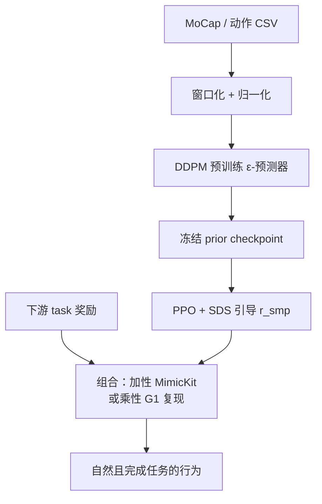

# SMP: 基于得分匹配的可复用运动先验

**SMP** 代表了从对抗模仿学习（如 [AMP](./amp-reward.md)）向生成式先验引导学习的范式演进。它将复杂的运动分布建模为一个连续的得分场（Score Field），并以此指导 RL 策略。

## 核心技术路线

### 1. 冻结的扩散模型作为奖励
与 AMP 不同，SMP 不需要判别器与策略共同训练。
- **预训练**：在动作数据集上预训练一个扩散模型。
- **冻结奖励**：在 RL 阶段，扩散模型被冻结，不再需要原始数据集。

### 2. SDS (Score Distillation Sampling)
SMP 借鉴了文本转图像领域的 SDS 技术：
- 策略生成的动作片段被添加噪声，然后输入扩散模型。
- 扩散模型预测噪声，其预测值与实际添加噪声的差异被转化为奖励：
  $$r_{SMP} = -\mathbb{E}_{t, \epsilon} [ \| \epsilon - \epsilon_\theta(x_t; t) \|^2 ]$$

### 3. ESM (Ensemble Score-Matching)
通过在多个噪声水平上聚合评估结果，降低奖励方差。

### 4. GSI (Generative State Initialization)
利用冻结 prior 采样 motion window 作为 reset 初态，并 priming 在线运动特征缓冲，使 SDS 奖励从第一步起有效；RL 阶段无需再访问原始 MoCap 轨迹库。

## 训练管线（概念）

## G1 + mjlab 工程复现

[MimicKit](../entities/mimickit.md) 提供论文级 SMP 参考实现，但 **未内置 Unitree G1**。[SUZ-tsinghua/smp](../entities/smp-g1-mjlab.md) 在 [mjlab](../entities/mjlab.md) 上补齐 G1 特征维度（59-d/帧）、四套任务（Forward / Steering / Location / Getup）与三套 **预置 prior**；奖励上可选 **乘性** `r = task × r_smp`，避免 MimicKit 加性形式中 `task_reward_weight : smp_reward_weight` 的敏感手调。与 [AMP_mjlab](../entities/amp-mjlab.md) 对照时：前者是 **生成式冻结先验**，后者是 **对抗判别器 + 参考 clip**。

## 主要技术路线
| 阶段 | 关键技术 | 说明 |
|------|---------|------|
| **先验建模** | Diffusion / Score-based Model | 学习专家动作的概率密度梯度场 |
| **策略优化** | Score Distillation | 将生成模型的得分作为 RL 的外部奖励信号 |
| **初始化** | GSI (Generative State Initialization) | 利用生成模型代替传统 RSI 数据集采样 |

## 关联页面
- [SMP on G1（mjlab 复现）](../entities/smp-g1-mjlab.md) — G1 端到端复现、预置 prior 与乘性奖励设计。
- [MimicKit](../entities/mimickit.md) — 原版 SMP / AMP / ADD 统一代码底座。
- [protomotions](../entities/protomotions.md) — 提供大规模并行训练支持。
- [概率流形式化](../formalizations/probability-flow.md)
- [AMP](./amp-reward.md) — 传统的判别器路线；[AMP_mjlab](../entities/amp-mjlab.md) 为 G1 工程对照。
- [Unitree G1](../entities/unitree-g1.md) — 论文附录与 G1 复现的目标平台。
- [Diffusion Policy](./diffusion-policy.md) — 同样基于扩散模型，但 SMP 侧重于作为先验奖励。
- [Sim2Real](../concepts/sim2real.md) — SMP 提供的结构化先验增强了迁移鲁棒性。

## 参考来源
- [sources/papers/smp.md](../../sources/papers/smp.md)
- [sources/repos/smp_suz_tsinghua.md](../../sources/repos/smp_suz_tsinghua.md)
- Mu et al., *SMP: Reusable Score-Matching Motion Priors for Physics-Based Character Control*, 2026.
