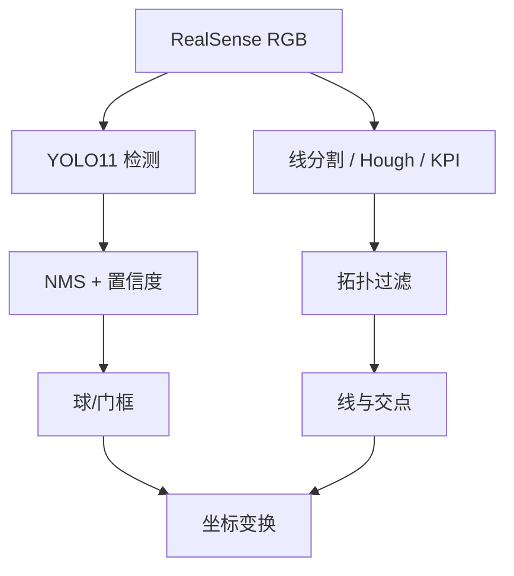

# 足球场线与球门检测

## 一句话定义

**球门与场地线交点检测**从机载图像识别 **球、球门与场地线几何（含线–线交点）**，输出可供定位与决策使用的结构化观测量——课程第 6.4 节；实践作业常用 **YOLO11** 训练球/门/线相关类别。

## 英文缩写速查

| 缩写 | 英文全称 | 简要说明 |
|------|----------|----------|
| YOLO | You Only Look Once | 实时检测族，课程常用 Ultralytics |
| KPI | Keypoint / Intersection | 线交点或角点观测量 |
| Homography | Homography | 场地平面 ↔ 图像单应 |
| mAP | mean Average Precision | 检测精度指标 |
| NMS | Non-Maximum Suppression | 框去重 |
| FOV | Field of View | 决定同时可见线数量 |

## 为什么重要

- **只有球不够**：自定位与「朝哪边攻」依赖 **场线结构**；交点是稀疏、可匹配的强特征。
- **连接感知与定位**：本节输出经 [后处理](../concepts/perception-coordinate-postprocessing.md) 进入 [线匹配](./visual-line-matching-localization.md) / [EKF](./visual-line-ekf-fusion.md)。
- 对照工业队方案可见 [Booster RoboCup demo](../entities/booster-robocup-demo.md) 中的场线感知叙述。

## 主要技术路线

| 路线 | 输出 | 备注 |
|------|------|------|
| YOLO 检球/门 | 框 + 类 | 课程 YOLO11 主线 |
| 语义/实例线分割 | 线掩码 | 再骨架化成线段 |
| 经典 Hough / LSD | 线段参数 | 无学习基线 |
| 关键点头回归 | L/T/X 交点 | 直接服务匹配 |
| 检测 + 拓扑后处理 | 过滤后图元 | 拒不可能组合 |

检测通论见 [目标检测](./object-detection.md)。

## 核心原理

### 两段式教学管线

1. **实例检测**：在 [足球场仿真](../concepts/soccer-field-simulation.md) 或真机采图，标注 ball / goal（及可选 robot、line），训练 YOLO11。
2. **线几何**：
   - 从线类掩码或边缘提取线段；
   - 求交得 L/T/X 型点，或网络直接回归关键点；
   - 按场地拓扑（中圈、禁区角等）过滤。
3. **后处理**：像素 → 米制（见 [坐标变换](../concepts/perception-coordinate-postprocessing.md)）。

### 交点类型（场地上的语义）

| 类型 | 几何 | 定位价值 |
|------|------|----------|
| L | 两线正交一端开放 | 角点，约束强 |
| T | 三向 | 禁区/中线常见 |
| X | 交叉 | 较少但很强 |
| 圆弧近似 | 中圈 | 需专门模型 |

## 工程实践

### 数据与训练

| 步骤 | 建议 |
|------|------|
| 域 | 仿真多光照/纹理随机 + 少量真机 |
| 分辨率 | 与机载推理一致（如 640） |
| 类别平衡 | 交点稀有 → 过采样或单独头 |
| 导出 | ONNX / TensorRT 以匹配部署 |

### 评价指标

| 指标 | 用途 |
|------|------|
| 球/门 mAP@0.5 | 检测质量 |
| 交点像素误差 | 几何头质量 |
| 端到端定位误差 | 与 EKF 联调后的真目标 |
| 推理 FPS | 须 ≥ 控制/感知闭环需求 |

### 常见失败与对策

| 失败 | 对策 |
|------|------|
| 白线断裂 | 形态学闭运算、时序平滑 |
| 反光地板误线 | 偏振/曝光、ROI 限场地区 |
| 远距离小球漏检 | 多尺度、跟踪器补帧 |
| 仿真→真机掉点 | 强数据增强、少量真机微调 |

## 局限与风险

- 2D 检测不给完整 3D；球速估计需深度或运动模型。
- **误区**：「mAP 高就能定位」——无稳定交点与标定，定位仍漂。
- 类别定义不统一（line vs intersection）会导致匹配端对不齐，需在数据卡上写清。

## 关联页面

- [目标检测](./object-detection.md)
- [足球场仿真](../concepts/soccer-field-simulation.md)
- [感知后处理与坐标变换](../concepts/perception-coordinate-postprocessing.md)
- [线匹配视觉定位](./visual-line-matching-localization.md)
- [Humanoid Soccer](../tasks/humanoid-soccer.md)
- [人形系统课程策展](../entities/humanoid-system-curriculum.md)

## 参考来源

- [深蓝学院人形系统课程大纲](../../sources/courses/shenlan_humanoid_system_theory_practice.md)

## 推荐继续阅读

- Ultralytics YOLO11 文档（训练、导出、关键点模式）
- RoboCup Humanoid League 规则中的场地线规格
