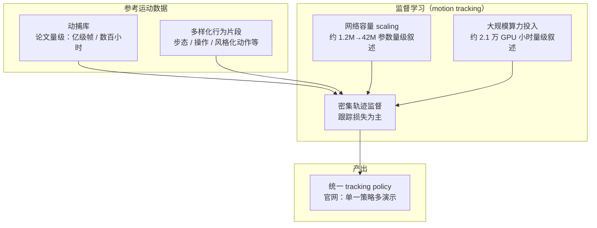
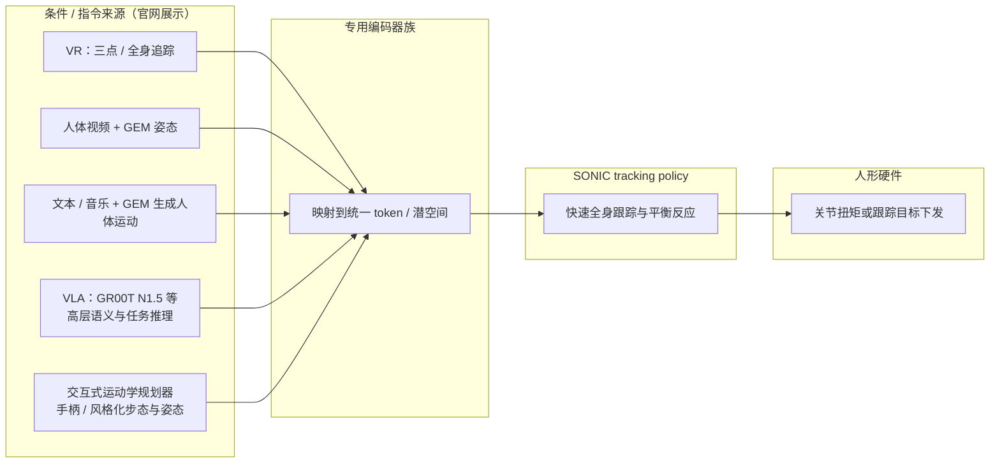
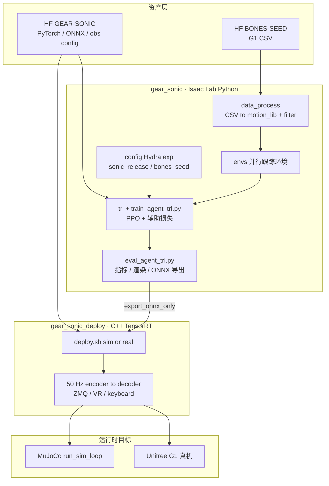
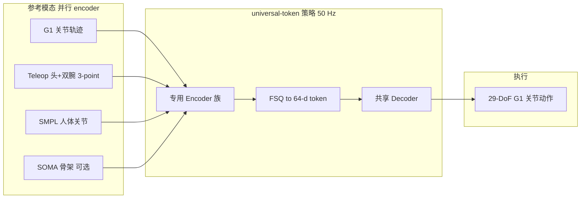
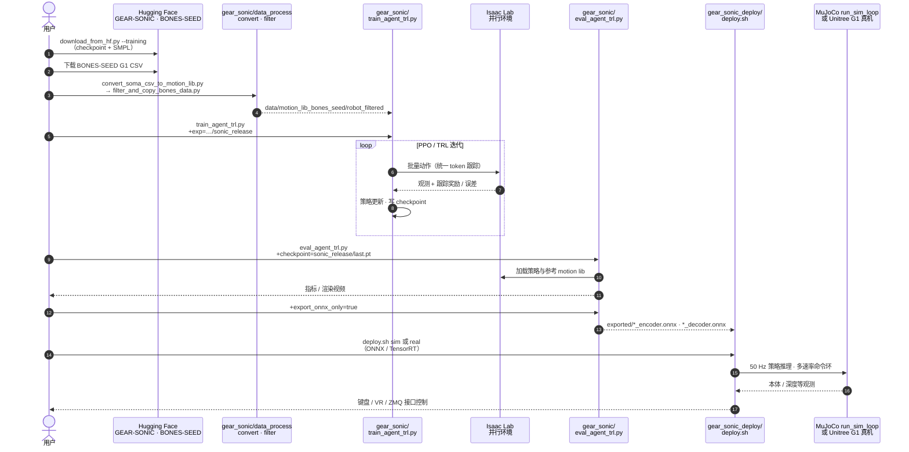

# SONIC（规模化运动跟踪人形控制）

SONIC 将规模化运动跟踪作为人形低层控制的统一预训练目标；论文主张网络容量、MoCap 数据与算力三轴 scaling，并以统一 token 接口接入 VR、视频、VLA 等上游。

SONIC（*Supersizing Motion Tracking for Natural Humanoid Whole-Body Control*）论证：在人形控制上 **大规模拟合多样参考运动**（motion tracking）可获得稳健的全身体现与少手工奖励设计，并随 **模型容量、数据量与算力** 同步扩展性能。项目由 NVIDIA 等与 CMU 等合作者推动（详见论文作者列表）。实现层面与 [Whole-Body Control (WBC)](../concepts/whole-body-control.md) 所讨论的「高自由度协调」问题同一战场：SONIC 用学习策略把参考运动映射为全身扭矩/位置指令。

官网（[GEAR-SONIC](https://nvlabs.github.io/GEAR-SONIC/)，与 [SONIC 别名页](https://nvlabs.github.io/SONIC/) 同源）在论文摘要之外，补充了 **VLA 堆叠、VR/视频遥操作、音乐与文本条件、运动学规划器交互** 等系统级演示；下文「公开材料要点」与之对齐，**仍以 arXiv 论文为方法细节准绳**。

## 英文缩写速查

| 缩写 | 英文全称 | 简要说明 |
|------|----------|----------|
| SONIC | Supersizing Motion Tracking for Natural Humanoid WBC | 规模化运动跟踪预训练人形控制 |
| MoCap | Motion Capture | 海量参考轨迹的监督来源 |
| WBC | Whole-Body Control | 全身协调跟踪的执行层问题 |
| VLA | Vision-Language-Action | 经统一 token 接入的高层接口 |
| VR | Virtual Reality | 遥操作与实时参考生成入口之一 |
| BFM | Behavior Foundation Model | 大规模行为数据预训练的可复用全身行为先验 |
| AMP | Adversarial Motion Prior | 用对抗判别约束状态转移接近专家运动分布的先验 |
| FSQ | Finite Scalar Quantization | 多编码器投影到共享潜 token 的量化接口 |
| PPO | Proximal Policy Optimization | Isaac Lab 侧主训练算法（TRL 封装） |
| ONNX | Open Neural Network Exchange | PyTorch checkpoint 导出到 C++ / TensorRT 部署的交换格式 |
| SMPL | Skinned Multi-Person Linear Model | 人体参数化姿态，SMPL encoder 的输入模态之一 |
| G1 | Unitree G1 | 官方发布权重与训练默认的 29-DoF 人形平台 |
| SOMA | Skeleton-Oriented Motion Abstraction | 可选第四编码器：BVH 衍生骨架关节（`sonic_bones_seed`） |

## 论文信息（arXiv:2511.07820）

| 字段 | 内容 |
|------|------|
| 完整标题 | *SONIC: Supersizing Motion Tracking for Natural Humanoid Whole-Body Control* |
| 作者 | Zhengyi Luo、Ye Yuan、Tingwu Wang 等 **28 人**；含 Tairan He、Jan Kautz、Umar Iqbal、Linxi "Jim" Fan、Yuke Zhu（完整名单见 arXiv） |
| 机构 | NVIDIA（GEAR Lab 等）；CMU 等合作者 |
| arXiv 版本 | v1 2025-11-11 → v2 2025-12-04 → v3 2026-05-21 |
| 项目页 | <https://nvlabs.github.io/GEAR-SONIC/>（别名 <https://nvlabs.github.io/SONIC/>） |
| 代码 | <https://github.com/NVlabs/GR00T-WholeBodyControl>（`gear_sonic` 训练 + `gear_sonic_deploy` 部署） |
| 权重 | <https://huggingface.co/nvidia/GEAR-SONIC> |
| 数据 | <https://huggingface.co/datasets/bones-studio/seed>（BONES-SEED） |
| 文档 | <https://nvlabs.github.io/GR00T-WholeBodyControl/> |

论文摘要口径的三个关键量：**1 亿+ MoCap 帧（约 700 小时）** 的密集轨迹监督、网络容量 **1.2M→42M 参数** 的扩展区间、约 **2.1 万 GPU 小时** 训练算力；结论是性能随算力与数据多样性 **稳步改善**，且学到的策略 **泛化到未见动作**。接口侧的一个具体细节：单一策略经 **专用编码器 → 统一 token 空间**，同时处理 **机器人运动、人体运动与混合运动** 三类指令的 **共享潜表征**——这也是 VR / 视频 / 文本 / 音乐 / VLA 能共用同一低层的原因。

## Survey 坐标（策展索引）

### 在 42 篇 RL 运动控制身体系统栈中

| 字段 | 内容 |
|------|------|
| 编号 | 17/42 |
| 系统栈层 | 02 参考跟踪 · 通用控制 |
| 索引来源 | [具身智能研究室 · 42 篇 humanoid RL 运动控制长文](https://mp.weixin.qq.com/s/hz9JXtJeUPRfUGzfD-pZuA) |

### 在 BFM 41 篇技术地图中

| 字段 | 内容 |
|------|------|
| 编号 | 07/41 |
| 分组 | 02 Goal-conditioned 学习 |
| 索引来源 | [awesome-bfm-papers](https://github.com/friedrichyuan/awesome-bfm-papers) |

### 在人形 Loco-Manip 161 篇中

同一篇论文在 [Loco-Manip 161 篇技术地图](../overview/humanoid-loco-manip-161-papers-technology-map.md) 里出现 **两次**（策展分类不同，canonical 实体仅此页）：

| 槽位 | 分组 | 分类 hub |
|------|------|----------|
| 019/161 | 01 运控基座与通用全身跟踪 | [loco-manip-161-category-01-motion-base-wbt](../overview/loco-manip-161-category-01-motion-base-wbt.md) |
| 103/161 | 04 生成式运动、语言控制与轨迹规划 | [loco-manip-161-category-04-generative-language-trajectory](../overview/loco-manip-161-category-04-generative-language-trajectory.md) |

索引来源：[具身智能研究室 · 161 篇人形 Loco-Manip 长文](https://mp.weixin.qq.com/s/pACh9EhsISiyPGdiiR0C3A)

## 为什么重要？

- **执行层「基础模型」叙事**：把跟踪当作统一预训练目标，再用 **统一 token / 控制接口** 接入 VR、视频、VLA、文本与音乐等不同上游——降低「每换一个接口就重写 reward」的成本。
- **与 BeyondMimic  lineage**：同属高质量仿真里的模仿 / 跟踪路线；SONIC 强调 **scaling** 式的数据与网络扩展（参见 [BeyondMimic](./beyondmimic.md) 中的物理建模与采样细节对照阅读）。
- **与「少数据高效 tracking」对照**：[EGM（Efficient General Mimic）](./egm-efficient-general-mimic.md) 用 **小时级精选 MoCap + bin 级课程采样 + CDMoE** 追求高动态泛化，可与本文的 **大规模预训练** 路线并列阅读。
- **视频驱动现实的落脚点**：人体运动估计（如 [GENMO](./genmo.md)、[WiLoR](./wilor.md)）给出参考轨迹后，需要动力学可行的跟踪策略；SONIC 在 [ExoActor](./exoactor.md) 中被用作「物理过滤器」，直接把人体运动喂入策略而省略部分经典重定向步骤（该结论具有任务与平台依赖性）。
- **交互式生成上游**：[ARDY](../entities/ardy.md)（SIGGRAPH 2026）演示 **实时自回归扩散人体运动 + SONIC 跟踪 → G1**，与 Kimodo 离线生成→SONIC 形成 **同生态不同延迟档位** 的参考供给路径。
- **与 VLA 的分工示例**：公开演示把 **GR00T N1.5** 与 SONIC 经同一接口串联，体现「慢推理 / 快反射」式 **分层控制** 的一种工程形态（参见 [VLA](./vla.md)）。
- **跨具身后训练：** [Any2Any](../entities/paper-any2any-cross-embodiment-wbt.md)（arXiv:2605.23733）以 **Gear-SONIC 为源骨干**，经运动学对齐 + 解码器侧 LoRA，用约 **1%** 全量训练成本将 WBT 迁到 LimX Oli/Luna 等新机——与本文「单平台 scaling」形成 **预训练 vs 迁移** 对照阅读。
- **结构 + 数据再 scaling：** [Humanoid-GPT](../entities/paper-humanoid-gpt.md)（arXiv:2606.03985）在 **~2B 帧 + 因果 Transformer + expert DAgger** 上继续推进零样本敏捷跟踪，项目页提供与 SONIC 的 **四类真机并排对比**；可与本文 **~100M + MLP** 路线并列阅读「通才 tracker 前沿」。
- **WAM 上游接口：** [MotionWAM](../entities/paper-motionwam-humanoid-loco-manipulation-wam.md)（arXiv:2606.09215）将 SONIC **FSQ motion token** 作为 **World Action Model 的统一全身动作空间**，由 Video DiT 单次前向隐状态条件 Motion DiT 预测，再经 SONIC 解码闭环执行 G1 loco-manipulation——与 GR00T+VLA 分层接 SONIC 形成 **动力学先验 vs 语义先验** 对照。
- **感知地形扩展：** [Perceptive BFM](../entities/paper-perceptive-bfm.md)（CoRL 2026 submission）在 **保留 raw 参考接口** 的 BFM 叙事上叠加 **机器人中心高程感知**；项目页报告无视觉消融 reward **54.6 → 3.6**，可与 SONIC 的 **无感知大规模 tracking** 形成「接口开放 vs 地形落地」对照。
- **接触丰富场景扩展：** [SceneBot](../entities/paper-scenebot.md)（arXiv:2606.27581）在 **同一 PPO tracking 范式** 上叠加 **per-link contact label** 与 **hindsight scene reconstruction** 数据引擎；sim-to-sim 上 **自由空间与 SONIC 同级**，但 object/terrain/sit 成功率 **95–100% vs 0–15%**——说明 scaling 型 tracker 需额外 **接触意图接口** 才能落地搬箱、楼梯与坐椅等场景交互。
- **高覆盖率训练集长尾：** [Athena-WBC](../entities/paper-athena-wbc-humanoid-longtail.md)（arXiv:2607.04837，小鹏机器人）在 **同平台重实现 SONIC-Base** 上发现 **残余训练集失败**（高动态/平衡关键）不全是曝光问题，而是 **保守 effort/temporal 奖励** 与 **名义重力冷启动** 造成的 **capability bottleneck**；用 **能力对齐 dynamic/balance expert → 路由 DAgger → RL 微调** 改善长尾与 held-out，并提出 **STC/TIS/MPJPE-W** 评测——与本文「scaling 仍留长尾」形成互补阅读。

## 公开材料要点（论文摘要 + 官网，2026-05）

| 主题 | 公开叙述摘要 |
|------|----------------|
| **规模** | 网络约 **1.2M→42M** 参数叙述区间；数据约 **1 亿+ 帧**、约 **700 小时** MoCap；算力约 **2.1 万 GPU 小时** 量级；性能随规模与数据多样性稳步改善的报道。 |
| **统一策略** | 主要展示结果来自 **单一统一控制策略**（非每场景独立训一条专用 policy 的叙事）。 |
| **下游** | **实时运动学规划器** 与 tracking 衔接，支持导航与多样步态 / 姿态；**统一 token 空间** 同时服务 VR 遥操作与 **VLA**（演示为 GR00T N1.5）。 |
| **遥操作** | 视频 + GEM 姿态估计；VR **三点**上身 + 规划器下身；VR **全身** 追踪。 |
| **多模态条件** | 音乐 / 文本经 GEM 生成人体运动，再由策略跟踪。 |
| **已开源** | 训练/部署代码在 [GR00T-WholeBodyControl](https://github.com/NVlabs/GR00T-WholeBodyControl)；权重 [HF GEAR-SONIC](https://huggingface.co/nvidia/GEAR-SONIC)；动捕子集 [BONES-SEED](https://huggingface.co/datasets/bones-studio/seed)（2026-07-20 项目页/文档站核查）。 |

## 流程总览（Mermaid）

### 1）规模化训练主轴（数据 × 模型 × 算力）



### 2）统一控制接口：多上游 → token → 低层全身执行



上图强调 **模块边界**：GEM / VLA / 规划器位于「生成或规划参考运动」一侧；SONIC 负责在动力学与接触约束下 **高频率跟踪**；具体观测栈、控制频率与接口字段以论文与 [官方文档站](https://nvlabs.github.io/GR00T-WholeBodyControl/) 为准。

## 读源码导航（论文 ↔ 仓库）

官方实现落在 [NVlabs/GR00T-WholeBodyControl](https://github.com/NVlabs/GR00T-WholeBodyControl)（工程仓总览见 [GR00T-WholeBodyControl](../entities/gr00t-wholebodycontrol.md)）。读仓建议顺序：**模块边界 → 文件树 → 算法↔代码映射 → 统一 token 数据流 → 运行时序**；命令与路径以仓库 README / [Training Guide](https://nvlabs.github.io/GR00T-WholeBodyControl/user_guide/training.html) / Quick Start 为准。

### 1）模块边界（训练 / 仿真 / 部署）



要点：**Isaac Lab 只跑 `gear_sonic`**；真机 / sim2sim 走 **独立 C++ 栈**；权重从 `last.pt` 经 `eval_agent_trl.py +export_onnx_only=true` 落到部署用 ONNX。

### 2）文件树注解（先认路，再下钻）

```
GR00T-WholeBodyControl/
├── download_from_hf.py          # 拉权重 / SMPL；--training · --low-latency
├── gear_sonic/                  # ★ 训练与评测（Isaac Lab）
│   ├── data_process/            # Bones-SEED CSV→PKL、过滤、SOMA/BVH
│   ├── config/                  # Hydra：+exp=…/sonic_release
│   ├── envs/                    # 跟踪环境、观测与 reward 接线
│   ├── trl/                     # PPO / TRL 算法实现
│   ├── train_agent_trl.py       # 训练 / 微调入口
│   ├── eval_agent_trl.py        # 评测、渲染、ONNX 导出
│   └── scripts/                 # run_sim_loop · launch_inference · VR
├── gear_sonic_deploy/           # ★ C++ 推理（真机 / sim2sim）
│   └── deploy.sh                # ./deploy.sh sim | real · --cp · --obs-config
├── motionbricks/                # 同仓生成式运动预览（非 SONIC 主干）
└── data/                        # 本地 motion_lib_* / smpl_filtered（gitignore 常见）
```

同仓还有 **Decoupled WBC** 与 **MotionBricks**；读 SONIC 时默认只跟 `gear_sonic*` + HF 权重，避免和 N1.5 解耦 WBC 混线。

### 3）算法 ↔ 代码映射

| 论文 / 方法概念 | 仓库落点 | 读什么 |
|-----------------|----------|--------|
| 规模化 motion tracking 预训练 | `train_agent_trl.py` + `+exp=…/sonic_release` | 单一统一策略、PPO 主环 |
| 专用编码器 → 统一 token | Training Guide：G1 / teleop / SMPL（+ 可选 SOMA）→ **FSQ** → 共享 64-d latent | 换上游 = 换 encoder，decoder 共用 |
| 密集跟踪监督 / 奖励 | `envs/` + W&B `rewards/*`、`tracking_*` | `anchor_pos_err`、`body_pos_err`、`mpjpe_*` |
| MoCap 数据规模 | BONES-SEED → `convert_soma_csv_to_motion_lib.py` → `filter_and_copy_bones_data.py` | 过滤后约 130K / 142K PKL |
| 多模态条件（VR / 视频 / VLA） | teleop encoder；`scripts/launch_inference.py`；ZMQ Manager | 低层仍是同一 decoder |
| 实时运动学规划器 | 文档 Kinematic Planner + 部署输入类型 | 手柄 / 风格化步态接 tracking |
| 真机 50 Hz 全身控制 | `gear_sonic_deploy/deploy.sh` + `model_{encoder,decoder}.onnx` | 默认约 200 ms（10×20 ms）参考 lookahead；低延迟档 4 帧 / ~80 ms |
| 配置驱动实验 | Hydra `+exp=manager/universal_token/all_modes/…` | `sonic_release` vs `sonic_bones_seed` |

### 4）统一 token 数据流（部署侧）



发布权重把 encoder / decoder 拆成 ONNX 对；**Default** 与 **Low-latency teleop** 必须 **成套** 使用（含各自的 `observation_config.yaml`），不可混搭。

### 5）源码运行时序图

权重与 SMPL 样本经 `download_from_hf.py` 从 [HF `nvidia/GEAR-SONIC`](https://huggingface.co/nvidia/GEAR-SONIC) 拉取；大规模参考动作用 [BONES-SEED](https://huggingface.co/datasets/bones-studio/seed) G1 CSV 转成 motion lib。一次完整「数据 → 训练 → 评测 → 部署」交互如下：



- **训练与部署解耦**：Python 训练环境与 C++ 部署栈分离；中间靠 ONNX 交接。
- **统一 token 接口不变**：换 VR / 视频 / 规划器 / VLA 上游只换 encoder，不重训整条低层 tracking policy——与上文「多上游 → token → 全身执行」及本节数据流图一致。

## 主要技术路线

| 维度 | 要点 |
|------|------|
| **监督** | 密集跟踪损失：策略输出逼近参考全身运动（具体观测与动作空间以论文为准）。 |
| **规模** | 论文与官网公开量级包含 **上亿帧**、**约 700 小时** MoCap、**约 1.2M→42M** 参数叙述与 **约 2.1 万 GPU 小时** 算力叙述；性能随规模单调改善的报道支撑「跟踪可扩展」论点。 |
| **接口** | **专用编码器 → FSQ → 统一 64-d token → 共享 decoder**；支持 **VLA、VR、视频、文本 / 音乐** 等上游与 **实时运动学规划** 桥接；部署 **50 Hz**，ONNX encoder/decoder 成套使用。 |

## 常见误区或局限

- **不是万能仿真替身**：跟踪器只能在其训练分布与机器人动力学对齐的范围内泛化；极端杂技或强接触任务仍可能失败。
- **跳过重定向的前提**：ExoActor 显示「人体轨迹 → SONIC」可优于某些 SMPL→机器人重定向流水线，但不等于所有平台都应丢弃重定向（参见 [GMR](./motion-retargeting-gmr.md) 讨论）。
- **硬件差异**：同一策略在不同人形硬件上仍需适配观测与动作映射。
- **演示与论文的边界**：官网视频突出系统集成；**可重复协议、随机种子与定量对比**仍以论文与仓库 `eval_agent_trl.py` / 文档站评测脚本为准。

## 与其他页面的关系

- [BeyondMimic](./beyondmimic.md)：相近生态里的高性能模仿框架，可作为物理建模与采样策略的对照。
- [ExoActor](./exoactor.md)：SONIC 作为生成视频流水线的机器人侧执行模块的案例。
- [Imitation Learning](./imitation-learning.md)：大规模跟踪可视为广义的演示驱动学习。
- [VLA](./vla.md)：SONIC 可作为低层执行器与 VLA 堆叠时的接口参考。
- [Teleoperation](../tasks/teleoperation.md)：VR / 视频遥操作与规划器下身的工程组合参考。
- [GR00T-WholeBodyControl](../entities/gr00t-wholebodycontrol.md)：官方训练 / 部署单仓与文档站入口。
- [Zhengyi Luo（罗正宜）](../entities/zhengyi-luo.md)：论文共同一作与项目核心贡献者之一，主页汇总 SONIC 与相邻人形工作入口。
- [GentleHumanoid](./gentlehumanoid-motion-tracking.md)：同属 motion tracking 族，但显式优化 **上半身柔顺与可调接触力**，可与 SONIC 的规模化刚性跟踪对照阅读。
- [Humanoid-GPT](../entities/paper-humanoid-gpt.md)：2B 帧 + Transformer 蒸馏路线；站点直接与 SONIC 对比 daily/dance/高动态/平衡四类行为。
- [SceneBot](../entities/paper-scenebot.md)：contact-prompted 单策略 tracker；论文以 SONIC 为自由空间强基线，在 **地形+物体** 交互上展示 contact label 与场景重建数据的必要性。
- [HumanoidArena](../entities/paper-humanoidarena.md)：将 SONIC 与 TWIST2 并列为 **分层全身学习的双 GMT 后端**，在 7 项腿关键 HOI/HSI 上评测 **跨 GMT 迁移** 与扰动泛化（arXiv:2606.17833）。
- [Athena-WBC](../entities/paper-athena-wbc-humanoid-longtail.md)：以 **SONIC 配方** 为强基线，研究 **训练集长尾残余** 的 **能力对齐专家蒸馏**（arXiv:2607.04837）；绝对数字不与 G1 发布权重直接可比。
- [ScaleBFM](../entities/paper-scaling-bfm-humanoid.md)：同 motion-tracking BFM 预训练叙事，但系统拆解 **on-policy 数量 × 参考多样性 × Humanoid Transformer** 三轴 scaling；whole-body 基准上 **BFM-Global** 相对 SONIC **G-MPKPE 降幅约 54%（BONES）/ 82%（Ours）**（arXiv:2607.15163）。

## 推荐继续阅读

- [机器人论文阅读笔记：SONIC Supersizing Motion Tracking for Natural Humanoid Control](https://imchong.github.io/Humanoid_Robot_Learning_Paper_Notebooks/papers/03_High_Impact_Selection/SONIC_Supersizing_Motion_Tracking_for_Natural_Humanoid_Control/SONIC_Supersizing_Motion_Tracking_for_Natural_Humanoid_Control.html)
- 论文：<https://arxiv.org/abs/2511.07820>
- 项目页：<https://nvlabs.github.io/GEAR-SONIC/>（别名 <https://nvlabs.github.io/SONIC/>）
- 代码：<https://github.com/NVlabs/GR00T-WholeBodyControl>
- 权重：<https://huggingface.co/nvidia/GEAR-SONIC>
- GEM / GENMO：<https://research.nvidia.com/labs/dair/genmo/>
- [42 篇 RL 运动控制（微信公众号）](https://mp.weixin.qq.com/s/hz9JXtJeUPRfUGzfD-pZuA)
- [awesome-bfm-papers](https://github.com/friedrichyuan/awesome-bfm-papers) — 完整列表与数据集表
- [A Survey of Behavior Foundation Model](https://arxiv.org/abs/2506.20487) — TPAMI 2025 综述

## 参考来源

- [SONIC（规模化人体运动跟踪驱动的人形全身控制）](../../sources/repos/sonic-humanoid-motion-tracking.md)
- [GR00T-WholeBodyControl 仓归档](../../sources/repos/gr00t_wholebodycontrol.md) — 官方训练/部署单仓
- [humanoid_rl_stack_17_sonic_supersizing_motion_tracking_for_natural_hu.md](../../sources/papers/humanoid_rl_stack_17_sonic_supersizing_motion_tracking_for_natural_hu.md) — 42 篇栈策展摘录
- [humanoid_rl_stack_42_catalog.md](../../sources/papers/humanoid_rl_stack_42_catalog.md) — 42 篇总表
- [bfm_awesome_sonic_arxiv_2511_07820.md](../../sources/papers/bfm_awesome_sonic_arxiv_2511_07820.md) — awesome-bfm 策展摘录
- [bfm_awesome_41_catalog.md](../../sources/papers/bfm_awesome_41_catalog.md) — 41+10 总表
- [wechat_embodied_ai_lab_humanoid_rl_motion_survey.md](../../sources/blogs/wechat_embodied_ai_lab_humanoid_rl_motion_survey.md) — RL 运动控制微信公众号编译导读
- [wechat_embodied_ai_lab_bfm_41_papers_survey.md](../../sources/blogs/wechat_embodied_ai_lab_bfm_41_papers_survey.md) — BFM 41 篇微信公众号编译导读
- [loco_manip_161_survey_019_sonic.md](../../sources/papers/loco_manip_161_survey_019_sonic.md) — Loco-Manip 161 #019 策展摘录
- [loco_manip_161_survey_103_sonic.md](../../sources/papers/loco_manip_161_survey_103_sonic.md) — Loco-Manip 161 #103 策展摘录
- [humanoid_loco_manip_161_catalog.md](../../sources/papers/humanoid_loco_manip_161_catalog.md) — Loco-Manip 161 总表
- [wechat_embodied_ai_lab_humanoid_loco_manip_161_survey.md](../../sources/blogs/wechat_embodied_ai_lab_humanoid_loco_manip_161_survey.md) — Loco-Manip 161 微信公众号编译导读
- [motion_cerebellum_64_catalog.md](../../sources/papers/motion_cerebellum_64_catalog.md) — 运动小脑 64 篇总表
- [wechat_embodied_ai_lab_humanoid_motion_cerebellum_survey.md](../../sources/blogs/wechat_embodied_ai_lab_humanoid_motion_cerebellum_survey.md) — 运动小脑微信公众号编译导读
- 原始抓取：[wechat_humanoid_rl_42_survey_2026-05-26.md](../../sources/raw/wechat_humanoid_rl_42_survey_2026-05-26.md)
- NVIDIA SONIC 项目页 — <https://nvlabs.github.io/GEAR-SONIC/>（页面内摘要、方法段落与演示分区；2026-07-20 再核源码入口）
- 官方代码 / 文档 — <https://github.com/NVlabs/GR00T-WholeBodyControl> · <https://nvlabs.github.io/GR00T-WholeBodyControl/>
- 权重与数据 — <https://huggingface.co/nvidia/GEAR-SONIC> · <https://huggingface.co/datasets/bones-studio/seed>
- arXiv 摘要与版本页 — <https://arxiv.org/abs/2511.07820>（v3，2026-05-21；作者名单、规模量级与统一潜表征叙述；正文写明 Code is available at GR00T-WholeBodyControl）

## 关联页面

- [人形 RL 身体系统栈](../overview/humanoid-rl-motion-control-body-system-stack.md) — 42 篇栈总框架（本文 #17/42）
- [BFM 41 篇技术地图](../overview/bfm-41-papers-technology-map.md) — 本文 #07/41（02 Goal-conditioned 学习）
- [Loco-Manip 161 篇技术地图](../overview/humanoid-loco-manip-161-papers-technology-map.md) — 本文 #019/#103 双槽位
- [Behavior Foundation Model（概念）](../concepts/behavior-foundation-model.md)
- [ScaleBFM（BFM scaling 配方）](../entities/paper-scaling-bfm-humanoid.md)
- [BeyondMimic](./beyondmimic.md)
- [ExoActor (视频生成驱动的交互式人形控制)](./exoactor.md)
- [GENMO（统一人体运动估计与生成）](./genmo.md)
- [ARDY（交互式人体运动生成）](../entities/ardy.md) — 实时扩散生成 + SONIC→G1 闭环演示
- [VLA（Vision-Language-Action）](./vla.md)
- [LEGS（论文实体）](../entities/paper-legs-embodied-gaussian-splatting-vla.md) — G1 loco-manip VLA 数据合成以 SONIC 为低层 WBC（arXiv:2606.01458）
- [MotionWAM（论文实体）](../entities/paper-motionwam-humanoid-loco-manipulation-wam.md) — WAM 预测 SONIC 统一 motion token 的实时人形 loco-manip（arXiv:2606.09215）
- [SceneBot（论文实体）](../entities/paper-scenebot.md) — contact label + hindsight 场景重建；自由空间媲美 SONIC、场景交互显著领先（arXiv:2606.27581）
- [HumanoidArena（论文实体）](../entities/paper-humanoidarena.md) — SONIC 作为 GMT 后端的分层 egocentric benchmark（arXiv:2606.17833）
- [Teleoperation（遥操作）](../tasks/teleoperation.md)
- [Zhengyi Luo（罗正宜）](../entities/zhengyi-luo.md)
