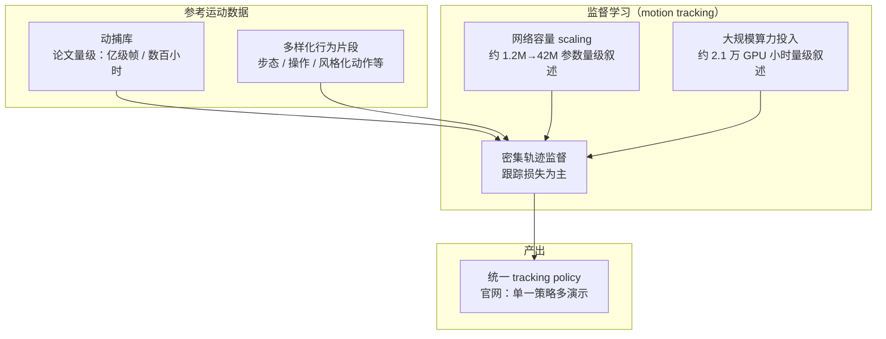
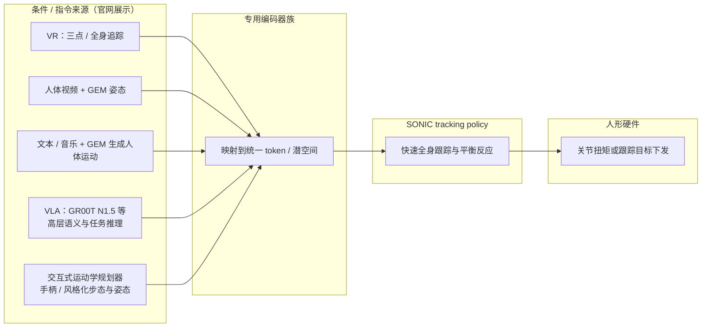

# SONIC（规模化运动跟踪人形控制）

SONIC 将规模化运动跟踪作为人形低层控制的统一预训练目标；论文主张网络容量、MoCap 数据与算力三轴 scaling，并以统一 token 接口接入 VR、视频、VLA 等上游。

SONIC（*Supersizing Motion Tracking for Natural Humanoid Whole-Body Control*）论证：在人形控制上 **大规模拟合多样参考运动**（motion tracking）可获得稳健的全身体现与少手工奖励设计，并随 **模型容量、数据量与算力** 同步扩展性能。项目由 NVIDIA 等与 CMU 等合作者推动（详见论文作者列表）。实现层面与 [Whole-Body Control (WBC)](../concepts/whole-body-control.md) 所讨论的「高自由度协调」问题同一战场：SONIC 用学习策略把参考运动映射为全身扭矩/位置指令。

官网（[GEAR-SONIC](https://nvlabs.github.io/GEAR-SONIC/)，与 [SONIC 别名页](https://nvlabs.github.io/SONIC/) 同源）在论文摘要之外，补充了 **VLA 堆叠、VR/视频遥操作、音乐与文本条件、运动学规划器交互** 等系统级演示；下文「公开材料要点」与之对齐，**仍以 arXiv 论文为方法细节准绳**。

## 为什么重要？

- **执行层「基础模型」叙事**：把跟踪当作统一预训练目标，再用 **统一 token / 控制接口** 接入 VR、视频、VLA、文本与音乐等不同上游——降低「每换一个接口就重写 reward」的成本。
- **与 BeyondMimic  lineage**：同属高质量仿真里的模仿 / 跟踪路线；SONIC 强调 **scaling** 式的数据与网络扩展（参见 [BeyondMimic](./beyondmimic.md) 中的物理建模与采样细节对照阅读）。
- **视频驱动现实的落脚点**：人体运动估计（如 [GENMO](./genmo.md)、[WiLoR](./wilor.md)）给出参考轨迹后，需要动力学可行的跟踪策略；SONIC 在 [ExoActor](./exoactor.md) 中被用作「物理过滤器」，直接把人体运动喂入策略而省略部分经典重定向步骤（该结论具有任务与平台依赖性）。
- **与 VLA 的分工示例**：公开演示把 **GR00T N1.5** 与 SONIC 经同一接口串联，体现「慢推理 / 快反射」式 **分层控制** 的一种工程形态（参见 [VLA](./vla.md)）。

## 公开材料要点（论文摘要 + 官网，2026-05）

| 主题 | 公开叙述摘要 |
|------|----------------|
| **规模** | 网络约 **1.2M→42M** 参数叙述区间；数据约 **1 亿+ 帧**、约 **700 小时** MoCap；算力约 **2.1 万 GPU 小时** 量级；性能随规模与数据多样性稳步改善的报道。 |
| **统一策略** | 主要展示结果来自 **单一统一控制策略**（非每场景独立训一条专用 policy 的叙事）。 |
| **下游** | **实时运动学规划器** 与 tracking 衔接，支持导航与多样步态 / 姿态；**统一 token 空间** 同时服务 VR 遥操作与 **VLA**（演示为 GR00T N1.5）。 |
| **遥操作** | 视频 + GEM 姿态估计；VR **三点**上身 + 规划器下身；VR **全身** 追踪。 |
| **多模态条件** | 音乐 / 文本经 GEM 生成人体运动，再由策略跟踪。 |
| **开源预期** | 官网写明展示涉及模型将发布（以 GitHub / 模型卡实际更新为准）。 |

## 流程总览（Mermaid）

### 1）规模化训练主轴（数据 × 模型 × 算力）

### 2）统一控制接口：多上游 → token → 低层全身执行

上图强调 **模块边界**：GEM / VLA / 规划器位于「生成或规划参考运动」一侧；SONIC 负责在动力学与接触约束下 **高频率跟踪**；具体观测栈、控制频率与接口字段以论文与后续开源代码为准。

## 主要技术路线

| 维度 | 要点 |
|------|------|
| **监督** | 密集跟踪损失：策略输出逼近参考全身运动（具体观测与动作空间以论文为准）。 |
| **规模** | 论文与官网公开量级包含 **上亿帧**、**约 700 小时** MoCap、**约 1.2M→42M** 参数叙述与 **约 2.1 万 GPU 小时** 算力叙述；性能随规模单调改善的报道支撑「跟踪可扩展」论点。 |
| **接口** | **专用编码器 → 统一 token**；支持 **VLA、VR、视频、文本 / 音乐** 等上游与 **实时运动学规划** 桥接。 |

## 常见误区或局限

- **不是万能仿真替身**：跟踪器只能在其训练分布与机器人动力学对齐的范围内泛化；极端杂技或强接触任务仍可能失败。
- **跳过重定向的前提**：ExoActor 显示「人体轨迹 → SONIC」可优于某些 SMPL→机器人重定向流水线，但不等于所有平台都应丢弃重定向（参见 [GMR](./motion-retargeting-gmr.md) 讨论）。
- **硬件差异**：同一策略在不同人形硬件上仍需适配观测与动作映射。
- **演示与论文的边界**：官网视频突出系统集成；**可重复协议、随机种子与定量对比**仍以论文与后续开源实验脚本为准。

## 与其他页面的关系

- [BeyondMimic](./beyondmimic.md)：相近生态里的高性能模仿框架，可作为物理建模与采样策略的对照。
- [ExoActor](./exoactor.md)：SONIC 作为生成视频流水线的机器人侧执行模块的案例。
- [Imitation Learning](./imitation-learning.md)：大规模跟踪可视为广义的演示驱动学习。
- [VLA](./vla.md)：SONIC 可作为低层执行器与 VLA 堆叠时的接口参考。
- [Teleoperation](../tasks/teleoperation.md)：VR / 视频遥操作与规划器下身的工程组合参考。
- [Zhengyi Luo（罗正宜）](../entities/zhengyi-luo.md)：论文共同一作与项目核心贡献者之一，主页汇总 SONIC 与相邻人形工作入口。

## 推荐继续阅读

- 论文：<https://arxiv.org/abs/2511.07820>
- 项目页：<https://nvlabs.github.io/GEAR-SONIC/>（别名 <https://nvlabs.github.io/SONIC/>）
- GEM / GENMO：<https://research.nvidia.com/labs/dair/genmo/>

## 参考来源

- [SONIC（规模化人体运动跟踪驱动的人形全身控制）](../../sources/repos/sonic-humanoid-motion-tracking.md)
- NVIDIA SONIC 项目页 — <https://nvlabs.github.io/GEAR-SONIC/>（页面内摘要、方法段落与演示分区，2026-05-14 抓取对照）

## 关联页面

- [BeyondMimic](./beyondmimic.md)
- [ExoActor (视频生成驱动的交互式人形控制)](./exoactor.md)
- [GENMO（统一人体运动估计与生成）](./genmo.md)
- [VLA（Vision-Language-Action）](./vla.md)
- [Teleoperation（遥操作）](../tasks/teleoperation.md)
- [Zhengyi Luo（罗正宜）](../entities/zhengyi-luo.md)
