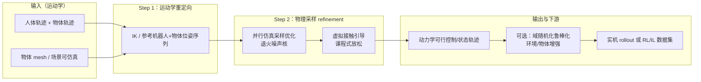

# SPIDER（物理感知采样式灵巧重定向）

**SPIDER**（*Scalable Physics-Informed DExterous Retargeting*，Pan 等，arXiv:2511.09484）把跨具身迁移写成：**人体演示只提供运动学层面的任务结构与目标**，再用**大规模并行物理仿真 + 采样优化**生成可在目标机器人上执行的**动力学可行轨迹**，并显式处理**接触丰富**任务中的歧义。

## 为什么重要

- **数据瓶颈的位置**：灵巧与人形策略需要大量演示，但本体采集昂贵；人体侧数据（动捕、视频重建、VR）规模更大，却常缺力/力矩与真实接触，**纯 IK / 几何重定向**易得到「看起来像、仿真或实机不可行」的序列。
- **与「每条轨迹训一个 RL」解耦**：论文将物理一致化表述为**对控制序列的采样型优化**（退火噪声核的加权更新，思路接近采样 MPC / 交叉熵类方法），在并行仿真里直接搜索可行 rollout，而不是为每条人类片段单独维护可微策略网络。
- **接触歧义的可工程化缓解**：引入**虚拟接触引导**——早期用虚拟力把物体「粘」向期望接触几何，再随迭代放松——用课程式信号稳定**接触序列**，与无引导采样对照（论文报告成功率显著提升，量级约 **+18%**，以原文表格为准）。

## 主要技术路线

| 模块 | 输入 / 决策变量 | 作用 |
|------|-----------------|------|
| **运动学重定向** | 人体轨迹、物体轨迹与 mesh | 生成与人体对齐的**参考机器人 + 物体**位姿/速度序列（论文中的运动学前端 \(x^{\text{ref}}_{0:T}\)） |
| **并行仿真采样优化** | 控制序列 \(u_{0:T-1}\)、并行 rollout | 在接触动力学下最小化跟踪误差与控制代价；用**退火高斯扰动**的加权更新搜索可行解（不更新策略网络） |
| **虚拟接触引导** | 期望接触位形、课程进度 | 早期施加**虚拟粘附力**稳定接触序列，再逐步放松，降低多解歧义 |
| **鲁棒化与增强（可选）** | 域随机化、场景/物体参数 | 缓解仿真—实物失配；支持单演示在多物体/地形/力条件下的数据扩增 |

## 管线总览（Mermaid）

## 与常见路线的关系

- **相对 GMR 等纯运动学前端**：GMR 类方法优先解决**骨架几何对齐**；SPIDER 假定已有（或可先做）**运动学参考**，把主计算预算花在**仿真里的动力学与接触可行性**上，产物更贴近「可 rollout 的机器人数据」。
- **相对 NMR / CEPR**：NMR 用 **RL 跟踪专家**在仿真里构造人机配对监督，再训练**前向网络**做快速推断；SPIDER 不显式以「训练大网络」为主叙事，而是强调**采样优化 + 接触课程**在跨机型数据生成上的**通用外壳**（仍可与学习式模块组合）。
- **相对 ReActor**：ReActor 用**双层 RL**联合更新「参数化参考」与「跟踪策略」；SPIDER 用**采样轨迹分布**直接优化控制序列，**不更新策略网络**，更靠近「轨迹级 MPC/CEM 式」物理修补器。

## 局限与阅读时注意点

- **仿真—实物间隙**：论文另设**鲁棒化**段落讨论模型失配；直驱实机仍依赖 DR、校准与任务相关验证。
- **计算与场景可仿真性**：方法假设交互对象与环境可在并行仿真器里完成 rollout；网格质量、接触参数与并行吞吐决定可用规模。
- **数字主张的边界**：论文中的 **10× 相对 RL 基线**、**2.4M 帧** 等数字与具体实验设置绑定，迁移到新机器人时应视作**量级参考**而非普适常数。

## 关联页面

- [Motion Retargeting（动作重定向）](../concepts/motion-retargeting.md) — 任务定义与「运动学 vs 动力学」分层坐标。
- [Motion Retargeting Pipeline（动作重定向流水线）](../concepts/motion-retargeting-pipeline.md) — 本方法在「IK → 物理修补」段的一种采样式落点。
- [GMR（通用动作重定向）](./motion-retargeting-gmr.md) — 常见运动学前站与 SPIDER 的输入接口关系。
- [NMR（神经运动重定向与人形全身控制）](./neural-motion-retargeting-nmr.md) — 另一条「仿真生成配对数据」主线，便于对照网络与优化分工。
- [ReActor（物理感知 RL 运动重定向）](./reactor-physics-aware-motion-retargeting.md) — 双层 RL 式物理一致参考生成，对照采样优化路径。
- [Manipulation（操作）](../tasks/manipulation.md) — 灵巧接触丰富任务的需求背景。

## 推荐继续阅读

- 论文摘要页：<https://arxiv.org/abs/2511.09484>
- arXiv HTML 全文：<https://arxiv.org/html/2511.09484v2>
- 项目首页（视频与交互可视化）：<https://jc-bao.github.io/spider-project/>
- 网站源码仓：<https://github.com/jc-bao/spider-project>

## 参考来源

- [spider_scalable_physics_informed_dexterous_retargeting（本入库摘录）](../../sources/papers/spider_scalable_physics_informed_dexterous_retargeting.md)
- [jc-bao.github.io/spider-project（项目页索引）](../../sources/sites/jc-bao-spider-project-github-io.md)
- [jc-bao/spider-project（Pages 源码仓）](../../sources/repos/jc-bao-spider-project.md)
