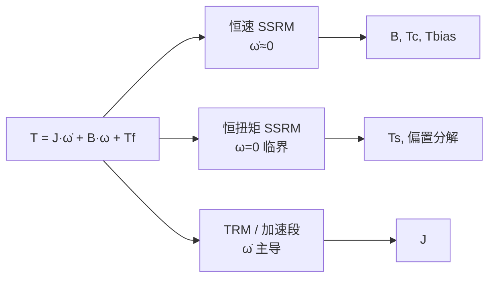

# SSRM — Steady-State Response Method（稳态响应法）

**SSRM（稳态响应法）**：给电机/关节施加 **可重复的规定输入**，等响应 **进入稳态**（$\dot\omega$、$\ddot\omega$ 近似常数或为零），测量稳态下的力矩与速度，再用 **退化的标量方程** 反推机械参数。它回答「不用黑盒优化，能不能用几组简单工况把摩擦和偏置先拆出来」，算法选型与写回仿真见 [关节执行器参数辨识](./joint-actuator-parameter-identification.md)。

## 一句话定义

**准静态换工况：恒速读 $B$ 与 $T_c$，恒扭矩读阈值与偏置；$J$ 要靠加速段或 TRM，不要从稳态位置误差猜摩擦。**

## 英文缩写速查

| 缩写 | 英文全称 | 简要说明 |
|------|----------|----------|
| SSRM | Steady-State Response Method | 本页：等稳态后反推参数 |
| TRM | Transient Response Method | 瞬态/加速段辨识；常与 SSRM 成对（电气或 $J$） |
| SysID | System Identification | 参数辨识总称 |
| Coulomb | Coulomb Friction | 与 $\mathrm{sign}(\dot q)$ 相关的库仑项 $T_c$ |
| Viscous | Viscous Friction | 与速度成正比的黏性项 $B$ 或 $b$ |
| PD | Proportional–Derivative | 闭环辨识时 $K_p,K_d$ 会混进「总阻尼」 |

## 为什么重要

- **概念极简、台架友好。** 不需要 Fourier 激励或 CMA-ES，十几行脚本 + 电流/力矩读数即可得到 Sim2Real 最缺的 $b,\tau_c$。
- **先拆摩擦，再拟动态。** [关节动力学辨识实验设计](./sim2real-joint-sysid-experiment-design.md) 把 SSRM 放在延迟之后、Chirp 之前；顺序反了，未建模摩擦会被 $J_{\mathrm{eff}}$ 或 $K_d$ 吸收。
- **与电气 SSRM 同哲学。** 矿用变频器文献用稳态直流测 $R_s$、瞬态测 $L$；机械侧用恒速测摩擦、加速测 $J$，是同一「让 unwanted 项从方程里消失」思路。

## 核心原理

### 机械侧最小模型

$$
T = J\dot\omega + B\omega + T_f
$$

- $J$：关节侧等效转动惯量（含转子反射 $J_r G^2$，见 [Armature Modeling](../concepts/armature-modeling.md)）
- $B$：黏性摩擦系数（MuJoCo `damping`）
- $T_f$：摩擦矩，最简 $T_f = T_c\,\mathrm{sign}(\omega) + T_{\mathrm{bias}}$（$T_c$ → `frictionloss`，$T_{\mathrm{bias}}$ 含重力残差、预紧、恒定扰动）

### 三类 SSRM 工况与方程退化

| 工况 | 控制输入 | 稳态条件 | 退化方程 | 可辨识 |
|------|----------|----------|----------|--------|
| **恒速** | 速度模式或多档 $\omega_i$ | $\dot\omega\approx 0$ | $T = B\omega + T_c\,\mathrm{sign}(\omega) + T_{\mathrm{bias}}$ | $B$、$T_c$（多档）；$T_{\mathrm{bias}}$ 若姿态固定 |
| **恒扭矩起动** | 重力补偿后缓增 $T$ | $\omega=0$ 临界点 | $T \approx T_s$（静摩擦） | $T_s$；正负 **半差→摩擦、半和→偏置** |
| **恒加速（TRM）** | 已知 $T$，测 $\alpha$ | $\|\omega\|$ 小或 $\alpha$ 主导 | $T \approx J\alpha + \text{小项}$ | $J$（需扣除已估 $B,T_c$） |

**恒速读图：** 对 $\tau$–$\omega$ 作图，**斜率 = $B$**，正负分支 **截距差 ≈ $2T_c$**；过零弯曲提示 Stribeck/死区（见 [Joint Friction Models](../concepts/joint-friction-models.md)）。

**恒扭矩读图：** 缓慢增力矩，记录首次持续运动阈值；突加力矩会破坏 $\dot\omega\approx 0$ 前提。双向阈值 $T_+,T_-$：$(T_+-T_-)/2$ 给摩擦，$(T_++T_-)/2$ 给偏置。

**$J$ 为何常不算纯 SSRM：** 纯恒速段 $\dot\omega=0$，惯量项自动消失；$J$ 需 **TRM**（开环 $\tau$–$\alpha$ 回归、摆锤自由衰减、或小幅动态段），见 [关节执行器参数辨识](./joint-actuator-parameter-identification.md) 的 BAM/PACE 路线。

## 主要技术路线

| 路线 | 输入 | 稳态判据 | 输出参数 | 典型入口 |
|------|------|----------|----------|----------|
| 多档恒速 SSRM | 速度指令 $\omega_i$（正/反） | 换向段外 $\dot\omega\approx 0$ | $B$、$T_c$、可选 $T_{\mathrm{bias}}$ | 驱动器速度模式；无则三角波位置 |
| 恒扭矩起动 SSRM | 缓增 $T$（重力已补偿） | $\omega=0$ 临界 | $T_s$；半差/半和分摩擦与偏置 | 力矩模式或电流环 |
| SSRM + TRM 组合 | 先 SSRM 再小幅加速 | 摩擦项已扣除 | $J$ 或 $I_a$ | BAM 摆锤；PACE 悬空 Chirp |
| 频域 SSRM（教材口径） | 逐频点正弦，等幅 | 每频点输出稳态 | FRF → $\tau,\omega_n,\zeta$ | 扫频/Chirp；见 [实验设计](./sim2real-joint-sysid-experiment-design.md) ③ |

Armstrong–Dupont–Canudas 1994 综述与 Elhami & Brookfield 1997 的 **顺序辨识** 都属第一、二行；Specht & Isermann 1989 用不同运动段切换 SSRM/TRM 角色。

## 工程实践

### 推荐顺序（单关节）

1. 时间戳 / 延迟（阶跃，非 SSRM）
2. **SSRM 恒速**：3–5 档 $\|\omega\|$，正反各一段，丢弃换向加减速
3. **SSRM 恒扭矩**：多姿态重复，分离重力与预紧
4. TRM / Chirp / 自由衰减 → $J$、被动 $b$、柔性

### 操作要点

| 要点 | 原因 |
|------|------|
| 速度 **不能为零** | $\omega=0$ 时 $B\omega$ 消失，库仑与黏性不可分 |
| 换向段 **丢弃** | 加减速段 $J\dot\omega$ 重新出现，破坏稳态方程 |
| 用 **限幅后实际扭矩** | 控制器输出 ≠ 电机端力矩；无标定只能得「等效摩擦」 |
| **不要** 用稳态位置误差 × $K_p$ 当摩擦 | 窗口结束时可能仍在回落；不同位置的重力/预载与摩擦混叠 |
| 重力 **先补偿或分姿态** | 否则 $T_{\mathrm{bias}}$ 被误记为摩擦 |

### 与算法页的边界

| 你有 | SSRM 交付 | 下一步 |
|------|-----------|--------|
| 力矩/电流 | $B,T_c,T_{\mathrm{bias}}$ | FloBaRoID 线性回归补 $I_a$ + 连杆参数 |
| 只有编码器 | 仅摩擦/偏置（恒速仍可做） | BAM 摆锤 / PACE 悬空 Chirp 估 $J$ + 仿真对齐 |
| 高减速比舵机 | 同上 | [BAM](../entities/bam-better-actuator-models.md) 文档站摆锤流程 |

## 局限与风险

1. **Stribeck / 齿槽 / 回差** — 纯 Coulomb+黏性 在恒速段残差大；弯折应换扩展摩擦模型，不是强行线性外推。
2. **闭环 PD 污染** — 恒速若靠位置环实现，$K_d$ 与 $B$ 相加；外推 $K_d=0$ 或开力矩/速度模式。
3. **$J$ 与 $k_t$ 等价** — 只有位置曲线时，SSRM 给不了物理 $J$，只能给 $J/k_t$。
4. **电气域 SSRM 不同参** — 变频器 SSRM 测 $R_s,L_m$；勿与机械 $J,B,T_c$ 混表（见 [参考来源](#参考来源) 论文簇说明）。

## 关联页面

- [关节执行器参数辨识](./joint-actuator-parameter-identification.md) — OLS / CMA-ES 与写回 MuJoCo
- [关节动力学辨识实验设计](./sim2real-joint-sysid-experiment-design.md) — SSRM 在分级流水线中的位置（② 级）
- [Joint Friction Models](../concepts/joint-friction-models.md) — $T_f$ 模型选型
- [System Identification](../concepts/system-identification.md) — SysID 全景
- [Armature Modeling](../concepts/armature-modeling.md) — $J$ 在仿真里的写法
- [BAM](../entities/bam-better-actuator-models.md) / [FloBaRoID](../entities/flobaroid.md) — SSRM 估完摩擦后的工具链
- [执行器驱动链选型闭环](../queries/actuator-drive-chain-selection-loop.md)

## 参考来源

- [SSRM 稳态响应法论文簇](../../sources/papers/ssrm_steady_state_response_method.md)
- [自由度 FreeDof：Sim2Real 动力学辨识实验设计](../../sources/blogs/wechat_freedof_sim2real_dynamics_identification.md)

## 推荐继续阅读

- Armstrong-Héélouvry, Dupont & Canudas de Wit, *Friction in Servo Machines: Analysis and Control Methods*, Applied Mechanics Reviews 1994：<https://doi.org/10.1115/1.3111082>
- Elhami & Brookfield, *Sequential identification of coulomb and viscous friction in robot drives*, Automatica 1997：<https://doi.org/10.1016/s0005-1098(96)00183-5>
- Specht & Isermann, *On-line identification of inertia, friction and gravitational forces applied to an industrial robot*, Syroco 1988：<https://doi.org/10.1016/b978-0-08-035742-3.50041-1>
- Swamy, *The steady state response of a servosystem taking stiction and coulomb friction into consideration*, J. Franklin Institute 1965：<https://doi.org/10.1016/0016-0032(65)90002-5>
