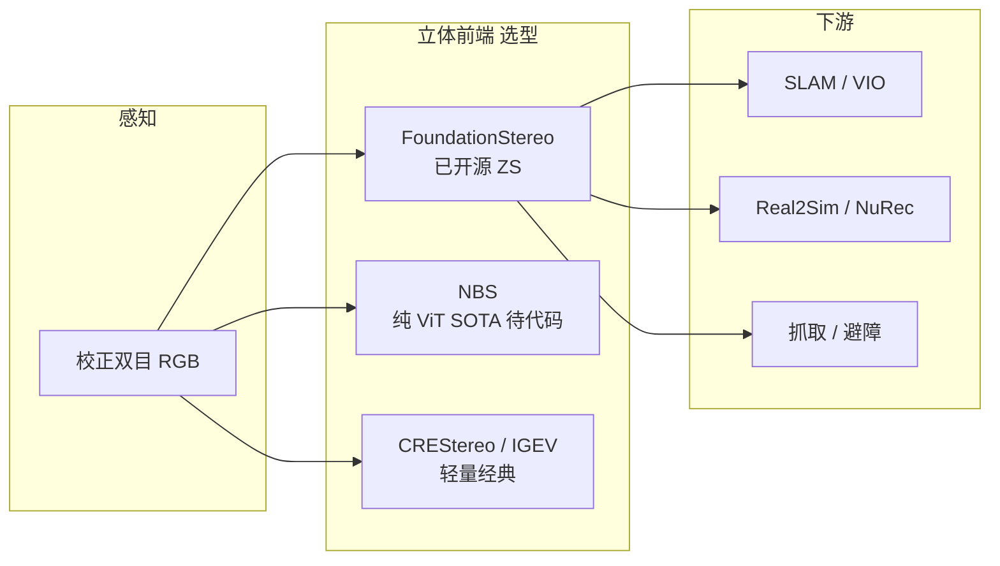

# 立体匹配基础模型与基准生态

本页汇总 **双目立体匹配（stereo matching）** 在 **基础模型时代** 的主线方法与评测基准，以 [NBS](../entities/paper-nbs-no-bias-stereo.md)（*No Bias Stereo*，Intrinsic × Texas A&M，arXiv:2608.28933）为 **「纯 ViT、无相关体」** 范式锚点，串联机器人感知栈中常见的 **FoundationStereo**、**S²M²** 及经典 **IGEV / CREStereo / RAFT-Stereo** 对照。单目法线侧，[Poppy](../entities/paper-sa-2603-27891-poppy-polarization-normal-estimation.md) 用测试时偏振引导细化冻结 RGB 骨干的法线估计（ECCV 2026 Oral；已开源）。

## 一句话定义

**从校正双目图像估计稠密视差/深度：传统方法靠相关体与迭代 refinement；2024–2026 基础模型路线用大规模数据 + 强骨干（DINOv2/CroCo）换零样本与可扩展性；NBS 进一步主张连相关体都可省略。**

## 英文缩写速查

| 缩写 | 英文全称 | 简要说明 |
|------|----------|----------|
| Stereo | Stereo Matching | 双目立体匹配；视差 → 深度 |
| ZS | Zero-Shot | 零样本泛化到新场景（FoundationStereo 卖点） |
| GEV | Geometry Encoding Volume | IGEV 系迭代几何编码体 |
| EPE | End-Point Error | 视差端点误差 |
| D1 | Disparity Error > 3px | KITTI 常用坏点率 |
| ViT | Vision Transformer | NBS / DINOv2 骨干 |

## 为什么重要

- **机器人通用深度前端：** 头载/固定双目、RealSense 类传感器、仿真到真机的 **metric depth** 都依赖立体或立体+学习混合栈。
- **Real2Sim / 重建上游：** [NVIDIA NuRec](../entities/nvidia-nurec.md)、OSMO、Agentic Real2Sim 等管线常链 **FoundationStereo**；人形 [LadderMan](../entities/paper-ladderman-humanoid-perceptive-ladder-climbing.md) 用 **Fast-FoundationStereo** 作 VFM 深度。
- **范式正在切换：** NBS 证明 **无 correlation volume** 也可 SOTA — 选型时需区分 **已开源可部署** vs **论文 SOTA 待发布**。

## 主要技术路线

| 路线 | 代表 | 核心机制 | 开源 |
|------|------|----------|------|
| **循环相关场** | RAFT-Stereo, CREStereo | 多级/级联 correlation + GRU 更新 | 是 |
| **几何编码体** | IGEV, Selective-IGEV | 迭代 geometry encoding volume + 频域选择 | 是 |
| **预训练 + 微调** | CroCo v2 | 跨视图 completion 预训练 → 立体头 | 是 |
| **零样本基础模型** | FoundationStereo | 大规模预训练 → 零样本泛化 | 是 |
| **可扩展 FM** | S²M² | 可靠深度 + 可扩展训练 | 是 |
| **无偏置 ViT** | NBS | DINOv2-L + 交替 attention + DPT；**无** correlation volume | **待发布** |

## 方法谱系（详表）

| 方法 | 会议/年 | 归纳偏置 | 代码 | 机器人相关印象 |
|------|---------|----------|------|----------------|
| [RAFT-Stereo](https://github.com/princeton-vl/RAFT-Stereo) | 3DV 2021 | 多级循环相关场 | **已开源** | 经典强基线；[EGO-OSCAR](../entities/paper-ego-oscar.md) 曾测 |
| [CREStereo](https://github.com/megvii-research/CREStereo) | CVPR 2022 Oral | 级联循环 + 自适应相关 | **已开源** | 轻量（9.5M）；NBS 对照 |
| [CroCo](https://github.com/naver/croco) / [v2](https://arxiv.org/abs/2303.12017) | NeurIPS'22 / ICCV'23 | 跨视图 completion 预训练 | **已开源** | 立体/光流统一预训练 |
| [IGEV-Stereo](https://github.com/gangweix/IGEV) | CVPR 2023 | 迭代 geometry encoding volume | **已开源** | Selective-IGEV 上游 |
| [Selective-IGEV](https://github.com/Windsrain/Selective-Stereo/tree/main/Selective-IGEV) | arXiv 2024 | 自适应频域选择 + IGEV | **已开源** | NBS 交互对比对象 |
| [FoundationStereo](https://github.com/NVlabs/FoundationStereo) | CVPR 2025 | 零样本基础模型 | **已开源** | **机器人栈最常用** 开源立体 FM |
| [S²M²](https://github.com/junhong-3dv/s2m2) | ICCV 2025 | 可扩展可靠深度 | **已开源** | Middlebury/ETH3D 常报榜 |
| [NBS](../entities/paper-nbs-no-bias-stereo.md) | arXiv 2026 | **无相关体纯 ViT** | **未开源** | ETH3D/SimpleProc SOTA + 最高效率 |

### 骨干与头（NBS 栈）

| 组件 | 链接 | 本库页面 |
|------|------|----------|
| **DINOv2** | [github.com/facebookresearch/dinov2](https://github.com/facebookresearch/dinov2) | [paper-dinov2](../entities/paper-dinov2.md) |
| **DPT** | [github.com/isl-org/DPT](https://github.com/isl-org/DPT) | [paper-dpt](../entities/paper-dpt.md) |

## 评测基准

| 基准 | 场景 | 常用指标 | 本库 |
|------|------|----------|------|
| [ETH3D Two-View](https://www.eth3d.net/low_res_two_view.php) | 高分辨率室内外 | EPE, bad@1/4 | [eth3d-stereo-benchmark](../entities/eth3d-stereo-benchmark.md) |
| [Middlebury V3](https://vision.middlebury.edu/stereo/eval3/) | 经典实验室场景 | bad %, avg err | [middlebury-stereo-benchmark](../entities/middlebury-stereo-benchmark.md) |
| [KITTI 2012/2015](https://www.cvlibs.net/datasets/kitti/eval_scene_flow.php?benchmark=stereo) | 自动驾驶驾驶 | D1-all, EPE | [kitti-stereo-benchmark](../entities/kitti-stereo-benchmark.md) |

**读榜提示：** NBS 主表强调 **ETH3D + SimpleProc（程序生成 OOD）+ XYZ-IBD（工业）**；Middlebury / KITTI 需查各论文原文是否提交。

## 流程总览（机器人栈典型位置）

## 工程实践

| 需求 | 推荐起点 | 备注 |
|------|----------|------|
| **今日可部署开源立体 FM** | [FoundationStereo](https://github.com/NVlabs/FoundationStereo) | NuRec 文档链、Isaac 生态 |
| **榜单位精度 / 学术复现** | S²M² + 关注 NBS 代码发布 | Middlebury / ETH3D |
| **边缘低算力** | CREStereo（~9.5M） | NBS 报 351M params — 非边缘向 |
| **已有 IGEV 系管线** | Selective-IGEV 升级 | NBS 定性优于 Selective-IGEV |
| **评测** | 先定基准：室内精细 → ETH3D；驾驶 → KITTI；经典 → Middlebury | 指标不可横比 |

## 局限与风险

- **NBS 未开源** — 论文 SOTA 与工程可用模型存在 **时间差**。
- **校正与标定：** 所有方法假设 **已校正双目**；机器人安装误差会直接进深度误差。
- **Sim2Real：** 深度噪声对 manipulation 比 loco 更敏感（参见 [REGRIND](../methods/regrind-retargeting-guided-rl.md) 等线的 sim2real 讨论）。

## 关联页面

- [NBS（No Bias Stereo）](../entities/paper-nbs-no-bias-stereo.md) — 本页范式锚点
- [DINOv2](../entities/paper-dinov2.md) / [DPT](../entities/paper-dpt.md) — NBS 骨干与头
- [NVIDIA NuRec](../entities/nvidia-nurec.md) — FoundationStereo 机器人重建栈
- [EATR-Stereo](../entities/paper-eatr-stereo.md) — 人形 **双目 + VLA** 另一路线（策略内融合，非 metric stereo FM）
- [State Estimation](../concepts/state-estimation.md) — 深度在估计链中的位置
- [机器人视觉感知栈选型闭环](../queries/robot-perception-stack-selection-loop.md) — 本页是其 ① 传感与标定层的「双目怎么选视差算法」分支：先由该闭环判断要不要 3D/深度、要不要走双目，再回本页在 FoundationStereo / CREStereo / NBS 之间定档

## 参考来源

- [NBS 论文摘录](../../sources/papers/nbs_arxiv_2608_28933.md)
- [立体匹配生态书目](../../sources/papers/stereo_matching_ecosystem_bibliography.md)
- [FoundationStereo 仓归档](../../sources/repos/nvlabs_foundation_stereo.md)
- [S²M² 仓归档](../../sources/repos/s2m2.md)

## 推荐继续阅读

- NBS 项目页：<https://intrinsic-experimental.github.io/nbs-website/>
- FoundationStereo：<https://nvlabs.github.io/FoundationStereo/>
- S²M² 项目页：<https://junhong-3dv.github.io/s2m2-project/>
- ETH3D benchmark：<https://www.eth3d.net/low_res_two_view.php>
