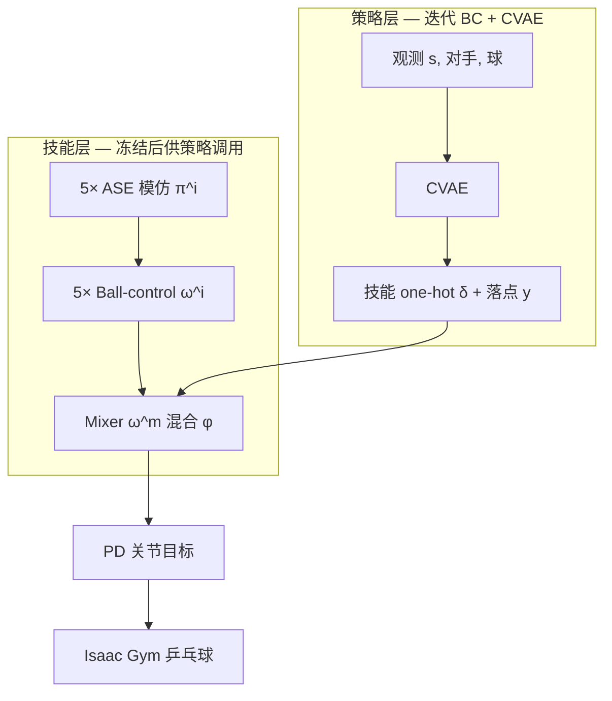

# Table Tennis Strategy & Skill Learning（PhysicsPingPong）

**PhysicsPingPong**（Wang et al., SIGGRAPH 2024, [arXiv:2407.16210](https://arxiv.org/abs/2407.16210)）为物理仿真乒乓球提出 **策略层 + 技能层** 分层控制：技能层保证五种击球动作的 **多样性、过渡与落点精度**；策略层在 **双智能体对打** 与 **VR 人–机** 场景中学会 **选技能与定落点**。

## 英文缩写速查

| 缩写 | 英文全称 | 简要说明 |
|------|----------|----------|
| ASE | Adversarial Skill Embeddings | 超球面 latent + 判别器的可复用技能嵌入框架 |
| CVAE | Conditional Variational Autoencoder | 策略层建模随机性的条件变分自编码器 |
| VR | Virtual Reality | 人–机实时对打的头戴显示与手柄接口 |
| BC | Behavior Cloning | 策略层从对局日志迭代克隆专家决策 |
| PD | Proportional-Derivative Control | 技能动作输出关节目标角再算力矩 |
| RL | Reinforcement Learning | 技能层各阶段用深度 RL 训练 |

## 为什么重要

- **显式解决技能 mode collapse**：单 universal 模仿策略在任务阶段常只用少数技能；**五路技能专家 + mixer 混合** 使 Skill Accuracy **0.76**（ASE **0.38**）。
- **策略可学习**：不仅手动/随机选技能，还用 **迭代 BC** 从竞争或合作对局中提炼 CVAE 策略。
- **VR 全身物理对打**：Unity 渲染 + Isaac Gym 仿真，用户球拍刚体跟 VR 手柄——相对仅浮动球拍的商业 VR 乒乓球更接近 **全身动力学** 交互。

## 主要技术路线

### 技能层三阶段

1. **Imitation**：每技能子集训练 ASE 策略 \(\pi^i\)；另训 universal \(\pi^u\)。
2. **Ball control**：固定 \(\pi^i\)，学 latent \(\omega^i\) 把球打到随机目标落点。
3. **Mixer**：随机技能 + 随机落点；\(\varphi\) 在关节维混合 universal 与选中技能动作，实现 **触球用专家、过渡用 mixer**。

### 策略层

- 每次对手来球更新 \((\delta, y)\)。
- **竞争**：只保留己方获胜片段；**合作**：保留对手成功回球片段。
- 对手可用 **随机策略** 或 **转播视频** 训练的启发式 CVAE。

## 与 SMPLOlympics 的关系

[SMPLOlympics](../entities/smplolympics.md) 在同一作者群生态中提供 **乒乓球练习环境** 与 **PULSE+AMP 基线**（Avg Hits 1.83）；本工作专注 **多技能 + 策略 + 人–机 VR**，是专项深化而非替代 benchmark。

## 常见误区

- **不是人形机器人真机**——物理 **角色动画**；与人形硬件跑酷/模仿真机工作正交。
- **开源完整度有限**：GitHub 主要发布数据链接，训练代码需联系作者（见仓库 README）。

## 关联页面

- [SMPLOlympics](../entities/smplolympics.md) — 统一体育环境与乒乓球基线
- [乒乓球分层技能选型指南](../queries/table-tennis-hierarchical-skill-learning-guide.md) — ASE 专家 + mixer + 策略层选型
- [Imitation Learning](./imitation-learning.md) — 技能层模仿学习背景
- [ASE](./ase.md) — 技能模仿骨架
- [AMP](./amp-reward.md) — style reward 家族
- [Reward Design](../concepts/reward-design.md) — 拍面/落点/contact 门控奖励设计
- [Teleoperation](../tasks/teleoperation.md) — VR 交互范式参照

## 参考来源

- [Strategy and Skill Learning for Physics-based Table Tennis Animation](../../sources/papers/table_tennis_strategy_skill_arxiv_2407_16210.md)
- [PhysicsPingPong 项目页](../../sources/sites/physics-ping-pong-github-io.md)
- [GitHub 仓库](../../sources/repos/physics-ping-pong.md)
- [arXiv:2407.16210](https://arxiv.org/abs/2407.16210)

## 推荐继续阅读

- [PhysicsPingPong 主页](https://jiashunwang.github.io/PhysicsPingPong/)
- [SMPLOlympics 实体页](../entities/smplolympics.md)
