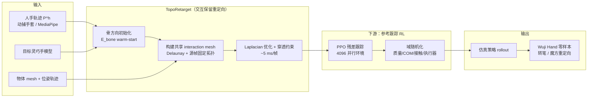

# TopoRetarget（交互保留灵巧重定向）

**TopoRetarget**（Wu 等，arXiv:2606.16272，清华大学 IIIS / MARS Lab）把灵巧手 **hand–object 演示** 转成机器人可跟踪的参考轨迹时，不追求逐点复制人手姿态，而是显式保留 **局部 hand–object 交互拓扑**——哪些关键点接触物体、相对位置与方向如何演化——并在同一组固定参数下适配不同物体、尺度与灵巧手 embodiment。

## 英文缩写速查

| 缩写 | 英文全称 | 简要说明 |
|------|----------|----------|
| Retargeting | Motion Retargeting | 将人体/动物动作映射到目标机器人骨架 |
| RL | Reinforcement Learning | 通过与环境交互最大化长期回报来学习策略 |
| PPO | Proximal Policy Optimization | 常用 on-policy 策略梯度算法 |
| DR | Domain Randomization | 训练时随机化仿真参数以提升跨域鲁棒迁移 |
| IK | Inverse Kinematics | 满足末端/姿态约束求解关节角的运动学逆解 |
| SDF | Signed Distance Field | 有符号距离场，用于穿透检测与约束 |
| Manipulation | Robot Manipulation | 抓取、移动、操作物体的任务总称 |

## 为什么重要

- **接触结构才是任务信号：** 转笔、魔方重定向等技能依赖指尖、指侧、掌面等多点接触切换；只匹配指尖或关节角会让 RL 在仿真里追「几何像但接触错」的参考，表现为漏接触、穿透与不可行抓取。
- **参考质量直接决定 downstream RL：** 论文用同一套 PPO 配方对比多路重定向产物；Pen-Spin 上 TopoRetarget 达 **87.5%** 成功率，较 OmniRetarget（46.9%）高约 **40 百分点**，说明瓶颈常在重定向而非策略架构。
- **与人形 OmniRetarget 同族、尺度不同：** 二者都用 **interaction mesh + Laplacian 形变能** 保留交互，但 TopoRetarget 面向 **21 点手部 + 物体表面采样** 的灵巧操作，强调 **<5 ms/帧** 实时求解与 **Wuji Hand** 零样本 sim2real。

## 主要技术路线

| 模块 | 输入 / 决策 | 作用 |
|------|-------------|------|
| **骨方向初始化** | MediaPipe 21 关键点、目标手模型 | 在腕部手坐标系匹配相邻骨段方向差，得 warm-start $\tilde{q}^r_t$ |
| **Interaction mesh** | 人手/机器人关键点 + 物体 mesh 采样 $O_t$ | Delaunay 四面体建共享边集 $\mathcal{I}_t$；换物体/尺度时重建采样、复用同一 Laplacian 框架 |
| **拓扑感知 Laplacian 优化** | 机器人配置 $q$、源帧固定权重 $w_{ij,t}$ | 最小化源/机器人加权 Laplacian 坐标差 + 骨方向先验 + 时序正则 |
| **穿透处理** | hand–object SDF $\phi_i(q)$ | 软/硬界 + slack 变量，ContactPose 上最大穿透 **1.07 mm**，>2 mm 穿透帧 **0%** |
| **轻量 PPO 跟踪** | 重定向参考 $\xi^{\text{ref}}$ | 残差动作、base 系物体/连杆前瞻观测；4 项 tracking reward + 物体/执行器 DR |

## 流程总览（Mermaid）

## 与常见路线的关系

- **相对 OmniRetarget：** 同用 **interaction mesh + Laplacian** 保留人–物/手–物局部关系；OmniRetarget 面向 **人形全身 + 地形/物体 Sequential SOCP**（~41 ms/帧），TopoRetarget 面向 **灵巧手 + 固定参数实时优化**（~4.7 ms/帧），在 ContactPose 接触精度/对齐上更优。
- **相对 DexPilot / GeoRT：** 后者以 **手部中心** 或 **极速几何** 为目标，论文显示在 hand–object 穿透与接触对齐上劣势明显（GeoRT 最大穿透 **22.22 mm**）。
- **相对 SPIDER：** SPIDER 用 **并行仿真采样** 做动力学 refinement；TopoRetarget 停留在 **运动学交互保留 + 下游 RL 修补**，不重写控制序列，更轻、更适合实时遥操与大规模参考生成。
- **相对 REGRIND：** 同族 **interaction mesh + Laplacian + 残差 RL**；REGRIND 面向 **MoCap 单次演示 → 剪刀/螺丝刀工具操作 → LEAP/WUJI 真机**，并系统对比 SPIDER/DexMachina（见 [REGRIND](../methods/regrind-retargeting-guided-rl.md)）。
- **相对 GMR 类 IK：** GMR 解决骨架几何对齐；TopoRetarget 把 **物体相对交互** 写进 mesh 能量，专为 **contact-rich in-hand manipulation** 设计。

## 实验要点（论文 Table 1–2）

| 评测 | TopoRetarget 主张 | 阅读提示 |
|------|-------------------|----------|
| ContactPose 接触精度 | **7.71 mm**（基线次优 14.12 mm） | 以接触骨段相对物体位姿/方向误差定义 |
| Pen-Spin RL 成功率 | **87.5%** vs OmniRetarget **46.9%** | 同一 PPO 架构与 DR，仅换参考 |
| Ho-cap RL 成功率 | **84.4%**，物体位置误差 **0.87 cm** | 抓取主导轨迹，旋转误差各法接近 |
| 真机 Wuji Hand | 零样本转笔、魔方重定向 | 5/5 trial 保持转笔（项目页视频） |

## 局限与阅读时注意点

- **上游参考质量：** 可容忍源侧轻微穿透，但对「应接触未接触」的虚拟接触需预处理。
- **未强调动力学一致化：** 与 SPIDER / DynaRetarget 不同，可行性主要靠运动学约束 + 下游 RL/DR；极端力控任务仍需验证。
- **数据集与代码发布：** 论文承诺轨迹与策略数据；入库日以项目页与 arXiv 为准，工程复现前请核对仓库更新。

## 关联页面

- [Motion Retargeting（动作重定向）](../concepts/motion-retargeting.md) — 灵巧手场景下的交互保留分支。
- [Motion Retargeting Pipeline（动作重定向流水线）](../concepts/motion-retargeting-pipeline.md) — 「演示 → 参考 → RL 跟踪」段的一种 Laplacian mesh 落点。
- [SPIDER（物理感知采样式灵巧重定向）](./spider-physics-informed-dexterous-retargeting.md) — 仿真采样动力学 refinement 对照。
- [OmniRetarget（人形交互保留重定向）](../entities/paper-hrl-stack-03-omniretarget.md) — 同人族 interaction mesh，全身 loco-manipulation 尺度。
- [REGRIND（重定向引导灵巧操作 RL）](./regrind-retargeting-guided-rl.md) — 同族 mesh 重定向 + 残差 RL，剪刀/螺丝刀真机。
- [Manipulation（操作）](../tasks/manipulation.md) — contact-rich 灵巧技能任务背景。
- [舞肌科技 / Wuji Hand](../entities/wuji-robotics.md) — 论文主真机平台。
- [DynaRetarget vs TopoRetarget（接触保真重定向对比）](../comparisons/dynaretarget-vs-toporetarget-retargeting.md) — 运动学层 vs 动力学层接触保真选型对比。

## 推荐继续阅读

- 论文摘要页：<https://arxiv.org/abs/2606.16272>
- arXiv HTML 全文：<https://arxiv.org/html/2606.16272v1>
- MARS Lab 项目页：<https://tsinghua-mars-lab.github.io/toporetarget-web/>
- 近邻全身交互保留：[OmniRetarget 项目页](https://omniretarget.github.io/)

## 参考来源

- [toporetarget_arxiv_2606_16272（本入库摘录）](../../sources/papers/toporetarget_arxiv_2606_16272.md)
- [toporetarget-github-io（项目页索引）](../../sources/sites/toporetarget-github-io.md)
