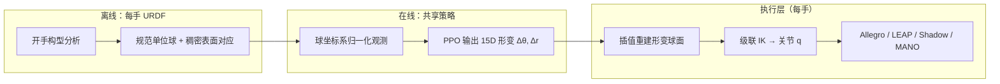

# UHAS（Unified Hand Action Space，统一手部动作空间）

**UHAS**（Casas 等，arXiv:2607.03570，UT Dallas IRVL / ASU IRIS，RSS 2026 灵巧操作研讨会）提出一种 **球面几何统一动作空间**：策略不直接输出各手的关节角，而是输出 **规范球面的形变参数**，再由 **Cascade Inverse Kinematics（CIK，级联逆运动学）** 转成可执行的 embodiment 专用关节配置。项目演示中，**同一策略可同时控制四只运动学与指数量不同的手**（Allegro、LEAP、Shadow、MANO）。

## 英文缩写速查

| 缩写 | 英文全称 | 简要说明 |
|------|----------|----------|
| UHAS | Unified Hand Action Space | 把球面形变作为跨灵巧手共享的动作表示 |
| CIK | Cascade Inverse Kinematics | 将形变球面映射到各手关节的级联逆解算法 |
| RL | Reinforcement Learning | 通过与环境交互最大化长期回报来学习策略的范式 |
| IK | Inverse Kinematics | 满足末端/姿态约束求解关节角的运动学逆解 |
| PPO | Proximal Policy Optimization | 本文采用的 on-policy 策略梯度算法 |
| MANO | hand Model with Articulated and Non-rigid defOrmations | 参数化人手模型，本文作第五种 evaluation embodiment |
| Sim2Real | Simulation to Real | 仿真策略迁移到真机的工程主线 |

## 为什么重要

- **灵巧手仍是跨具身短板：** 大规模机器人学习长期以平行夹爪为主；多指手的 **DoF、拓扑、控制接口** 碎片化，导致「换一只手就重训一套策略」成为常态。
- **动作层统一而非仅数据层堆叠：** UHAS 在 **动作与观测** 两侧都落到 **规范球坐标系**（按各手 URDF 自动建球并归一化），使 PPO 策略可在 **同一 15 维形变空间** 上同时服务 4 指与 5 指手。
- **可操作的迁移证据链：** 论文给出 **四手联合训练 ≈ 单手专训**、**排除目标手的零样本**、**MANO→真机手 500 iter 微调** 与 **真机 LEAP** 部署，把「统一动作空间」从概念推进到可测指标。

## 主要技术路线

### 1. 从 URDF 到规范单位球

给定灵巧手 URDF 的开手构型：

1. 取掌根与指尖坐标系，掌心为指根平均，半径 \(r = 2l/\pi\)（\(l\) 为掌心到指尖平均距离）。
2. 球心沿 **掌法向外** 距离 \(r\)；球坐标系 \(z\) 对齐掌法、\(x\) 对齐中指方向。
3. 所有距离按该手半径 **归一化到单位球**，消除尺度差，保留各手自己的球参数供 CIK 反归一化。

### 2. 稠密手–球面对应

在球面均匀采样点 \((\theta, \phi)\) 及法向，投影到掌/指内表面，建立 **配置不变** 的稠密对应：手指运动时 3D 表面点会变，但所属 \((\theta,\phi)\) **不变**——这是跨手共享动作语义的关键。

### 3. 紧凑形变动作（默认 15 维）

完整球面点变形维度过高；UHAS 用 **驱动平面 + 驱动向量** 参数化：

| 分量 | 控制方式 | 含义 |
|------|----------|------|
| \(\Delta\theta\) | 绕球心的驱动平面旋转 | 侧向/张开式形变 |
| \(\Delta r\) | 平面内驱动向量径向位移 | 包络/握拳式形变 |

默认 **5 个驱动平面 × 每平面 2 个驱动向量 = 15 维**；驱动平面与手指对齐。**4 指手** 在无名指位 **复制一环指平面**（及对应观测），使动作/观测张量与 5 指手对齐。

### 4. CIK 与球控制器

- 关节分为 **侧向关节**（主要改指尖 \(\theta\)）与 **包络关节**（主要改 \(r,\phi\)）。
- **侧向阶段：** 预计算 lateral joint sweep lookup，由目标 \(\Delta\theta\) 查表得 \(\Delta q_{\text{lateral}}\)。
- **包络阶段：** 沿指运动链从根到尖，逐级解 1D IK，把下游表面点贴到形变球目标位置。
- **球控制器** = 形变参数化 + CIK；论文报告 CIK 可达 **~150 Hz**，适合闭环 RL。

## 流程总览

## 实验要点（手内立方体重定向）

**任务：** Isaac Lab Repose Cube；每 episode 连续 **10 个目标朝向**；仿真四手，真机 primarily **LEAP**（AprilTag 位姿 + 系统辨识）。

| 设定 | 主张 | 阅读提示 |
|------|------|----------|
| **Multi-Hand** | 四手联合训，成功率与连续重定向与 **Single-Hand** 相当（~99% / ~9.5） | 支持「单策略多手」而非明显牺牲 |
| **Zero-shot** | 训练时去掉目标手，Allegro/LEAP 仍 ~95% / ~7.7；Shadow 较弱 | 形态差越大，零样本越难 |
| **跨指数量** | 5 指组训 → 4 指手成功率可跌至 ~66%；同组内迁移接近满性能 | 论文承认 **4F↔5F** 仍有明显 gap |
| **MANO 微调** | 仅 **500 iter** 相对 scratch **~4500 iter** 即可恢复新机 | 适合作为新机 **热启动** 路径 |
| **真机 LEAP** | 10 试平均连续重定向：关节基线 **0.6** → UHAS 零样本 **0.9** → 四手联合 **1.1** → 仅 LEAP **2.0** | 仿真–真机仍有 gap；专训单机仍最优 |

**消融：** 每平面 **2 个驱动向量** 在性能与训练时长间最均衡（相对 1/3/4 向量）。

## 工程实践

1. **先为每只手跑 URDF→球管线**，确认开手构型下指尖法向与掌法近似对齐（论文假设）。
2. **策略在 UHAS 训练**，部署时用 **球控制器** 转关节；观测务必在同一规范球系下归一化。
3. **4 指部署 5 指策略**：复制环指驱动平面与观测槽位，无需改网络结构。
4. **真机**：预留 **PD 调参与系统辨识** 预算；论文强调低层控制对 sim2real 极敏感。
5. **多手联合训更保守：** 真机上四手联合模型不如 LEAP 专训——轻量 actor-critic 会学「所有手都安全」的保守动作；算力允许时可加大网络或分阶段课程。

## 局限与风险

- **任务与奖励敏感：** 当前主结果集中在 **手内立方体重定向** 与特定 Isaac Lab 奖励；换物体/接触任务需重新验证形变基是否足够表达。
- **4 指 vs 5 指形态鸿沟：** 零样本与跨组迁移在 Shadow 或跨指数量时性能显著下降；不能假设「任意新手零样本即用」。
- **依赖 CIK 可行性：** 极端形变或非常规 URDF 可能导致 IK 不可行；需监控关节限位与穿透。
- **与数据驱动重定向正交：** UHAS 统一的是 **控制动作空间**；人手演示仍可能需要 [Motion Retargeting](../concepts/motion-retargeting.md) 等管线才能进入同一空间。

## 与其他页面的关系

- 与 [In-hand Reorientation](./in-hand-reorientation.md)：UHAS 是当前该任务上 **跨具身 RL 动作表示** 的代表性工作；前者综述任务挑战与 OpenAI 等经典路线，后者给出 **多手单策略** 的几何接口。
- 与 [跨具身策略迁移选型指南](../queries/cross-embodiment-transfer-strategy.md)：SONIC/Any2Any 等主要面向 **人形全身 WBT**；UHAS 把「统一动作空间 + 多具身联合训练」落到 **灵巧手关节层**，可作为操作栈的互补参考。
- 与 [Allegro Hand](../entities/allegro-hand.md) / [Shadow Hand](../entities/shadow-hand.md)：论文评测平台；项目视频展示四手同策略时二者均为核心 embodiment。
- 与 [Motion Retargeting](../concepts/motion-retargeting.md)：重定向解决 **演示/参考轨迹跨骨架**；UHAS 解决 **策略动作跨手型**——可串联但问题不同。

## 推荐继续阅读

- 官方项目页（四手同策略演示视频）：<https://irvlutd.github.io/UHAS/>
- 论文 arXiv：<https://arxiv.org/abs/2607.03570>
- RobotFingerPrint（同组先前工作，球面统一抓取坐标）：见论文引用 Khargonkar et al. 2024

## 参考来源

- [UHAS 论文摘录（arXiv:2607.03570）](../../sources/papers/uhas_arxiv_2607_03570.md)
- [UHAS 官方项目页（IRVL UTD）](../../sources/sites/uhas-project-irvlutd.md)

## 关联页面

- [In-hand Reorientation（手内重定向）](./in-hand-reorientation.md)
- [Manipulation（操作任务）](../tasks/manipulation.md)
- [Motion Retargeting（运动重定向）](../concepts/motion-retargeting.md)
- [跨具身策略迁移选型指南](../queries/cross-embodiment-transfer-strategy.md)
- [Allegro Hand](../entities/allegro-hand.md)
- [Shadow Hand](../entities/shadow-hand.md)
