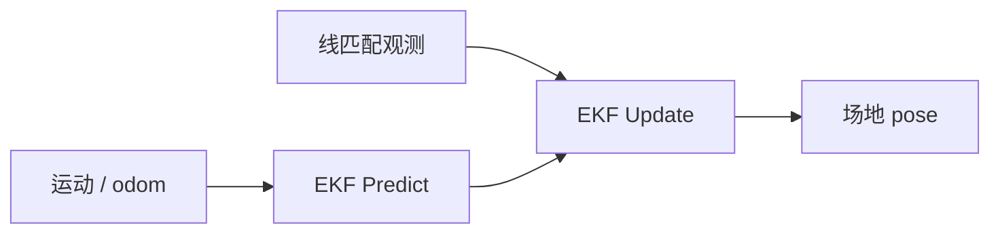

# 线特征视觉定位的 EKF 融合

## 一句话定义

**线特征 EKF 融合**在 [扩展卡尔曼滤波](../formalizations/ekf.md) 框架下，以运动模型预测机器人场地位姿，并以 [线匹配](./visual-line-matching-localization.md) 得到的位姿或线几何残差为观测，输出抗抖的定位估计——课程第 7.3 节。

## 英文缩写速查

| 缩写 | 英文全称 | 简要说明 |
|------|----------|----------|
| EKF | Extended Kalman Filter | 非线性系统局部线性化滤波 |
| Innovation | Innovation | 观测残差 \(y - h(\hat{x})\) |
| Odom | Odometry | 预测步常用输入 |
| Mahalanobis | Mahalanobis Distance | 门控异常线观测 |
| SE(2) | Special Euclidean Group 2D | 场地平面位姿常用流形 |

## 为什么重要

- 单帧线匹配会跳；踢球决策需要平滑位姿与合理协方差。
- 把「看见线」与「腿在动」统一到同一滤波器。
- 滤波形式化见 [EKF](../formalizations/ekf.md)；多传感器叙事见 [传感器融合](../concepts/sensor-fusion.md)。

## 主要技术路线

| 路线 | 状态 | 观测 |
|------|------|------|
| 位姿测量 EKF | \(SE(2)\) 位姿 | 线匹配直接输出 \((x,y,\theta)\) |
| 残差 EKF | 同左 | 线距离 / 交点重投影残差 |
| 粒子滤波对照 | 多峰后验 | 对称场地全局模糊时 |
| 与里程计松耦合 | odom 预测 + 视觉更新 | 课程默认教学路径 |

## 核心原理

1. **预测**：差分驱动或行走速度积分 + 过程噪声 \(Q\)。
2. **观测**：匹配成功的交点/线 → 位姿测量或堆叠线距离残差；观测噪声 \(R\) 随检测置信度缩放。
3. **更新**：标准 EKF；马氏距离门控拒野值。
4. **输出**：\((x,y,\theta)\) 供行为树/战术模块。

## 工程实践

- 调试看创新序列是否白；\(R\) 过大则定位跟着 odom 漂，过小则一遇误匹配就拽飞。
- 对称模糊时增大过程噪声或引入唯一地标（球门）观测。

## 局限与风险

- 强非线性/多峰后验时 EKF 不足，可上粒子滤波。
- 与三维 LiDAR 定位是不同栈；赛场视觉 EKF 通常在 **2D 场地平面**。

## 关联页面

- [EKF 形式化](../formalizations/ekf.md)
- [线匹配视觉定位](./visual-line-matching-localization.md)
- [人形系统课程策展](../entities/humanoid-system-curriculum.md)

## 参考来源

- [深蓝学院人形系统课程大纲](../../sources/courses/shenlan_humanoid_system_theory_practice.md)

## 推荐继续阅读

- Thrun, Burgard, Fox — *Probabilistic Robotics* 定位章节
