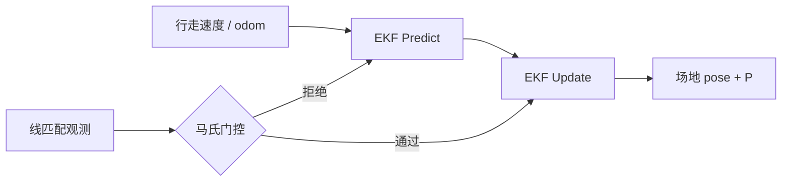

# 线特征视觉定位的 EKF 融合

## 一句话定义

**线特征 EKF 融合**在 [扩展卡尔曼滤波](../formalizations/ekf.md) 下，以行走/里程计运动模型预测场地平面位姿，以 [线匹配](./visual-line-matching-localization.md) 的位姿或线几何残差为观测更新，得到抗抖的 \((x,y,\theta)\)——课程第 7.3 节。

## 英文缩写速查

| 缩写 | 英文全称 | 简要说明 |
|------|----------|----------|
| EKF | Extended Kalman Filter | 非线性局部线性化滤波 |
| Innovation | Innovation | 观测残差 \(y-h(\hat{x})\) |
| \(Q,R\) | Process / Measurement noise | 过程/观测噪声协方差 |
| Mahalanobis | Mahalanobis Distance | 野值门控 |
| SE(2) | Special Euclidean Group | 平面刚体位姿 |
| Odom | Odometry | 预测步输入 |

## 为什么重要

- 单帧线匹配会跳变；踢球与站位需要 **平滑轨迹 + 可信协方差**。
- 把「腿在动」与「看见线」统一到同一估计器，短暂丢视线时仍可靠惯性/odom 撑住。
- 多传感器叙事见 [传感器融合](../concepts/sensor-fusion.md)；形式化见 [EKF](../formalizations/ekf.md)。

## 主要技术路线

| 路线 | 状态 | 观测形式 |
|------|------|----------|
| 位姿测量 EKF | \(SE(2)\) | 匹配直接给 \((x,y,\theta)\) |
| 残差 EKF | 同左 | 线距离/交点重投影残差堆叠 |
| 粒子滤波对照 | 多峰 | 对称场地全局模糊 |
| 松耦合里程计 | odom 预测 + 视觉更新 | 课程默认教学路径 |

## 核心原理

### 预测

差分驱动或速度积分（教学常用）：

\[
\begin{aligned}
p_{k|k-1} &= p_{k-1} + R(\theta)\,v\,\Delta t \\
\theta_{k|k-1} &= \theta_{k-1} + \omega\,\Delta t \\
P_{k|k-1} &= F P F^\top + Q
\end{aligned}
\]

足式噪声大 → \(Q\) 取大；有 IMU 航向时可降 \(\theta\) 过程噪声。

### 更新

观测 \(z\) 来自线匹配；观测模型 \(h(x)\) 为位姿本身或投影残差：

\[
K = P H^\top (HPH^\top+R)^{-1},\quad
\hat{x}\leftarrow \hat{x}+K(z-h(\hat{x}))
\]

**门控**：马氏距离超阈则拒绝本次视觉更新（防对称跳变/误匹配）。

### 噪声整定直觉

| 调参 | 过小 | 过大 |
|------|------|------|
| \(R\)（视觉） | 误匹配拽飞估计 | 定位跟 odom 漂 |
| \(Q\)（运动） | 过度相信里程计 | 视觉一来就猛拉 |

## 工程实践

### 课程联调顺序

1. 开环：只预测，画轨迹（应平滑但漂）。
2. 加入理想仿真观测（真值加噪），验证滤波收敛。
3. 接入真实 [线匹配](./visual-line-matching-localization.md)，调门限与 \(R\)。
4. 与行为层对接：丢失定位时降速/寻线行为。

### 调试指标

| 指标 | 期望 |
|------|------|
| 创新白化 | 直方图近似零均值 |
| 更新率 | 有线时稳定（如 5–15 Hz） |
| 对称跳变次数 | ≈0（门控生效） |
| 相对真值 RMSE | 仿真可定量；真机用已知地标 |

### 实现要点

- 状态与观测角用 **unwrap**，避免 \(\pm\pi\) 跳变。
- 检测置信度映射到 \(R\)：低置信 → 大 \(R\) 或直接拒识。
- 发布 `field→base` TF 时带时间戳，供决策节点插值。

## 局限与风险

- 强非线性/多峰时 EKF 不够 → 粒子滤波或多假设 EKF。
- **误区**：视觉丢失仍用过小 \(Q\) 硬积分——会在无观测时「假装很准」。
- 与 3D LiDAR 全局定位是不同栈；本节默认 **2D 场地平面**。

## 关联页面

- [EKF 形式化](../formalizations/ekf.md)
- [线匹配视觉定位](./visual-line-matching-localization.md)
- [场地线检测](./soccer-field-line-detection.md)
- [Humanoid Soccer](../tasks/humanoid-soccer.md)
- [人形系统课程策展](../entities/humanoid-system-curriculum.md)
- [足球视觉场线定位流水线](../queries/soccer-visual-field-localization-pipeline.md) — 本页是其第三段（EKF 融合），产出抗抖位姿

## 参考来源

- [深蓝学院人形系统课程大纲](../../sources/courses/shenlan_humanoid_system_theory_practice.md)

## 推荐继续阅读

- Thrun, Burgard, Fox — *Probabilistic Robotics*（EKF 定位章节）
- [Welch & Bishop Kalman 教程](../../sources/courses/welch_bishop_kalman_filter.md)
