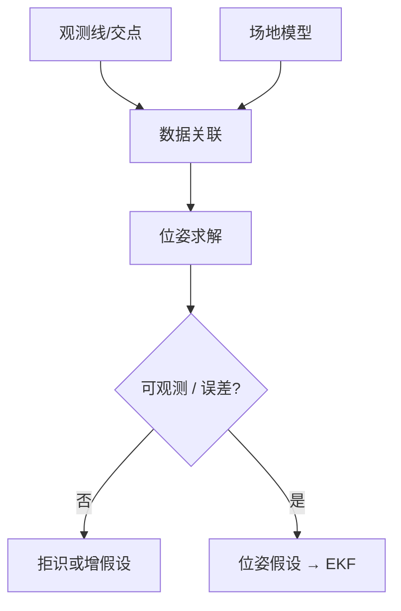

# 线匹配视觉定位

## 一句话定义

**线匹配视觉定位**将图像中提取的 **场地线或交点** 与已知场地图纸上的线特征做 **数据关联**，估计机器人在场地坐标系中的位姿——课程第 7.2 节「空间视觉定位 — 线匹配」。

## 英文缩写速查

| 缩写 | 英文全称 | 简要说明 |
|------|----------|----------|
| Data Association | Data Association | 观测 ↔ 模型对应 |
| Field Model | Field Model | 规则尺寸的场地先验地图 |
| PnP | Perspective-n-Point | 点特征位姿求解对照 |
| Homography | Homography | 平面单应，可分解位姿 |
| RANSAC | Random Sample Consensus | 拒野值关联 |
| FOV | Field of View | 可见特征数量上限 |

## 为什么重要

- 足球场有 **强先验结构**，比纯视觉里程计更抗弱纹理；白线在草地上对比度高时尤其有效。
- 单帧匹配结果噪声大，通常作为 [EKF 融合](./visual-line-ekf-fusion.md) 的观测，而不是直接当控制用位姿。
- 对称场地（左右禁区相似）会带来 **多峰后验**——必须与运动先验或球门朝向等唯一特征结合。

## 主要技术路线

| 路线 | 观测量 | 求解 |
|------|--------|------|
| 交点–模型匹配 | L/T/X 关键点 | 对应搜索 + 最小二乘 / PnP |
| 线–线匹配 | 无限线或线段 | 点到线 / 线到线残差 |
| 单应平面法 | 平面点集 | Homography → \((R,t)\) |
| 多假设 | 对称模糊 | 保留 N 假说交滤波器 |

## 核心原理

### 输入输出

- **输入**：[检测](./soccer-field-line-detection.md) + [坐标变换](../concepts/perception-coordinate-postprocessing.md) 后的线/交点；场地模型（米制）。
- **输出**：位姿假设 \(\hat{T}_{\text{field}}^{\text{base}}\)（或相机系）+ 可选协方差/假设列表。

### 匹配流水线

1. **候选生成**：按距离、角度、拓扑（「T 点只连三条模型边」）剪枝。
2. **打分**：重投影误差、线距离和、交点数量。
3. **鲁棒估计**：RANSAC 或门控最小二乘。
4. **可观测性检查**：自由度是否被约束（单条线无法定全位姿）。

### 最小特征组合（直觉）

| 可见特征 | 大致约束 |
|----------|----------|
| 一条线 | 横向/航向部分约束，沿线滑移自由 |
| 一个 L 角 + 朝向 | 常可定 2D 位姿 |
| 球门两柱 + 线 | 消歧左右半场 |
| 仅中圈弧 | 需额外模型，弱约束 |

## 工程实践

### 实现检查表

| 项 | 建议 |
|----|------|
| 模型单位 | 与规则书一致（mm/m 勿混） |
| 畸变 | 先去畸变再匹配 |
| 最小特征数 | 少於此则不发布观测 |
| 对称消歧 | 球门颜色/历史位姿/进攻方向 |
| 调试可视化 | 把模型线重投影回图像 |

### 与仿真的配合

在 [足球场仿真](../concepts/soccer-field-simulation.md) 中可精确知道真值位姿，便于画「匹配误差 vs 距离/俯仰」曲线，再上真机。

### 失败模式

| 现象 | 原因 |
|------|------|
| 位姿跳到对称位置 | 未消歧 |
| 误差随摆头爆炸 | 外参/时间戳 |
| 长期无输出 | FOV 内无线、阈值过严 |
| 贴边行走定位飘 | 线被截断、关联错边 |

## 局限与风险

- 遮挡、光照、线磨损导致关联失败率上升。
- **误区**：把单帧匹配当地面真值喂控制——应用 [EKF](./visual-line-ekf-fusion.md) 平滑并门控。
- 非标准场地（线宽/尺寸不符）模型必须重标定。

## 关联页面

- [场地线检测](./soccer-field-line-detection.md)
- [线特征 EKF 融合](./visual-line-ekf-fusion.md)
- [感知后处理与坐标变换](../concepts/perception-coordinate-postprocessing.md)
- [Humanoid Soccer](../tasks/humanoid-soccer.md)
- [人形系统课程策展](../entities/humanoid-system-curriculum.md)
- [足球视觉场线定位流水线](../queries/soccer-visual-field-localization-pipeline.md) — 本页是其第二段（线匹配数据关联）

## 参考来源

- [深蓝学院人形系统课程大纲](../../sources/courses/shenlan_humanoid_system_theory_practice.md)

## 推荐继续阅读

- RoboCup 各队开源视觉定位中的 field-line matcher 实现
- Hartley & Zisserman — *Multiple View Geometry*（平面单应章节）
