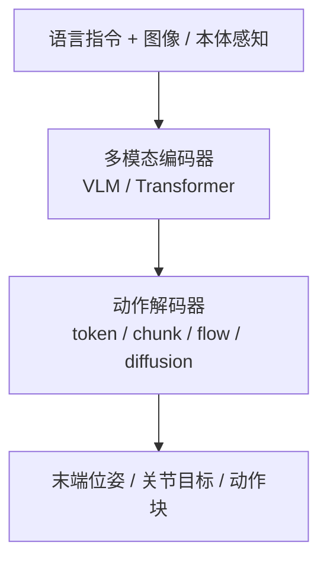

# VLA（Vision-Language-Action）

**VLA**：把视觉、语言和机器人动作统一到同一个模型里，让策略不只“看见状态后输出动作”，还能够显式理解任务指令和语义约束。

## 一句话定义

VLA 可以看成机器人版的多模态 foundation model：输入“看到了什么 + 要做什么”，输出“下一步怎么动”。

## 为什么重要

- 它把“任务描述”从手写 reward 或手工 state machine，转成自然语言接口。
- 它是 RT-2、π₀、OpenVLA、Octo 一类通用操作策略的共同抽象。
- 它让一个模型处理多任务成为可能，但代价是更大的数据需求、更高推理延迟，以及更复杂的部署链路。

## 主要技术路线

常见实现：
- **RT-2**：把 web-scale VLM 能力迁移到机器人控制
- **π₀**：在 VLA 上加入 Flow Matching，生成连续动作序列
- **OpenVLA / Octo**：更强调开源数据、跨任务泛化和 fine-tune 流程
- **StarVLA**：证明强 VLM 底座（Qwen3-VL）配合简单 MLP 动作头即可在多项基准上打破 SOTA，代表极简主义路线
- **RLDX-1**：在 Qwen3-VL 与 GR00T 系训练栈上引入 **MSAT** 多流扩散动作头，可选运动模块、时序记忆与触觉/力矩物理流，并配套图捕获与 RTC 的低延迟推理实现
- **SONIC × GR00T N1.5（NVIDIA 公开演示）**：高层 VLA 与低层 **规模化 motion tracking** 策略经 **统一控制接口** 串联，由同一套 tracking policy 承担快速全身反应；可作为「慢 VLA + 快执行器」分层形态的案例（细节以 [SONIC](./sonic-motion-tracking.md) 与项目页为准）
- **Being-H0.7**：用 egocentric 人视频 + 机器人演示，在**潜空间**用未来观测分支监督 **latent world–action** 先验；测试时不滚未来像素，直接输出动作，并常与 **action chunking**、异步缓冲（UAC）组合部署
- **HumanNet**：百万小时量级 **人中心** 一三人称视频语料 + 策展/标注管线；论文在 LingBot-VLA 设定下给出「**约 1000h** egocentric 人视频持续预训练 vs **约 100h** 真机数据」等受控对比，用于讨论 **人类视频小时** 能否在成本上部分替代早期真机预训练（见 [HumanNet](../entities/humannet.md)）

## VLA 与传统策略的区别

| 维度 | 传统 BC / RL 策略 | VLA |
|------|-------------------|-----|
| 任务输入 | 预定义 observation / goal | 自然语言 + 视觉 + 状态 |
| 泛化方式 | task-specific | 多任务/零样本/少样本 |
| 数据规模 | 百到千级演示 | 通常需要数千到数十万演示 |
| 推理开销 | 低，适合高频控制 | 高，常见 50ms+，需异步部署 |
| 适合任务 | 单任务控制 | 通用操作、多任务调度 |

## 核心优势

### 1. 语言条件化
可以直接用“把红色杯子放到左边托盘”之类的任务描述驱动策略，而不是单独写状态机。

### 2. 多任务统一
VLA 常把抓取、放置、开关门、抽屉操作等任务放进一个统一模型，而非每项任务单训一个 policy。

### 3. 语义泛化
Web 知识和视觉语义可以帮助机器人处理训练集中稀疏出现的物体、关系和指令表述。这通常配合 [Data Flywheel](../concepts/data-flywheel.md) 来实现闭环性能提升；进一步地，[LWD](./lwd.md) 把这套闭环重写为车队级 offline-to-online RL，把部署中的失败与人为干预也变成 generalist VLA 的训练信号。

## 算法能力栈 (Algorithm Capability Stack)

根据 [embodied-ai-guide](../../sources/repos/embodied-ai-guide.md) 与 [xbotics-embodied-guide](../../sources/repos/xbotics-embodied-guide.md) 的总结，具身智能的完整算法栈包含：
- **感知层 (Vision & Perception)**: 2D/3D/4D 视觉、视觉提示 (Visual Prompting)、Affordance 学习；在大规模室内场景中，可辅以互联网视频重建得到的 **3D 场景理解** 监督（例如 [SceneVerse++](../entities/sceneverse-pp.md) 支持的 [3D 空间 VQA](../concepts/3d-spatial-vqa.md) / [VLN](../tasks/vision-language-navigation.md) 数据），缓解纯 2D 图文预训练在度量空间关系上的短板。
- **规划层 (Planning)**: 基于 LLM 的任务拆解与逻辑推理。
- **策略层 (Policy)**: VLA 基础模型，通常采用分层双系统架构（慢速高层语义 + 快速低层反应）。**SFT (Supervised Fine-Tuning)** 是将通用 VLM 适配到机器人特定任务的关键步骤。
- **执行层 (Action)**: [action-chunking](action-chunking.md)、[diffusion-policy](diffusion-policy.md) 或关节控制。

## 实战路径建议

根据 [xbotics-embodied-guide](../../sources/repos/xbotics-embodied-guide.md) 的路线图，VLA 的落地建议分为四个阶段：
1. **基础掌握**：熟悉 [lerobot](../entities/lerobot.md) 框架与基础 [imitation-learning](imitation-learning.md) 算法。
2. **数据飞轮**：建立自动化数据采集与标注流水线（[auto-labeling-pipelines](auto-labeling-pipelines.md)）。
3. **模型微调**：对 OpenVLA 或 Octo 等开源模型进行针对性 SFT。
4. **真机闭环**：结合 [action-chunking](action-chunking.md) 解决推理延迟，完成实物部署。VLA 的动作头也常借助 [生成式模型基础](../formalizations/generative-foundations.md) 中的 diffusion / flow / latent variable 视角理解。

## 工程瓶颈

### 1. 推理延迟
VLA 通常不是高频底层控制器，真机上常见 50ms 以上推理延迟，因此更适合输出 action chunk、目标位姿 or 中频命令，再由低层控制器执行。

### 2. 数据规模要求高
想要稳健泛化，通常需要大量多样化演示数据。十几条示教可以做 task-specific BC，但远不足以支撑通用 VLA。除跨机构机器人日志外，**人中心互联网视频**（经策展与交互标注，如 [HumanNet](../entities/humannet.md)）正在成为持续预训练的一种规模化来源，但其分布与真机仍不同，需要与 Sim2Real 与执行层栈联合评估。

### 3. 部署链路复杂
摄像头时间同步、图像预处理、prompt 模板、动作反归一化、GPU 推理和安全 fallback，任何一步都可能拖垮真机体验。工程上可把「传感 + 遥操作 + 异步 chunk 推理 + 本体命令」收到可复用的实时 I/O 编排层，例如 [RIO（Robot I/O）](../entities/robot-io-rio.md) 所代表的 **Node + 可切换中间件** 路线，以减少换硬件组合时的重写面（仍以具体任务 profiling 为准）。

## 适合放在系统中的哪一层

- **高层任务规划 / 中层动作生成**：适合
- **1kHz 力矩闭环控制**：通常不适合
- **和 WBC / impedance / skill library 结合**：当前更现实的真机方案
- **常见落地方式**：输出 [Action Chunking](./action-chunking.md) 或末端目标，再交给低层控制器和 [Safety Filter](../concepts/safety-filter.md) 执行

## 与 World Action Models（WAM）的关系

综述 *World Action Models*（arXiv:2605.12090）把典型 VLA 写作 **\(p(a \mid o, l)\)** 的语义条件策略，并指出其往往 **不显式滚未来物理状态**。当未来观测预测与动作生成在 **同一策略框架内耦合**、并以联合对象 **\(p(o', a \mid o, l)\)** 为训练目标时，文献中才归类为 **WAM**（含 Cascaded 与 Joint 两族）。入口概念页见 [World Action Models（WAM）](../concepts/world-action-models.md)。

## 常见误区

- **误区 1：VLA 的实时性和传统控制器相当。**
  通常并非如此，必须认真处理推理频率和动作缓冲。
- **误区 2：VLA 可以在十条演示上学成通用能力。**
  通用能力依赖大规模、异构、多任务数据。
- **误区 3：VLA = 直接替代所有控制模块。**
  当前更可靠的工程做法仍是“VLA 负责语义与任务层，传统控制负责执行层”。

## 参考来源

- [sources/papers/rl_foundation_models.md](../../sources/papers/rl_foundation_models.md) — RT-1 / RT-2 / π₀ / Octo / TD-MPC2 综述
- [sources/papers/diffusion_and_gen.md](../../sources/papers/diffusion_and_gen.md) — π₀ 与生成式动作建模路线
- [Embodied-AI-Guide](../../sources/repos/embodied-ai-guide.md) — Lumina 社区具身智能百科全书，涵盖能力栈与仿真管线
- [Xbotics-Embodied-Guide](../../sources/repos/xbotics-embodied-guide.md) — 工程实践导向，包含 VLA 实战路线图与数据飞轮建设
- [SceneVerse++](../../sources/repos/sceneverse-pp.md) — 互联网视频→3D 场景的大规模自动标注与 VQA/VLN 监督（补充空间推理数据来源）
- [RLDX-1](../../sources/repos/rldx-1.md) — RLWRLD 灵巧操作 VLA 仓库与技术报告归档
- Brohan et al., *RT-2: Vision-Language-Action Models Transfer Web Knowledge to Robotic Control*
- Black et al., *π₀: A Vision-Language-Action Flow Model for General Robot Control*
- Ye et al., *StarVLA-α: Reducing Complexity in Vision-Language-Action Systems* (2026)
- [sources/papers/star_vla.md](../../sources/papers/star_vla.md) — StarVLA 极简基准模型
- [sources/papers/being_h07.md](../../sources/papers/being_h07.md) — Being-H0.7 潜空间世界–动作模型
- [sources/papers/humannet.md](../../sources/papers/humannet.md) — HumanNet 百万小时人中心视频语料与 VLA 受控预训练对比
- [sources/repos/humannet.md](../../sources/repos/humannet.md) — HumanNet 项目页与 GitHub 索引
- [sources/papers/world_action_models_survey_2605.md](../../sources/papers/world_action_models_survey_2605.md) — WAM 综述与 Cascaded/Joint 分类
- [sources/repos/awesome-wam-openmoss.md](../../sources/repos/awesome-wam-openmoss.md) — Awesome-WAM 论文库

## 关联页面
- [深度学习基础](../concepts/deep-learning-foundations.md)

- [Foundation Policy（基础策略模型）](../concepts/foundation-policy.md)
- [π₀ (Pi-zero) 策略模型](./π0-policy.md) — 结合 Flow Matching 的最新 VLA 突破
- [StarVLA](./star-vla.md) — 基于 Qwen3-VL 的极简 VLA 基准
- [LingBot-Map](./lingbot-map.md) — 为 VLA 提供几何背景的流式 3D 基础模型
- [3D 空间 VQA](../concepts/3d-spatial-vqa.md) — 视觉–语言模型的度量空间推理任务
- [视觉–语言导航（VLN）](../tasks/vision-language-navigation.md) — 语言条件下的室内导航基准任务
- [SceneVerse++](../entities/sceneverse-pp.md) — 网页规模 3D 场景理解数据集与自动标注管线参照
- [Embodied Scaling Laws (具身规模法则)](../concepts/embodied-scaling-laws.md) — 数据规模与模型性能的关系
- [Auto-labeling Pipelines (自动化标注)](./auto-labeling-pipelines.md) — 构建大规模 VLA 数据集的基石
- [Foundation Policy Alignment (策略对齐)](../formalizations/foundation-policy-alignment.md) — 跨形态知识共享的形式化
- [Unified Multimodal Tokens (统一 Token)](./unified-multimodal-tokens.md) — 现代 VLA 的架构趋势
- [Action Tokenization (动作分词)](../formalizations/vla-tokenization.md) — VLA 将动作离散化的数学过程
- [Cross-modal Attention (跨模态注意力)](../formalizations/cross-modal-attention.md) — VLA 实现视-语-控对齐的底层机制
- [Manipulation](../tasks/manipulation.md)
- [Loco-Manipulation](../tasks/loco-manipulation.md)
- [Action Chunking](./action-chunking.md)
- [Diffusion Policy](./diffusion-policy.md)
- [Behavior Cloning](./behavior-cloning.md)
- [RoboTwin 2.0](../entities/robotwin.md) — 具身智能自动化数据生成平台
- [LeRobot](../entities/lerobot.md) — Hugging Face 具身智能全栈框架
- [RLDX-1](../entities/rldx-1.md) — 多流扩散动作头 + 可选触觉/力矩与 RTC 推理栈的工程参考
- [RIO（Robot I/O）](../entities/robot-io-rio.md) — 跨形态实时采集与 VLA 闭环部署的模块化 I/O 栈（RSS 2026）
- [Query：VLA 真机部署指南](../queries/vla-deployment-guide.md)
- [Query：VLA 与低级关节控制器融合架构](../queries/vla-with-low-level-controller.md)
- [Safety Filter](../concepts/safety-filter.md)
- [LWD（Learning while Deploying）](./lwd.md) — VLA generalist 策略的车队级 offline-to-online RL 后训练框架
- [Being-H0.7](./being-h07.md) — 潜空间世界–动作模型与大规模 egocentric 视频训练
- [HumanNet](../entities/humannet.md) — 百万小时人中心视频语料与管线级设计参照
- [World Action Models（WAM）](../concepts/world-action-models.md) — 联合未来–动作范式与 VLA/世界模型分界

## 推荐继续阅读

- RT-2 / π₀ 原论文或项目博客
- OpenVLA / Octo 开源实现
- [Query：如何在真机上部署 VLA 策略？](../queries/vla-deployment-guide.md)
- [Query：VLA 与低级关节控制器融合架构](../queries/vla-with-low-level-controller.md)
