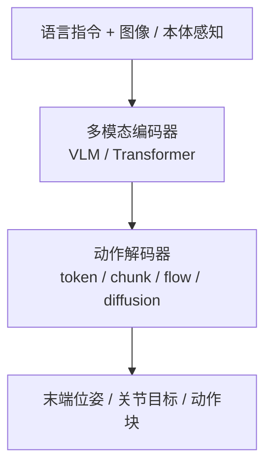

# VLA（Vision-Language-Action）

**VLA**：把视觉、语言和机器人动作统一到同一个模型里，让策略不只“看见状态后输出动作”，还能够显式理解任务指令和语义约束。

## 一句话定义

VLA 可以看成机器人版的多模态 foundation model：输入“看到了什么 + 要做什么”，输出“下一步怎么动”。在 [Foundation Policy](../concepts/foundation-policy.md) 抽象下，VLA 是 manipulation 域最主流的 foundation policy 实例。

## 英文缩写速查

| 缩写 | 英文全称 | 简要说明 |
|------|----------|----------|
| VLA | Vision-Language-Action | 视觉、语言与动作统一的多模态策略模型 |
| VLM | Vision-Language Model | 预训练视觉–语言底座，常经 SFT 适配为 VLA |
| RT-2 | Robotics Transformer 2 | 将 web-scale VLM 能力迁移到机器人控制的代表工作 |
| BC | Behavior Cloning | 监督模仿路线，常与 VLA 预训练/微调组合 |
| SFT | Supervised Fine-Tuning | 将通用 VLM 适配到特定机器人任务与数据分布 |
| VAM | Video-Action Model | 先预测视频潜动力学再解码动作，如 mimic-video |
| UEI | Unified Embodied Intelligence | 同一扩散骨干联合生成视频与动作块的统一架构 |

## 为什么重要

- 它把“任务描述”从手写 reward 或手工 state machine，转成自然语言接口。
- 它是 RT-2、π₀、OpenVLA、Octo 一类通用操作策略的共同抽象。
- 它让一个模型处理多任务成为可能，但代价是更大的数据需求、更高推理延迟，以及更复杂的部署链路。

## 主要技术路线

常见实现：
- **RT-2**：把 web-scale VLM 能力迁移到机器人控制
- **π₀**：在 VLA 上加入 Flow Matching，生成连续动作序列
- **π₀.₇**：在 π 系 VLA 上系统化**多模态提示条件**（子任务语言、片段元数据、控制模态、视觉子目标）以合并异质数据并支持推理时 **steering**；官方报告开箱 dexterity 对标 RL 专精与组合/跨本体泛化迹象（见 [π₀.₇](./pi07-policy.md)）
- **OpenVLA / Octo**：更强调开源数据、跨任务泛化和 fine-tune 流程
- **CapVector**：在 **参数空间** 用 **辅助目标 SFT** 与 **标准 SFT** 两枚同分布 checkpoint 的差 **\(\theta_{\text{ao}}-\theta_{\text{ft}}\)** 抽取 **capability vector**，合并回 **\(\theta_{\text{pt}}\)** 得 **\(\theta_{\text{meta}}\)**；下游仅用 **标准 SFT + 轻量正交正则** 以接近纯 SFT 的开销复现 **Spatial Forcing、LaRA-VLA** 等辅助微调带来的收敛与成功率收益，并在 **LIBERO / RoboTwin** 与多 VLA 骨干上讨论 **跨域与真机** 迁移（见 [CapVector 论文实体页](../entities/paper-capvector-capability-vectors-vla.md)）
- **StarVLA**：证明强 VLM 底座（Qwen3-VL）配合简单 MLP 动作头即可在多项基准上打破 SOTA，代表极简主义路线
- **Pelican-Unified 1.0**：在 Qwen3-VL 上叠 **推理末态潜变量 \(z\)** 与 **Wan 系 UFG**，用 **同一扩散去噪** 联合生成未来视频与动作块，语言 / 视频 / 动作损失回传共享表示；定位为 **统一具身智能（UEI）** 闭环而非 VLA+世界模型流水线拼接（见 [Pelican-Unified 1.0](./pelican-unified-1.md)）
- **mimic-video（Video-Action Model, VAM）**：用 **互联网规模视频扩散骨干**（如 Cosmos-Predict2）在 **潜空间** 形成与语言一致的 **视觉动力学计划**，再以 **流匹配动作解码器** 作 **逆动力学** 输出动作块；论文叙事强调相对传统 VLA 的 **样本效率** 与把瓶颈转移到 **视频表征质量**（见 [mimic-video](./mimic-video.md)）
- **DeFI**：将 **GFDM（SVD 系前向动力学）** 与 **GIDM（DINO+VQ 自监督逆动力学）** 在混合/无标签视频上 **分开预训练**，下游再 **冻结前向 + 扩散适配器** 耦合微调，缓解 2D 预测与 3D 动作的目标纠缠并放大无动作标签人视频（见 [DeFI](./defi-decoupled-dynamics-vla.md)）
- **RLDX-1**：在 Qwen3-VL 与 GR00T 系训练栈上引入 **MSAT** 多流扩散动作头，可选运动模块、时序记忆与触觉/力矩物理流，并配套图捕获与 RTC 的低延迟推理实现
- **Xiaomi-Robotics-0**：**Qwen3-VL-4B + DiT flow matching**；两阶段预训练（**Choice Policies** 扩展 VLM → 冻结 VLM 训 DiT）+ 面向 **异步 action chunk** 的后训练（**Λ 形注意力、前缀随机遮蔽、flow 损失重加权** 等），强调仿真与双臂真机 **吞吐/延迟** 叙事（见 [Xiaomi-Robotics-0](../entities/xiaomi-robotics-0.md)）
- **Qwen-VLA**：**Qwen3.5-4B + 1.15B DiT flow-matching** 的 **通才** 实例；**操作 + VLN + 轨迹** 同一 checkpoint，**embodiment prompt** 切换平台（见 [Qwen-VLA](../entities/qwen-vla.md)）
- **Qwen-RobotManip**：通义 [Qwen-Robot Suite](../entities/qwen-robot-suite.md) 内 **操作专精** VLA；**80-d 跨本体对齐 + Human-to-Robot 合成 + OOD 榜 north star**，与 Qwen-VLA **同 DiT flow 族** 但分域 scaling 叙事（见 [Qwen-RobotManip](../entities/qwen-robot-manip.md)）
- **SONIC × GR00T N1.5（NVIDIA 公开演示）**：高层 VLA 与低层 **规模化 motion tracking** 策略经 **统一控制接口** 串联，由同一套 tracking policy 承担快速全身反应；可作为「慢 VLA + 快执行器」分层形态的案例（细节以 [SONIC](./sonic-motion-tracking.md) 与项目页为准）
- **MotionWAM vs VLA（Mondo / HKUST，arXiv:2606.09215）**：在 **同 Stage 3 演示 + 同 SONIC 低层** 设定下，**视频世界模型隐状态条件** 的 WAM（76.1%）大幅超过 **GR00T-N1.7**（43.9%）等 VLA 微调基线——说明人形 loco-manip 闭环更依赖 **动力学先验** 而非单独加强 **VLM 语义先验**（见 [MotionWAM](../entities/paper-motionwam-humanoid-loco-manipulation-wam.md)）
- **Being-H0.7**：用 egocentric 人视频 + 机器人演示，在**潜空间**用未来观测分支监督 **latent world–action** 先验；测试时不滚未来像素，直接输出动作，并常与 **action chunking**、异步缓冲（UAC）组合部署
- **HumanNet**：百万小时量级 **人中心** 一三人称视频语料 + 策展/标注管线；论文在 LingBot-VLA 设定下给出「**约 1000h** egocentric 人视频持续预训练 vs **约 100h** 真机数据」等受控对比，用于讨论 **人类视频小时** 能否在成本上部分替代早期真机预训练（见 [HumanNet](../entities/humannet.md)；论文 Table 1 相关基准语料索引见 [对照页](../comparisons/humannet-table1-human-video-corpora.md)）
- **EgoScale**：在 **>20k h** 带 **腕 + 重定向高 DoF 手** 标签的 egocentric 人视频上预训练 **流式 VLA**，给出 **人数据规模 ↔ 验证损失（log-linear）↔ 真机灵巧后训练表现** 的实证链条，并以 **小规模视点对齐的人–机 mid-training** 承接 embodiment gap（见 [EgoScale](./egoscale.md)）
- **T-Rex**：在 EgoScale 同族 **人视频预训练** 之上，用 **100 h 触觉同步 play mid-training** 与 **变频率 MoT + 异步触觉 flow matching** 实现 **毫秒级触觉反应**；**12 项双手灵巧真机任务** 宏平均 **65%**，且 **朴素拼接触觉会损害 π₀.₅**（见 [T-Rex](../entities/paper-trex-tactile-reactive-dexterous-manipulation.md)，arXiv:2606.17055）
- **Green-VLA**：**L0→L1→R0→R1→R2** 五阶段课程 + **DataQA** + **64 维语义统一动作** + flow-matching 专家；**R2** 用 **IQL 轨迹优化** 与 **源噪声分布 actor** 突破 BC 饱和而不直接 RL 穿 flow；主平台 **Green 人形 32 DoF 上身**（见 [Green-VLA](../entities/paper-greenvla-staged-vla-humanoid.md)，arXiv:2602.00919）
- **Vesta（planner VLM，非 VLA）**：在 **Qwen3-VL-8B** 上 **SFT 统一** 定位 / VLN / 具身推理 / **带 memory 的子任务规划**，作 **System-2 planner** 向 **Gr00t-N1.6** 等 actor 输出文本子任务；四轴 benchmark 平均超最强单基线 **>20 pt**，R2R-CE SR **55.5%** 逼近 navigation specialist（见 [Vesta](../entities/paper-vesta-generalist-embodied-reasoning.md)，arXiv:2606.20905）
- **MINT（RSS 2026）**：用 **SDAT** 在 **DCT 频域** 做多尺度动作分词，**Intent token（低频全局）** 与 **Execution token（高频残差）** 显式解耦；策略以 **next-scale 自回归** 做意图→执行推理，**MINT-Zero** 支持 **单演示 Intent 注入** 的 one-shot 迁移；LIBERO / LIBERO-Plus / 真机报告强泛化与鲁棒性（见 [MINT](../entities/paper-mint-vla.md)，arXiv:2602.08602）
- **Evo-1（CVPR 2026）**：**0.77B** 轻量 **InternVL3-1B + cross-modulated DiT flow-matching**；**两阶段训练**（冻 VLM 对齐动作头 → 全量微调）**保持 VLM 语义对齐**；**无机器人数据预训练** 即在 Meta-World **80.6%**、LIBERO **94.8%**、RoboTwin **37.8%** 与 xArm6 真机 **78%**；RTX 4090d **2.3 GB / 16.4 Hz**；**官方 LeRobot 集成**（SO100/SO101，`lerobot-record --policy.path`）（见 [Evo-1](../entities/paper-evo1-lightweight-vla.md)，arXiv:2511.04555）
- **LaST-HD**：在 **reasoning-before-acting MoT VLA** 上，用 **动作条件世界模型** 把 **非配对人手与机器人轨迹** 对齐到 **共享前向动力学潜空间**，以潜式 **物理推理** 监督动作专家；配套 **OOL Glove** 采集与 **mixed-to-human**（混合共训 + 人手在线纠偏）配方，在 **6 项真机 / 3 本体** 上报告 **仅用人类数据泛化** 与 **约 20 分钟纠偏适应**（见 [LaST-HD](../entities/paper-last-hd-latent-physical-reasoning.md)，arXiv:2606.23685）
- **GaP staging（非纯 VLA，但直接消费 VLA）**：[GaP](../entities/paper-gap-graph-as-policy.md) 在 [变体自动化](../concepts/variational-automation.md) benchmark 上用 **计算图** 做感知/相机位姿等 **结构化 staging**，再 handoff **π₀.₅ / MolmoAct2**；大位姿变化列裸 VLA **~0.20**，**π₀.₅ w/ GaP** 可达 **0.66+**（Pack varied）——说明 **可靠性 gap** 有时靠 **图式工程壳** 而非单点放大 VLA 数据
- **InternVLA-A1.5**：**Qwen3.5-2B MoT VLM + 460M unified expert**；Stage1 **持续 VQA/子任务/FAST** 共训保语义，Stage2 用 **50 foresight token** 查询 **冻结 WAN2.2** 潜式未来 + **flow matching** 连续动作；**1.2M** 机器人 + **3M** InternVLA-M1 预训练；**六套仿真全榜领先**，真机 **组合指令 OOD 绑定** 与 **13 步 MOF** 显著超 **π₀.₅/Motus**；**训练用世界模型、部署不滚像素**（~0.1s/步）（见 [InternVLA-A1.5](../entities/paper-internvla-a15-unified-vla.md)，arXiv:2607.04988）
- **LingBot-VLA 2.0**：**Qwen3-VL-4B + 稀疏 MoE action expert**；约 **6 万小时** 过滤预训练（**5 万 h** 机器人 ×**20** 本体 + **1 万 h** egocentric 人视频）、**55 维统一全身动作** 与 **Dual-Query 深度/视频蒸馏**；GM-100 / 长程移动操作 **generalist** 评测超 **π₀.₅**、**GR00T N1.7** 与 **1.0**；开源 **6B 权重** 与真机部署脚本（见 [LingBot-VLA 2.0](../entities/lingbot-vla-v2.md)，arXiv:2607.06403）
- **Dexmal DM0.5**：**Gemma3-4B VLM + 680M Flow-Matching Action Expert**；**~60s 历史上下文抽象**、**11 类具身 CoT** 与 **DP 动态轨迹对齐** 强化开放 **zero-shot** 与长程记忆；混合预训练覆盖操作/导航/人视频，博客报告 **Table30 v2、LIBERO、RoboTwin2.0、R2R/RxR** 领先 **DM0 / π0.5-Droid**（见 [Dexmal DM0.5](../entities/dexmal-dm05.md)）

## VLA 与传统策略的区别

| 维度 | 传统 BC / RL 策略 | VLA |
|------|-------------------|-----|
| 任务输入 | 预定义 observation / goal | 自然语言 + 视觉 + 状态 |
| 泛化方式 | task-specific | 多任务/零样本/少样本 |
| 数据规模 | 百到千级演示 | 通常需要数千到数十万演示 |
| 推理开销 | 低，适合高频控制 | 高，常见 50ms+，需异步部署 |
| 适合任务 | 单任务控制 | 通用操作、多任务调度 |

## 核心优势

### 1. 语言条件化
可以直接用“把红色杯子放到左边托盘”之类的任务描述驱动策略，而不是单独写状态机。

### 2. 多任务统一
VLA 常把抓取、放置、开关门、抽屉操作等任务放进一个统一模型，而非每项任务单训一个 policy。

### 3. 语义泛化
Web 知识和视觉语义可以帮助机器人处理训练集中稀疏出现的物体、关系和指令表述。这通常配合 [Data Flywheel](../concepts/data-flywheel.md) 来实现闭环性能提升；进一步地，[LWD](./lwd.md) 把这套闭环重写为车队级 offline-to-online RL，把部署中的失败与人为干预也变成 generalist VLA 的训练信号。

## 算法能力栈 (Algorithm Capability Stack)

根据 [embodied-ai-guide](../../sources/repos/embodied-ai-guide.md) 与 [xbotics-embodied-guide](../../sources/repos/xbotics-embodied-guide.md) 的总结，具身智能的完整算法栈包含：
- **感知层 (Vision & Perception)**: 2D/3D/4D 视觉、视觉提示 (Visual Prompting)、Affordance 学习；在大规模室内场景中，可辅以互联网视频重建得到的 **3D 场景理解** 监督（例如 [SceneVerse++](../entities/sceneverse-pp.md) 支持的 [3D 空间 VQA](../concepts/3d-spatial-vqa.md) / [VLN](../tasks/vision-language-navigation.md) 数据），缓解纯 2D 图文预训练在度量空间关系上的短板。
- **规划层 (Planning)**: 基于 LLM 的任务拆解与逻辑推理。
- **策略层 (Policy)**: VLA 基础模型，通常采用分层双系统架构（慢速高层语义 + 快速低层反应）。**SFT (Supervised Fine-Tuning)** 是将通用 VLM 适配到机器人特定任务的关键步骤。
- **执行层 (Action)**: [action-chunking](action-chunking.md)、[diffusion-policy](diffusion-policy.md) 或关节控制。

## 实战路径建议

根据 [xbotics-embodied-guide](../../sources/repos/xbotics-embodied-guide.md) 的路线图，VLA 的落地建议分为四个阶段：
1. **基础掌握**：熟悉 [lerobot](../entities/lerobot.md) 框架与基础 [imitation-learning](imitation-learning.md) 算法。
2. **数据飞轮**：建立自动化数据采集与标注流水线（[auto-labeling-pipelines](auto-labeling-pipelines.md)）。
3. **模型微调**：对 OpenVLA 或 Octo 等开源模型进行针对性 SFT。
4. **真机闭环**：结合 [action-chunking](action-chunking.md) 解决推理延迟，完成实物部署。VLA 的动作头也常借助 [生成式模型基础](../formalizations/generative-foundations.md) 中的 diffusion / flow / latent variable 视角理解。

## 工程瓶颈

### 1. 推理延迟
VLA 通常不是高频底层控制器，真机上常见 50ms 以上推理延迟，因此更适合输出 action chunk、目标位姿 or 中频命令，再由低层控制器执行。

### 2. 数据规模要求高
想要稳健泛化，通常需要大量多样化演示数据。十几条示教可以做 task-specific BC，但远不足以支撑通用 VLA。除跨机构机器人日志外，**人中心互联网视频**（经策展与交互标注，如 [HumanNet](../entities/humannet.md)）正在成为持续预训练的一种规模化来源，但其分布与真机仍不同，需要与 Sim2Real 与执行层栈联合评估。

另一条被系统讨论的路线是让 **视频模态大模型** 直接提供 **时序物理先验**，把「语义 + 动力学」从静态 VLM 中部分解耦出去，再用轻量动作头吸收机器人轨迹；代表叙述见 [mimic-video（VAM）](./mimic-video.md) 与论文中的 oracle 缩放实验读法。

### 3. 部署链路复杂
摄像头时间同步、图像预处理、prompt 模板、动作反归一化、GPU 推理和安全 fallback，任何一步都可能拖垮真机体验。工程上可把「传感 + 遥操作 + 异步 chunk 推理 + 本体命令」收到可复用的实时 I/O 编排层，例如 [RIO（Robot I/O）](../entities/robot-io-rio.md) 所代表的 **Node + 可切换中间件** 路线，以减少换硬件组合时的重写面（仍以具体任务 profiling 为准）。

**长程任务编排：** 当单段 VLA chunk 不足以覆盖「复位 → 移动 → 多轮操作 → 卸载」时，可用 **行为树** 显式调度策略 `LOAD/RESUME/STOP` 与确定性宏动作（关节/底盘）。开源锚点见 [Cyclo Intelligence](../entities/cyclo-intelligence.md) 与概念页 [行为树 × VLA 编排](../concepts/behavior-tree-vla-orchestration.md)。

**长程记忆增强（模型内）：** 相似观测在不同执行阶段需不同动作时，可在 VLA 视觉侧注入 **稀疏历史证据** 而非稠密帧堆叠或在线 VLM 子任务分解。[KEMO](../entities/paper-kemo-event-driven-keyframe-memory-vla.md)（arXiv:2606.23589）用 **运动学减速峰 + DINOv2 视觉去重** 选事件关键帧，经 **门控 cross-attention** 插拔进 **π₀.₅**，在真机双臂六项记忆依赖任务上相对无记忆基线 **TSR +23.6 pt**。[EventVLA](../entities/paper-eventvla-visual-evidence-memory.md)（arXiv:2606.20092）以 **基础视觉锚点 + 前瞻式 KEM** 在 **QwenOFT** 上端到端预测关键帧并 **拼接原始图像**；发布 **RoboTwin-MeM** 诊断基准，在 17 项仿真记忆任务与 4 项真机双臂任务上相对 SOTA 记忆 VLA 平均约 **+40%**（RoboTwin-MeM **75.2%**）。

## 适合放在系统中的哪一层

- **高层任务规划 / 中层动作生成**：适合
- **1kHz 力矩闭环控制**：通常不适合
- **和 WBC / impedance / skill library 结合**：当前更现实的真机方案
- **常见落地方式**：输出 [Action Chunking](./action-chunking.md) 或末端目标，再交给低层控制器和 [Safety Filter](../concepts/safety-filter.md) 执行

## 与 World Action Models（WAM）的关系

综述 *World Action Models*（arXiv:2605.12090）把典型 VLA 写作 **\(p(a \mid o, l)\)** 的语义条件策略，并指出其往往 **不显式滚未来物理状态**。当未来观测预测与动作生成在 **同一策略框架内耦合**、并以联合对象 **\(p(o', a \mid o, l)\)** 为训练目标时，文献中才归类为 **WAM**（含 Cascaded 与 Joint 两族）。入口概念页见 [World Action Models（WAM）](../concepts/world-action-models.md)。

## 部署经验后训练（post-training from experience）

离线 SFT / BC 往往不足以覆盖真机 **分布偏移** 与 **接触/精细操作** 长尾失败。近年路线在预训练 VLA 之上，用 **自主 rollout + 人类干预 + 价值/优势信号** 做迭代提纯：

- **臂部为主：** RECAP、π\*0.6 等将部署轨迹转为 advantage-conditioned 微调；**[STEAM](../entities/paper-steam-advantage-modeling.md)**（arXiv:2606.29834）用 **专家帧对自监督时序偏移 + worst-of-N ensemble** 无标签估计帧级 advantage，再经 **CFGRL** 提纯 **π₀**，真机四任务较 BC **+16.2%–59%** 绝对成功率，[RLinf](https://github.com/RLinf/RLinf) 提供 LeRobot 三阶段管线；
- **车队级：** [LWD](./lwd.md) 把成功/失败/干预统一进 offline-to-online replay；
- **人形全身：** [ROVE](../entities/paper-rove-humanoid-vla-intervention.md)（arXiv:2606.17011）指出 MoCap **全身 + 灵巧手接管** 含 **adaptation 噪声**，需 **三阶段标注 + OVE 状态价值 + 跨 embodiment 人类视频**，避免 HG-DAgger 式直接模仿干预。
- **flow-VLA 保守 RL：** [Green-VLA](../entities/paper-greenvla-staged-vla-humanoid.md)（arXiv:2602.00919）在 **R2** 用 **Q 梯度轨迹修正回灌** 与 **初始噪声 actor**，在 WidowX 上较 R1 **+24%** 绝对成功率，适合与 on-policy PG 微调 flow 模型对照阅读。
- **产线真机 PPO on CFM-VLA：** [KinetIQ Ascend](../entities/kinetiq-ascend.md)（Humanoid, 2026）在 **BC 预训练 CFM 操作 VLA** 上用 **解耦 Thor 采样 / 云端 PPO**、**prefix-CFM 正则** 与 **稀疏奖励 + 在线 A/B 基线**，在双臂 **Alpha** 三项生产任务上用 **数天 robot-time** 报告 **42%–2× 吞吐** 与 **10–20× 失败率下降**；强调 **仅 RL 瓶颈阶段** 与 **车队部署后持续学习**。

选型时区分：**数据采集质量**（见 [Teleoperation](../tasks/teleoperation.md)）与 **后训练如何从次优经验中提取策略**（见 [Online vs Offline RL](../comparisons/online-vs-offline-rl.md)）。

## 常见误区

- **误区 1：VLA 的实时性和传统控制器相当。**
  通常并非如此，必须认真处理推理频率和动作缓冲。
- **误区 2：VLA 可以在十条演示上学成通用能力。**
  通用能力依赖大规模、异构、多任务数据。
- **误区 3：VLA = 直接替代所有控制模块。**
  当前更可靠的工程做法仍是“VLA 负责语义与任务层，传统控制负责执行层”。
- **误区 4：LIBERO 高分等于产线可靠。**
  [GaP](../entities/paper-gap-graph-as-policy.md) 的 **VA** benchmark 显示 π₀.₅ 在 **小扰动 LIBERO** 上 **0.96**，在 **大位姿/排列变化** 列可跌至 **~0.20**；工业持久自动化需另看 [变体自动化](../concepts/variational-automation.md) 刻度与 **图式/agentic** 互补路线。
- **误区 5：VLA 端到端分数高 ⇒ System 2 认知完备。**
  [RoboBench](../entities/robo-bench.md) 显示 SOTA MLLM 在 **隐式指令、robot-view 感知、执行失败诊断** 等轴仍远低于人类；且 RoboBench 分与 **CALVIN/LIBERO** 下游 VLA 相关——选型 VLM 骨干时宜同时看 **操纵流水线认知诊断** 与 **控制基准**。

## 参考来源

- [wechat_shenlan_five_embodied_model_taxonomy.md](../../sources/blogs/wechat_shenlan_five_embodied_model_taxonomy.md) — 深蓝具身智能五大模型（VLM/VLN/VLA/VLX/WM）分类与协同链路
- [深蓝具身智能：2025 VLA 开源复现景观（微信公众号）](../../sources/blogs/wechat_shenlan_vla_github_repro_survey_2025.md) — OpenPI、VLA-Adapter、RLinf 等 11 项 GitHub 栈策展索引
- [sources/papers/rl_foundation_models.md](../../sources/papers/rl_foundation_models.md) — RT-1 / RT-2 / π₀ / Octo / TD-MPC2 综述
- [sources/papers/diffusion_and_gen.md](../../sources/papers/diffusion_and_gen.md) — π₀ 与生成式动作建模路线
- [Embodied-AI-Guide](../../sources/repos/embodied-ai-guide.md) — Lumina 社区具身智能百科全书，涵盖能力栈与仿真管线
- [Xbotics-Embodied-Guide](../../sources/repos/xbotics-embodied-guide.md) — 工程实践导向，包含 VLA 实战路线图与数据飞轮建设
- [SceneVerse++](../../sources/repos/sceneverse-pp.md) — 互联网视频→3D 场景的大规模自动标注与 VQA/VLN 监督（补充空间推理数据来源）
- [RLDX-1](../../sources/repos/rldx-1.md) — RLWRLD 灵巧操作 VLA 仓库与技术报告归档
- Brohan et al., *RT-2: Vision-Language-Action Models Transfer Web Knowledge to Robotic Control*
- Black et al., *π₀: A Vision-Language-Action Flow Model for General Robot Control*
- Ye et al., *StarVLA-α: Reducing Complexity in Vision-Language-Action Systems* (2026)
- [sources/papers/star_vla.md](../../sources/papers/star_vla.md) — StarVLA 极简基准模型
- [sources/papers/being_h07.md](../../sources/papers/being_h07.md) — Being-H0.7 潜空间世界–动作模型
- [sources/papers/humannet.md](../../sources/papers/humannet.md) — HumanNet 百万小时人中心视频语料与 VLA 受控预训练对比
- [sources/repos/humannet.md](../../sources/repos/humannet.md) — HumanNet 项目页与 GitHub 索引
- [sources/papers/world_action_models_survey_2605.md](../../sources/papers/world_action_models_survey_2605.md) — WAM 综述与 Cascaded/Joint 分类
- [sources/papers/pelican_unified_uei_arxiv_2605_15153.md](../../sources/papers/pelican_unified_uei_arxiv_2605_15153.md) — Pelican-Unified 1.0（UEI）技术报告 arXiv:2605.15153
- [sources/papers/pi07.md](../../sources/papers/pi07.md) — π₀.₇ 论文与官方博客归档
- [sources/repos/awesome-wam-openmoss.md](../../sources/repos/awesome-wam-openmoss.md) — Awesome-WAM 论文库
- [sources/repos/xiaomi-robotics-0.md](../../sources/repos/xiaomi-robotics-0.md) — Xiaomi-Robotics-0 官网 / GitHub / arXiv 归档
- [sources/papers/mimic_video_arxiv_2512_15692.md](../../sources/papers/mimic_video_arxiv_2512_15692.md) — mimic-video：Video-Action Model 与 VLA 对照的 arXiv:2512.15692 摘录
- [sources/papers/defi_arxiv_2604_16391.md](../../sources/papers/defi_arxiv_2604_16391.md) — DeFI：解耦前向/逆动力学预训练的 arXiv:2604.16391 摘录
- [sources/courses/nvidia_sim_to_real_so101_isaac.md](../../sources/courses/nvidia_sim_to_real_so101_isaac.md) — GR00T N1.6 + 语言条件操作臂 post-training 官方教程
- [sources/papers/rove_arxiv_2606_17011.md](../../sources/papers/rove_arxiv_2606_17011.md) — ROVE：人形 VLA 干预轨迹 RL 后训练（arXiv:2606.17011）
- [sources/papers/greenvla_arxiv_2602_00919.md](../../sources/papers/greenvla_arxiv_2602_00919.md) — Green-VLA：五阶段 VLA + 统一动作 + R2 对齐（arXiv:2602.00919）
- [sources/papers/last_hd_arxiv_2606_23685.md](../../sources/papers/last_hd_arxiv_2606_23685.md) — LaST-HD：潜式物理推理 + OOL Glove 人手→机器人 VLA（arXiv:2606.23685）
- [sources/repos/cyclo_intelligence.md](../../sources/repos/cyclo_intelligence.md) — ROBOTIS Cyclo Intelligence：BT 编排 LeRobot/GR00T VLA 真机栈
- [sources/papers/lingbot_vla_v2_tech_report.md](../../sources/papers/lingbot_vla_v2_tech_report.md) — LingBot-VLA 2.0：6 万小时数据管线 + MoE + Dual-Query 蒸馏（arXiv:2607.06403）
- [sources/repos/lingbot-vla-v2.md](../../sources/repos/lingbot-vla-v2.md) — LingBot-VLA 2.0 官方仓库与权重入口

## 关联页面
- [五大具身模型分类（VLM/VLN/VLA/VLX/WM）](../comparisons/vlm-vln-vla-vlx-world-model-taxonomy.md) — 感知→导航→执行→推演递进框架
- [Query：具身大模型分类学选型闭环知识链](../queries/embodied-fm-taxonomy-loop.md) — VLA 是五层选型闭环的 **③ 动作执行层**：全模态+本体状态 → 关节/末端控制量，也是「泛化 ↔ 实时带宽」矛盾最尖锐的一层
- [VLA 开源复现景观（2025）](../overview/vla-open-source-repro-landscape-2025.md) — GitHub 高可见项目按复现目标分组
- [VLN 四范式复现路径](../overview/vln-open-source-repro-paradigms.md) — 导航域 Uni-NaVid 等（与 UniVLA 操作栈区分）
- [深度学习基础](../concepts/deep-learning-foundations.md)

- [Foundation Policy（基础策略模型）](../concepts/foundation-policy.md)
- [π₀ (Pi-zero) 策略模型](./π0-policy.md) — 结合 Flow Matching 的最新 VLA 突破
- [π₀.7（Pi-zero 0.7）通才 VLA](./pi07-policy.md) — Physical Intelligence 2026 通才模型与多模态提示条件路线
- [StarVLA](./star-vla.md) — 基于 Qwen3-VL 的极简 VLA 基准
- [LingBot-Map](./lingbot-map.md) — 为 VLA 提供几何背景的流式 3D 基础模型
- [LingBot-VLA 2.0](../entities/lingbot-vla-v2.md) — Robbyant 务实 VLA 基础模型（6B、全身统一动作、真机部署链）
- [3D 空间 VQA](../concepts/3d-spatial-vqa.md) — 视觉–语言模型的度量空间推理任务
- [RoboBench](../entities/robo-bench.md) — MLLM 作为操纵流水线 **embodied brain** 的五维认知诊断；与 CALVIN/LIBERO VLA 相关
- [视觉–语言导航（VLN）](../tasks/vision-language-navigation.md) — 语言条件下的室内导航基准任务
- [SceneVerse++](../entities/sceneverse-pp.md) — 网页规模 3D 场景理解数据集与自动标注管线参照
- [Embodied Scaling Laws (具身规模法则)](../concepts/embodied-scaling-laws.md) — 数据规模与模型性能的关系
- [Auto-labeling Pipelines (自动化标注)](./auto-labeling-pipelines.md) — 构建大规模 VLA 数据集的基石
- [Foundation Policy Alignment (策略对齐)](../formalizations/foundation-policy-alignment.md) — 跨形态知识共享的形式化
- [Unified Multimodal Tokens (统一 Token)](./unified-multimodal-tokens.md) — 现代 VLA 的架构趋势
- [Action Tokenization (动作分词)](../formalizations/vla-tokenization.md) — VLA 将动作离散化的数学过程
- [Cross-modal Attention (跨模态注意力)](../formalizations/cross-modal-attention.md) — VLA 实现视-语-控对齐的底层机制
- [Manipulation](../tasks/manipulation.md)
- [Loco-Manipulation](../tasks/loco-manipulation.md)
- [Action Chunking](./action-chunking.md)
- [Diffusion Policy](./diffusion-policy.md)
- [Behavior Cloning](./behavior-cloning.md)
- [RoboTwin 2.0](../entities/robotwin.md) — 具身智能自动化数据生成平台
- [LeRobot](../entities/lerobot.md) — Hugging Face 具身智能全栈框架
- [OpenVLA](../entities/openvla.md) — 开源 Prismatic VLA 与 LoRA/OFT 微调
- [NVIDIA SO-101 Sim2Real 实验 workflow](../entities/nvidia-so101-sim2real-lab-workflow.md) — GR00T N1.6 教程级 VLA + 四类 sim2real 策略对照
- [RLDX-1](../entities/rldx-1.md) — 多流扩散动作头 + 可选触觉/力矩与 RTC 推理栈的工程参考
- [RIO（Robot I/O）](../entities/robot-io-rio.md) — 跨形态实时采集与 VLA 闭环部署的模块化 I/O 栈（RSS 2026）
- [Xiaomi-Robotics-0](../entities/xiaomi-robotics-0.md) — 小米开源 VLA：异步 chunk 执行与后训练技巧的系统叙述
- [Query：VLA 真机部署指南](../queries/vla-deployment-guide.md)
- [Query：操作 VLA 与视频-动作架构选型](../queries/manipulation-vla-architecture-selection.md)
- [Query：VLA 与低级关节控制器融合架构](../queries/vla-with-low-level-controller.md)
- [Safety Filter](../concepts/safety-filter.md)
- [LWD（Learning while Deploying）](./lwd.md) — VLA generalist 策略的车队级 offline-to-online RL 后训练框架
- [ROVE（人形 VLA 干预后训练）](../entities/paper-rove-humanoid-vla-intervention.md) — 次优 MoCap 接管轨迹的 OVE + advantage conditioning（arXiv:2606.17011）
- [Green-VLA（分阶段 VLA 与人形部署）](../entities/paper-greenvla-staged-vla-humanoid.md) — DataQA + 语义统一动作 + IQL/噪声 RL 的 R2 对齐（arXiv:2602.00919）
- [KinetIQ Ascend（真机 CFM-VLA PPO 后训练）](../entities/kinetiq-ascend.md) — 产线双臂人形操作 RL 工程栈与三项任务结果（Humanoid, 2026）
- [Being-H0.7](./being-h07.md) — 潜空间世界–动作模型与大规模 egocentric 视频训练
- [HumanNet](../entities/humannet.md) — 百万小时人中心视频语料与管线级设计参照
- [World Action Models（WAM）](../concepts/world-action-models.md) — 联合未来–动作范式与 VLA/世界模型分界
- [Pelican-Unified 1.0（UEI）](./pelican-unified-1.md) — Qwen3-VL 推理潜变量 + UFG 联合扩散（未来视频与动作）
- [mimic-video（Video-Action Model）](./mimic-video.md) — 视频潜计划 + 流匹配动作解码器相对 VLA 的先验分工
- [DeFI（解耦前向/逆动力学 VLA）](./defi-decoupled-dynamics-vla.md) — GFDM/GIDM 分阶段预训练 + 下游扩散耦合
- [LaST-HD（潜式物理推理 + 人手数据）](../entities/paper-last-hd-latent-physical-reasoning.md) — 世界模型对齐跨具身潜空间与 mixed-to-human 训练（arXiv:2606.23685）
- [Cyclo Intelligence（ROBOTIS Physical AI 栈）](../entities/cyclo-intelligence.md) — Docker 化数据/训练/推理 + BT 任务机
- [行为树 × VLA 编排](../concepts/behavior-tree-vla-orchestration.md) — BT 生命周期与 VLA chunk 分层模式

## 推荐继续阅读

- RT-2 / π₀ 原论文或项目博客
- [OpenVLA](../entities/openvla.md) / Octo 开源实现
- [Query：如何在真机上部署 VLA 策略？](../queries/vla-deployment-guide.md)
- [Query：VLA 与低级关节控制器融合架构](../queries/vla-with-low-level-controller.md)
