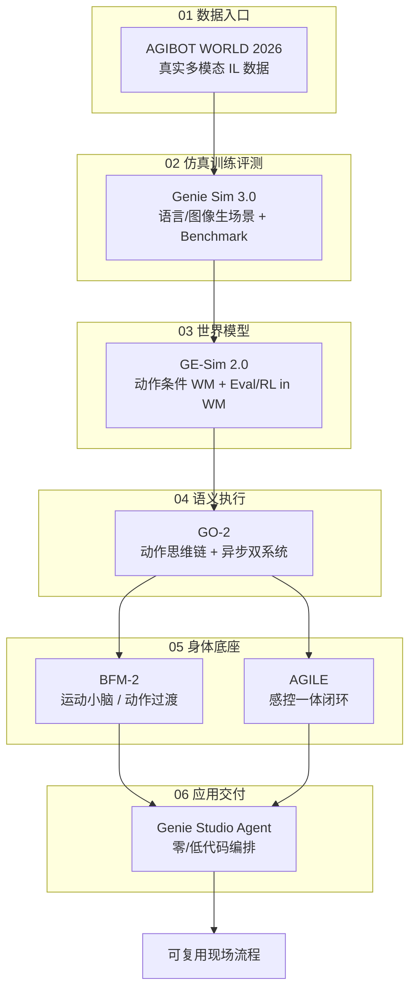

# 智元 2026-06 发布技术地图

> **本页定位**：为 [具身智能研究室 · 智元这轮发布怎么看？](https://mp.weixin.qq.com/s/QWj7F2vhhRrRpX41SaNyaA) 提供 **按落地链路七段组织的阅读坐标**；不复述各项目安装细节，只保留 **问题重框、五开源 + 两底座分工、与训练栈/世界模型/BFM 地图的挂接**。姊妹篇 [BFM 41 篇技术地图](./bfm-41-papers-technology-map.md)、[训练栈分层](./robot-training-stack-layers-technology-map.md)、[世界模型训练闭环](./robot-world-models-training-loop-taxonomy.md)。

## 一句话观点

智元 2026-06 发布把机器人落地拆成 **可独立演进的分层模块**：真实数据入口（AGIBOT WORLD 2026）→ 仿真训练评测（Genie Sim 3.0）→ 动作条件世界模型（GE-Sim 2.0）→ 语义–动作执行基座（GO-2）→ **两个身体能力底座**（BFM-2 运控小脑、AGILE 感控闭环）→ 应用编排交付（Genie Studio Agent）——方向是 **全链路底座化**，但单层指标不能替代长期真机稳定性。

## 英文缩写速查

| 缩写 | 英文全称 | 简要说明 |
|------|----------|----------|
| VLA | Vision-Language-Action | 视觉-语言-动作多模态策略 |
| WM | World Model | 学习环境动态以供想象/规划的世界模型 |
| Sim2Real | Simulation to Real | 仿真策略迁移真机 |
| IL | Imitation Learning | 模仿学习，从示范轨迹学习策略 |
| BFM | Behavior Foundation Model | 行为基础模型，可复用身体能力接口 |
| RL | Reinforcement Learning | 通过与环境交互最大化长期回报来学习策略 |

## 为什么单独做这张地图

- [训练栈分层](./robot-training-stack-layers-technology-map.md) 回答 **行业通用仿真/训练工具如何分层**；本页聚焦 **智元生态内七段落地链路** 如何自洽串联。
- [世界模型训练闭环 taxonomy](./robot-world-models-training-loop-taxonomy.md) 已覆盖 GE-Sim 2.0 等方法位；本页补 **与 Genie Sim、GO-2、数据入口的同发布会语境**。
- **命名辨析：** [BFM-2](../entities/agibot-bfm-2.md)（智元运控基座产品）≠ [paper-bfm-*](../overview/bfm-41-papers-technology-map.md)（学术 awesome 索引）≠ 泛称 [行为基础模型](../concepts/behavior-foundation-model.md)。

## 流程总览：七段落地链路

## 六组分类节点（图谱 hub）

| 组 | 分类节点 | 项目 | 核心问题 |
|----|----------|------|----------|
| 01 | [数据入口](./agibot-release-category-01-data-entry.md) | AGIBOT WORLD 2026 | **数据离真实部署有多近？** |
| 02 | [仿真训练与评测](./agibot-release-category-02-sim-training-eval.md) | Genie Sim 3.0 | **场景生成能否进入训练–评测–微调闭环？** |
| 03 | [世界模型](./agibot-release-category-03-world-model.md) | GE-Sim 2.0 | **WM 能否响应动作并服务训练环？** |
| 04 | [语义执行基座](./agibot-release-category-04-execution-vla.md) | GO-2 | **语义规划如何变成可执行动作？** |
| 05 | [身体能力底座](./agibot-release-category-05-body-foundations.md) | BFM-2、AGILE | **运控小脑与感控闭环如何补身体层？** |
| 06 | [应用编排与交付](./agibot-release-category-06-application-delivery.md) | Genie Studio Agent | **能力如何变成可部署流程？** |

## 七项目速查

| # | 项目 | 开源/底座 | Wiki |
|---|------|-----------|------|
| 01 | AGIBOT WORLD 2026 | 开源数据 | [agibot-world-2026](../entities/agibot-world-2026.md) |
| 02 | Genie Sim 3.0 | 开源仿真 | [genie-sim-3](../entities/genie-sim-3.md) |
| 03 | GE-Sim 2.0 | 世界模型 | [ge-sim-2](../entities/ge-sim-2.md) |
| 04 | GO-2 | 执行基座 | [go-2](../entities/go-2.md) |
| 05 | BFM-2 | **能力底座** | [agibot-bfm-2](../entities/agibot-bfm-2.md) |
| 06 | AGILE | **能力底座** | [agibot-agile](../entities/agibot-agile.md) |
| 07 | Genie Studio Agent | 应用平台 | [genie-studio-agent](../entities/genie-studio-agent.md) |

## 文内收束判断（策展）

| 判断 | 含义 |
|------|------|
| 分层 > 单点 | 数据、仿真、WM、VLA、运控、部署 **同时推进**，而非只押一个模型 |
| 开源五段 | 数据 / 仿真 / WM / GO-2 / Studio 强调 **可接入与可复用** |
| 两底座 | BFM-2 补 **动作间过渡**；AGILE 补 **视觉–控制闭环** |
| 谨慎验证 | GE-Sim「训练场替代真机」、BFM-2/AGILE 视频叙事须 **更多公开材料与复现** |
| 与 BFM 学术线 | [BFM 41 篇地图](./bfm-41-papers-technology-map.md) 提供学术脉络；本页补 **智元产品化落点** |

## 关联页面

- [VLA](../methods/vla.md)
- [行为基础模型](../concepts/behavior-foundation-model.md)
- [Agibot-World 站点背景](../../sources/sites/agibot-world.md)
- [Agent Reach](../entities/agent-reach.md) — 本文抓取工具链

## 参考来源

- [wechat_embodied_ai_lab_agibot_june_2026_release.md](../../sources/blogs/wechat_embodied_ai_lab_agibot_june_2026_release.md)
- [wechat_agibot_june_2026_release_2026-06-26.md](../../sources/raw/wechat_agibot_june_2026_release_2026-06-26.md)

## 推荐继续阅读

- [智元 GO-2 论文](https://arxiv.org/abs/2601.11404)
- [GE-Sim 2.0 项目页](https://ge-sim-v2.github.io/)
- [Genie Sim GitHub](https://github.com/AgibotTech/genie_sim)
