# AI 架构地图（Neural Network Architecture Map）

> **本页定位**：独立阅读节点。按 **数据几何与控制接口** 给神经网络一张六支地图；各叶子链到概念/方法页与一手论文，不在这里复述公式全文。

## 一句话定义

先问输入住在哪种几何里（向量 / 栅格 / 序列 / 分布 / 图），再问输出要单点回归还是多模态分布，最后才选具体骨干——机器人策略只是同一张地图在 `obs → action` 上的实例化。

## 英文缩写速查

| 缩写 | 英文全称 | 简要说明 |
|------|----------|----------|
| MLP | Multi-Layer Perceptron | 向量前馈，高频策略默认骨干 |
| MoE | Mixture-of-Experts | 稀疏门控扩容 |
| CNN | Convolutional Neural Network | 栅格局部卷积 |
| ViT | Vision Transformer | 图像块 + 注意力视觉骨干 |
| SSM | State Space Model | 状态空间序列模型；Mamba 为其选择性代表 |
| VLA | Vision-Language-Action | 多模态决策模型的当前主实例 |

## 为什么重要

- 论文 Method 里的「我们用了 Transformer」本身几乎不构成贡献；**选错函数族**才会在延迟、样本效率与多模态上立刻失败。
- 本库已有 [人形策略网络架构](../concepts/humanoid-policy-network-architecture.md)（决策栈代际）与 [RNN/CNN/Transformer/Mamba 对比](../comparisons/rnn-cnn-transformer-mamba.md)（序列三维权衡）。缺的是一张 **覆盖感知–生成–决策** 的总图。
- 选型口诀：**几何对齐 + 延迟预算 + 分布形态**。更大参数量排在这三项之后。

## 流程总览：六支函数族

```mermaid
flowchart TB
  root["神经网络 / AI 模型"]
  root --> ff["1 基础前馈"]
  root --> spat["2 图像 / 空间"]
  root --> seq["3 序列 / 时间"]
  root --> gen["4 生成模型"]
  root --> gfam["5 图结构"]
  root --> robot["6 机器人 / 决策"]

  ff --> mlp["MLP"]
  ff --> moe["MoE"]

  spat --> cnn["CNN"]
  spat --> resnet["ResNet"]
  spat --> unet["U-Net"]
  spat --> vit["ViT"]

  seq --> rnn["RNN"]
  seq --> lstm["LSTM"]
  seq --> gru["GRU"]
  seq --> tcn["TCN"]
  seq --> tr["Transformer"]
  seq --> ssm["SSM"]
  seq --> mamba["Mamba"]

  gen --> ae["Autoencoder"]
  gen --> vae["VAE"]
  gen --> gan["GAN"]
  gen --> diff["Diffusion"]
  gen --> dit["DiT"]

  gfam --> gnn["GNN"]

  robot --> mp["MLP Policy"]
  robot --> rp["RNN / GRU / LSTM Policy"]
  robot --> tp["Transformer Policy"]
  robot --> dp["Diffusion Policy"]
  robot --> vla["VLA"]
```

## 子节点索引

| 支 | 叶子 | Wiki 节点 | 一手资料 | 核心问题 |
|----|------|-----------|----------|----------|
| 1 前馈 | MLP | [mlp](../concepts/mlp.md) | [Rumelhart 1986](../../sources/papers/rumelhart_backprop_learning_representations_nature_1986.md) | 向量映射能否又快又稳？ |
| 1 前馈 | MoE | [mixture-of-experts](../concepts/mixture-of-experts.md) | [Shazeer 2017](../../sources/papers/shazeer_moe_arxiv_1701_06538.md) | 容量能否与逐步算力解耦？ |
| 2 空间 | CNN | [convolutional-neural-network](../concepts/convolutional-neural-network.md) | [LeCun 1998](../../sources/papers/lecun_gradient_based_learning_1998.md) | 栅格局部性是否该写成归纳偏置？ |
| 2 空间 | ResNet | [paper-resnet](../entities/paper-resnet-deep-residual-learning.md) | [He 2016](../../sources/papers/resnet_arxiv_1512_03385.md) | 加深是否还能训得动？ |
| 2 空间 | U-Net | [unet](../concepts/unet.md) | [Ronneberger 2015](../../sources/papers/unet_ronneberger_arxiv_1505_04597.md) | 密集预测如何保住边界？ |
| 2 空间 | ViT | [vision-transformer](../concepts/vision-transformer.md) | [Dosovitskiy 2020](../../sources/papers/vit_dosovitskiy_arxiv_2010_11929.md) | 弱偏置 + 大数据能否换架构统一？ |
| 3 序列 | RNN/LSTM/GRU | [recurrent-neural-network](../concepts/recurrent-neural-network.md) | [LSTM 1997](../../sources/papers/hochreiter_lstm_1997.md) · [GRU 2014](../../sources/papers/cho_rnn_encoder_decoder_arxiv_1406_1078.md) | 短中程 POMDP 历史怎么压？ |
| 3 序列 | TCN | [temporal-convolutional-network](../concepts/temporal-convolutional-network.md) | [Bai 2018](../../sources/papers/bai_tcn_arxiv_1803_01271.md) | 固定窗口能否可并行卷积？ |
| 3 序列 | Transformer | [transformer](../concepts/transformer.md) | [Vaswani 2017](../../sources/papers/attention_is_all_you_need.md) | 任意位置是否需要 \(O(1)\) 路径？ |
| 3 序列 | SSM / Mamba | [ssm](../concepts/state-space-model-ssm.md) · [mamba](../concepts/mamba.md) | [S4](../../sources/papers/gu_s4_arxiv_2111_00396.md) · [Mamba](../../sources/papers/gu_mamba_arxiv_2312_00752.md) | 长历史能否近线性记住并选择？ |
| 4 生成 | AE / VAE | [autoencoder](../concepts/autoencoder.md) | [Kingma 2013](../../sources/papers/kingma_vae_arxiv_1312_6114.md) | 潜空间是否必须可采样？ |
| 4 生成 | GAN | [generative-adversarial-network](../concepts/generative-adversarial-network.md) | [Goodfellow 2014](../../sources/papers/goodfellow_gan_arxiv_1406_2661.md) | 隐式分布匹配是否值得换训练不稳？ |
| 4 生成 | Diffusion | [diffusion-model](../concepts/diffusion-model.md) | [Ho 2020](../../sources/papers/ho_ddpm_arxiv_2006_11239.md) | 多模态能否拆成稳定多步监督？ |
| 4 生成 | DiT | [diffusion-transformer](../concepts/diffusion-transformer.md) | [Peebles 2023](../../sources/papers/peebles_dit_arxiv_2212_09748.md) | 去噪骨干能否与 VLM 同族？ |
| 5 图 | GNN | [graph-neural-network](../concepts/graph-neural-network.md) | [Kipf 2017](../../sources/papers/kipf_gcn_arxiv_1609_02907.md) | 关系拓扑是否比栅格更本质？ |
| 6 决策 | 五类策略 | 见下节 | [Diffusion Policy](../../sources/papers/diffusion_policy_arxiv_2303_04137.md) 等 | 同一函数族如何接到控制环？ |

## 研究判断：六支分别解决什么

### 1. 基础前馈

[MLP](../concepts/mlp.md) 是最小完备逼近器，输入必须已经是向量。Isaac / mjlab 里 2–3 层小网仍是 locomotion SOTA 的执行层，因为它 **延迟低、吞吐高、调参路径熟**。[MoE](../concepts/mixture-of-experts.md) 把容量做成稀疏条件计算：适合 VLA 动作专家与多技能 gating，不适合 500 Hz 力矩环。

### 2. 图像 / 空间结构

[CNN](../concepts/convolutional-neural-network.md) 把平移局部性写成权值共享；[ResNet](../entities/paper-resnet-deep-residual-learning.md) 解决「加深训不动」；[U-Net](../concepts/unet.md) 为分割与扩散降噪提供多尺度跳跃；[ViT](../concepts/vision-transformer.md) 用弱偏置换架构统一，成为 VLA 视觉塔默认。机载实时检测仍常是 CNN；开放词汇与多模态衔接才优先 ViT。对照见 [CNN vs ViT](../comparisons/cnn-vs-vit-backbones.md)。

### 3. 序列 / 时间建模

把历史压进状态：[RNN/LSTM/GRU](../concepts/recurrent-neural-network.md)。固定窗口可并行：[TCN](../concepts/temporal-convolutional-network.md)。任意两位置直接交互：[Transformer](../concepts/transformer.md)。近线性长记忆：[SSM](../concepts/state-space-model-ssm.md) / [Mamba](../concepts/mamba.md)。三维权衡（长程 / 训练并行 / 推理复杂度）见 [对比页](../comparisons/rnn-cnn-transformer-mamba.md)。

### 4. 生成模型

[AE/VAE](../concepts/autoencoder.md) 学可采样潜空间，服务世界模型与运动流形。[GAN](../concepts/generative-adversarial-network.md) 图像锐但训练脆，机器人遗产是外观 Sim2Real 与 [AMP](../methods/amp-reward.md)。[Diffusion](../concepts/diffusion-model.md) 用已知噪声做监督，天然表达多模态；[DiT](../concepts/diffusion-transformer.md) 把去噪骨干换成 Transformer，对接 VLA 动作头。

### 5. 图结构

[GNN](../concepts/graph-neural-network.md) 的归纳偏置是 **边**。场景图、接触图、多机通信值得用；固定人形关节树往往 MLP + 结构化观测就够。GNN 是编码器，很少当整条策略。

### 6. 机器人 / 决策模型

决策模型 = 上面某族 + 控制接口（频率、动作表示、训练信号）。

| 策略族 | 骨干 | 典型输出 | 何时选 | 站内入口 |
|--------|------|----------|--------|----------|
| MLP Policy | 浅 MLP | 单步关节/扭矩 | 本体向量、高频率、大规模 RL | [策略架构](../concepts/humanoid-policy-network-architecture.md) |
| RNN Policy | GRU/LSTM + MLP 头 | 单步动作 | 短历史 POMDP、接触事件 | [RNN](../concepts/recurrent-neural-network.md) |
| Transformer Policy | ACT / RT | 动作块 / token | 演示序列、语言或长上下文 | [BC+Transformer](../methods/bc-with-transformer.md) · [RT](../methods/robotics-transformer-rt-series.md) |
| Diffusion Policy | U-Net 或 Transformer 去噪 | 多步动作分布 | 多模态操作、接触丰富 IL | [Diffusion Policy](../methods/diffusion-policy.md) |
| VLA | VLM + MLP/DiT/MoE 头 | 语言条件动作 | 开放指令、跨任务 | [VLA](../methods/vla.md) |

分层事实：**慢语义层可以很大，快执行层至今常是小 MLP**。两者共存，不是互相淘汰。

## 按目标选入口

| 你的目标 | 从哪开始 |
|----------|----------|
| 向量观测、要上真机走路 | [MLP](../concepts/mlp.md) → [策略架构](../concepts/humanoid-policy-network-architecture.md) |
| 多技能但还想解释 gating | [MoE](../concepts/mixture-of-experts.md) |
| 机载检测 / 分割 | [CNN](../concepts/convolutional-neural-network.md) → [U-Net](../concepts/unet.md) → [视觉骨干](./hub-vision-backbone.md) |
| VLA / 开放词汇感知 | [ViT](../concepts/vision-transformer.md) → [VLA](../methods/vla.md) |
| 短历史补偿 POMDP | [GRU](../concepts/recurrent-neural-network.md) |
| 固定窗口时序且要并行 | [TCN](../concepts/temporal-convolutional-network.md) |
| 长上下文或多模态 token | [Transformer](../concepts/transformer.md) |
| 超长触觉 / 事件历史 | [Mamba](../concepts/mamba.md) |
| 世界模型潜空间 | [VAE](../concepts/autoencoder.md) → [潜空间想象](../concepts/latent-imagination.md) |
| 外观域迁移 / 运动风格 | [GAN](../concepts/generative-adversarial-network.md) / [AMP](../methods/amp-reward.md) |
| 多模态动作块 | [Diffusion](../concepts/diffusion-model.md) → [DiT](../concepts/diffusion-transformer.md) → [DP](../methods/diffusion-policy.md) |
| 物体关系 / 接触图 | [GNN](../concepts/graph-neural-network.md) |

## 工程实践

1. **先写接口再写网络**：观测维、控制频率、动作是单步还是 chunk、损失是回归还是生成。
2. **同一任务可混族**：ViT 视觉塔 + DiT 动作头 + MLP 低层跟踪是常见产品栈，不是架构不纯。
3. **用延迟表否决论文叙事**：机载 5 ms 预算可以直接否决未蒸馏的大 Transformer Policy。
4. **生成式头只在分布真的多峰时启用**：单峰步态指令用 MLP 回归更稳。

## 局限与风险

- 本图按函数族切，不覆盖优化器、数据、奖励——那些常常比骨干更决定真机成败。
- 「最新架构」容易掩盖 **算子成熟度**：Mamba/MoE 在嵌入式上可能根本编不过去。
- 不要把第 6 支理解成第 1–5 支之外的新数学；它只是部署约束下的装配。

## 关联页面

- [深度学习基础](../concepts/deep-learning-foundations.md)
- [人形策略网络架构](../concepts/humanoid-policy-network-architecture.md)
- [视觉感知骨干知识链](./hub-vision-backbone.md)
- [IL/RL 学习范式](./hub-learning.md)
- [VLA 知识链](./hub-vla.md)
- [RNN vs CNN vs Transformer vs Mamba](../comparisons/rnn-cnn-transformer-mamba.md)

## 参考来源

- [AI 架构地图 taxonomy（维护者整理）](../../sources/personal/ai-architecture-map.md)
- [AI 架构地图一手论文簇](../../sources/papers/ai_architecture_foundations.md)

## 推荐继续阅读

- [Attention Is All You Need（论文实体）](../entities/paper-attention-is-all-you-need.md) · [arXiv:1706.03762](https://arxiv.org/abs/1706.03762)
- [Deep Learning Book — 架构各章](https://www.deeplearningbook.org/)
