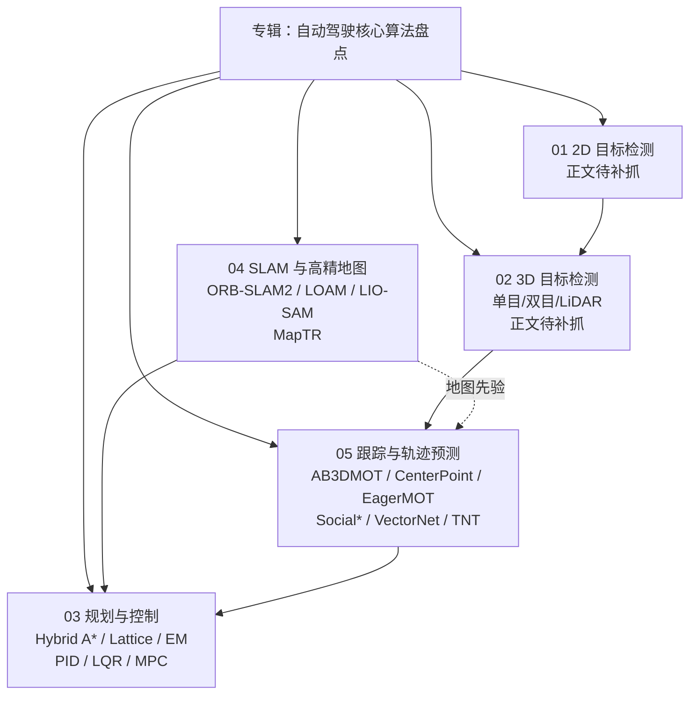

# 《自动驾驶核心算法盘点》专栏技术地图

> **本页定位**：为深蓝AI 微信公众号 [**《自动驾驶核心算法盘点》**](https://mp.weixin.qq.com/mp/appmsgalbum?__biz=MzY4NjA5NTgyMQ==&action=getalbum&album_id=4596755873481310212) 专辑提供 **父节点阅读坐标**；提炼模块边界与经典算法锚点，不复述公式推导。截至 2026-07-21 **已入库正文 3/5 篇**（第 1–2 篇遇微信 CAPTCHA / 搜狗未收录，仅占位）。

## 一句话观点

经典自动驾驶软件栈仍可概括为 **感知 → 定位/地图 → 跟踪/预测 → 规划 → 控制**：上游把世界变成带 ID 的 3D 实体与未来意图，下游在运动学与舒适约束下把意图变成可执行轨迹与执行器指令；量产系统是这些经典算法的 **场景化组合**，而非单一「最优解」。

## 英文缩写速查

| 缩写 | 英文全称 | 简要说明 |
|------|----------|----------|
| AD | Autonomous Driving | 自动驾驶；本专辑按模块盘点核心算法 |
| HD Map | High-Definition Map | 高精地图；几何 + 语义先验 |
| SLAM | Simultaneous Localization and Mapping | 同步定位与建图 |
| MPC | Model Predictive Control | 模型预测控制；滚动时域约束优化 |
| LQR | Linear Quadratic Regulator | 线性二次型调节器；横向控制常见主力 |
| MOT | Multi-Object Tracking | 多目标跟踪；常接 3D 检测 |
| BEV | Bird's-Eye View | 鸟瞰图；检测/建图/预测常用表征 |
| Frenet | Frenet–Serret frame（道路参考线坐标） | 沿参考线的纵横向坐标，结构化道路规划常用 |

## 流程总览：五篇如何串成一条栈

## 子节点索引

| 序 | 专栏篇目 | 状态 | 站内挂接 | 核心问题 |
|----|----------|------|----------|----------|
| 01 | 目标检测篇（一） | [占位 source](../../sources/blogs/wechat_shenlan_ai_ad_2d_detection_pending.md) | [Object Detection](../methods/object-detection.md) | 2D 检测如何服务车载感知？ |
| 02 | 3D 目标检测全盘点 | [占位 source](../../sources/blogs/wechat_shenlan_ai_ad_3d_detection_pending.md) | 同上 + 跟踪上游 | 单目/双目/LiDAR 3D 检测如何选型？ |
| 03 | 规划与控制 | [source](../../sources/blogs/wechat_shenlan_ai_ad_planning_control.md) | [LQR/iLQR](../methods/lqr-ilqr.md)、[MPC](../methods/model-predictive-control.md)、[PythonRobotics](../entities/python-robotics.md) | 运动学搜索、Frenet 采样与路径–速度解耦如何分工？ |
| 04 | SLAM 与高精地图 | [source](../../sources/blogs/wechat_shenlan_ai_ad_slam_hdmap.md) | [导航·SLAM 栈](./navigation-slam-autonomy-stack.md)、[LIO-SAM](../entities/lio-sam.md)、[ORB-SLAM3](../entities/orb-slam3.md) | 视觉/激光/紧耦合与在线向量地图如何演进？ |
| 05 | 跟踪与轨迹预测 | [source](../../sources/blogs/wechat_shenlan_ai_ad_tracking_prediction.md) | [Kalman](../formalizations/kalman-filter.md)、检测方法页 | 如何从帧级框走到连续实体与多模态未来？ |

## 已入库篇：算法速查

### 03 — 规划与控制

| 层 | 算法 | 一句话 |
|----|------|--------|
| 规划 | Hybrid A* | 含航向的运动学扩展，泊车/狭窄空间主力 |
| 规划 | Lattice + Frenet | 参考线拉直后横纵采样打分，结构化道路主线 |
| 规划 | Apollo EM Planner | 路径–速度解耦；DP 粗搜 + QP 精修 |
| 控制 | PID | 纵向速度基线 |
| 控制 | LQR | 横向最优反馈（Riccati） |
| 控制 | MPC | 约束滚动优化，极限工况上限高 |

### 04 — SLAM 与高精地图

| 层 | 算法/主题 | 一句话 |
|----|-----------|--------|
| 视觉 SLAM | ORB-SLAM2 | Tracking/建图/回环三线程标杆（量产需融合） |
| 激光 SLAM | LOAM | 高频里程计 + 低频建图解耦 |
| 紧耦合 | LIO-SAM | 激光–IMU–GPS 因子图 |
| HD Map | 多层语义结构 | 几何/语义/先验/实时层 |
| 在线建图 | MapTR | 多相机 → BEV 向量地图 |

> **注意：** 第 4 篇文末「参考资料」误贴了规控论文列表；溯源以正文算法名为准（见 source 说明）。

### 05 — 跟踪与轨迹预测

| 层 | 算法 | 一句话 |
|----|------|--------|
| 跟踪 | AB3DMOT | 3D KF + 匈牙利；检测够好则跟踪可极简 |
| 跟踪 | CenterPoint | BEV 中心点 + 速度匹配 |
| 跟踪 | EagerMOT | LiDAR 后再用相机 2D 急切补匹配 |
| 预测 | Social LSTM / GAN | 交互池化 → 多模态生成 |
| 预测 | VectorNet | 向量化地图/轨迹 + GNN |
| 预测 | TNT | 终点驱动的意图→轨迹 |

## 与仓库开源栈的对照

| 专辑模块 | 仓库已有入口 | 勿混淆 |
|----------|--------------|--------|
| 规划/控制 | [PythonRobotics](../entities/python-robotics.md)、[LQR](../methods/lqr-ilqr.md)、[MPC](../methods/model-predictive-control.md) | 人形全身 [MPC–WBC](../concepts/mpc-wbc-integration.md) 不是车规控 |
| SLAM/定位 | [导航·SLAM·自动驾驶开源栈](./navigation-slam-autonomy-stack.md)、[Autoware](../entities/autoware.md) | ORB-SLAM 不能直接当 Nav2 全局规划器 |
| 检测 | [Object Detection](../methods/object-detection.md)、[选型 Query](../queries/object-detection-model-selection.md) | 机器人抓取检测 vs 车载 3D MOT 评测集不同 |
| 预测/端到端 | 专辑收束提到 E2E/RL 渗透 | 具身 [VLA](../methods/vla.md) 与车端 E2E 共享叙事但栈不同 |

## 为什么重要

- 为腿式/人形主线读者提供 **乘用车级算法词典**，便于读 Autoware、Apollo 文档与驾驶数据集论文时对号入座。
- 把「检测够好则跟踪可极简」「路径–速度解耦」「向量地图约束预测」等 **工程可迁移洞见** 沉到 wiki，而不只是外链列表。
- 第 1–2 篇补抓后，本页可直接挂 2D/3D 检测子索引，无需改栈结构。

## 局限与风险

- 微信策展体例：引用量、SOTA、FPS 数字会过时；以论文与官方仓库为准。
- 第 1–2 篇 **尚未编译正文**；勿根据标题臆造算法清单。
- 专辑偏经典模块化栈；端到端驾驶（UniAD/VAD 等）仅作趋势提及，需另页深挖。

## 关联页面

- [导航·SLAM·自动驾驶开源栈总览](./navigation-slam-autonomy-stack.md)
- [目标检测](../methods/object-detection.md)
- [LQR / iLQR](../methods/lqr-ilqr.md)
- [模型预测控制](../methods/model-predictive-control.md)
- [LiDAR SLAM / LIO / VIO 选型](../comparisons/lidar-slam-lio-vio-selection.md)
- [卡尔曼滤波](../formalizations/kalman-filter.md)

## 参考来源

- [wechat_shenlan_ai_ad_planning_control.md](../../sources/blogs/wechat_shenlan_ai_ad_planning_control.md)
- [wechat_shenlan_ai_ad_slam_hdmap.md](../../sources/blogs/wechat_shenlan_ai_ad_slam_hdmap.md)
- [wechat_shenlan_ai_ad_tracking_prediction.md](../../sources/blogs/wechat_shenlan_ai_ad_tracking_prediction.md)
- [wechat_shenlan_ai_ad_2d_detection_pending.md](../../sources/blogs/wechat_shenlan_ai_ad_2d_detection_pending.md)
- [wechat_shenlan_ai_ad_3d_detection_pending.md](../../sources/blogs/wechat_shenlan_ai_ad_3d_detection_pending.md)
- [专辑元数据 JSON](../../sources/raw/wechat_shenlan_ai_ad_core_algorithms_album_2026.json)

## 推荐继续阅读

- 微信专辑页：[自动驾驶核心算法盘点](https://mp.weixin.qq.com/mp/appmsgalbum?__biz=MzY4NjA5NTgyMQ==&action=getalbum&album_id=4596755873481310212)
- Apollo EM Planner：<https://arxiv.org/abs/1807.08048>
- [PythonRobotics](https://github.com/AtsushiSakai/PythonRobotics)（规划/LQR/MPC 可运行示例）
