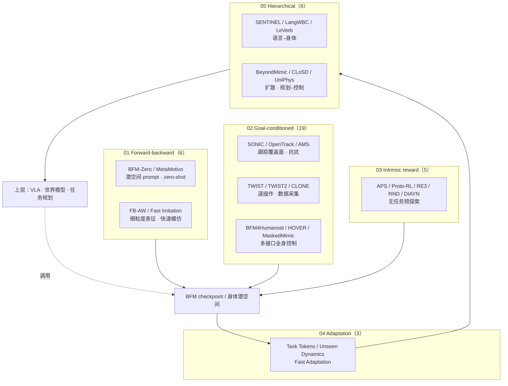

# BFM 技术地图：41 篇论文的五类问题视角

> **本页定位**：为 [具身智能研究室 · BFM 41 篇专题](https://mp.weixin.qq.com/s/Ei32la_vo0UW9Y_QCAqB2g) 提供 **按五类问题组织的阅读坐标**；不复述每篇论文细节，只保留 **产业语境、五组论文地图、与 taxonomy / 身体系统栈的挂接**。概念定义与 Mermaid taxonomy 见 [Behavior Foundation Model](../concepts/behavior-foundation-model.md)；姊妹篇 [人形 RL 身体系统栈](./humanoid-rl-motion-control-body-system-stack.md)、[AMP 运动先验综述](./humanoid-amp-motion-prior-survey.md)。

## 一句话观点

**BFM 最值得看的，不是「动作库更大」，而是把身体能力做成上层智能可调用的接口**——走、平衡、起身、接触、抗扰恢复要先在底层封装好，语言 / VLA / 世界模型 / 规划器才能稳定调用；41 篇论文共同回答 **「身体如何成为运控基座」**，而非单点 demo。

## 为什么单独做这张地图

- [BFM 概念页](../concepts/behavior-foundation-model.md) 已给出 **预训练三线 + 适应两线** 的 taxonomy（对齐 TPAMI 2025 综述）。
- [awesome-bfm-papers](https://github.com/friedrichyuan/awesome-bfm-papers) 提供 **活索引**，但读者仍需要 **按问题线索** 的导航——公众号长文把 41 篇全部串读，并补上 **智元 BFM-2 / 众擎 demo** 等产业观察。
- 与 [八层身体系统栈](./humanoid-rl-motion-control-body-system-stack.md) 的关系：八层栈回答「humanoid RL 系统在搭什么」；本页回答 **「运控基座 / BFM」这条横切面在 2025–2026 的论文簇如何铺开」**。

## 流程总览：五类问题 → 身体 API

## 产业语境（策展，非官方技术规格）

| 主体 | 文内观察 | 与本页关系 |
|------|----------|------------|
| **智元** | 公开把 **BFM-2** 推为「运控基座模型」，预告 BFM-3 | 与 **01 FB 线 + 02 跟踪覆盖面** 叙事直接对齐 |
| **众擎** | 年度 demo：多动作拼接、长时程、倒地起身、抗扰 | 文内视为「运控基座需求侧验证」，**不写成已官方冠名 BFM** |
| **学术索引** | [awesome-bfm-papers](https://github.com/friedrichyuan/awesome-bfm-papers) + [综述 arXiv:2506.20487](https://arxiv.org/abs/2506.20487) | 41 篇编号与分组以仓库 README 为准 |

## 五组论文地图（41 篇）

> **已有 wiki 页** 以链接标出；其余为后续按 arXiv / 项目页升格的候选。完整标题与链接见 [source 归档](../../sources/blogs/wechat_embodied_ai_lab_bfm_41_papers_survey.md)。

### 01 — Forward-backward 表征（6 篇）

| # | 工作 | 要点 | 本库 |
|---|------|------|------|
| 01 | **BFM-Zero** | 无监督 RL + latent prompt；未见动作跟踪、奖励优化、恢复 | [BFM 实体 § 同期工作](../entities/paper-behavior-foundation-model-humanoid.md) |
| 02 | **MetaMotivo** | Zero-shot whole-body；与 BFM-Zero 对照读 | — |
| 03 | **FB-AW / FB-AWARE** | 潜空间要「细」才可被上层精确调用 | — |
| 04 | **Fast Imitation** | 有基座后新动作应少走弯路 | — |
| 05 | **Learning One Representation** | 统一 FB 嵌入服务多 reward | — |
| 06 | **Successor States** | 未来状态分布的数学底座 | — |

### 02 — Goal-conditioned 学习（19 篇）

| # | 工作 | 要点 | 本库 |
|---|------|------|------|
| 07 | **SONIC** | Supersizing motion tracking；动作覆盖面 | [sonic-motion-tracking](../methods/sonic-motion-tracking.md) |
| 08 | **OpenTrack** | 任意动作 + 扰动下跟踪 | — |
| 09 | **AMS** | 异构数据下敏捷与稳定 | [ams](../methods/ams.md) |
| 10–12 | **TWIST2 / TWIST / CLONE** | 全身数据采集与长时程遥操作闭环 | [teleoperation](../tasks/teleoperation.md) |
| 13 | **BFM for Humanoid Robots** | CVAE + 掩码 + 多接口统一 | [paper-behavior-foundation-model-humanoid](../entities/paper-behavior-foundation-model-humanoid.md) |
| 14 | **HOVER** | 神经全身控制器 · 上层接口 | — |
| 15 | **InterMimic** | 人-物交互 WBC | — |
| 16–25 | **ModSkill … ASE** | 技能模块化、masked inpainting、planner、CALM/CASE、PHC、MTM、ASE 等 | [protomotions](../entities/protomotions.md)（MaskedMimic 生态） |

### 03 — Intrinsic reward 预训练（5 篇）

| # | 工作 | 要点 | 本库 |
|---|------|------|------|
| 26–30 | **APS / Proto-RL / RE3 / RND / DIAYN** | 任务到来前的探索与技能分化 | [behavior-foundation-model](../concepts/behavior-foundation-model.md) § intrinsic 线 |

### 04 — Adaptation（3 篇）

| # | 工作 | 要点 | 本库 |
|---|------|------|------|
| 31 | **Task Tokens** | 轻量 task 条件适配 | — |
| 32 | **Unseen Dynamics** | 负载/地面/参数变化 | [sim2real](../concepts/sim2real.md) |
| 33 | **Fast Adaptation** | 下游样本与工程成本 | — |

### 05 — Hierarchical control（8 篇）

| # | 工作 | 要点 | 本库 |
|---|------|------|------|
| 34 | **SENTINEL** | 端到端 language-action WBC | [身体系统栈 §7](./humanoid-rl-motion-control-body-system-stack.md) |
| 35 | **BeyondMimic** | Guided diffusion 全身控制 | [beyondmimic](../methods/beyondmimic.md) |
| 36–37 | **LeVerb / LangWBC** | 视觉-语言 → 全身 latent / 端到端 | [vla](../methods/vla.md)、[DAJI](../entities/paper-daji-anticipatory-joint-intent.md) |
| 38–41 | **TokenHSI / CLoSD / UniPhys / UniHSI** | 场景交互 token、仿真–扩散闭环、规划–控制、contact chain | — |

### 数据集（10 项，不计入 41 篇）

文内强调：**上限在数据能否变成机器人可信、可执行、可迁移的训练材料**。Humanoid-X、PHUMA、Motion-X++、AMASS、HumanML3D、BABEL 等 — 见 [awesome_bfm_papers](../../sources/repos/awesome_bfm_papers.md) 与 [AMASS](../entities/amass.md)。

## 与 taxonomy / 身体系统栈的对照

| 本页五组 | [BFM 概念页](../concepts/behavior-foundation-model.md) taxonomy | [八层身体系统栈](./humanoid-rl-motion-control-body-system-stack.md) |
|----------|---------------------------------------------------------------------|----------------------------------------------------------------------|
| 01 FB | Forward–backward 预训练 | 控制层 · 身体潜空间 / prompt |
| 02 Goal-conditioned | Goal-conditioned 预训练 | 数据 + 跟踪 + 控制（层 1–3） |
| 03 Intrinsic | Intrinsic-reward 预训练 | 控制层 · 探索先验 |
| 04 Adaptation | 微调线 | 跨任务 / 跨动力学部署 |
| 05 Hierarchical | 层次化 + 微调 | 任务接口层（层 7）· VLA 调用 |

## 四个后续深读方向（沿用文内计划）

1. **BFM-Zero + forward-backward** — 与 CVAE-BFM 的方法谱系两端。
2. **HOVER / MaskedMimic / SONIC** — 全身跟踪与多接口执行器。
3. **SENTINEL / LangWBC / LeVerb** — 语义到身体接口。
4. **Humanoid-X / Motion-X++** — 身体数据 scaling。

## 关联页面

- [Behavior Foundation Model](../concepts/behavior-foundation-model.md) — 定义与 taxonomy
- [BFM（人形 WBC 论文实体）](../entities/paper-behavior-foundation-model-humanoid.md)
- [人形运动跟踪方法选型](../queries/humanoid-motion-tracking-method-selection.md)
- [Foundation Policy](../concepts/foundation-policy.md) — 与 VLA 操作向基础策略的边界
- [人形 RL 身体系统栈](./humanoid-rl-motion-control-body-system-stack.md)、[AMP 运动先验综述](./humanoid-amp-motion-prior-survey.md)

## 参考来源

- [具身智能研究室 · BFM 41 篇微信公众号编译稿](../../sources/blogs/wechat_embodied_ai_lab_bfm_41_papers_survey.md)
- [awesome-bfm-papers 精选列表](../../sources/repos/awesome_bfm_papers.md)
- [BFM 综述（arXiv:2506.20487）](../../sources/papers/bfm_survey_arxiv_2506_20487.md)

## 推荐继续阅读

- [awesome-bfm-papers](https://github.com/friedrichyuan/awesome-bfm-papers) — 41 篇完整表与数据集表
- [A Survey of Behavior Foundation Model](https://arxiv.org/abs/2506.20487) — TPAMI 2025 全文
- [BFM-Zero 项目页](https://lecar-lab.github.io/BFM-Zero/) — promptable 身体基座对照
