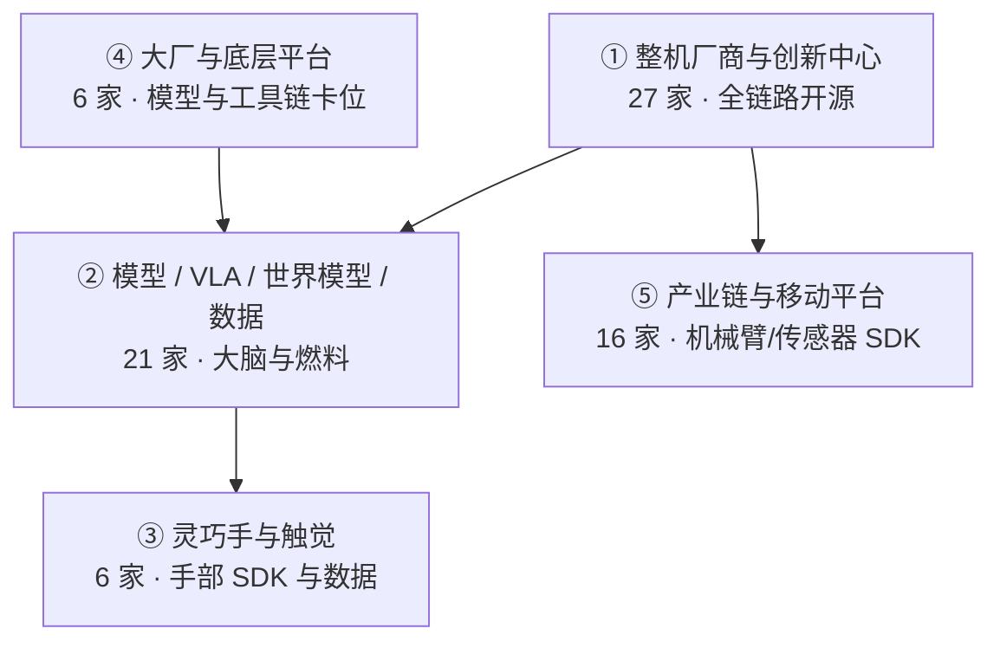

# 国内具身智能开源全景（76 家 · 424 项）

> **本页定位**：[国内具身智能的开源全景](https://mp.weixin.qq.com/s/L2XQBhesU8EiS2nKM7HErw)（2026-09-06）的阅读坐标；**424/424 独立详情节点**见 [覆盖索引](../queries/china-domestic-opensource-424-coverage.md)。

## 一句话观点

**国内具身开源已从单点仓库扩展为「整机全链路 + 模型大脑 + 灵巧手 + 大厂平台 + 产业链 SDK」五层格局；选型应先定层，再进独立实体页核对训练/部署入口。**

## 英文缩写速查

| 缩写 | 英文全称 | 简要说明 |
|------|----------|----------|
| OEM | Original Equipment Manufacturer | 整机厂商与各地创新中心 |
| VLA | Vision-Language-Action | 视觉–语言–动作模型 |
| SDK | Software Development Kit | 真机驱动与控制接口 |
| HMI | Humanoid Motion Intelligence | 同源 GitHub 知识库 |

## 五层格局

| 层 | 机构数（文内） | 开源特征 | 本库入口 |
|---|---:|---|---|
| 第一层 | 27 | 本体资产 + RL + 仿真 + 部署 SDK 成套公开 | [208 项索引](../queries/china-domestic-opensource-424-coverage.md) |
| 第二层 | 21 | VLA/世界模型/数据格式立标准 | [73 项索引](../queries/china-domestic-opensource-424-coverage.md) |
| 第三层 | 6 | 手部 SDK、仿真、遥操作、触觉数据 | [36 项索引](../queries/china-domestic-opensource-424-coverage.md) |
| 第四层 | 6 | 模型层与开发者工具链 | [44 项索引](../queries/china-domestic-opensource-424-coverage.md) |
| 第五层 | 16 | 机械臂/相机/雷达 ROS 驱动 | [63 项索引](../queries/china-domestic-opensource-424-coverage.md) |

## 节点策略（本 ingest）

- **424/424 独立 `wiki/entities/*` 详情节点**（静态站 `detail.html?id=entity-…`）。
- **复用 126** 既有实体（Unitree/智元/HMI 主表等已覆盖项）；**新建 298** `cn-os-*` 实体补齐缺口。
- 与 [HMI 开源项目主表 166 项](../queries/hmi-opensource-projects-coverage.md) **互补**：主表按技术路线深读算法；本全景按 **国内机构** 查仓库入口。

## 读法建议

1. **选整机厂** — 从智元/宇树/天工等实体页沿 RL → Sim2Sim → SDK 链路读。
2. **选 VLA/世界模型** — 第二层公司实体 + [VLA](../methods/vla.md)。
3. **查是否已有方法页** — 覆盖索引标注「复用」时优先读原方法/论文页。

## 关联页面

- [Humanoid Motion Intelligence](../entities/humanoid-motion-intelligence.md)
- [424 项覆盖索引](../queries/china-domestic-opensource-424-coverage.md)
- [HMI 开源项目主表导读](../queries/hmi-opensource-projects-coverage.md)

## 参考来源

- [国内具身智能开源全景（微信公众号）](../../sources/blogs/wechat_embodied_station_domestic_opensource_panorama_2026-09-06.md)

## 推荐继续阅读

- [GitHub：人形机器人运动智能知识库](https://github.com/RealXiaoze/humanoid-motion-intelligence)
