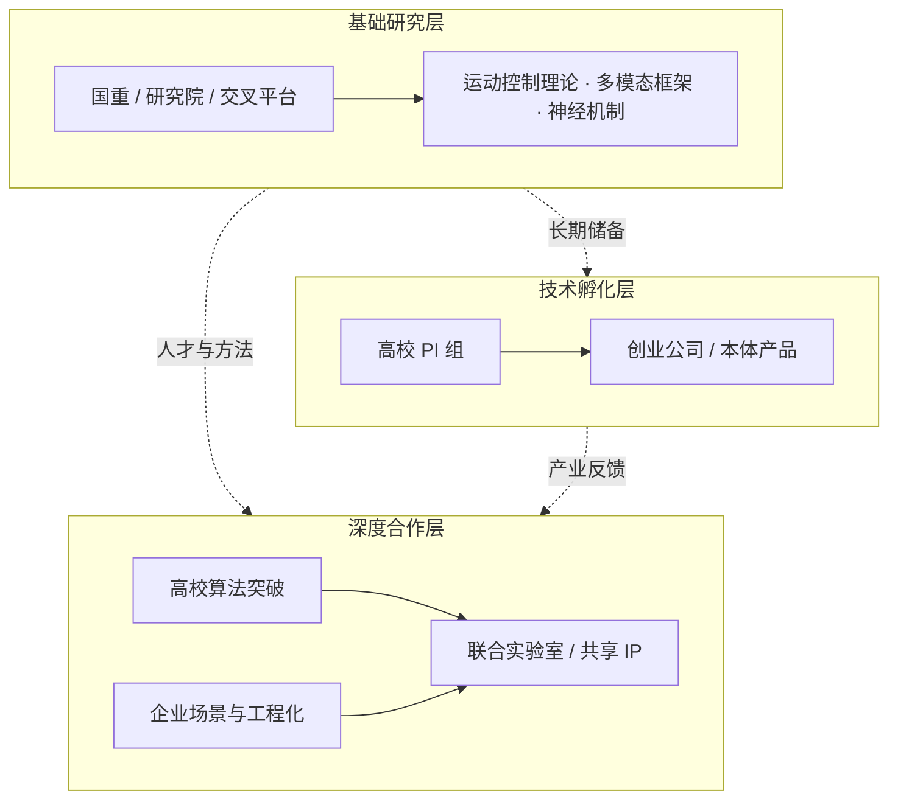

# 国内具身智能实验室三层地图（2026）

> **本页定位**：为 [深蓝具身智能 · 50 所国内具身智能实验室盘点](https://mp.weixin.qq.com/s/58c4CgN9XVmtS_RMKbqeKw) 提供 **可读的结构坐标**；不复述全部条目简历，只保留 **三层划分、代表节点、与本库知识页的交叉**。姊妹篇见 [海外具身智能实验室地图](./overseas-embodied-ai-labs-landscape-2026.md)。

## 一句话定义

国内具身智能高校实验室可按公开产学研现状粗分为 **技术孵化层（组→公司）、深度合作层（校企联合实验室）、基础研究层（重点科研平台）**——三股力量共同构成从论文到产品、从算法到本体的转化链条；划分边界有交叉，**仅作导航，非官方定性**。

## 英文缩写速查

| 缩写 | 英文全称 | 简要说明 |
|------|----------|----------|
| VLA | Vision-Language-Action | 视觉–语言–动作多模态策略 |
| MPC | Model Predictive Control | 模型预测控制 |
| WBC | Whole-Body Control | 全身控制 |
| Sim2Real | Simulation to Real | 仿真策略迁移真机 |
| DP3 | 3D Diffusion Policy | 3D 条件扩散操作策略 |
| SLAM | Simultaneous Localization and Mapping | 同步定位与建图 |

## 为什么重要

- **选题与合作**：判断一个团队更偏「创业转化」「联合攻关」还是「长期底座」，比按校名排序更有用。
- **读论文时的机构语境**：同一高校下可同时存在孵化组、联合实验室与国重平台——引用机构标签时要落到 **具体实验室 / PI**。
- **与商业平台对照**：孵化层公司名可接到 [市面知名机器人平台纵览](./notable-commercial-robot-platforms.md)；合作层数据/开源入口可接到 [Agibot World](../entities/agibot-world-2026.md) 等节点。

## 流程总览：三层转化链

## 核心原理：三层怎么读

### 1. 技术孵化层——「一间组，往往就是一家公司的前身」

文内强调国内最鲜明特征之一是 **实验室直接孵化企业**。下列为高频对照节点（完整名单见 [sources 归档](../../sources/blogs/wechat_shenlan_china_embodied_labs_50_2026.md)）：

| 实验室 / 团队 | 孵化 / 产业关联（文内） | 本库延伸 |
|---------------|------------------------|----------|
| 清华 ISR / TEA / EVAR / MARS 等 | 星动纪元、破壳、千寻、星海图等 | [Diffusion Policy](../methods/diffusion-policy.md)（DP3 语境）、[VLA](../methods/vla.md) |
| 清华机器人控制实验室（赵明国） | 加速进化；MPC / WBC 算法传统 | [MPC](../methods/model-predictive-control.md)、[WBC](../concepts/whole-body-control.md) |
| 北大 EPIC Lab（王鹤） | 银河通用 Galbot；GraspVLA | [manipulation](../tasks/manipulation.md) |
| 南科大 CLEAR（张巍） | 逐际动力 LimX Dynamics | [LimX COSA](../entities/limx-cosa.md)、[Sim2Real](../concepts/sim2real.md) |
| 中科院自动化所人形中心（乔红） | 唯实研究院；Q 系列 | [人形机器人](../entities/humanoid-robot.md) |
| 松山湖 XbotPark / 港科大体系 | 固高、大疆等硬科技生态 | [市面平台纵览](./notable-commercial-robot-platforms.md) |
| 港科大 ARGLab（沈劭劼） | 与大疆 HDJI；VINS / FAST-Planner | [VINS-Fusion](../entities/vins-fusion.md)、[EGO-Planner Swarm](../entities/ego-planner-swarm.md) |

### 2. 深度合作层——技术路线图上的校企共建

企业提供场景与工程化，高校提供前沿算法，双方通过联合实验室 **前置研发周期、共享 IP**。

| 联合平台（文内） | 合作企业 / 机构 | 本库延伸 |
|------------------|-----------------|----------|
| PKU-Agibot Lab | 智元机器人 | [Agibot 灵犀 X1](../entities/agibot-lingxi-x1.md)、[Agibot World 2026](../entities/agibot-world-2026.md) |
| 北大 ACIR | 北京人形 / 国地共建具身智能创新中心 | [X-Humanoid](../entities/x-humanoid.md)、[天工开源](../entities/tienkung-humanoid-open-source.md) |
| OpenDriveLab（港大 & 上海 AI Lab） | 智元 → AgiBotWorld 百万真机数据 | [Agibot World 2026](../entities/agibot-world-2026.md)、[VLA 开源复现谱系](./vla-open-source-repro-landscape-2025.md) |
| 北大–智平方联合实验室 | 智平方（GOVLA / AlphaBot） | [VLA](../methods/vla.md)、[世界模型训练闭环](./robot-world-models-training-loop-taxonomy.md) |

### 3. 基础研究层——未必纸面孵化，但托住长期攻关

文内将 THUEIR / AIR、上交多实验室、复旦可信具身智能研究院、人大 GeWu-Lab 等归入 **基础研究腹地**：运动控制数学、多模态融合、神经机制与机器人耦合等。读法建议：

- 需要 **理论 / 表示 / 数据集** 时优先扫这一层；
- 需要 **可买平台或落地数据** 时回到孵化层与合作层。

## 工程实践：怎么用这张地图

1. **跟论文找组**：先定层（孵化 / 合作 / 底座），再落到 PI 与代表成果，而不是只记校名。
2. **跟开源找入口**：合作层里 OpenDriveLab / 智元数据链路 → [Agibot World](../entities/agibot-world-2026.md) 与 [VLA 复现谱系](./vla-open-source-repro-landscape-2025.md)。
3. **跟硬件找公司**：孵化层公司名 → [商业平台纵览](./notable-commercial-robot-platforms.md)；逐际 → [LimX COSA](../entities/limx-cosa.md)。
4. **国内外对照**：国内「组即公司」密度高；海外更多「PI 联合创办 AI 公司 / 研究所衍生」——见姊妹篇。

## 局限与风险

- **非穷尽、非排名**：文内声明手动整理、欢迎补充；本页亦不做竞争力排序。
- **边界交叉**：同一 PI 可同时出现在孵化与合作层；联合实验室更名频繁（如北大 ACIR）。
- **信息时效**：数据截至 **2026-07**；公司融资、实验室建制可能快速变化——以官网与项目页为准。
- **本库未建全量实体**：约 50 所中仅交叉已有 wiki 节点；其余保留在 sources，按研究需要再拆页。

## 关联页面

- [海外具身智能实验室地图（2026）](./overseas-embodied-ai-labs-landscape-2026.md)
- [市面知名机器人平台纵览](./notable-commercial-robot-platforms.md)
- [Robot Learning Overview](./robot-learning-overview.md)
- [VLA 开源复现谱系 2025](./vla-open-source-repro-landscape-2025.md)
- [Agibot World 2026](../entities/agibot-world-2026.md)
- [X-Humanoid](../entities/x-humanoid.md)
- [LimX COSA](../entities/limx-cosa.md)

## 参考来源

- [wechat_shenlan_china_embodied_labs_50_2026.md](../../sources/blogs/wechat_shenlan_china_embodied_labs_50_2026.md)
- [原始抓取正文](../../sources/raw/wechat_shenlan_china_embodied_labs_50_2026-07-26/article.md)

## 推荐继续阅读

- 原文（含全景图领取入口）：[微信公众号文章](https://mp.weixin.qq.com/s/58c4CgN9XVmtS_RMKbqeKw)
- 姊妹篇原文：[2026 海外具身智能实验室 43 所](https://mp.weixin.qq.com/s/_zoU9Q-KXHJAUZ041iBuCw)
