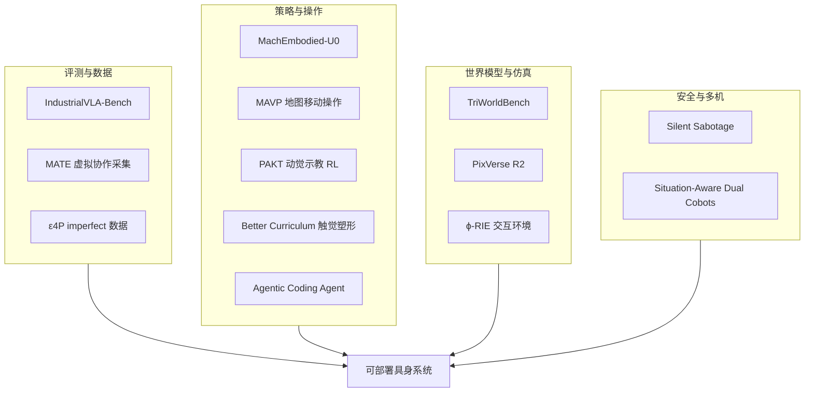

# 协作数据、评测与世界模型：12 篇论文阅读坐标

> **本页定位**：为 [具身智能小站 · 12 篇盘点](https://mp.weixin.qq.com/s/ZYnIkrJ-9H5KQw2z-AT0qQ)（2026-09-23）提供按问题组织的阅读坐标，并链接同期 [PixVerse R2](../entities/paper-pixverse-r2.md) ingest。

## 一句话观点

**「协作数据贵」与「世界模型是否可信」是同一部署问题的两面：前者问数据从哪来，后者问预测能否支撑决策——本期 12 篇分别给出评测协议、虚拟协作采集、三视角一致性基准与重建到仿真路径。**

## 英文缩写速查

| 缩写 | 英文全称 | 简要说明 |
|------|----------|----------|
| VLA | Vision-Language-Action | 视觉–语言–动作策略 |
| WM | World Model | 环境前向预测模型 |
| EAIS | Execution-Aligned Interaction Sampling | MATE 交互关键片段采样 |
| 3DGS | 3D Gaussian Splatting | 高斯溅射场景重建 |

## 为什么单独做这张地图

- 一次列出 12 篇跨度大的工作；需要横切面索引。
- **12/12 独立节点**：本批全部新建；**0 重复 arXiv**。

## 流程总览

## 分组索引

### VLA 评测与数据效率

| 论文 | 节点 | 开源 |
|------|------|------|
| IndustrialVLA-Bench | [paper-industrialvla-bench](../entities/paper-industrialvla-bench.md) | 已开源 |
| ε4P | [paper-varepsilon4p](../entities/paper-varepsilon4p.md) | 未开源 |

### 人形协作与统一具身模型

| 论文 | 节点 | 开源 |
|------|------|------|
| MATE | [paper-mate-virtual-teleop](../entities/paper-mate-virtual-teleop.md) | 待发布 |
| MachEmbodied-U0 | [paper-me-u0](../entities/paper-me-u0.md) | 已开源 |

### 移动操作与示教

| 论文 | 节点 | 开源 |
|------|------|------|
| MAVP | [paper-mavp](../entities/paper-mavp.md) | 待发布 |
| TriWorldBench | [paper-triworldbench](../entities/paper-triworldbench.md) | 已开源 |
| Better Curriculum | [paper-better-curriculum](../entities/paper-better-curriculum.md) | 待发布 |
| PAKT | [paper-pakt](../entities/paper-pakt.md) | 待发布 |

### 代码代理、安全与仿真

| 论文 | 节点 | 开源 |
|------|------|------|
| Agentic Coding Agent | [paper-agentic-coding-manipulation](../entities/paper-agentic-coding-manipulation.md) | 未开源 |
| Silent Sabotage | [paper-silent-sabotage](../entities/paper-silent-sabotage.md) | 已开源 |
| ϕ-RIE | [paper-phi-rie](../entities/paper-phi-rie.md) | 已开源 |
| Situation-Aware Dual Cobots | [paper-situation-aware-dual-cobots](../entities/paper-situation-aware-dual-cobots.md) | 已开源 |

### 同期：实时交互世界模型

| 模型 | 节点 | 开源 |
|------|------|------|
| PixVerse R2 | [paper-pixverse-r2](../entities/paper-pixverse-r2.md) | 模型未开源 |

## 关联页面

- [VLA](../methods/vla.md)
- [Generative World Models](../methods/generative-world-models.md)
- [Loco-Manipulation](../tasks/loco-manipulation.md)
- [PixVerse R2](../entities/paper-pixverse-r2.md)

## 参考来源

- [wechat_embodied_station_12_papers_collab_wm_2026-09-23.md](../../sources/blogs/wechat_embodied_station_12_papers_collab_wm_2026-09-23.md)

## 推荐继续阅读

- [IndustrialVLA-Bench](../entities/paper-industrialvla-bench.md)
- [TriWorldBench](../entities/paper-triworldbench.md)
- [PixVerse R2](../entities/paper-pixverse-r2.md)
