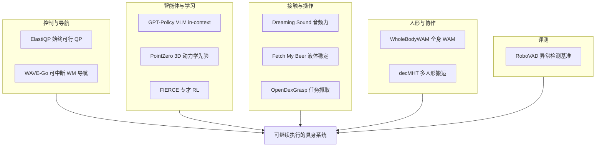

# 约束冲突与可继续执行：11 篇论文阅读坐标

> **本页定位**：为 [具身智能小站 · 11 篇盘点](https://mp.weixin.qq.com/s/RozDRLth62xgulo4ccIBMw)（2026-09-20）提供按问题组织的阅读坐标。

## 一句话观点

**「动作还能继续」取决于三层：QP/控制器在不可行时如何软化、世界模型/智能体在执行中如何反悔与验证、操作层如何把力与动态稳定写进闭环——而非单点换更大模型。**

## 英文缩写速查

| 缩写 | 英文全称 | 简要说明 |
|------|----------|----------|
| QP | Quadratic Programming | 约束二次规划 |
| WM | World Model | 世界/动作预测模型 |
| VLM | Vision-Language Model | 视觉–语言模型智能体 |
| WAM | World Action Model | 世界–动作联合模型 |

## 为什么单独做这张地图

- 一次列出 11 篇方向跨度大的工作；需要横切面索引。
- **11/11 独立节点**：新建 6 + 复用 5；**0 重复 arXiv**。

## 流程总览

## 分组索引

### 控制与导航（深读 + 跟进）

| 论文 | 节点 | 开源 |
|------|------|------|
| ElastiQP | [paper-elastiqp](../entities/paper-elastiqp.md) | 已开源 |
| WAVE-Go | [paper-wave-go](../entities/paper-wave-go.md) | 已开源 |
| GPT-Policy | [paper-gpt-policy](../entities/paper-gpt-policy.md) | 已开源 |

### 力感知、液体与灵巧操作

| 论文 | 节点 | 开源 |
|------|------|------|
| Dreaming the Sound of Contact | [paper-dreaming-sound-of-contact](../entities/paper-dreaming-sound-of-contact.md) | 待发布 |
| Fetch My Beer | [paper-fetch-my-beer](../entities/paper-fetch-my-beer.md) | 待发布 |
| OpenDexGrasp | [paper-opendexgrasp](../entities/paper-opendexgrasp.md) | 待发布 |

### 世界模型、专才与基准

| 论文 | 节点 | 开源 |
|------|------|------|
| WholeBodyWAM | [paper-wholebodywam-unimotion-4k](../entities/paper-wholebodywam-unimotion-4k.md) | 待发布 |
| PointZero | [paper-pointzero](../entities/paper-pointzero.md) | 已开源 |
| FIERCE | [paper-fierce](../entities/paper-fierce.md) | 已开源 |
| RoboVAD | [paper-robovad](../entities/paper-robovad.md) | 部分开源 |

### 多人形协作

| 论文 | 节点 | 开源 |
|------|------|------|
| decMHT | [paper-decentralized-multi-humanoid-pickup](../entities/paper-decentralized-multi-humanoid-pickup.md) | 待发布 |

## 关联页面

- [Whole-Body Control](../concepts/whole-body-control.md)
- [World Action Models](../concepts/world-action-models.md)
- [VLA](../methods/vla.md)
- [Loco-Manipulation](../tasks/loco-manipulation.md)

## 参考来源

- [wechat_embodied_station_11_papers_constraint_control_2026-09-20.md](../../sources/blogs/wechat_embodied_station_11_papers_constraint_control_2026-09-20.md)

## 推荐继续阅读

- [ElastiQP](../entities/paper-elastiqp.md)
- [GPT-Policy](../entities/paper-gpt-policy.md)
