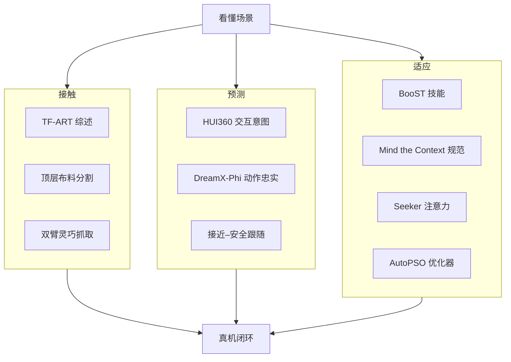

# 接触–预测–适应：10 篇论文的阅读坐标

> **本页定位**：为 [具身智能小站 · 10 篇盘点](https://mp.weixin.qq.com/s/IxmKI4_JYy1KBfp_JCZFLw)（2026-08-18）提供 **按三类问题组织的阅读坐标**；不复述每篇方法细节。姊妹近期盘点见 [具身智能小站 9 篇（2026-08-17）](../../sources/blogs/wechat_embodied_station_9_papers_2026-08-17.md)。

## 一句话观点

**具身智能下一站不是更大的「看懂」，而是接触时能调力、预测时忠实于动作、适应时能带着技能与规范迁移。**

## 英文缩写速查

| 缩写 | 英文全称 | 简要说明 |
|------|----------|----------|
| TF-ART | Tactile/Force-Aware Robot learning Taxonomy | 接触组综述坐标 |
| WAM / WM | World Action / World Model | 预测组：本专辑以视频 WM 为主 |
| HRI | Human–Robot Interaction | 预测组的交互意图与社交规范 |
| VQ-VAE | Vector Quantized VAE | 适应组 BooST 技能码本 |
| ROI | Region of Interest | 适应组 Seeker 的动作监督瓶颈 |

## 为什么单独做这张地图

- 公众号把 10 篇放在同一叙事里：从视觉–语言理解继续接到物理交互、约束、时序与社会上下文。
- 站内已有触觉链、世界模型闭环、社交导航节点；需要一张 **横切面** 避免 10 个实体变成孤岛。
- **Seeker 已有 complete 页**，本专辑不重复造页。

## 流程总览：三类问题

## 分组索引

### 接触：调力、认边界、双手稳定

| # | 论文 | 开源（入库日） | 详情 |
|---|------|----------------|------|
| 01 | TF-ART 触觉/力觉综述 | Awesome 清单 | [paper-tf-art-tactile-force-survey](../entities/paper-tf-art-tactile-force-survey.md) |
| 04 | 顶层布料分割 | 空仓 | [paper-top-layer-fabric-seg](../entities/paper-top-layer-fabric-seg.md) |
| 06 | 真机双臂灵巧抓取 | 训练/推理已开 | [paper-real-bi-dex-grasp](../entities/paper-real-bi-dex-grasp.md) |

### 预测：会不会来、走哪只臂、跟多近

| # | 论文 | 开源（入库日） | 详情 |
|---|------|----------------|------|
| 03 | HUI360 | 基线 + 标注 | [paper-hui360](../entities/paper-hui360.md) |
| 08 | DreamX-Phi 1.0 | 占位仓 | [paper-dreamx-phi](../entities/paper-dreamx-phi.md) |
| 07 | 接近–安全跟随 | 可运行仿真 | [paper-nav-ps-balance](../entities/paper-nav-ps-balance.md) |

### 适应：技能、规范、看哪、优化器

| # | 论文 | 开源（入库日） | 详情 |
|---|------|----------------|------|
| 05 | BooST | 仅项目页 | [paper-boost-skill-transfer](../entities/paper-boost-skill-transfer.md) |
| 09 | Mind the Context | notebook | [paper-mind-the-context](../entities/paper-mind-the-context.md) |
| 10 | Seeker | **复用** 已有节点 | [paper-seeker](../entities/paper-seeker.md) |
| 02 | AutoPSO | CEC 示例可跑 | [paper-autopso](../entities/paper-autopso.md) |

## 怎么读（不要线性刷完）

1. 做接触操作：先 [TF-ART](../entities/paper-tf-art-tactile-force-survey.md) 看力/触觉进哪一层，再按任务选分割或双臂抓取。
2. 做社交移动：先 [HUI360](../entities/paper-hui360.md) 预测交互，再用 [nav-ps-balance](../entities/paper-nav-ps-balance.md) 跟目标。
3. 做少样本策略：[BooST](../entities/paper-boost-skill-transfer.md) 管技能码，[Seeker](../entities/paper-seeker.md) 管视觉瓶颈。
4. 做视频 WM：用 [DreamX-Phi](../entities/paper-dreamx-phi.md) 对照「动作忠实 vs 真实感」，权重未开时只当坐标。

## 局限与风险

- 公众号是二手综述；数字以各论文/项目页为准。
- 十篇开源程度差异大（空仓 / 占位 / 清单 / 可跑），选型先看开源列。
- AutoPSO 偏进化计算，放进「适应」是因为优化器自动化，不是具身策略本身。

## 关联页面

- [Contact-Rich Manipulation](../concepts/contact-rich-manipulation.md)
- [生成式世界模型](../methods/generative-world-models.md)
- [触觉与力觉知识链](./hub-tactile.md)
- [机器人世界模型训练闭环](./robot-world-models-training-loop-taxonomy.md)

## 参考来源

- [微信盘点归档](../../sources/blogs/wechat_embodied_station_contact_predict_adapt_10_papers_2026-08-18.md)
- [原始抓取](../../sources/raw/wechat_embodied_station_contact_predict_adapt_10_papers_2026-08-18.md)
- 原文：<https://mp.weixin.qq.com/s/IxmKI4_JYy1KBfp_JCZFLw>

## 推荐继续阅读

- 原文公众号文章（含项目链）
- 前一篇小站盘点：[9 篇 WAM/执行接口](../../sources/blogs/wechat_embodied_station_9_papers_2026-08-17.md)
