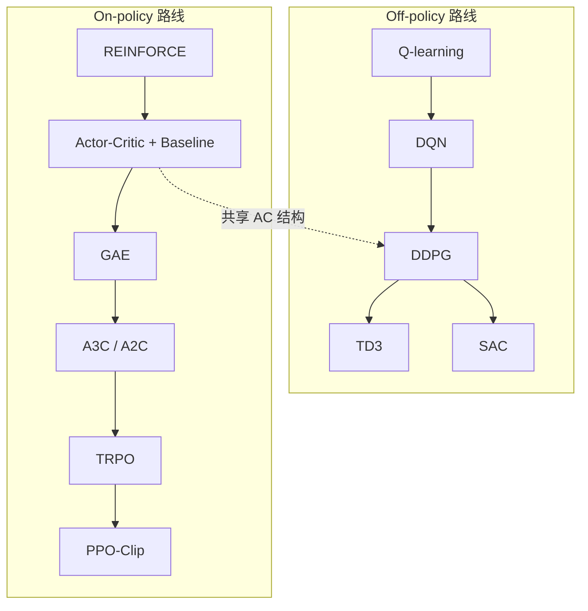

# 深度 RL 两条主线：Off-policy 与 On-policy 演进

> **本页定位**：为 [PinkRobot · Off/On-policy 完整演进](https://mp.weixin.qq.com/s/gfL23ksN1FeXNTp5kpUpsw) 提供 **按问题线索组织的阅读坐标**；算法细节以 [PPO](../methods/ppo.md)、[SAC](../methods/sac.md)、[PPO vs SAC](../comparisons/ppo-vs-sac.md) 等专页为准。姊妹篇运控 PPO 数学链见 [RobotsHub 万字解析](../../sources/blogs/wechat_robotshub_ppo_locomotion_fundamentals.md)。

## 一句话观点

**Off-policy 与 On-policy 的严格分界是行为策略 $\pi_b$ 与目标策略 $\pi$ 是否相同**——Replay Buffer 只是 off-policy 的常见工程手段；机器人里 **真机交互贵** 时 off-policy 复用更有价值，**大规模并行仿真便宜** 时 PPO 类 on-policy 往往更顺手。

## 英文缩写速查

| 缩写 | 英文全称 | 简要说明 |
|------|----------|----------|
| Off-policy | — | $\pi_b \neq \pi$，可用历史数据更新当前策略 |
| On-policy | — | $\pi_b = \pi$，数据来自当前策略 |
| DQN | Deep Q-Network | 深度 Q-learning，离散动作 off-policy 里程碑 |
| DDPG | Deep Deterministic Policy Gradient | 连续动作确定性 Actor + Q Critic |
| TD3 | Twin Delayed DDPG | 双 Q + 延迟 Actor 更新，抑制过估计 |
| SAC | Soft Actor-Critic | 最大熵 off-policy 随机 Actor |
| GAE | Generalized Advantage Estimation | PPO/TRPO 常用 Advantage 估计 |
| TRPO | Trust Region Policy Optimization | KL 约束的策略更新，PPO 前身 |

## 严格分界：不是「有没有 Replay Buffer」

| 通俗说法 | 问题 | 严格说法 |
|----------|------|----------|
| 有 Buffer = off-policy | Buffer 也可做 on-policy 对照实验 | 看 $\pi_b$ 与 $\pi$ 是否一致 |
| 没 Buffer = on-policy | PPO 也会对同一 rollout 多轮 minibatch | 仍用当前 $\pi$ 重新采样下一批 |
| Actor-Critic = on-policy | DDPG/TD3/SAC 全是 AC | AC 是结构；Off/On 是数据关系 |

**Q-learning 为何天然 off-policy：** 行为策略可用 $\epsilon$-greedy 探索，但 TD target 用 $\max_a Q(s',a)$——数据来自 $\pi_b$，目标朝 greedy $\pi$ 更新。

## 流程总览：两条演进链

> **读图注意：** SAC 与 TD3 **大致同期**，不是「TD3 加熵」的线性后继；Actor-Critic 虚线表示 **结构共享**，不表示 on-policy 专属。

## 分段检索：各算法解决什么问题

| 算法 | 主要痛点 | 关键机制 | 本库入口 |
|------|----------|----------|----------|
| Q-learning | 表格 off-policy control | Bellman max 算子 TD | [Bellman](../formalizations/bellman-equation.md) |
| DQN | 深度网络 + 非平稳目标 | Target net + Replay | [RL 方法页](../methods/reinforcement-learning.md) |
| DDPG | 连续动作无法 argmax | 确定性 Actor + Q | [policy-optimization](../methods/policy-optimization.md) |
| TD3 | Critic 过估计被 Actor 利用 | Twin Q + delayed policy | 同上 |
| SAC | 探索与 off-policy 稳定性 | 最大熵 + 随机 Actor + 自动温度 | [SAC](../methods/sac.md) |
| REINFORCE | 直接优化策略 | Monte Carlo PG | [policy-optimization](../methods/policy-optimization.md) |
| GAE | Advantage 方差大 | $\lambda$ 权衡 bias–variance | [GAE](../formalizations/gae.md) |
| TRPO | 一步更新过大 | KL trust region + 二阶 | [PPO](../methods/ppo.md) §与 TRPO 关系 |
| PPO | TRPO 难并行 / 难实现 | Clip surrogate + 一阶 SGD | [PPO](../methods/ppo.md) |

## 机器人场景选型（一页记忆）

| 条件 | 更常选 | 原因 |
|------|--------|------|
| 真机 / 低并行 / 高保真单次交互贵 | **SAC / TD3** 等 off-policy | 同一 transition 多轮复用 |
| GPU 大规模并行仿真（数千 env） | **PPO** 等 on-policy | 采样便宜；结构简单；易与向量化仿真结合 |
| 需要最大探索随机性（连续控制） | **SAC** | 熵正则 + 随机 Actor 内生探索 |
| 运控默认骨干 + AMP/跟踪奖励栈 | **PPO** | 社区默认；[humanoid-rl-policy-training-five-modules](./humanoid-rl-policy-training-five-modules.md) |

典型数量感（文内）：4096 env × 24 steps ≈ **近 10 万 transition/rollout**——此时「样本利用率低」不再是首要矛盾。

## 常见误区澄清

### PPO 多 epoch 仍是 on-policy

流程：用 $\pi$ 采 rollout → **固定该批** 多轮 SGD → **丢弃** → 用新 $\pi$ 再采。不会像 SAC 那样长期从多代旧策略的 Buffer 抽样。

### SAC ≠ TD3 + entropy

SAC 根基是 **最大熵 RL + soft policy iteration + 随机 Actor**；现代实现也用 Twin Q，与 TD3 **工程结构相似但理论出发点不同**。

### Off-policy 稳定性三连

Function approximation + bootstrapping + off-policy data → 易出现 **deadly triad** 类不稳定；TD3/SAC 的 twin Q、target smoothing、熵正则等都是在回应这一问题。

## 现代机器人 PPO 常见组合（文内 §54）

PPO 本身不解决动力学或约束，但作为 **稳定可并行的 policy optimization backbone**，常与以下技术叠加：

- [Domain Randomization](../concepts/domain-randomization.md)
- [Privileged / Asymmetric Actor-Critic](../concepts/privileged-training.md)
- Curriculum、AMP / Motion Tracking、[Sim2Real](../concepts/sim2real.md)
- Teacher–Student 蒸馏、对称增广

## 与其他页面的关系

- **算法专页：** [PPO](../methods/ppo.md)、[SAC](../methods/sac.md)、[Policy Optimization](../methods/policy-optimization.md)
- **选型对比：** [PPO vs SAC](../comparisons/ppo-vs-sac.md)、[Query: ppo-vs-sac-for-robots](../queries/ppo-vs-sac-for-robots.md)
- **运控训练闭环：** [humanoid-rl-policy-training-five-modules](./humanoid-rl-policy-training-five-modules.md)
- **Mimic/AMP 线（正交维度）：** [mimic-control-evolution-lineage](./mimic-control-evolution-lineage.md)

## 推荐继续阅读

- [OpenAI Spinning Up](https://spinningup.openai.com/)
- [Schulman et al., PPO, 2017](https://arxiv.org/abs/1707.06347)
- [Haarnoja et al., SAC, ICML 2018](https://proceedings.mlr.press/v80/haarnoja18b.html)
- [Isaac Lab RL 文档](https://isaac-sim.github.io/IsaacLab/main/source/overview/reinforcement-learning/rl_existing_scripts.html)

## 参考来源

- [PinkRobot Off/On-policy 完整演进](../../sources/blogs/wechat_pinkrobot_off_on_policy_rl_evolution_2026-09-15.md)
- [RobotsHub PPO 运控万字解析](../../sources/blogs/wechat_robotshub_ppo_locomotion_fundamentals.md)
- [policy_optimization.md ingest 档案](../../sources/papers/policy_optimization.md)
