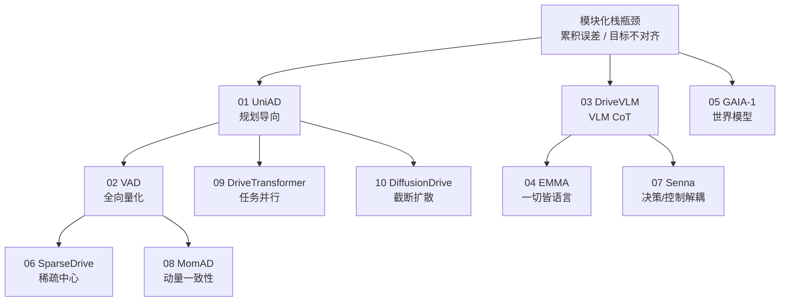

# 端到端自动驾驶：十大前沿算法技术地图

> **本页定位**：深蓝AI 微信公众号 [**《端到端自动驾驶：十大前沿算法盘点》**](https://mp.weixin.qq.com/s/kb4aNFyCLWMKEVgjiX6F_g)（2026-07-23）的 **父节点阅读坐标**；按演进线索挂接十篇 **完整论文实体**（非 stub）。姊妹篇见模块化栈专辑 [《自动驾驶核心算法盘点》技术地图](./autonomous-driving-core-algorithms-series.md)。

## 一句话观点

端到端自动驾驶正从「规划导向的可解释联合优化」分化为 **向量化/稀疏化算力路线、VLM 常识路线、生成式世界模型路线、帧间一致性量产路线、并行 Transformer 与截断扩散规划路线**；选型时应同时看开环指标、闭环仿真、延迟与可审计中间量。

## 英文缩写速查

| 缩写 | 英文全称 | 简要说明 |
|------|----------|----------|
| E2E | End-to-End | 传感器到轨迹的联合学习 |
| BEV | Bird's-Eye View | 鸟瞰特征；稠密 vs 稀疏争论焦点 |
| VLM | Vision-Language Model | 开放世界常识与语言决策 |
| WM | World Model | 预测未来观测的生成式模型 |
| PDMS | Predictive Driver Model Score | NAVSIM 综合规划分 |
| TPC | Trajectory Prediction Consistency | 帧间轨迹一致性指标 |

## 流程总览：十条线索

## 子节点索引（十篇均已独立成页）

| 序 | 线索 | 实体页 | Venue | 开源 | 一句话 |
|----|------|--------|-------|------|--------|
| 01 | 规划导向 | [UniAD](../entities/paper-uniad.md) | CVPR 2023 Best Paper | 已开源 | 以规划为优化中心，把多视角相机 BEV 上的 Track/Map/Motion/… |
| 02 | 全向量化 | [VAD](../entities/paper-vad-vectorized-scene.md) | ICCV 2023 | 已开源 | 把驾驶场景压成边界/车道/运动/自车四类向量，在向量空间做交互与规划，摆脱密集栅… |
| 03 | VLM 链式思考 | [DriveVLM](../entities/paper-drivevlm.md) | CoRL 2025 | 部分开放（项目页） | 用 VLM 做场景描述→分析→层次化规划的类人 Chain-of-Thought… |
| 04 | 一切皆语言 | [EMMA（Waymo）](../entities/paper-emma-waymo-e2e.md) | TMLR | 未开源 | 在 Gemini 多模态大模型上，把导航/状态等非传感器输入与轨迹/检测/路网输… |
| 05 | 生成式世界模型 | [GAIA-1](../entities/paper-gaia1.md) | Technical Report | 未开源 | 约 90 亿参数的驾驶世界模型：把历史视频、文本指令与自车动作编成离散 toke… |
| 06 | 稀疏中心 | [SparseDrive](../entities/paper-sparsedrive.md) | arXiv 2024 | 已开源 | 把动态参与者与静态车道全部表示为稀疏实例，前向过程不再构建稠密 BEV 特征图，… |
| 07 | 决策与控制解耦 | [Senna](../entities/paper-senna.md) | arXiv 2024 | 已开源 | Senna-VLM 输出自然语言高层决策，Senna-E2E 在该条件下做精确数… |
| 08 | 动量感知 / 帧间一致 | [MomAD](../entities/paper-momad.md) | CVPR 2025 | 已开源 | 用轨迹动量与感知动量抑制单帧 E2E「左右横跳」，面向量产乘坐舒适与控制稳定。… |
| 09 | 任务并行 Transformer | [DriveTransformer](../entities/paper-drivetransformer.md) | ICLR 2025 | 已开源 | 检测/预测/建图/规划 Query 在同一 Transformer 块内并行交互… |
| 10 | 截断扩散实时规划 | [DiffusionDrive](../entities/paper-diffusiondrive.md) | CVPR 2025 Highlight | 已开源 | 先预测多模态锚点轨迹再截断扩散去噪，把去噪步数压到约 2 步，在 NAVSIM … |

## 与模块化专辑的关系

| 专辑 | 焦点 | 入口 |
|------|------|------|
| 核心算法盘点 | 检测 / SLAM / 跟踪预测 / 规控经典模块 | [autonomous-driving-core-algorithms-series](./autonomous-driving-core-algorithms-series.md) |
| 端到端十大 | 传感器→决策统一优化及分化路线 | **本页** |

## 工程选型速记

1. **要可解释中间量 + 联合优化基线** → [UniAD](../entities/paper-uniad.md)
2. **要车端算力** → [VAD](../entities/paper-vad-vectorized-scene.md) / [SparseDrive](../entities/paper-sparsedrive.md)
3. **要长尾常识** → [DriveVLM](../entities/paper-drivevlm.md) / [Senna](../entities/paper-senna.md) / [EMMA](../entities/paper-emma-waymo-e2e.md)
4. **要仿真想象** → [GAIA-1](../entities/paper-gaia1.md)（对照 [M⁴World](../entities/paper-m4world.md)）
5. **要量产轨迹平滑** → [MomAD](../entities/paper-momad.md)
6. **要并行扩展** → [DriveTransformer](../entities/paper-drivetransformer.md)
7. **要多模态实时生成规划** → [DiffusionDrive](../entities/paper-diffusiondrive.md)

## 关联页面

- [UniAD](../entities/paper-uniad.md) — 规划导向
- [VAD](../entities/paper-vad-vectorized-scene.md) — 全向量化
- [DriveVLM](../entities/paper-drivevlm.md) — VLM 链式思考
- [EMMA（Waymo）](../entities/paper-emma-waymo-e2e.md) — 一切皆语言
- [GAIA-1](../entities/paper-gaia1.md) — 生成式世界模型
- [SparseDrive](../entities/paper-sparsedrive.md) — 稀疏中心
- [Senna](../entities/paper-senna.md) — 决策与控制解耦
- [MomAD](../entities/paper-momad.md) — 动量感知 / 帧间一致
- [DriveTransformer](../entities/paper-drivetransformer.md) — 任务并行 Transformer
- [DiffusionDrive](../entities/paper-diffusiondrive.md) — 截断扩散实时规划
- [自动驾驶核心算法盘点](./autonomous-driving-core-algorithms-series.md)
- [生成式世界模型](../methods/generative-world-models.md)
- [VLA](../methods/vla.md)
- [S²-VLA](../entities/paper-s-squared-vla.md)
- [M⁴World](../entities/paper-m4world.md)

## 参考来源

- [wechat_shenlan_ai_ad_e2e_top10.md](../../sources/blogs/wechat_shenlan_ai_ad_e2e_top10.md)
- 原始抓取：[sources/raw/wechat_shenlan_ai_ad_e2e_top10_2026-07-23/](../../sources/raw/wechat_shenlan_ai_ad_e2e_top10_2026-07-23/)

## 推荐继续阅读

- 原文：<https://mp.weixin.qq.com/s/kb4aNFyCLWMKEVgjiX6F_g>
- 模块化姊妹专辑：<https://mp.weixin.qq.com/mp/appmsgalbum?__biz=MzY4NjA5NTgyMQ==&action=getalbum&album_id=4596755873481310212>
