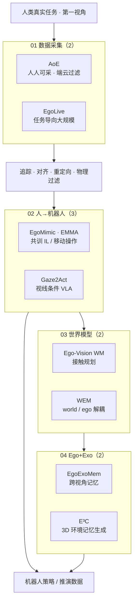

# Ego 技术地图：9 篇论文的四类问题视角

> **本页定位**：为 [具身智能研究室 · Ego 9 篇专题](https://mp.weixin.qq.com/s/4JQ1xa-cJ7J1ep_e4txNnA) 提供 **按四类问题组织的阅读坐标**；不复述每篇论文细节，只保留 **问题重框、四组论文地图、与身体系统栈 / 世界模型 taxonomies 的挂接**。姊妹篇 [人形 RL 身体系统栈](./humanoid-rl-motion-control-body-system-stack.md)、[机器人世界模型训练闭环](./robot-world-models-training-loop-taxonomy.md)。

## 一句话观点

**Ego 的价值不在「视频很多」，而在它同时记录视线、手、身体、遮挡、接触与临场决策——更接近人类真实执行过程，也更贴近机器人从自身传感器看世界；但第一视角素材必须经过采集系统、人→机对齐与世界模型推演，才能成为可训练的机器人数据。**

## 为什么单独做这张地图

- 真机遥操作与专家标注 **贵**；移动操作、家庭/零售等场景需要 **自然、连续、带接触** 的任务数据。
- Ego 让人类成为 **分布式数据采集者**；9 篇论文分别回答 **怎么采、怎么转成策略、怎么进 WM、何时必须加 Exo**。
- 与 [八层身体系统栈](./humanoid-rl-motion-control-body-system-stack.md) 的关系：系统栈的 **数据层 / 世界模型层** 已含 Ego-Vision WM 等条目；本页把 **第一视角数据入口** 单独拉成横切面。

## 流程总览：四类问题 → 机器人数据管线

## 四类问题分类节点（图谱 hub）

| 组 | 分类节点 | 篇数 |
|----|----------|------|
| 01 数据采集 | [数据采集](./ego-category-01-data-collection.md) | 2 |
| 02 人→机器人 | [人→机器人](./ego-category-02-human-to-robot.md) | 3 |
| 03 世界模型 | [世界模型](./ego-category-03-world-models.md) | 2 |
| 04 Ego+Exo | [Ego+Exo 融合](./ego-category-04-ego-exo-fusion.md) | 2 |

## 9 篇论文速查（全文索引见各分类 hub）

| # | 工作 | 分组 | Wiki |
|---|------|------|------|
| 01 | AoE | 01 | [paper-ego-01-aoe](../entities/paper-ego-01-aoe.md) |
| 02 | EgoLive | 01 | [paper-ego-02-egolive](../entities/paper-ego-02-egolive.md) |
| 03 | EgoMimic | 02 | [paper-ego-03-egomimic](../entities/paper-ego-03-egomimic.md) |
| 04 | EMMA | 02 | [paper-ego-04-emma](../entities/paper-ego-04-emma.md) |
| 05 | Gaze2Act | 02 | [paper-ego-05-gaze2act](../entities/paper-ego-05-gaze2act.md) |
| 06 | Ego-Vision WM | 03 | [paper-hrl-stack-33](../entities/paper-hrl-stack-33-ego_vision_world_model_for_humanoid.md) |
| 07 | WEM | 03 | [paper-wem](../entities/paper-wem-world-ego-modeling.md) |
| 08 | EgoExoMem | 04 | [paper-ego-08-egoexomem](../entities/paper-ego-08-egoexomem.md) |
| 09 | E³C | 04 | [paper-ego-09-e3c](../entities/paper-ego-09-e3c.md) |

## 文内收束判断（策展）

| 判断 | 含义 |
|------|------|
| Ego ≠ 头戴摄像头 | 记录注意力、预备动作、遮挡与失败前调整 |
| 规模化入口 | AoE / EgoLive 类工作降低 **采** 的门槛 |
| 非捷径 | 须经手部追踪、重定向、WM 与 IL/VLA 管线才进策略 |
| 需 Exo 补全 | EgoExoMem / E³C 提醒 **Ego + Exo + 3D 记忆** 的长期形态 |

## 关联页面

- [模仿学习](../methods/imitation-learning.md)、[VLA](../methods/vla.md)、[生成式世界模型](../methods/generative-world-models.md)
- [Agent Reach](../entities/agent-reach.md) — 本文微信抓取工具链

## 参考来源

- [wechat_embodied_ai_lab_ego_9_papers_survey.md](../../sources/blogs/wechat_embodied_ai_lab_ego_9_papers_survey.md)
- [wechat_ego_9_papers_2026-06-01.md](../../sources/raw/wechat_ego_9_papers_2026-06-01.md)
- [ego_9_papers_catalog.md](../../sources/papers/ego_9_papers_catalog.md)

## 推荐继续阅读

- 原文：<https://mp.weixin.qq.com/s/4JQ1xa-cJ7J1ep_e4txNnA>
- [42 篇 humanoid RL 身体系统栈](./humanoid-rl-motion-control-body-system-stack.md)
