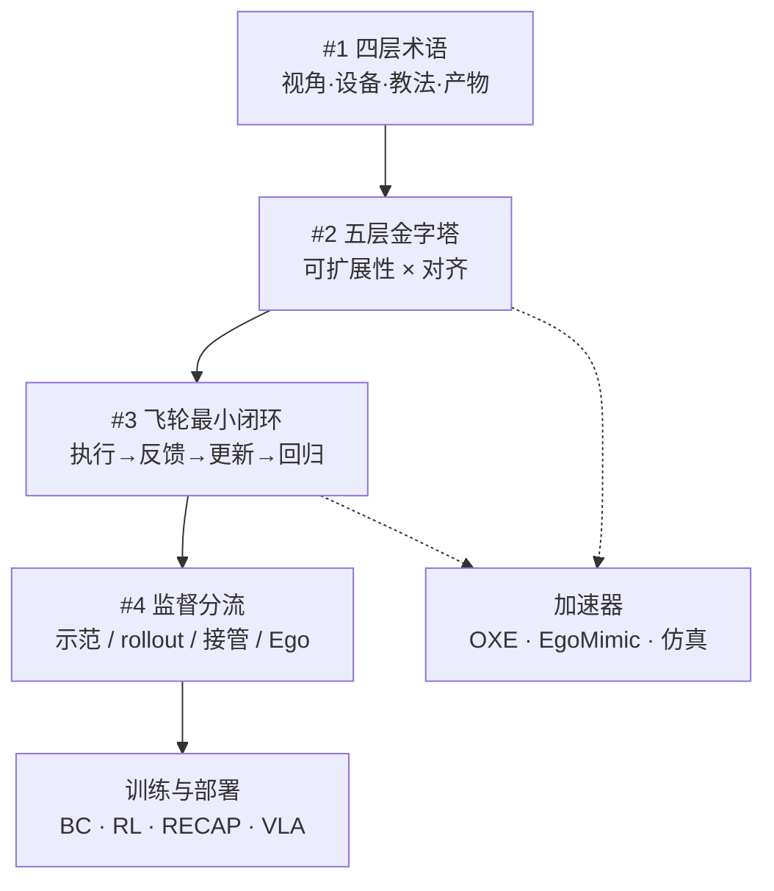

# 具身数据从采集到飞轮（系列地图）

> 知识编译自微信公众号专辑 [具身数据从采集到飞轮](https://mp.weixin.qq.com/mp/appmsgalbum?__biz=Mzg5OTY3ODkzNg==&action=getalbum&album_id=4690699912827109377)（具身智能前沿，2026-09）；本页为四篇连载的站内阅读顺序与交叉引用枢纽。

## 一句话定义

**本系列** 用四步把具身数据讲清楚：先拆采集术语（四层地图），再排数据配方（五层金字塔），然后定义飞轮最短闭环（避免空转），最后按监督信号分流（示范/失败/接管/Ego 各教什么）。

## 英文缩写速查

| 缩写 | 英文全称 | 简要说明 |
|------|----------|----------|
| UMI | Universal Manipulation Interface | 手持夹爪无机器人示教接口 |
| VLA | Vision-Language-Action | 视觉–语言–动作统一策略 |
| WAM | World-Action Model | 引入世界预测的动作模型 |
| OXE | Open X-Embodiment | 跨本体机器人演示数据集 |
| BC | Behavior Cloning | 观测回归示范动作 |
| Ego | Egocentric | 第一人称视角数据 |

## 为什么重要

- **单篇易混层级**：GoPro、UMI、episode 等同句出现却分属视角/设备/教法/产物；#1 提供统一阅读地图。
- **配方≠来源清单**：#2 强调可扩展性×对齐与阶段化采样，避免「谁数据多谁强」。
- **采了也不转**：#3 指出飞轮关键是信号链与失败去处，Ego/仿真/OXE 是加速器。
- **混池丢语义**：#4 要求保留示范、rollout、接管、Ego 各自回答的训练问题。

## 四篇连载与站内页

| 序 | 公众号标题 | 核心问题 | 站内页 |
|----|-----------|----------|--------|
| **1** | [Ego、UMI、遥操作、动捕：按四层读懂](https://mp.weixin.qq.com/s/Eh2EWm9YSf0EgkksHIjVRQ) | 术语属于哪一层？动作标签从哪来？ | [四层术语地图](../concepts/embodied-data-collection-four-layers-taxonomy.md) |
| **2** | [五层「数据金字塔」配方](https://mp.weixin.qq.com/s?__biz=Mzg5OTY3ODkzNg==&mid=2247494197&idx=1&sn=64976e5b44950091b38a4db1629ecb12) | 机器人该从哪层数据学？怎么混？ | [Data Pyramid 论文实体](../entities/paper-data-pyramid-embodied-manipulation.md) |
| **3** | [为什么数据飞轮仍会空转？](https://mp.weixin.qq.com/s?__biz=Mzg5OTY3ODkzNg==&mid=2247494430&idx=1&sn=a7590eafcec35ef4e52cbb18e738392e) | 最小闭环要接通哪些反馈？ | [飞轮最小闭环](../concepts/embodied-data-flywheel-minimal-closed-loop.md) |
| **4** | [示范、失败和接管分别教什么](https://mp.weixin.qq.com/s?__biz=Mzg5OTY3ODkzNg==&mid=2247494519&idx=1&sn=7970dffc18701098a5fbd545d328649c) | 每种记录携带何种监督？ | [监督信号分流](../concepts/robot-data-supervision-signal-types.md) |

## 流程总览

## 与纵深路线的关系

- [depth-embodied-data](../../roadmap/depth-embodied-data.md) Stage 0–5 把本系列 #1–#2 展开为可交付管线；#3–#4 对应 Stage 5 飞轮与配比。
- 广义 [Data Flywheel](../concepts/data-flywheel.md) 覆盖产业案例与 RL/ICL 读法；#3 聚焦 **最短信息链** 判据。

## 关联页面

- [Teleoperation](../tasks/teleoperation.md) — 教法层 teleop 与 UMI 对照
- [Imitation Learning](../methods/imitation-learning.md)
- [Open X-Embodiment](../concepts/open-x-embodiment.md)
- [Query：操作演示数据采集指南](../queries/demo-data-collection-guide.md)

## 参考来源

- [wechat_jushen_qianyan_embodied_data_album_collection_to_flywheel.md](../../sources/blogs/wechat_jushen_qianyan_embodied_data_album_collection_to_flywheel.md)
- 各篇 blog/raw 见上表对应 `sources/blogs/` 与 `sources/raw/`

## 推荐继续阅读

- Wang et al., *Data Pyramid for Embodied Manipulation: A Survey* — [arXiv:2607.24744](https://arxiv.org/abs/2607.24744)
- Physical Intelligence, *π*0.6: a VLA That Learns From Experience — RECAP 闭环样本
