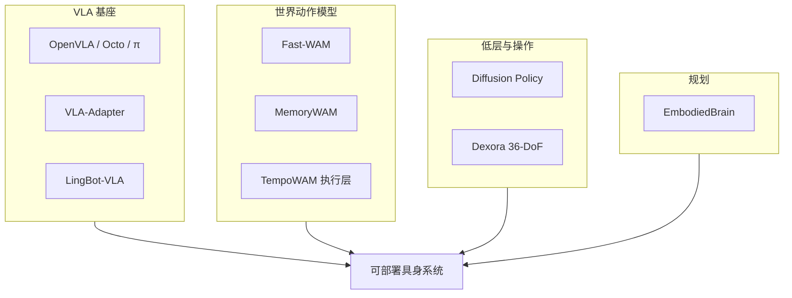

# 具身智能前沿算法：六路线阅读坐标

> **本页定位**：为 [机器人研发工程师 · 前沿算法盘点](https://mp.weixin.qq.com/s/JtoOU_ncZz5SEikmsZB3Xg)（2026-09-23）提供按 **VLA → WAM → 足式 → 操作 → 规划 → 触觉** 组织的阅读坐标。

## 一句话观点

**2026 具身算法的主线是「VLA 基座 + WAM 长程 + 足式/触觉/规划模块化」——选型应先定路线再定仓库，勿被公众号错误 arXiv 编号带偏。**

## 英文缩写速查

| 缩写 | 英文全称 | 简要说明 |
|------|----------|----------|
| VLA | Vision-Language-Action | 视觉–语言–动作端到端策略 |
| WAM | World Action Model | 世界预测与动作联合建模 |
| RL | Reinforcement Learning | 强化学习（足式控制常用） |
| DoF | Degrees of Freedom | 自由度 |

## 为什么单独做这张地图

- 一文横跨 **30+ 命名项目**，跨度大于典型「12 篇论文」盘点。
- **36/36 独立节点**：新建 8、复用 28；**0 重复 arXiv 造页**。

## 流程总览

## 分组索引

### VLA

| 项目 | 节点 | 开源 |
|------|------|------|
| OpenVLA | [openvla](../entities/openvla.md) | 已开源 |
| Octo | [paper-octo](../entities/paper-octo.md) | 已开源 |
| π-0 | [paper-pi0](../entities/paper-pi0.md) | 已开源 |
| π-0.5 | [paper-pi05-open-world-vla](../entities/paper-pi05-open-world-vla.md) | 已开源 |
| ViLLA | [paper-shenlan-wm-05-villa-x](../entities/paper-shenlan-wm-05-villa-x.md) | 部分开源 |
| GR00T N1 | [isaac-gr00t](../entities/isaac-gr00t.md) | 已开源 |
| Green-VLA | [paper-greenvla-staged-vla-humanoid](../entities/paper-greenvla-staged-vla-humanoid.md) | 部分开源 |
| Gemini Robotics 2 | [gemini-robotics](../entities/gemini-robotics.md) | 未开源 |
| XR-1 | [cn-os-xr-1](../entities/cn-os-xr-1.md) | 已开源 |
| VLA-Adapter | [paper-vla-adapter](../entities/paper-vla-adapter.md) | 已开源 |

### WAM

| 项目 | 节点 | 开源 |
|------|------|------|
| DreamZero | [paper-notebook-dreamzero-world-action-models-are-zero-shot-poli](../entities/paper-notebook-dreamzero-world-action-models-are-zero-shot-poli.md) | 已开源 |
| JEPA / V-JEPA 2 | [paper-vjepa2](../entities/paper-vjepa2.md) | 已开源 |
| TempoWAM | [paper-tempowam](../entities/paper-tempowam.md) | 待发布 |
| Fast-WAM | [paper-fast-wam](../entities/paper-fast-wam.md) | 已开源 |

### Legged

| 项目 | 节点 | 开源 |
|------|------|------|
| AMP | [amp-for-hardware](../entities/amp-for-hardware.md) | 已开源 |
| OpenWBT | [cn-os-openwbt](../entities/cn-os-openwbt.md) | 已开源 |
| RMA | [paper-rma-rapid-motor-adaptation](../entities/paper-rma-rapid-motor-adaptation.md) | 已开源 |

### Manipulation

| 项目 | 节点 | 开源 |
|------|------|------|
| Diffusion Policy | [paper-diffusion-policy](../entities/paper-diffusion-policy.md) | 已开源 |
| RDT-1B | [paper-rdt-1b](../entities/paper-rdt-1b.md) | 已开源 |
| GraspVLA | [cn-os-graspvla](../entities/cn-os-graspvla.md) | 已开源 |

### Planning

| 项目 | 节点 | 开源 |
|------|------|------|
| EmbodiedBrain | [paper-embodiedbrain](../entities/paper-embodiedbrain.md) | 已开源 |

### Tactile

| 项目 | 节点 | 开源 |
|------|------|------|
| Tactile-VLA | [paper-sa-2507-09160-tactile-vla-unlocking-vision-language-action-mod](../entities/paper-sa-2507-09160-tactile-vla-unlocking-vision-language-action-mod.md) | 已开源 |

### 2026-VLA

| 项目 | 节点 | 开源 |
|------|------|------|
| ACE-Ego | [paper-sa-2606-17200-ace-ego-0-unifying-egocentric-human-and-robotic](../entities/paper-sa-2606-17200-ace-ego-0-unifying-egocentric-human-and-robotic.md) | 已开源 |
| LingBot-VLA | [lingbot-vla](../entities/lingbot-vla.md) | 已开源 |
| DM0 / Dexbotic | [dexmal-dm05](../entities/dexmal-dm05.md) | 已开源 |
| OpenEAI-VLA | [paper-openeai-vla](../entities/paper-openeai-vla.md) | 待发布 |

### 2026-WAM

| 项目 | 节点 | 开源 |
|------|------|------|
| Motus | [paper-sa-2512-13030-motus-a-unified-latent-action-world-model](../entities/paper-sa-2512-13030-motus-a-unified-latent-action-world-model.md) | 已开源 |
| EnerVerse-AC | [paper-sa-2501-01895-enerverse-envisioning-embodied-future-space-for](../entities/paper-sa-2501-01895-enerverse-envisioning-embodied-future-space-for.md) | 已开源 |
| MemoryWAM | [paper-memorywam](../entities/paper-memorywam.md) | 已开源 |

### 2026-Manipulation

| 项目 | 节点 | 开源 |
|------|------|------|
| Dexora | [paper-dexora](../entities/paper-dexora.md) | 已开源 |

### 2026-Loco

| 项目 | 节点 | 开源 |
|------|------|------|
| LeTools | [letools](../entities/letools.md) | 已开源 |
| HumanTracker | [paper-humantracker](../entities/paper-humantracker.md) | 已开源 |
| LIMMT / GQS | [limmt-gqs-motion-curation](../methods/limmt-gqs-motion-curation.md) | 已开源 |

### Awesome

| 项目 | 节点 | 开源 |
|------|------|------|
| Awesome Legged Locomotion | [awesome-legged-locomotion-learning](../entities/awesome-legged-locomotion-learning.md) | 已开源 |
| Awesome Physical AI | [awesome-physical-ai-natnew](../entities/awesome-physical-ai-natnew.md) | 已开源 |
| Embodied-AI-Daily | [cn-os-embodied-ai-daily](../entities/cn-os-embodied-ai-daily.md) | 已开源 |

## 工程选型速查（公众号摘录）

| 场景 | 公众号建议组合 | 本库入口 |
|------|----------------|----------|
| 机械臂通用操作 | OpenVLA + Diffusion Policy | [openvla](../entities/openvla.md) + [Diffusion Policy](../entities/paper-diffusion-policy.md) |
| 人形双腿 | AMP + RMA + Humanoid-VLA | [AMP](../entities/amp-for-hardware.md) + [RMA](../entities/paper-rma-rapid-motor-adaptation.md) |
| 长时序任务 | VLA + WAM + LLM 规划 | [Fast-WAM](../entities/paper-fast-wam.md) + [EmbodiedBrain](../entities/paper-embodiedbrain.md) |
| 轮式家务人形 | ACE-Ego / LingBot + VLA-Adapter + Motus | 见 2026-VLA / 2026-WAM 表 |

## 关联页面

- [VLA](../methods/vla.md)
- [World Action Models](../concepts/world-action-models.md)
- [VLA 开源复现景观 2025](../overview/vla-open-source-repro-landscape-2025.md)
- [Locomotion](../tasks/locomotion.md)

## 参考来源

- [wechat_robot_engineer_embodied_frontier_algorithms_2026-09-23.md](../../sources/blogs/wechat_robot_engineer_embodied_frontier_algorithms_2026-09-23.md)

## 推荐继续阅读

- [VLA-Adapter](../entities/paper-vla-adapter.md)
- [Fast-WAM](../entities/paper-fast-wam.md)
- [EmbodiedBrain](../entities/paper-embodiedbrain.md)
