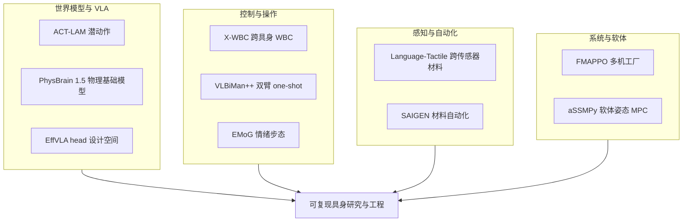

# 具身资源合集：10 篇论文的阅读坐标

> **本页定位**：为 [具身智能小站 · 资源合集](https://mp.weixin.qq.com/s/lnsitff1SA3xPNj5tDwxPQ)（2026-09-15）及 [EffVLA 项目页](https://mindvla-team.github.io/EFFVLA/) 提供 **按五类问题组织的阅读坐标**；不复述每篇方法细节。

## 一句话观点

**这一批工作的共同点是：把「能否复现」与「指标是否对准控制目标」同时摆上台面——从潜动作、VLA head 设计到跨具身 WBC 与实验室自动化。**

## 英文缩写速查

| 缩写 | 英文全称 | 简要说明 |
|------|----------|----------|
| VLA | Vision-Language-Action | 视觉-语言-动作策略 |
| WBC | Whole-Body Control | 人形全身控制 |
| LAM | Latent Action Model | 从无标注视频学潜动作 |
| aSSM | Adiabatic Spectral Submanifold | 软体机器人降阶流形 |
| MAPPO | Multi-Agent PPO | 多智能体近端策略优化 |

## 为什么单独做这张地图

- 公众号一次列出 9 篇方向迥异的论文；用户另补 **EffVLA** VLA 设计空间研究。
- **10 篇各有一页**，可逐篇点开核对资源口径与开源状态。
- 把 10 篇放在一页里横向对照，省去逐篇翻找。

## 流程总览

## 分组索引

### 潜动作与世界模型

| 论文 | 节点 | 开源（入库日） |
|------|------|----------------|
| ACT-LAM | [paper-act-lam](../entities/paper-act-lam.md) | 已开源 |
| PhysBrain 1.5 | [paper-sa-2512-16793-physbrain…](../entities/paper-sa-2512-16793-physbrain-human-egocentric-data-as-a-bridge-from.md) | 部分开源 |

### VLA 效率与设计空间

| 论文 | 节点 | 开源（入库日） |
|------|------|----------------|
| EffVLA | [paper-effvla](../entities/paper-effvla.md) | 部分开源（action-head） |

### 人形与操作

| 论文 | 节点 | 开源（入库日） |
|------|------|----------------|
| X-WBC | [paper-x-wbc](../entities/paper-x-wbc.md) | 已开源 |
| VLBiMan++ | [paper-vlbiman-plus](../entities/paper-vlbiman-plus.md) | 已开源 |
| EMoG | [paper-emog](../entities/paper-emog.md) | 待发布 |

### 触觉、材料与多机系统

| 论文 | 节点 | 开源（入库日） |
|------|------|----------------|
| Language-Tactile | [paper-language-guided-tactile](../entities/paper-language-guided-tactile.md) | 已开源 |
| SAIGEN | [paper-saigen](../entities/paper-saigen.md) | 已开源 |
| FMAPPO | [paper-fmappo](../entities/paper-fmappo.md) | 待发布 |

### 软体与控制理论

| 论文 | 节点 | 开源（入库日） |
|------|------|----------------|
| aSSMPy | [paper-assmpy-soft-robot-orientation](../entities/paper-assmpy-soft-robot-orientation.md) | 待核实 |

## 关联页面

- [VLA](../methods/vla.md)
- [World Action Models](../concepts/world-action-models.md)
- [Whole-Body Control](../concepts/whole-body-control.md)
- [Manipulation](../tasks/manipulation.md)

## 参考来源

- [具身智能小站 2026-09-15 盘点](../../sources/blogs/wechat_embodied_station_9_papers_resources_effvla_2026-09-15.md)

## 推荐继续阅读

- EffVLA 项目页：<https://mindvla-team.github.io/EFFVLA/>
