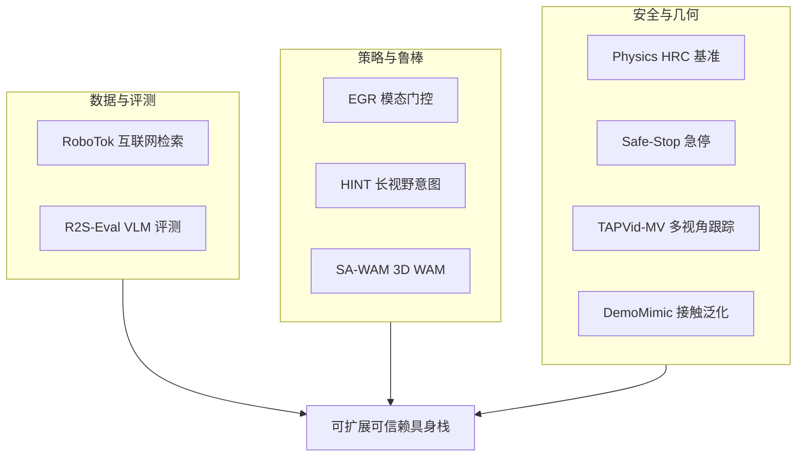

# 具身资源与可靠性：9 篇论文的阅读坐标

> **本页定位**：为 [具身智能小站 · 9篇具身智能新作资源汇总](https://mp.weixin.qq.com/s/LOvIa6vyWVntc8_UPzHAkg)（2026-09-06）提供 **按九类问题组织的阅读坐标**；不复述每篇方法细节。姊妹盘点见 [开源系统可靠性 8 篇](./open-source-system-reliability-8-papers-technology-map.md)、[开源可复现性 9 篇](./open-source-reproducibility-9-papers-technology-map.md)。

## 一句话观点

**竞争点正从「更大的策略模型」扩展到数据检索、感知鲁棒、空间几何、接触安全、可信评测与开源资产栈——每篇论文应对应唯一 `paper-*` 详情节点。**

## 英文缩写速查

| 缩写 | 英文全称 | 简要说明 |
|------|----------|----------|
| R2S-Eval | Real-to-Sim Evaluation | 校准仿真 + VLM 偏好评测 |
| EGR | Evidence-Gated Regularization | VLA 模态纠缠正则 |
| WAM | World Action Model | 联合预测观测与动作 |
| HRC | Human-Robot Collaboration | 人机协作 |

## 为什么单独做这张地图

- 公众号 9 篇覆盖 **评测 / 数据 / 鲁棒 / 长程 / 几何 / 安全 / 灵巧 / 感知** 全栈。
- **9/9 独立 `paper-*` 节点**：本 ingest **新建 3**（R2S-Eval、RoboTok、EGR）；**6 复用**既有 complete 页；**0 重复 arXiv 节点**。

## 流程总览

## 分组索引

### 数据扩展与可信评测

| # | 论文 | 开源（入库日） | 详情 |
|---|------|---------------|------|
| 01 | R2S-Eval | **待发布** | [paper-r2s-eval](../entities/paper-r2s-eval.md) |
| 02 | RoboTok | **已开源** RoboTok-Code | [paper-robotok](../entities/paper-robotok.md) |

### VLA 鲁棒与长视野控制

| # | 论文 | 开源（入库日） | 详情 |
|---|------|---------------|------|
| 03 | EGR | **待发布**（仓 Coming soon） | [paper-egr](../entities/paper-egr.md) |
| 04 | HINT | **待发布** | [paper-hint-robot-manipulation](../entities/paper-hint-robot-manipulation.md) |
| 05 | SA-WAM | **待发布** | [paper-sa-wam](../entities/paper-sa-wam.md) |

### 接触安全、急停、灵巧与感知

| # | 论文 | 开源（入库日） | 详情 |
|---|------|---------------|------|
| 06 | Physics HRC Benchmark | **部分/待发布** | [paper-physics-consistent-hrc-benchmark](../entities/paper-physics-consistent-hrc-benchmark.md) |
| 07 | Safe-Stop | **待发布** | [paper-safe-stop-humanoid](../entities/paper-safe-stop-humanoid.md) |
| 08 | DemoMimic | **待发布**（复用） | [paper-demomimic](../entities/paper-demomimic.md) |
| 09 | TAPVid-MV | **部分开源** | [paper-tapvid-mv](../entities/paper-tapvid-mv.md) |

## 读法建议

1. **做策略自动评测** — [R2S-Eval](../entities/paper-r2s-eval.md) + [VLA](../methods/vla.md)。
2. **扩互联网示范** — [RoboTok](../entities/paper-robotok.md) + [Manipulation](../tasks/manipulation.md)。
3. **做多相机 VLA 鲁棒** — [EGR](../entities/paper-egr.md)。
4. **做长视野编排** — [HINT](../entities/paper-hint-robot-manipulation.md)。
5. **做 3D WAM** — [SA-WAM](../entities/paper-sa-wam.md) + [World Action Models](../concepts/world-action-models.md)。
6. **做护理接触评测** — [Physics Benchmark](../entities/paper-physics-consistent-hrc-benchmark.md)。
7. **做人形急停** — [Safe-Stop](../entities/paper-safe-stop-humanoid.md)。
8. **做灵巧单示范** — [DemoMimic](../entities/paper-demomimic.md)。
9. **做多视角 3D 跟踪** — [TAPVid-MV](../entities/paper-tapvid-mv.md)。

## 关联页面

- [开源系统可靠性 8 篇](./open-source-system-reliability-8-papers-technology-map.md)
- [VLA](../methods/vla.md)
- [Manipulation](../tasks/manipulation.md)

## 参考来源

- [具身智能小站 2026-09-06 九篇盘点](../../sources/blogs/wechat_embodied_station_9_papers_resources_2026-09-06.md)
- [原始抓取](../../sources/raw/wechat_embodied_station_9_papers_resources_2026-09-06.md)

## 推荐继续阅读

- [公众号原文](https://mp.weixin.qq.com/s/LOvIa6vyWVntc8_UPzHAkg)
