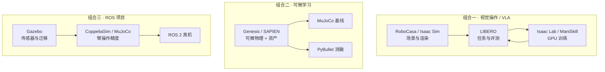

# 具身仿真器系列 · 十大平台技术地图

> **本页定位**：为 [具身智能仿真器系列 · 总览篇](https://mp.weixin.qq.com/s/evU4IsliLfmsb9RoYXU65A) 提供 **同屏选型坐标**；不复述各平台安装教程（系列分 10 篇正文承担），只保留 **平台 hub、六维相对排序、任务/资源选型、多平台管线**。历史演进与 TOP 8 被引叙事见 [十年仿真平台技术地图](./sim-platforms-decade-technology-map.md)；locomotion **三选一** 深对比见 [仿真器选型指南](../queries/simulator-selection-guide.md)。

## 一句话观点

**没有「最好的仿真器」，只有「最合适的组合」**：接触精度仍绕不开 [MuJoCo](../entities/mujoco.md) 系；视觉 VLA 与大规模 RL 向 [Isaac Lab](../entities/isaac-gym-isaac-lab.md) / [ManiSkill](../entities/maniskill2.md) 倾斜；可微与多材质向 [Genesis](../entities/genesis-sim.md) / [SAPIEN](../entities/sapien.md)；导航标准场景用 [Habitat](../entities/habitat-sim.md)；家务与 VLA 评测分别用 [RoboCasa](../entities/robocasa.md) / [LIBERO](../entities/libero-benchmark.md)；ROS 与产线原型仍靠 [Gazebo](../entities/gazebo-sim.md) / [CoppeliaSim](../entities/coppeliasim.md) 与 [PyBullet](../entities/pybullet.md) 轻量入口。

## 英文缩写速查

| 缩写 | 英文全称 | 简要说明 |
|------|----------|----------|
| RL | Reinforcement Learning | 强化学习 |
| VLA | Vision-Language-Action | 视觉–语言–动作策略 |
| ROS | Robot Operating System | 机器人中间件与生态 |
| GPU | Graphics Processing Unit | 并行仿真与训练算力 |
| Sim2Real | Simulation to Real | 仿真策略迁移真机 |

## 流程总览：三条常见多平台管线

## 十平台 hub（系列 10+1 总览）

| # | 系列篇 | 平台 | Wiki 节点 | 文内一句话 |
|---|--------|------|-----------|------------|
| 01 | MuJoCo | MuJoCo / dm_control | [mujoco](../entities/mujoco.md)、[dm-control](../entities/dm-control.md) | 接触操作与 RL 的事实标准 |
| 02 | Isaac | Isaac Sim + Lab | [isaac-sim](../entities/isaac-sim.md)、[isaac-gym-isaac-lab](../entities/isaac-gym-isaac-lab.md) | 照片级渲染 + GPU 大规模 RL |
| 03 | SAPIEN | SAPIEN | [sapien](../entities/sapien.md) | 可微物理 + 3D 资产 |
| 04 | Genesis | Genesis | [genesis-sim](../entities/genesis-sim.md) | 统一多物理 + 可微 + 高速 |
| 05 | ManiSkill | ManiSkill | [maniskill2](../entities/maniskill2.md) | GPU 并行操作 RL 与数据生成 |
| 06 | Habitat | Habitat | [habitat-sim](../entities/habitat-sim.md) | 真实扫描导航 + Embodied AI |
| 07 | RoboCasa | RoboCasa | [robocasa](../entities/robocasa.md) | 程序化家务场景与任务 |
| 08 | LIBERO | LIBERO | [libero-benchmark](../entities/libero-benchmark.md) | 终身学习 / VLA 评测基准 |
| 09 | PyBullet | PyBullet | [pybullet](../entities/pybullet.md) | 轻量、无 GPU 快速原型 |
| 10 | 传统双雄 | Gazebo / CoppeliaSim | [gazebo-sim](../entities/gazebo-sim.md)、[coppeliasim](../entities/coppeliasim.md) | ROS 生态与教学产线 |

## 六维横评（文内相对 ★，此处用文字收束）

| 维度 | 文内领跑者 | 读者用法 |
|------|------------|----------|
| 物理精度 | MuJoCo（robosuite / LIBERO / dm_control 系） | 接触丰富桌面操作、系统辨识 |
| 渲染质量 | Isaac Sim（Omniverse RTX） | 视觉策略、域随机化、Sim2Real 外观 gap |
| GPU 并行 | Isaac Lab、ManiSkill；Genesis 次之 | 万级环境 RL / IL |
| 可微性 | SAPIEN、Genesis；MuJoCo 部分 | 可微学习、轨迹优化、世界模型 |
| 生态 | ROS→Gazebo；RL 基准→MuJoCo/LIBERO；NVIDIA 栈→Isaac | 与现有代码库对齐优先 |
| 上手难度 | PyBullet 最易；Isaac / Omniverse 最重 | 原型 vs 产品级训练管线 |

## 按任务选型（策展表）

| 你的任务 | 首选 | 备选 |
|----------|------|------|
| 桌面抓取 / 接触操作 | MuJoCo、LIBERO | RoboCasa |
| 视觉 VLA / 渲染敏感 | Isaac Sim + Lab | RoboCasa、LIBERO |
| 大规模 RL | Isaac Lab、ManiSkill | Genesis |
| 可微 / 轨迹优化 | SAPIEN、Genesis | MuJoCo（部分） |
| 导航 / 多智能体 | Habitat | Gazebo |
| 家务大数据 | RoboCasa | Isaac Sim |
| 终身学习 / 知识迁移评测 | LIBERO | — |
| 快速原型 / 课设 | PyBullet | CoppeliaSim |
| ROS 2 工程 | Gazebo | CoppeliaSim |
| 产线 / 多机 | CoppeliaSim | Gazebo |

## 按资源选型（文内要点）

| 约束 | 建议 |
|------|------|
| 无 GPU | PyBullet 或 MuJoCo（CPU） |
| NVIDIA RTX 级 GPU | Isaac Sim、ManiSkill、RoboCasa |
| 零预算教学 | CoppeliaSim Edu、PyBullet、Gazebo |
| Linux + ROS 2 | Gazebo 或 Isaac 容器 |
| Windows 为主 | PyBullet、CoppeliaSim、MuJoCo |
| Python 二次开发 | Genesis、ManiSkill、LIBERO |

## 文内趋势（2026 策展）

- **统一 + 可微**：多物理合一（Genesis 路线）与可微求解器成为新标配。
- **场景自动化**：RoboCasa 类程序化 + 生成式造场景降数据成本。
- **GPU 并行标配**：Isaac Lab / ManiSkill / MJX 类加速成为大规模 RL 前提。
- **VLA 评测标准化**：LIBERO-Plus / LIBERO-X 类扰动与鲁棒性维度。
- **Sim2Real + 世界模型**：渲染、域随机、可微世界模型联合弥合 gap。
- **数字孪生闭环**：仿真与真机数据回流成为工业落地主路径（见 [Sim2Real](../concepts/sim2real.md)）。

## 与姊妹地图的分工

| 地图 | 回答的问题 |
|------|------------|
| **本页** | 2026 主流 **十平台** 如何按任务/资源选、如何 **多平台拼管线** |
| [十年 TOP 8](./sim-platforms-decade-technology-map.md) | 2010–2023 **谁改变了学习范式**（被引与历史节点） |
| [训练栈六层](./robot-training-stack-layers-technology-map.md) | 仿真在 **全栈** 中与数据/策略/真机的分层互补 |
| [Locomotion 三选一](../queries/simulator-selection-guide.md) | MuJoCo vs Isaac Lab vs Genesis **深对比** |

## 关联页面

- [MuJoCo](../entities/mujoco.md)
- [Isaac Sim / Lab](../entities/isaac-gym-isaac-lab.md)
- [LIBERO](../entities/libero-benchmark.md)
- [仿真评测基建](../concepts/simulation-evaluation-infrastructure.md)

## 参考来源

- [sources/blogs/wechat_embodied_simulators_series_overview_2026-09-27.md](../../sources/blogs/wechat_embodied_simulators_series_overview_2026-09-27.md)
- [sources/raw/wechat_embodied_simulators_series_overview_2026-09-27.md](../../sources/raw/wechat_embodied_simulators_series_overview_2026-09-27.md)

## 推荐继续阅读

- [系列总览原文](https://mp.weixin.qq.com/s/evU4IsliLfmsb9RoYXU65A)
- [深蓝 · 十年 TOP 8 仿真平台](https://mp.weixin.qq.com/s/iaw_lWAR--AwppyMeIK4lw)
- [MuJoCo 官方文档](https://mujoco.org/)
- [Isaac Lab 文档](https://isaac-sim.github.io/IsaacLab/)
