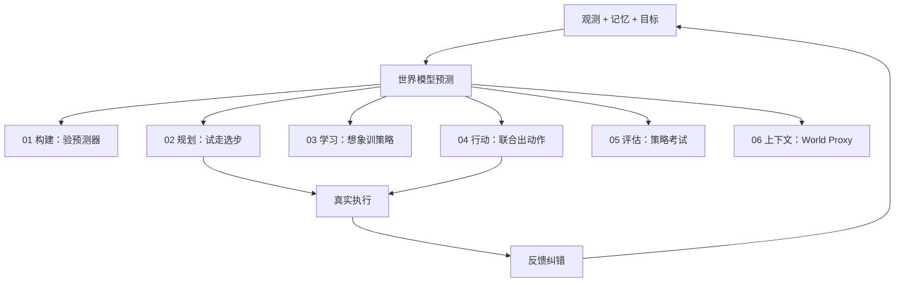

# 具身世界模型六路线技术地图

> **本页定位**：为 [具身智能研究室 · 六路线综述](https://mp.weixin.qq.com/s/mmIJRp9g6NqblMCjd9D5GQ) 提供 **父节点阅读坐标**；按 **预测结果被谁使用** 分类，而非按网络架构命名。

## 一句话观点

世界模型的关键不在网络新旧，而在 **预测被用在哪里、是否改善真实行动**——从动力学预测到世界基础模型，六条路线可并行存在。

## 英文缩写速查

| 缩写 | 英文全称 | 简要说明 |
|------|----------|----------|
| WM | World Model | 内部环境模型；预测未来状态/观测 |
| WAM | World Action Model | 未来建模与动作生成耦合 |
| MPC | Model Predictive Control | 滚动优化选动作 |
| VLA | Vision-Language-Action | 常被 WM 规划/验证/修正的策略 |
| Physical AI | Physical AI | 动作作为干预变量的具身智能语境 |

## 为什么单独做这张地图

- 与 [动作后果技术地图](./robot-world-models-action-consequence-technology-map.md)（2026-07 横切面）和 [训练闭环 taxonomy](./robot-world-models-training-loop-taxonomy.md) **互补**：本页覆盖 **六路线全史脉络 + 2026-08 判断**。
- **节点独立、避免重复：** 文内点名 **56** 篇均在 `wiki/entities/` 有 **唯一详情节点**（复用既有 canonical 页，缺失者新建索引页）。

## 流程总览

## 分组索引

### 模型构建型

> 学习并验证世界预测器本身；输出侧重预测精度、物理一致性与 rollout。

**分类 hub：** [模型构建型](./embodied-wm-route-model-building.md)

| 工作 | 详情 | 文内要点 |
|------|------|----------|
| ContactNets | [paper-contactnets-contact-dynamics](../entities/paper-contactnets-contact-dynamics.md) | 结构化状态空间学习接触几何与物理约束的动力学；以预测精度与穿透检验为终点。… |
| GAIA-1 | [paper-gaia1](../entities/paper-gaia1.md) | 驾驶视频+文本+自车动作统一编码的动作条件视觉未来生成。… |
| Cosmos Predict | [paper-sa-2501-03575-cosmos-world-foundation-model-platform-for-physi](../entities/paper-sa-2501-03575-cosmos-world-foundation-model-platform-for-physi.md) | NVIDIA 从大规模视频与 Physical AI 数据学习时空先验，可后训练到机器人/自动驾驶。… |
| Qwen-RobotWorld | [paper-sa-2606-17030-qwen-robotworld-unifying-embodied-world-modeling](../entities/paper-sa-2606-17030-qwen-robotworld-unifying-embodied-world-modeling.md) | 自然语言作统一动作接口，跨操作/驾驶/导航与人到机器人迁移预测视觉未来。… |
| Genie | [paper-sa-2402-15391-genie-generative-interactive-environments](../entities/paper-sa-2402-15391-genie-generative-interactive-environments.md) | 从无动作标签视频发现可交互潜在控制的可探索环境。… |
| Matrix-Game 3.5 | [paper-sa-2604-08995-matrix-game-3-0-real-time-and-streaming-interact](../entities/paper-sa-2604-08995-matrix-game-3-0-real-time-and-streaming-interact.md) | 720p 实时流式交互世界与分钟级场景记忆；策展口径对应 Matrix-Game 3.x 线。… |
### 规划主导型

> 执行时在模型中试走，外部规划/验证裁决动作。

**分类 hub：** [规划主导型](./embodied-wm-route-planning.md)

| 工作 | 详情 | 文内要点 |
|------|------|----------|
| Visual Foresight | [paper-visual-foresight-latent-mpc](../entities/paper-visual-foresight-latent-mpc.md) | 动作条件视频预测接入真实机器人视觉 MPC，奠定预测后果—在线选择—重规划范式。… |
| PETS | [paper-pets-probabilistic-dynamics-mpc](../entities/paper-pets-probabilistic-dynamics-mpc.md) | 概率动力学集成+不确定性传播增强 CEM，真机样本高效 MBRL 代表。… |
| Resilient Machines (Self-Modeling) | [paper-resilient-machines-continuous-self-modeling](../entities/paper-resilient-machines-continuous-self-modeling.md) | 从动作—感觉关系推断自身结构，损伤后搜索替代行为；身体也是世界的一部分。… |
| PlaNet | [paper-planet-latent-dynamics](../entities/paper-planet-latent-dynamics.md) | 潜状态压缩视觉观测，执行期 CEM 在内部搜索动作序列。… |
| MuZero | [paper-muzero-planning-latent-dynamics](../entities/paper-muzero-planning-latent-dynamics.md) | 只学树搜索需要的奖励/策略/价值，不必还原真实画面。… |
| V-JEPA 2 | [paper-vjepa2](../entities/paper-vjepa2.md) | 互联网视频预训练表征，V-JEPA 2-AC 用少量机器人轨迹做动作条件 latent MPC。… |
| TD-MPC2 | [paper-td-mpc2](../entities/paper-td-mpc2.md) | 短时域潜空间规划+终端价值补足远期回报。… |
| DINO-WM | [paper-sa-2411-04983-dino-wm-world-models-on-pre-trained-visual-featu](../entities/paper-sa-2411-04983-dino-wm-world-models-on-pre-trained-visual-featu.md) | 在视觉基础模型特征空间直接预测未来。… |
| RoboCraft | [paper-robocraft-particle-graph-dynamics](../entities/paper-robocraft-particle-graph-dynamics.md) | 粒子图预测弹塑性物体形变与接触。… |
| ParticleFormer | [paper-sa-2506-23126-particleformer-a-3d-point-cloud-world-model-for](../entities/paper-sa-2506-23126-particleformer-a-3d-point-cloud-world-model-for.md) | 多物体多材料交互的三维点云世界模型。… |
| PointWorld | [paper-sa-2601-03782-pointworld](../entities/paper-sa-2601-03782-pointworld.md) | 三维点流统一场景变化与跨本体动作，由 MPC 调用。… |
| τ₀-VLA | [paper-tau0-vla](../entities/paper-tau0-vla.md) | 高层不确定时 VLM 提子任务，WM 预测分支后果并由价值模型 beam search。… |
| CheckVLA | [paper-checkvla-execution-time-verification](../entities/paper-checkvla-execution-time-verification.md) | 执行时用动作条件 WM 比较预测与真实观测，风险越界则改写后续动作。… |
### 学习主导型

> 训练时在想象经验中优化另一套策略。

**分类 hub：** [学习主导型](./embodied-wm-route-learning.md)

| 工作 | 详情 | 文内要点 |
|------|------|----------|
| World Models (Ha & Schmidhuber) | [paper-ha-schmidhuber-world-models](../entities/paper-ha-schmidhuber-world-models.md) | VAE+MDN-RNN 梦境中训练小控制器。… |
| Dreamer | [paper-dreamer-latent-imagination](../entities/paper-dreamer-latent-imagination.md) | 潜在想象轨迹上训练 actor-critic。… |
| DreamerV3 | [paper-shenlan-wm-13-dreamerv3](../entities/paper-shenlan-wm-13-dreamerv3.md) | 单套算法配置覆盖更丰富任务族的在线想象 RL。… |
| RISE | [paper-sa-2602-11075-rise-self-improving-robot-policy-with-compositio](../entities/paper-sa-2602-11075-rise-self-improving-robot-policy-with-compositio.md) | 独立 VLA 在多视角想象环境中生成轨迹并持续更新。… |
| World4RL | [paper-sa-2509-19080-world4rl-diffusion-world-models-for-policy-refin](../entities/paper-sa-2509-19080-world4rl-diffusion-world-models-for-policy-refin.md) | 扩散式操作策略的世界模型后训练。… |
| Robotic World Model | [robotic-world-model-eth-rsl](../entities/robotic-world-model-eth-rsl.md) | 腿足与人形控制上的机器人世界模型想象学习。… |
| DreamGen | [paper-notebook-dreamgen-unlocking-generalization-in-robot-learn](../entities/paper-notebook-dreamgen-unlocking-generalization-in-robot-learn.md) | 生成新任务场景机器人视频并补充动作信息训练下游策略。… |
| DayDreamer | [paper-daydreamer-world-models-real-robots](../entities/paper-daydreamer-world-models-real-robots.md) | 世界模型直接在真实机器人上训练策略，无需仿真。… |
| UniSim | [paper-unisim](../entities/paper-unisim.md) | 生成式世界模型作可交互神经环境训练策略。… |
| GigaWorld-0 | [gigaworld-0](../entities/gigaworld-0.md) | 视频外观/动作建模连接 3DGS 与规划，服务 VLA 数据生成。… |
| GR00T-Dreams | [paper-gr00t-dreams-synthetic-trajectories](../entities/paper-gr00t-dreams-synthetic-trajectories.md) | 世界模型扩展机器人轨迹作合成数据。… |
### 行动主导型

> 部署时动作生成与未来建模显式耦合。

**分类 hub：** [行动主导型](./embodied-wm-route-action.md)

| 工作 | 详情 | 文内要点 |
|------|------|----------|
| Unified World Models (UWM) | [paper-shenlan-wm-08-uwm](../entities/paper-shenlan-wm-08-uwm.md) | 未来观测扩散与动作扩散同一 Transformer，未来目标改善动作。… |
| Cosmos Policy | [paper-shenlan-wm-11-cosmos-policy](../entities/paper-shenlan-wm-11-cosmos-policy.md) | 动作块/未来视觉/本体/价值同一潜在空间，可想象多未来再排序。… |
| DreamZero | [paper-notebook-dreamzero-world-action-models-are-zero-shot-poli](../entities/paper-notebook-dreamzero-world-action-models-are-zero-shot-poli.md) | 同一生成过程输出未来视频与动作，真实观测修正下一轮。… |
| Riemann-1.0 | [paper-riemann-1-causal-action-video-wam](../entities/paper-riemann-1-causal-action-video-wam.md) | 统一因果序列：历史观测先生成动作，再条件预测视觉后果；真机可直接执行动作。… |
| World Tokens | [paper-world-tokens-inference-trimmed-wam](../entities/paper-world-tokens-inference-trimmed-wam.md) | 训练期世界监督、推理期裁剪生成分支的 WAM 趋势代表。… |
| FLEX-π | [paper-flex-pi](../entities/paper-flex-pi.md) | RGB/点图/语义共同塑造未来表征的多流 Joint WAM。… |
| MobileWAM | [paper-mobilewam-mobile-manipulation-wam](../entities/paper-mobilewam-mobile-manipulation-wam.md) | 从机械臂扩展到移动操作的 WAM。… |
| MotionWAM | [paper-motionwam-humanoid-loco-manipulation-wam](../entities/paper-motionwam-humanoid-loco-manipulation-wam.md) | 实时人形 loco-manipulation：Video DiT 隐状态条件 Motion DiT。… |
### 评估主导型

> 外部策略在学习世界中考试，减少真机筛选。

**分类 hub：** [评估主导型](./embodied-wm-route-evaluation.md)

| 工作 | 详情 | 文内要点 |
|------|------|----------|
| WorldGym | [paper-shenlan-wm-15-worldgym](../entities/paper-shenlan-wm-15-worldgym.md) | 外部策略在 WM 闭环 rollout，用相对排序减少真机筛选。… |
| Veo World Simulator | [paper-veo-world-simulator-policy-testing](../entities/paper-veo-world-simulator-policy-testing.md) | 视频基础模型改造为机器人测试场：OOD 与安全红队。… |
| GE-Sim 2.0 | [ge-sim-2](../entities/ge-sim-2.md) | 动作条件多视角视频+本体反馈的闭环策略评测模拟器。… |
| WorldEval | [paper-sa-2505-19017-worldeval-world-model-as-real-world-robot-polici](../entities/paper-sa-2505-19017-worldeval-world-model-as-real-world-robot-polici.md) | 轻量策略条件世界模型评估。… |
| GigaWorld-1 | [paper-gigaworld-1-policy-evaluation](../entities/paper-gigaworld-1-policy-evaluation.md) | 系统比较世界模型与动作表示；强调长时动作忠实性。… |
### 上下文主导型

> 持续维护可查询世界状态与记忆（World Proxy）。

**分类 hub：** [上下文主导型](./embodied-wm-route-context.md)

| 工作 | 详情 | 文内要点 |
|------|------|----------|
| Hydra | [paper-hydra-0](../entities/paper-hydra-0.md) | 实时分层三维场景图维护对象/房间/建筑关系。… |
| ConceptGraphs | [paper-conceptgraphs-open-vocabulary-3d-scene](../entities/paper-conceptgraphs-open-vocabulary-3d-scene.md) | VLM 语义融入三维对象图，支持开放词汇空间查询。… |
| HoloAgent-0 | [holoagent](../entities/holoagent.md) | 空间与时间记忆连接技能系统与失败恢复。… |
| SayPlan | [paper-sayplan-llm-scene-graph-planning](../entities/paper-sayplan-llm-scene-graph-planning.md) | 从大型场景图检索任务子图并用符号约束检查计划。… |
| RoboMemory | [paper-robomemory-multi-type-embodied-memory](../entities/paper-robomemory-multi-type-embodied-memory.md) | 并行维护时间/空间/语义/任务经历供规划与执行调用。… |
### 趋势与判断

> 文内五个判断与行业方向所引工作。

**分类 hub：** [趋势与判断](./embodied-wm-route-outlook.md)

| 工作 | 详情 | 文内要点 |
|------|------|----------|
| Cosmos 3 | [cosmos-3](../entities/cosmos-3.md) | 统一骨干处理文本/图像/视频/音频/动作的全模态世界基础模型。… |
| WorldArena | [paper-sa-2602-08971-worldarena-a-unified-benchmark-for-evaluating-pe](../entities/paper-sa-2602-08971-worldarena-a-unified-benchmark-for-evaluating-pe.md) | 对比视频质量与数据生成/策略评估/规划效用。… |
| RoboWM-Bench | [paper-robowm-bench-action-faithfulness](../entities/paper-robowm-bench-action-faithfulness.md) | 把生成行为还原为机器人动作并在真机执行评测。… |
| DreamDojo | [paper-hrl-stack-35-dreamdojo](../entities/paper-hrl-stack-35-dreamdojo.md) | 第一视角人类视频学日常交互，少量机器人数据恢复可控性。… |
| PlayWorld | [paper-playworld-autonomous-play-data](../entities/paper-playworld-autonomous-play-data.md) | 自主玩耍采集漏抓/滑动/碰撞/形变等失败长尾。… |
| Newton | [newton-physics](../entities/newton-physics.md) | 物理引擎提供几何/接触/约束，与神经 WM 融合。… |
| PIN-WM | [paper-sa-2504-16693-pin-wm-learning-physics-informed-world-models-fo](../entities/paper-sa-2504-16693-pin-wm-learning-physics-informed-world-models-fo.md) | 真实数据识别参数并补充视觉与未建模残差。… |
| Foresight (PI) | [paper-foresight-action-conditioned-failure-monitoring](../entities/paper-foresight-action-conditioned-failure-monitoring.md) | 动作条件表征监测失败风险，服务端侧安全闭环。… |

## 关联页面

- [World Action Models](../concepts/world-action-models.md)
- [Generative World Models](../methods/generative-world-models.md)
- [动作后果技术地图](./robot-world-models-action-consequence-technology-map.md)
- [训练闭环 taxonomy](./robot-world-models-training-loop-taxonomy.md)

## 参考来源

- [wechat_embodied_ai_lab_wm_six_routes_survey_2026-08-25.md](../../sources/blogs/wechat_embodied_ai_lab_wm_six_routes_survey_2026-08-25.md)

## 推荐继续阅读

- [微信公众号原文](https://mp.weixin.qq.com/s/mmIJRp9g6NqblMCjd9D5GQ)
