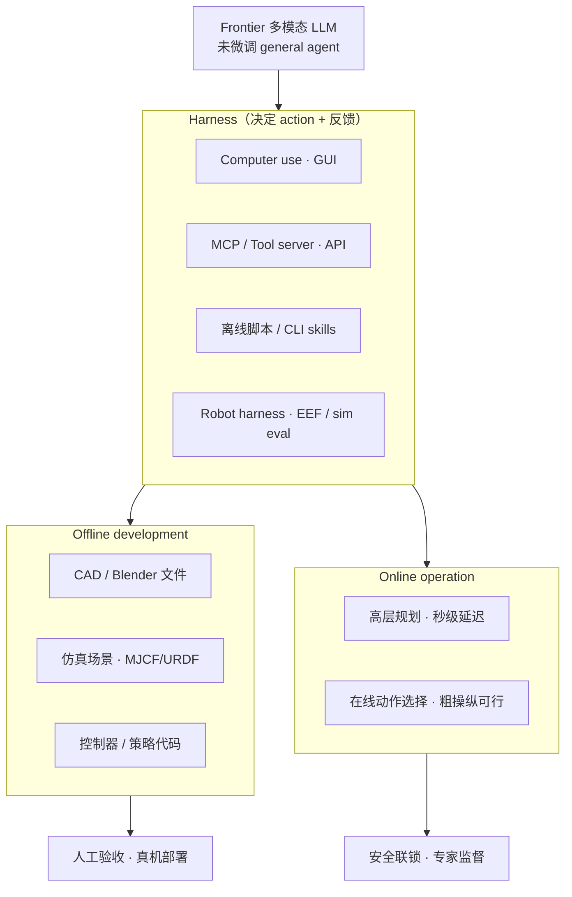

# 前沿模型 × 3D / CAD / 机器人（MIT CDFG Living Survey）

> **本页定位**：为 [MIT CDFG 2026 Living Survey](https://mit-cdfg.github.io/Survey-AI-for-3D-modeling-Robotics/) 提供 **按 harness 与开发模式组织的阅读坐标**；不复述 345 帖细节，只保留 **证据范围、三条主结论、接口 taxonomy、机器人离线/在线分界、评测归因与风险** 和本库已有实体的挂接。具身评测总入口见 [hub-embodied-eval-benchmark](./hub-embodied-eval-benchmark.md)。

## 一句话观点

**公开 frontier 多模态模型（未任务微调、以 agent 形式接工具）已能产出工程师可编辑的 3D/CAD 草稿，并在仿真里离线合成可部署控制器；但 benchmark 数字几乎总是「模型 + harness」的系统成绩，真机快闭环与接触精细任务仍不可靠，物理安全与工程验收不能省略。**

## 英文缩写速查

| 缩写 | 英文全称 | 简要说明 |
|------|----------|----------|
| CAD | Computer-Aided Design | 参数化机械/工业设计；本 survey 含 FreeCAD/SolidWorks/CGM 等 |
| MCP | Model Context Protocol | 结构化 tool server 协议；Blender/CGM/FreeCAD MCP 等 |
| DCC | Digital Content Creation | Blender、Houdini、TouchDesigner 等内容创作软件 |
| B-rep | Boundary Representation | 实体 CAD 边界表示；拓扑合法 ≠ 可制造 |
| VLA | Vision-Language-Action | 端到端视觉–语言–动作策略；与 modular LLM planner 对照 |
| RL | Reinforcement Learning | 强化学习；survey 中离线 reward/环境合成与控制器训练 |
| GUI | Graphical User Interface | Computer use 路径所自动化的桌面交互 |

## 为什么需要单独读这条线

- 机器人社区常把 **「大模型会不会抓」** 与 **「大模型会不会建 sim / 写 reward / 修 CAD」** 混在同一 hype 桶里；本 survey 用 **offline development vs online operation** 和 **harness 表** 强制拆开。
- 本库已有 [RoboDojo](../entities/robodojo.md)、[GPT 6 Astra 具身策略评测](../entities/paper-gpt-6-astra-embodied-policy.md) 等 **固定接口** 对照；MIT 报告把同一 RoboDojo 进度分（42 任务 **1→29/100**）放进 **更大范围的社区演示 corpus**，适合回答「论文 benchmark 之外 showcase 声称什么、多少可复现」。
- **Living document**：索引随 frontier 型号与社区帖更新；本页数字以 **2026-09 报告 Executive Summary** 为准，后续维护应 diff [companion 仓库](https://github.com/Frank-ZY-Dou/awesome-ai-3d-modeling-robotics)。

## 证据范围（Materials）

| 维度 | 规模 | 读法 |
|------|------|------|
| 公开帖 | **345** | 含 X/LinkedIn/厂商帖与开发者报告 |
| 独立 case | **243** | 去重后的 showcase / 实验叙事 |
| 可运行代码 case | **43** | Tier 1 级可验证性；**多数结论仍为演示级** |
| 模型族 | GPT-6 Astra、Claude Opus/Fable、Gemini 等 | 以公开记录中 **有文档** 的系统为主 |

## 流程总览：Frontier 模型 → Harness → 领域产出

## 三条主结论（Executive Summary 对齐）

### 1) 3D / CAD：强草稿，弱终稿

- **3D：** 产出 **可编辑 Blender 场景/程序**（多对象、可迭代修改），而非单一 fused mesh；video→scene 类 benchmark 有代际提升，但 **尺寸是否与真实场景一致** 仍缺 benchmark。
- **CAD：** Parametric CAD Bench（100 FreeCAD 任务）领先模型平均约 **85%** vs 前代约 **70%**；多体装配可达 **数百** verified solids。**公差、应力、可制造性、物理零件验证** 在公开记录中 **未系统覆盖**。
- **实践：** 保留 **原生 parametric 文件**；终稿前预算 **工程校验** 而非信任 B-rep valid  alone。

### 2) 机器人：离线写控 > 在线闭环

- **离线：** 在 Isaac/MuJoCo 等中 **合成控制器** 再部署；报告引用钢琴控制器与若干真机臂/手案例（开发集外 withheld 测试仍少）。
- **在线：** **多秒 inference** → 仅适合 **高层规划**；RoboDojo 42 任务 progress 大幅提升但仍 **远非饱和**；真机 **粗放置** 可成功，**接触丰富精细** sim 任务成功率极低（约 **4%** 量级）。
- **与本库对照：** [GPT 6 Astra 具身策略评测](../entities/paper-gpt-6-astra-embodied-policy.md) 在 **固定 RoboDojo 十任务子集** 上给出 hybrid/direct 数字；读 MIT survey 的 RoboDojo 句时应区分 **全 42 任务 progress** vs **独立报告的成功率/Score**。

### 3) 归因：固定 harness 才能谈「模型进步」

- Computer use、MCP、插件、coding agent **改变可观测错误与可执行操作**；§5.6 要求对比时 **锁定 task + harness + compute**，并报告 **成本、失败尝试、中间进度、物理验证**。
- **Table 1（agentic tool layer）** 是选型 checklist：Blender MCP、CGM MCP、MecAgent、RoboDojo、Inspect Robots、text-to-cad skills 等 **不可互换**。

## 能力地图（§4 压缩）

| 域 | 报告中的「已显示」 | 仍依赖专家 / 未测 |
|----|-------------------|-------------------|
| 3D 建模 | 程序化场景、video→sim 环境、game/UI 资产 | 度量对齐、长期版本管理 |
| 工业 CAD | FreeCAD/SolidWorks/CGM 参数化、装配 | 公差、DFM、物理件 |
| 机器人控制 | 离线 sim 控制器、粗 manipulate | 快闭环、插接/装配、安全 unsupervised |
| 动画 | 绑骨、特效、previs→视频 | 标准 benchmark、自动 rig 修脚 |

## 五个可执行结论

1. **先画 harness 框图再比模型** — 同一 RoboDojo 分数可能来自不同 observation/API；见 [具身评测选型闭环](../queries/embodied-eval-benchmark-selection-loop.md)。
2. **机器人默认 offline-first** — 让 frontier 模型写 **sim + 控制器**；在线只作 **规划**，且经 **与模型无关的安全联锁**（报告 §8）。
3. **CAD/3D 输出当 draft** — 与 [SimFoundry](../entities/paper-simfoundry-real2sim-scene-generation.md) 等 real-to-sim 管线衔接时，声明几何来源是 **agent 生成** 还是 **扫描/重建**。
4. **查 Tier 再信 showcase** — 243 case 中仅 **43** 有 runnable code；ingest 外部帖时沿用 survey 的 **可验证性分层**。
5. **安全与学分单独记账** — 危险物理指令拒绝率、真机损坏案例说明 **不能** 把 VLA 安全假设套用到 general agent tool use。

## 风险摘要（§7）

| 风险 | 含义 |
|------|------|
| 可靠性 | 长链 tool call、GUI 漂移、silent geometric fail |
| 延迟/成本 | Token 与失败尝试在生产力评估中不可忽略 |
| 工程有效性 | 合法 solid ≠ 可制造/可装配 |
| 物理安全 | 低拒绝率 + 真机损坏先例 |
| 出处/教育 | 生成物评估应转向 **约束说明与验错** |

## 与现有 wiki 的位置

| 读者问题 | 去哪里 |
|----------|--------|
| RoboDojo 任务、RealEval、XPolicyLab？ | [RoboDojo](../entities/robodojo.md) |
| GPT-6 Astra hybrid vs Direct 十任务？ | [paper-gpt-6-astra-embodied-policy](../entities/paper-gpt-6-astra-embodied-policy.md) |
| VLA 与 modular LLM 栈？ | [VLA](../methods/vla.md)、[foundation-policy](../concepts/foundation-policy.md) |
| 仿真–真机 gap？ | [sim-vs-real-eval-gap](../concepts/sim-vs-real-eval-gap.md) |
| MCP 在 agent 中的角色（非 CAD 专论）？ | [Open Code Review](../entities/open-code-review.md) |
| 几何状态 / 重建 survey 对照？ | [VGGT 几何状态综述](./vggt-geometric-state-survey.md) |

## 局限

- **MIT CSAIL Research Report（living survey）**，非单一 arXiv 终稿；型号名（GPT-6 Astra 等）随产业迭代 **快速过时**。
- 本页 **不** 逐条收录 345 帖；细节与更正见 [项目页 Appendix C](https://mit-cdfg.github.io/Survey-AI-for-3D-modeling-Robotics/) 与 GitHub companion。
- Survey **不包含** 统一训练代码；各 benchmark（RoboDojo、Parametric CAD Bench 等）复现走 **各自仓库**（见 [awesome-ai-3d-modeling-robotics](../../sources/repos/awesome-ai-3d-modeling-robotics.md) 与报告附录）。

## 工程工具项目入口

[CAE / CFD 代理工具与技能总览](./cae-cfd-agent-skills-landscape.md) 补充具体的软件接口和技能项目：参数化建模可读 [FreeCAD Automation Skill（Cai-aa）](../entities/cai-aa-freecad-automation-skill.md)，设计到分析的衔接可读 [CAD CAE Copilot](../entities/armpro24-blip-cad-cae-copilot.md)。这些节点用于定位实现与依赖，评估时仍沿用本页的 harness、可编辑性和工程验收边界。

## 关联页面

- [hub-embodied-eval-benchmark](./hub-embodied-eval-benchmark.md)
- [RoboDojo](../entities/robodojo.md)、[GPT 6 Astra 具身策略评测](../entities/paper-gpt-6-astra-embodied-policy.md)
- [foundation-policy](../concepts/foundation-policy.md)、[VLA](../methods/vla.md)
- [SimFoundry](../entities/paper-simfoundry-real2sim-scene-generation.md)
- [VGGT 几何状态综述](./vggt-geometric-state-survey.md)

## 参考来源

- [MIT CDFG 报告归档（2026）](../../sources/papers/dou_frontier_3d_modeling_robotics_mit_csail_2026.md)
- [Living Survey 项目页归档](../../sources/sites/mit-cdfg-survey-ai-3d-modeling-robotics.md)
- [awesome-ai-3d-modeling-robotics companion 归档](../../sources/repos/awesome-ai-3d-modeling-robotics.md)

## 推荐继续阅读

- [MIT CDFG Living Survey 交互站](https://mit-cdfg.github.io/Survey-AI-for-3D-modeling-Robotics/)
- [Awesome AI for 3D Modeling & Robotics（GitHub）](https://github.com/Frank-ZY-Dou/awesome-ai-3d-modeling-robotics)
- [RoboDojo Benchmark](https://robodojo-benchmark.com/)
