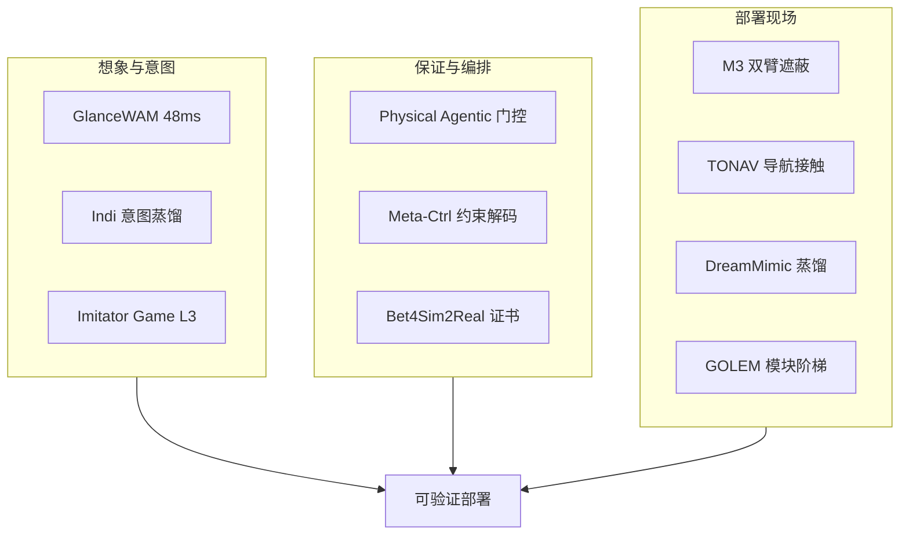

# 48ms WAM / 编排 / 证书：10 篇论文的阅读坐标

> **本页定位**：为 [具身智能小站 · 10 篇盘点](https://mp.weixin.qq.com/s/MdCtmijSM_VfYp19f-nZQw)（2026-08-30）提供 **按五类问题组织的阅读坐标**；不复述每篇方法细节。姊妹近期盘点见 [开源 8 篇](./open-source-8-papers-technology-map.md)、[WAM / VLA / 跨本体 9 篇](./wam-vla-cross-embodiment-9-papers-technology-map.md)、[世界模型与真实执行 10 篇](./world-model-exec-10-papers-technology-map.md)。

## 一句话观点

**具身下一阶段是把隐式结构改成显式接口：想象何时发生、行为目标如何进入解码器、谁验证多机动作、模拟如何变成证书、模块怎样在仿真与真机之间保持一致。**

## 英文缩写速查

| 缩写 | 英文全称 | 简要说明 |
|------|----------|----------|
| WAM | World-Action Model | GlanceWAM 异步想象 |
| VLA | Vision-Language-Action | Indi / M3 动作解码 |
| RO | Robot Orchestrator | Physical Agentic AI 执行门控 |
| SSR | Subgoal Success Rate | Meta-Ctrl 在 WAH-NL 的主轴 |
| GOLEM | Generalized Open Library of Embodied Modules | 人形工业模块库 |

## 为什么单独做这张地图

- 公众号把 10 篇放在「显式接口」叙事里：异步想象、意图蒸馏、多机编排、双臂遮蔽、意图评测、导航–接触、规划保证、仿真证书、模块化人形。
- **Indi / DreamMimic** 在先前 ingest 已有 complete 页 — 本专辑 **复用、不重复造页**。
- 需要横切面索引，避免 10 个实体成孤岛。

## 流程总览

## 分组索引

### 想象何时发生、目标如何进入解码器

| 论文 | 详情节点 | 读什么 |
|------|----------|--------|
| GlanceWAM | [paper-glancewam](../entities/paper-glancewam.md) | 想象离关键路径，动作头 48 ms |
| Indi | [paper-indi](../entities/paper-indi.md) | 行为意图进解码器（复用既有页） |
| Imitator Game | [paper-imitator-game](../entities/paper-imitator-game.md) | L3 功能替代才是意图考场 |

### 谁验证动作、如何收紧评测

| 论文 | 详情节点 | 读什么 |
|------|----------|--------|
| Physical Agentic AI | [paper-physical-agentic-ai](../entities/paper-physical-agentic-ai.md) | 规划无执行权，门控 0% 错派 |
| Meta-Ctrl | [paper-meta-ctrl](../entities/paper-meta-ctrl.md) | 语法/语义拆开，计划按构造合法 |
| Bet4Sim2Real | [paper-bet4sim2real](../entities/paper-bet4sim2real.md) | 仿真下注收窄真机证书 |

### 现场：双臂、四足、人形

| 论文 | 详情节点 | 读什么 |
|------|----------|--------|
| M3 | [paper-m3-modality-masking](../entities/paper-m3-modality-masking.md) | 训练期遮蔽，不改推理结构 |
| TONAV | [paper-tonav](../entities/paper-tonav.md) | 导航停止在操作就绪 |
| DreamMimic | [paper-dreammimic](../entities/paper-dreammimic.md) | RSSM 作蒸馏器（复用既有页） |
| GOLEM | [paper-golem-humanoid](../entities/paper-golem-humanoid.md) | 工业模块阶梯，抓取 97→37% |

## 开源状态速查（入库日）

| 论文 | 状态 |
|------|------|
| GlanceWAM | **已开源** MIT + HF |
| Indi | **未开源**（复用） |
| Physical Agentic AI | **已开源** MIT |
| M3 | **未开源** |
| Imitator Game | **部分开源** Arena / 项目页 |
| TONAV | **待发布** 学习代码 |
| DreamMimic | **待发布**（复用） |
| Meta-Ctrl | **未开源** |
| Bet4Sim2Real | **已开源** 无 SPDX |
| GOLEM | **待核实** org API 404 |

## 关联页面

- [World Action Models](../concepts/world-action-models.md)
- [VLA](../methods/vla.md)
- [开源 8 篇地图](./open-source-8-papers-technology-map.md)
- [WAM / VLA / 跨本体 9 篇](./wam-vla-cross-embodiment-9-papers-technology-map.md)
- [世界模型与真实执行 10 篇](./world-model-exec-10-papers-technology-map.md)

## 参考来源

- [wechat_embodied_station_10_papers_glancewam_vla_crew_2026-08-30](../../sources/blogs/wechat_embodied_station_10_papers_glancewam_vla_crew_2026-08-30.md)
- [raw 抓取](../../sources/raw/wechat_embodied_station_10_papers_glancewam_vla_crew_2026-08-30.md)

## 推荐继续阅读

- [具身智能小站原文](https://mp.weixin.qq.com/s/MdCtmijSM_VfYp19f-nZQw)
- [开源 8 篇地图](./open-source-8-papers-technology-map.md)
- [GlanceWAM 代码](https://github.com/linhanwang/GlanceWAM)
