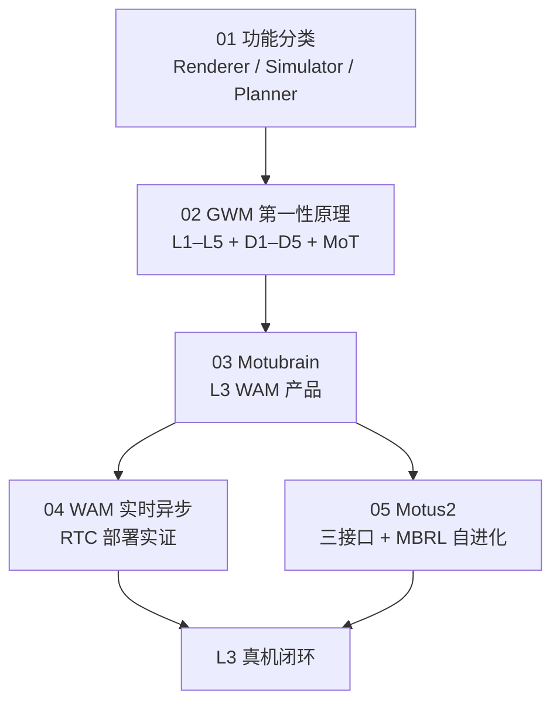

# GWM 闭环：5 篇资料阅读坐标

> **本页定位**：为 [具身智能之心 · 世界模型闭环收拢](https://mp.weixin.qq.com/s/2J1bmGFOL2yC8IvUURBAAg)（2026-09-10）提供 **按五类资料组织的阅读坐标**；方法细节见各 `paper-*` / 概念页。

## 一句话观点

**世界模型术语虽乱，但闭环正在收拢：先用 Fei-Fei 输出三分消歧，再用生数 GWM 报告钉「理解–想象–行动」分级与数据金字塔，最后用 Motubrain + RTC + Motus2 展示 L3 从训练、部署到自进化的工程纵深。**

## 英文缩写速查

| 缩写 | 英文全称 | 简要说明 |
|------|----------|----------|
| GWM | General World Model | 生数第一性原理闭环框架 |
| WAM | World Action Model | L3 可行动世界策略 |
| RTC | Real-Time Chunking | 异步 chunk 部署策略 |
| MoT | Mixture-of-Transformers | 多模态共享状态架构 |

## 为什么单独做这张地图

- 文内同时引用 **概念博客、技术报告、三篇 arXiv 级实例**，读者易把 L 级、D 级与产品名混为一谈。
- **5/5 独立详情节点**（1 新建 GWM 报告 + 1 复用概念 + 3 复用 paper）；**0 重复 arXiv**。

## 流程总览

## 分组索引

| # | 资料 | 节点类型 | 开源（入库日） | 详情 |
|---|------|----------|---------------|------|
| 01 | A Functional Taxonomy of World Models | 概念 | 博客，未开源 | [functional-taxonomy-world-models](../concepts/functional-taxonomy-world-models.md) |
| 02 | General World Models from First-Principles | 技术报告 | 手稿/演讲；无 arXiv | [paper-gwm-first-principles](../entities/paper-gwm-first-principles.md) |
| 03 | Motubrain | 论文 2604.27792 | 仓占位 | [paper-motubrain](../entities/paper-motubrain.md) |
| 04 | World Action Models in Real Time | 论文 2608.01880 | 论文+博客 | [paper-wam-realtime-async](../entities/paper-wam-realtime-async.md) |
| 05 | Motus2 | 论文 2608.30237 | 未开源 | [paper-motus2](../entities/paper-motus2.md) |

## 关联页面

- [World Action Models](../concepts/world-action-models.md)
- [生成式世界模型](../methods/generative-world-models.md)
- [Data Pyramid 综述](../entities/paper-data-pyramid-embodied-manipulation.md) — 与生数 D1–D5 **勿混层号**

## 参考来源

- [wechat_embodied_station_gwm_closed_loop_2026-09-10.md](../../sources/blogs/wechat_embodied_station_gwm_closed_loop_2026-09-10.md)

## 推荐继续阅读

- [腾讯科技 · 世界模型问题反而更多](../../sources/blogs/wechat_tencent_world_model_questions_2026-09-05.md) — 另一套 WM 路线盘点
