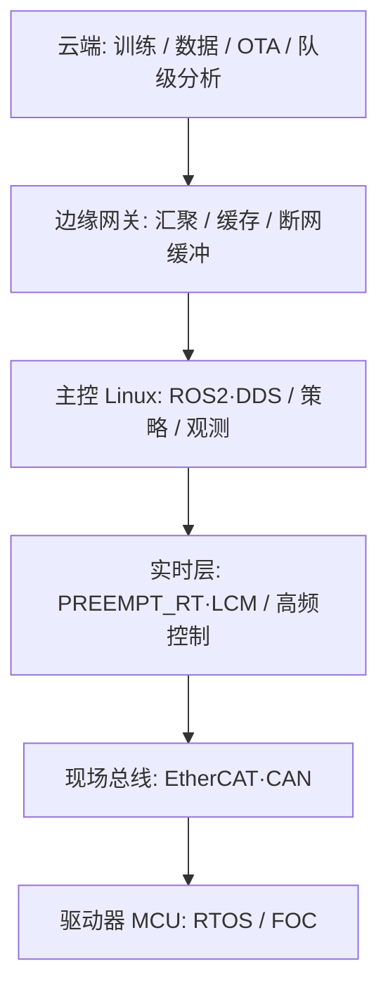

# 机器人系统工程（知识链汇总）

> **知识链入口**：本页是「系统工程 / Systems Engineering」知识链的统一入口，覆盖从驱动器 MCU 到云端发布的非算法基座能力；图谱视角见 [路线视图](../../docs/graph.html?depth=humanoid-hardware-design)。

## 一句话定义

**机器人系统工程知识链** 回答：策略与控制算法之外，真机与研发栈还依赖哪些 **操作系统、网络、数据、分布式、部署、实时与安全** 能力，以及它们在运控环路中的边界在哪里。

## 英文缩写速查

| 缩写 | 英文全称 | 简要说明 |
|------|----------|----------|
| OS | Operating System | 进程/线程/内存/文件系统/调度所在层 |
| RTOS | Real-Time Operating System | 面向截止时间的实时操作系统 |
| DDS | Data Distribution Service | ROS 2 默认底层通信标准 |
| OTA | Over-The-Air | 空中固件/模型更新 |
| CAP | Consistency Availability Partition tolerance | 分布式系统取舍框架 |
| CI/CD | Continuous Integration / Delivery | 持续集成与持续交付 |

## 为什么重要

- 人形/足式落地故障大量来自 **调度抖动、总线超时、错误的中间件选型、无安全 FSM、不可回滚的模型更新**，而非单点 reward 设计。
- 研发效率依赖 **容器化训练、可观测性、数据面一致性**；这与 1 kHz 运控环是两套语义，必须分层看待。

## 本知识链覆盖什么

| 层次 | 读者常问的问题 | 站内入口 |
|------|----------------|----------|
| **实时控制面** | 控制环为什么抖？截止时间怎么保证？ | [RTOS 与实时调度](../concepts/rtos-realtime-scheduling.md)、[实时运控中间件配置指南](../queries/real-time-control-middleware-guide.md) |
| | 大模型推理慢，控制环怎么不被拖垮？ | [控制频率与推理频率解耦](../concepts/control-inference-frequency-decoupling.md) |
| | 通信断了、驱动器报错，机器人该进什么状态？ | [机器人安全状态机](../concepts/robot-safety-state-machine.md)、[WBC FSM](../entities/wbc-fsm.md) |
| | 关节数据走哪条总线？ | [CAN 总线](../concepts/can-bus-protocol.md)、[EtherCAT](../concepts/ethercat-protocol.md)、[UDP 组播动力学](../formalizations/udp-multicast-dynamics.md) |
| **机载软件面** | 进程、线程、内存、调度如何影响机器人程序？ | [操作系统基础](../concepts/operating-system-basics.md) |
| | 同机多进程之间怎么传数据最快？ | [进程间通信（IPC）](../concepts/ipc-inter-process-communication.md) |
| | ROS 2 的节点/话题/QoS 怎么用？底下发生了什么？ | [ROS 2 基础](../concepts/ros2-basics.md)、[DDS 通信机制](../concepts/dds-communication.md) |
| **数据与服务面** | 日志/数据集/OTA 包该用哪种无损压缩？ | [LZ4 vs Zstandard](../comparisons/lz4-vs-zstandard.md)、[LZ4](../entities/lz4.md)、[Zstandard](../entities/zstandard.md) |
| | TCP/UDP/HTTP/DNS/TLS 在遥测与远程运维里怎么选？ | [网络协议栈](../concepts/network-protocol-stack.md) |
| | 采集数据怎么存、怎么查得快？ | [数据库基础](../concepts/database-fundamentals.md) |
| | 缓存为什么会穿透/雪崩/读到脏数据？ | [缓存一致性陷阱](../concepts/cache-consistency-pitfalls.md) |
| | 消息重复、乱序、丢失怎么办？ | [消息队列可靠性](../concepts/message-queue-reliability.md) |
| | 多机/多服务的一致性与超时重试怎么设计？ | [分布式系统基础](../concepts/distributed-systems-basics.md) |
| **部署与运维面** | 训练与部署环境怎么复现？怎么自动发布？ | [容器编排与 CI/CD](../concepts/container-orchestration-cicd.md) |
| | 出了问题怎么定位？该采哪些信号？ | [可观测性：日志/指标/链路](../concepts/observability-logs-metrics-tracing.md) |
| | 策略模型怎么灰度、怎么回滚？ | [模型版本管理与 OTA](../concepts/model-versioning-ota.md) |
| | 哪些算力放机上、哪些放云端？断网怎么办？ | [边缘计算与云端协同](../concepts/edge-cloud-robotics.md) |
| **安全与合规** | 认证、授权、密钥、供应链风险怎么管？ | [软件安全基础](../concepts/software-security-basics.md)、[Codex Security](../entities/codex-security.md) |
| | 工业功能安全认证能直接套到人形上吗？ | [Fail-Passive Gap](../entities/paper-fail-passive-gap.md)（人形主动安全态 vs ISO 13849 切电） |

## 分层读法

- **数据面**（数据库/缓存/消息/分布式/容器/安全）服务云与边，语义是吞吐与一致性。
- **控制面**（RTOS、总线、频率解耦、安全 FSM）服务机载截止时间，语义是最坏延迟。
- 两者交界处的中间件选型见 [通信协议知识链](./hub-communication.md)。

## 从哪里开始读

- **在调实时控制环** → [操作系统基础](../concepts/operating-system-basics.md) → [RTOS 与实时调度](../concepts/rtos-realtime-scheduling.md) → [控制/推理频率解耦](../concepts/control-inference-frequency-decoupling.md) → [实时运控中间件配置指南](../queries/real-time-control-middleware-guide.md)
- **在搭训练与部署栈** → [容器编排与 CI/CD](../concepts/container-orchestration-cicd.md) → [可观测性](../concepts/observability-logs-metrics-tracing.md) → [模型版本管理与 OTA](../concepts/model-versioning-ota.md) → [边缘计算与云端协同](../concepts/edge-cloud-robotics.md)
- **在做上机安全设计** → [机器人安全状态机](../concepts/robot-safety-state-machine.md) → [Fail-Passive Gap](../entities/paper-fail-passive-gap.md) → [软件安全基础](../concepts/software-security-basics.md)

## 与其他知识链的关系

- **[硬件通信与协议](./hub-communication.md)**：本页负责 OS/部署/安全语义，总线与中间件的横向选型在通信链。
- **[WBC](./hub-wbc.md)**：全身控制的截止时间预算依赖本页的实时调度与安全 FSM。
- **[状态估计](./hub-state-estimation.md)**：多传感器时间对齐依赖通信与时钟层能力。
- **[数据管线](./hub-data-pipeline.md)**：采集数据的存储、消息与可观测基础设施在本页。

## 关联页面

- [硬件通信与协议知识链](./hub-communication.md)
- [机器人整机配电架构](../concepts/robot-power-distribution-architecture.md) · [机器人整机通信架构](../concepts/robot-onboard-communication-architecture.md)
- [人形整机硬件设计纵深路线](../../roadmap/depth-humanoid-hardware-design.md)
- [控制环路延迟建模](../formalizations/control-loop-latency-modeling.md)
- [Deployment 技术地图](../../tech-map/modules/system/deployment.md)

## 参考来源

- [OS 与网络一手资料](../../sources/sites/systems_engineering_os_network_primary_refs.md)
- [数据与分布式一手资料](../../sources/sites/systems_engineering_data_distributed_primary_refs.md)
- [部署可观测安全一手资料](../../sources/sites/systems_engineering_deploy_obs_security_primary_refs.md)
- [DDS/RTOS/边云/OTA/安全 FSM 一手资料](../../sources/sites/dds_omg_rtos_edge_ota_safety_primary_refs.md)
- [Codex Security 仓库归档](../../sources/repos/codex-security.md)
- [Fail-Passive Gap 论文策展](../../sources/papers/fail_passive_gap_arxiv_2608_02809.md)

## 推荐继续阅读

- [实时运控中间件配置指南](../queries/real-time-control-middleware-guide.md)
