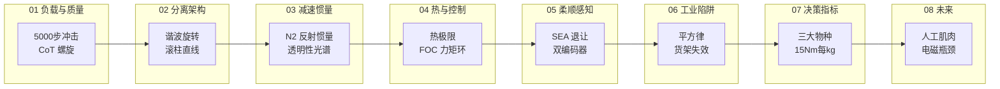

# Humanoid 执行器 102：八章技术地图

> **本页定位**：为 [human five · Humanoid 执行器 入门 102](https://mp.weixin.qq.com/s/zinp6ulTorzfqmCR_HaI5A) 提供 **按论证链条组织的阅读坐标**；部件级清单与供应链见姊妹篇 [Humanoid Hardware 101](./humanoid-hardware-101-technology-map.md)。

## 一句话观点

人形腿部执行器不是「更大扭矩的工业伺服」，而是要在 **亚毫秒冲击** 下 **机械退让**、在 **质量惩罚螺旋** 下维持 **>15 Nm/kg**，并在 **N² 反射惯量** 与 **热极限** 之间选对 **谐波 / 滚柱 / QDD / SEA** 谱系——没有万能最佳，只有匹配任务的物种。

## 与 Hardware 101 的分工

| 维度 | [Hardware 101](./humanoid-hardware-101-technology-map.md) | 本页（Actuator 102） |
|------|-----------------------------------------------------------|----------------------|
| 视角 | 七类子系统、BOM、供应链 | 执行器在腿上**为何坏**、如何选型 |
| 深度 | 电机/减速/丝杠/轴承分件 | 冲击、CoT、反射惯量、控制带宽 |
| 结论 | 2 万美元需减关节与简化手 | 三大物种 + 膝关节样本指标 |

## 流程总览：八章论证链

## 八类分类节点（图谱 hub）

| 组 | 分类节点 | 公众号章节 |
|----|----------|------------|
| 01 负载与质量螺旋 | [负载与质量螺旋](./humanoid-actuator-102-load-and-mass-spiral.md) | I–II |
| 02 分离架构 | [旋转-直线分离架构](./humanoid-actuator-102-split-architecture.md) | III |
| 03 减速与反射惯量 | [减速与反射惯量](./humanoid-actuator-102-gear-reflected-inertia.md) | IV |
| 04 热学与控制 | [热学与力矩控制](./humanoid-actuator-102-thermal-and-control.md) | V–VI |
| 05 柔顺与感知 | [柔顺与感知反馈](./humanoid-actuator-102-compliance-sensing.md) | VII–VIII |
| 06 工业陷阱 | [工业执行器陷阱](./humanoid-actuator-102-industrial-actuator-trap.md) | IX |
| 07 决策与指标 | [决策矩阵与物种](./humanoid-actuator-102-decision-species.md) | X–XI |
| 08 未来路线 | [人工肌肉与未来](./humanoid-actuator-102-future-artificial-muscle.md) | XII + 参考文献 |

## 关联页面

- [Humanoid Hardware 101 技术地图](./humanoid-hardware-101-technology-map.md)
- [Hardware 101 · 集成执行器](./humanoid-hardware-101-integrated-actuators.md)
- [Hardware 101 · 传动链](./humanoid-hardware-101-actuation-sensing-chain.md)
- [人形硬件选型 Query](../queries/humanoid-hardware-selection.md)
- [参考文献索引（source）](../../sources/papers/humanoid_actuator_102_reference_catalog.md)

## 英文缩写速查

| 缩写 | 英文全称 | 简要说明 |
|------|----------|----------|
| BOM | Bill of Materials | 物料清单，硬件零部件列表 |
| QDD | Quasi-Direct Drive | 准直驱，低减速比、高背驱动性的作动方案 |
| SEA | Series Elastic Actuator | 串联弹性执行器，提供柔顺与力控 |
| CoT | Cost of Transport | 单位重量·距离能耗的无量纲移动效率指标 |

## 参考来源

- [wechat_human_five_humanoid_actuator_102.md](../../sources/blogs/wechat_human_five_humanoid_actuator_102.md) — <https://mp.weixin.qq.com/s/zinp6ulTorzfqmCR_HaI5A>
- [wechat_humanoid_actuator_102_2026-06-02.md](../../sources/raw/wechat_humanoid_actuator_102_2026-06-02.md)
- [humanoid_actuator_102_reference_catalog.md](../../sources/papers/humanoid_actuator_102_reference_catalog.md)
