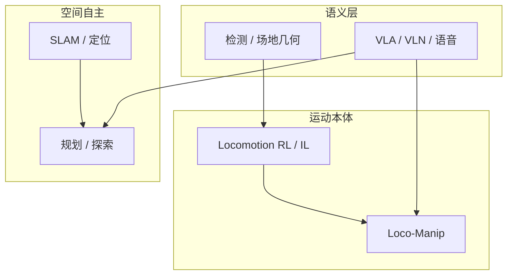

# 人形机器人算法研究现状

## 一句话定义

**人形算法研究现状**是对当前研究主战场的分层快照——**下肢/全身运动、loco-manipulation、导航与探索、比赛级感知决策、大模型具身**——对应课程第 1.2 节，并接到本库可继续深挖的路线与任务页。

## 英文缩写速查

| 缩写 | 英文全称 | 简要说明 |
|------|----------|----------|
| RL | Reinforcement Learning | 高动态运动主流学习范式 |
| IL | Imitation Learning | 动捕/视频驱动模仿与跟踪 |
| AMP | Adversarial Motion Priors | 对抗运动先验 |
| VLA | Vision-Language-Action | 视觉–语言–动作策略 |
| VLN | Vision-Language Navigation | 语言引导导航 |
| SLAM | Simultaneous Localization and Mapping | 建图定位 |
| WBC | Whole-Body Control | 模型基全身控制对照 |

## 为什么重要

- 防止把「人形研究」窄化为单一 PPO 行走；课程 Ch2–8 正是按 **控制 → 导航 → 探索 → 感知 → 大模型** 展开的现状切片。
- 便于选题：做比赛足球、做 VLN、做全身操作，入口不同，评价指标也不同。
- 与 [发展历史](./humanoid-robot-history.md) 互补：历史给时代，本页给 **现在该读哪条线**。

## 核心原理（现状分层）

| 层次 | 近期主流问题 | 代表方法族 | 本库入口 |
|------|--------------|------------|----------|
| 双足/全身运动 | 跟踪、抗扰、起身、地形 | PPO、AMP、BFM、运动扩散 | [Humanoid Locomotion](../tasks/humanoid-locomotion.md)、[控制路线图](../roadmaps/humanoid-control-roadmap.md) |
| 移动操作 | 力交互、全身协调 | 分层/统一策略、接触课程 | [Loco-Manipulation](../tasks/loco-manipulation.md) |
| 导航自主 | 建图、避障、探索 | LiDAR SLAM、A\*/DWA、TARE/FAR | [导航栈](./navigation-slam-autonomy-stack.md)、[自主探索](../tasks/autonomous-exploration.md) |
| 比赛感知决策 | 球/线/对抗 | YOLO + 线几何 + EKF + 技能 RL | [Humanoid Soccer](../tasks/humanoid-soccer.md) |
| 大模型具身 | 语义到动作 | VLA、VLN、语音 agent、NaVid | [大模型赋能人形](./large-model-empowered-humanoids.md) |

## 工程实践（如何读「现状」）

1. **用课程当坐标轴**：每章对应上表一行，先建立地图再钻单篇论文。
2. **跟踪开源与可复现**：有代码/权重的工作优先（课程强调系统可跑）。
3. **综述入口**：具身智能研究室人形 RL 长文等（见参考来源）；本库 [topic-locomotion](./topic-locomotion.md) 作运动专题索引。
4. **写调研时分层引用**：勿把导航 SLAM 论文与全身 VLA 论文塞进同一「SOTA 表」而不声明任务。

## 与课程章节的显式映射

| 课程章 | 现状层 |
|--------|--------|
| Ch2 | 运动本体 RL |
| Ch3–5 | 空间自主 |
| Ch6–7 | 比赛感知决策 |
| Ch8 | 语义层大模型 |

完整节点表见 [人形系统课程策展](../entities/humanoid-system-curriculum.md)。

## 局限与风险

- 「现状」更新极快，本页只做分层导航；细节以专题 overview / 论文实体为准。
- 商业演示 ≠ 可复现算法；以论文设定与开源为准。
- 指标不可跨任务横比（进球率 ≠ 导航成功率 ≠ 操作成功率）。

## 关联页面

- [人形发展历史](./humanoid-robot-history.md)
- [人形控制学习路线图](../roadmaps/humanoid-control-roadmap.md)
- [运动控制专题](./topic-locomotion.md)
- [人形系统课程策展](../entities/humanoid-system-curriculum.md)

## 参考来源

- [深蓝学院人形系统课程大纲](../../sources/courses/shenlan_humanoid_system_theory_practice.md)
- [具身智能研究室人形 RL 运动控制长文](../../sources/blogs/wechat_embodied_ai_lab_humanoid_rl_motion_survey.md)

## 推荐继续阅读

- [人形控制学习路线图](../roadmaps/humanoid-control-roadmap.md)
- [大模型赋能人形](./large-model-empowered-humanoids.md)
