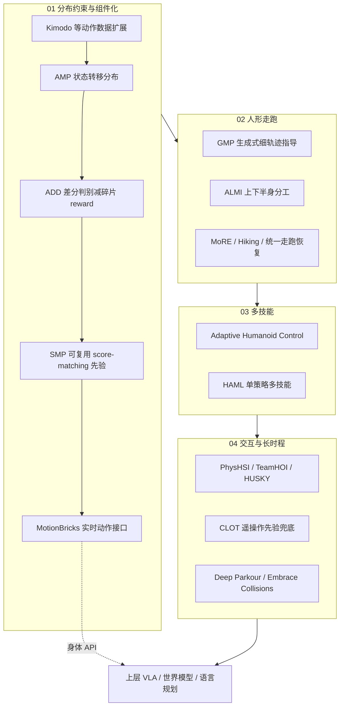

# 人形机器人 AMP：运动先验综述视角

> **本页定位**：为 [具身智能研究室 · AMP 专题长文](https://mp.weixin.qq.com/s/YZsm3855iP3TNTTt1aou7w) 提供 **按问题线索组织的阅读坐标**；不复述每篇论文细节，只保留 **与 mimic / 身体系统栈的分工、四段论文地图、演化判断** 与和本库已有页面的挂接。姊妹篇总框架见 [人形 RL 运动控制身体系统栈](./humanoid-rl-motion-control-body-system-stack.md)。

## 一句话观点

**AMP（Adversarial Motion Prior）解决的不是「能不能跑」，而是「跑起来之后仍不像一个身体」。** 它把策略生成的状态转移约束在人类运动分布附近，让任务 reward 与参考动作之间不必二选一；对人形机器人而言，这是 [身体系统栈](./humanoid-rl-motion-control-body-system-stack.md) 控制层里 **风格 / 分布约束** 的主线，也是未来 VLA、世界模型调用身体前的 **底层合理性边界**。

## 为什么需要单独读 AMP 这条线

- **[DeepMimic](../methods/deepmimic.md) / motion tracking** 能证明「照着参考能跑」；细粒度 tracking reward 也能堆出速度。
- 缺口在 **速度指令满足之后**：步态不自然、起停割裂、恢复怪异、长时程漂移——即「任务完成但仍不像身体」。
- AMP 与姊妹篇 42 篇综述的关系：**八层栈回答「系统在搭什么」**；本篇回答 **「控制层里运动先验这一横切面如何演化」**。

## 流程总览：从分布约束到身体 API

## 四段论文地图（19 篇）

> 标题以公众号 2026-05-21 抓取版为准；**已有 wiki 页** 以链接标出，其余为后续按 arXiv / 项目页升格的候选。

### 01 — 分布约束与先验组件化

| # | 工作 | 要点 | 本库 |
|---|---|---|---|
| 01 | **AMP** (Peng et al., SIGGRAPH 2021) | 约束状态转移分布，非逐帧 mimic | [AMP & HumanX](../methods/amp-reward.md)、[sources/papers/amp.md](../../sources/papers/amp.md) |
| 02 | **ADD** | 对抗式差分判别，减轻多目标 reward 手调 | [add](../methods/add.md) |
| 03 | **SMP** | 运动先验拆成可复用 reward model | [smp](../methods/smp.md) |
| 04 | **Kimodo** | 大规模可控人体动作生成 → 先验数据上限 | [kimodo](../entities/kimodo.md) |
| 05 | **MotionBricks** | 实时 smart primitives + G1 全身控制 | [motionbricks](../methods/motionbricks.md) |

### 02 — 人形走跑（AMP 最自然落点）

| # | 工作 | 要点 | 本库 |
|---|---|---|---|
| 06 | **GMP** | 生成式先验补「哪里不像」的细指导 | — |
| 07 | **ALMI** | 下半身 locomotion + 上半身 mimic | — |
| 08 | **MoRE** | 复杂地形多专家 lifelike 步态 | — |
| 09 | **Hiking in the Wild** | 可扩展感知跑酷框架 | — |
| 10 | **Unified walk/run/recovery** | 状态相关 adversarial motion priors | [AMP_mjlab](../entities/amp-mjlab.md)（工程上统一走+恢复） |

### 03 — 多技能与自适应

| # | 工作 | 要点 | 本库 |
|---|---|---|---|
| 11 | **Adaptive Humanoid Control** | 多行为蒸馏 + RL 微调 | — |
| 12 | **HAML** | 单策略 adversarial 多技能 | — |

### 04 — 交互、特殊运动与长时程

| # | 工作 | 要点 | 本库 |
|---|---|---|---|
| 13 | **Humanoid Goalkeeper** | 位置条件任务–运动约束 | — |
| 14 | **HUSKY** | 滑板：人–板耦合的身体经验 | [loco-manipulation 任务表](../tasks/loco-manipulation.md) 提及 |
| 15 | **PhysHSI** | 坐 / 躺 / 站 / 搬箱的场景交互自然度 | — |
| 16 | **CLOT** | 长时程遥操作闭环 + motion prior 兜底 | — |
| 17 | **TeamHOI** | **masked AMP**：交互部位让给任务，其余保先验 | — |
| 18 | **Deep Whole-body Parkour** | 感知 + 全身 tracking，先验只是一层 | [project-instinct](../entities/project-instinct.md) 生态 |
| 19 | **Embrace Collisions** | 全身接触 shadowing，扩展「自然身体」边界 | [project-instinct](../entities/project-instinct.md) |

## 五个可执行结论（沿用策展文，压缩表述）

1. **AMP ≠ 好看**：是 **任务完成之后** 仍约束在身体分布内的 RL 信号；与 [imitation-learning](../methods/imitation-learning.md) 中纯 tracking 互补。
2. **走跑是第一战场，不是唯一战场**：恢复、遥操作、协作搬运、场景交互同样需要分布约束（见 [balance-recovery](../tasks/balance-recovery.md)）。
3. **先验会组件化**：SMP / MotionBricks 指向 **可复用模块 + 实时身体 API**，避免每换任务重训判别器。
4. **条件化是现实形态**：TeamHOI 的 masked AMP 说明 **「哪里像人、哪里让给任务」** 须分开——与 [身体系统栈](./humanoid-rl-motion-control-body-system-stack.md) 第 7 层「身体 API」一致。
5. **不能替代完整栈**：跑酷 / 全身接触仍需感知 + 接触 + 时机；AMP 是 [八层栈](./humanoid-rl-motion-control-body-system-stack.md) 中 **控制 / 接触** 间的 **分布正则**，不是单点银弹。

## 与现有 wiki 的位置

| 读者问题 | 去哪里 |
|----------|--------|
| 整套 humanoid RL 在搭什么系统？ | [身体系统栈](./humanoid-rl-motion-control-body-system-stack.md) |
| AMP 判别器怎么工作？ | [amp-reward](../methods/amp-reward.md) |
| G1 上统一走 + 跌倒恢复工程实现？ | [amp-mjlab](../entities/amp-mjlab.md)、[mimickit](../entities/mimickit.md) |
| 世界模型在身体栈哪一层？ | [robot-world-models-training-loop-taxonomy](./robot-world-models-training-loop-taxonomy.md) |

## Wiki 实体索引（站内详情页）

> 以下 19 篇均已升格为 `wiki/entities/` 详情页（可搜索、进图谱）。

| # | 论文 | 实体页 |
|---|------|--------|
| 01 | AMP | [paper-amp-survey-01-amp.md](../entities/paper-amp-survey-01-amp.md) |
| 02 | Physics-Based Motion Imitation with Adversarial Differential Discriminators | [paper-amp-survey-02-physics_based_motion_imitation_with.md](../entities/paper-amp-survey-02-physics_based_motion_imitation_with.md) |
| 03 | SMP | [paper-amp-survey-03-smp.md](../entities/paper-amp-survey-03-smp.md) |
| 04 | Kimodo | [paper-amp-survey-04-kimodo.md](../entities/paper-amp-survey-04-kimodo.md) |
| 05 | MotionBricks | [paper-amp-survey-05-motionbricks.md](../entities/paper-amp-survey-05-motionbricks.md) |
| 06 | Natural Humanoid Robot Locomotion with Generative Motion Prior | [paper-amp-survey-06-natural_humanoid_robot_locomotion_wi.md](../entities/paper-amp-survey-06-natural_humanoid_robot_locomotion_wi.md) |
| 07 | Adversarial Locomotion and Motion Imitation for Humanoid Policy Learning | [paper-amp-survey-07-adversarial_locomotion_and_motion_im.md](../entities/paper-amp-survey-07-adversarial_locomotion_and_motion_im.md) |
| 08 | MoRE | [paper-amp-survey-08-more.md](../entities/paper-amp-survey-08-more.md) |
| 09 | Hiking in the Wild | [paper-amp-survey-09-hiking_in_the_wild.md](../entities/paper-amp-survey-09-hiking_in_the_wild.md) |
| 10 | Unified Walking, Running, and Recovery for Humanoids via State-Dependent Adversarial Motion Priors | [paper-amp-survey-10-unified_walking_running_and_recovery.md](../entities/paper-amp-survey-10-unified_walking_running_and_recovery.md) |
| 11 | Towards Adaptive Humanoid Control via Multi-Behavior Distillation and Reinforced Fine-Tuning | [paper-amp-survey-11-towards_adaptive_humanoid_control_vi.md](../entities/paper-amp-survey-11-towards_adaptive_humanoid_control_vi.md) |
| 12 | HAML | [paper-amp-survey-12-haml.md](../entities/paper-amp-survey-12-haml.md) |
| 13 | Humanoid Goalkeeper | [paper-amp-survey-13-humanoid_goalkeeper.md](../entities/paper-amp-survey-13-humanoid_goalkeeper.md) |
| 14 | HUSKY | [paper-amp-survey-14-husky.md](../entities/paper-amp-survey-14-husky.md) |
| 15 | PhysHSI | [paper-amp-survey-15-physhsi.md](../entities/paper-amp-survey-15-physhsi.md) |
| 16 | CLOT | [paper-amp-survey-16-clot.md](../entities/paper-amp-survey-16-clot.md) |
| 17 | TeamHOI | [paper-amp-survey-17-teamhoi.md](../entities/paper-amp-survey-17-teamhoi.md) |
| 18 | Deep Whole-body Parkour | [paper-amp-survey-18-deep_whole_body_parkour.md](../entities/paper-amp-survey-18-deep_whole_body_parkour.md) |
| 19 | Embrace Collisions | [paper-amp-survey-19-embrace_collisions.md](../entities/paper-amp-survey-19-embrace_collisions.md) |

## 局限

- 公众号标题写「20 篇」、正文编号至 19；本页 **不臆造第 20 篇**。
- 上表 19 篇均已各有 `wiki/entities/paper-amp-survey-*` **索引节点**；AMP / ADD / SMP 等另有 `wiki/methods/` 方法页。实体页为策展摘要，细节以论文 PDF / 项目页为准。
- 策展框架不等于领域共识；与 [ULTRA Survey](../tasks/ultra-survey.md) 等其它综述可能分层不同。

## 关联页面

- [人形 RL 运动控制身体系统栈](./humanoid-rl-motion-control-body-system-stack.md) — 42 篇姊妹篇总框架
- [AMP & HumanX](../methods/amp-reward.md)、[ADD](../methods/add.md)、[SMP](../methods/smp.md)、[MotionBricks](../methods/motionbricks.md)
- [AMP_mjlab](../entities/amp-mjlab.md)、[Kimodo](../entities/kimodo.md)、[MimicKit](../entities/mimickit.md)、[ProtoMotions](../entities/protomotions.md)
- [humanoid-locomotion](../tasks/humanoid-locomotion.md)、[loco-manipulation](../tasks/loco-manipulation.md)
- [Project Instinct](../entities/project-instinct.md) — Deep Parkour / Embrace Collisions 生态

## 参考来源

- [万字长文，读懂人形机器人 AMP：20 篇论文搭起的运动先验圣经（微信公众号原文）](https://mp.weixin.qq.com/s/YZsm3855iP3TNTTt1aou7w)
- [具身智能研究室 · AMP 专题（仓库内归档）](../../sources/blogs/wechat_embodied_ai_lab_humanoid_amp_motion_prior_survey.md)
- [AMP 原始论文索引（SIGGRAPH 2021）](../../sources/papers/amp.md)
- [42 篇 RL 运动控制姊妹篇（仓库内归档）](../../sources/blogs/wechat_embodied_ai_lab_humanoid_rl_motion_survey.md)

## 推荐继续阅读

- [AMP 项目页（Xue Bin Peng）](https://xbpeng.github.io/projects/AMP/index.html)
- [两万字 · 42 篇 RL 运动控制（微信公众号）](https://mp.weixin.qq.com/s/hz9JXtJeUPRfUGzfD-pZuA)
- [ImChong/AMP_mjlab](https://github.com/ImChong/AMP_mjlab) — Unitree G1 统一 locomotion + recovery 工程参考
