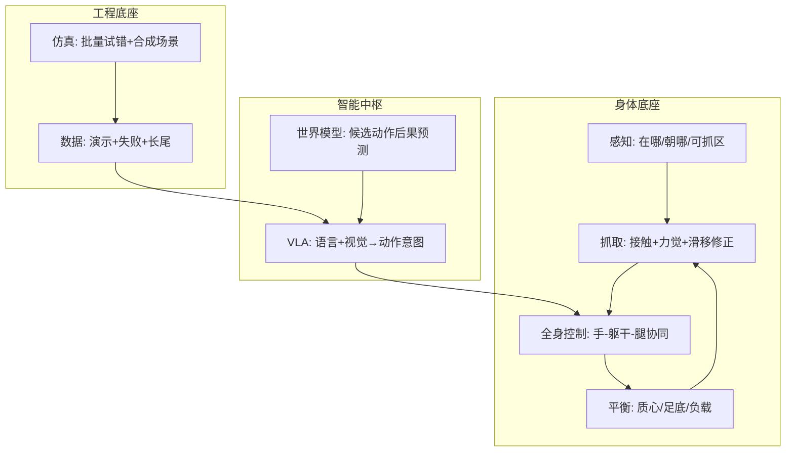

# 人形机器人八大能力技术地图

> **本页定位**：为微信公众号 [**魔方AI空间**](https://mp.weixin.qq.com/s/-33IGrRqnxM6ALuI5ynODg)（猫先生M · 【从零走向 AGI】系列）提供 **八大能力阅读坐标**；不复述厂商 Demo 细节，只保留 **能力分工、层间依赖、按缺口选入口** 与和本库实体页的挂接。与 [身体系统栈](./humanoid-rl-motion-control-body-system-stack.md)（42 篇 RL 综述视角）**互补**：本页更偏 **产业科普 + 全栈鸟瞰**。

## 一句话观点

人形机器人把红杯放进水槽，难的不在「拿起」瞬间，而在 **看清—抓稳—全身协同—不摔—听懂任务—预判后果—靠数据与仿真持续纠错** 的整条链；VLA 与世界模型是身体 API 成熟后的加速器，不是跳过感知与接触控制的捷径。

## 英文缩写速查

| 缩写 | 英文全称 | 简要说明 |
|------|----------|----------|
| VLA | Vision-Language-Action | 视觉+语言+状态 → 动作或动作序列 |
| WM | World Model | 预测「这么动之后世界怎样」 |
| WBC | Whole-Body Control | 手-躯干-腿在动力学约束下协同 |
| MPC | Model Predictive Control | 滚动优化轨迹的全身/步态控制范式 |
| IMU | Inertial Measurement Unit | 姿态与加速度，平衡闭环核心传感 |
| Sim2Real | Simulation to Real | 仿真策略/数据落地真机的工程主线 |
| OXE | Open X-Embodiment | 跨本体机器人演示数据协作项目 |
| HOI | Human-Object Interaction | 人-物交互与操作数据语境 |

## 为什么按「八大能力」而不是「单点 Demo」

文内用 **红杯入水槽** 动机：需识别杯位与朝向、规划抓取力、弯腰时防重心前冲、遇人避让再恢复。线上 Demo 常只展示几秒流畅片段；工厂与家庭更关心 **换一批物体、换一个场地、加一点干扰后还能不能把活干完**，以及出了问题能否自己恢复、与人共事是否安全。

因此把能力拆成三层（文内原话归纳）：

- **基础能力**：感知、抓取、全身控制、平衡 — 让身体能稳定接触世界。
- **智能中枢**：VLM、VLA、世界模型、任务规划 — 把理解变成可执行意图。
- **工程底座**：数据、仿真、后训练、安全约束 — 低成本试错与持续进化。

## 流程总览：从任务到执行



分层执行栈（文内 ASCII，与 [WBC](../concepts/whole-body-control.md) / [VLA](../methods/vla.md) 常见部署一致）：

```
语言任务 + 视觉上下文
        ↓
VLA / 规划：子目标、顺序、动作意图
        ↓
全身控制：手臂、躯干、腿部、步态与约束
        ↓
关节级控制：高频跟踪、力控、碰撞保护
```

## 八能力对照表（文内 × 站内）

| # | 能力 | 文内要解决的问题 | 最直白理解 | 站内入口 |
|---|------|------------------|------------|----------|
| 1 | **感知** | 环境里有什么、在哪、状态怎样 | 认出杯子，还要知道从哪抓 | [具身感知六表征](../concepts/embodied-perception-six-spatial-representations.md)、[2D→3D Gap](../concepts/2d-to-3d-semantic-lifting-gap.md) |
| 2 | **抓取** | 如何稳定接触和操作 | 贴准、抓稳、会纠错 | [抓取 hub](./hub-grasp.md)、[接触力控 hub](./hub-contact-force-control.md)、[Manipulation](../tasks/manipulation.md) |
| 3 | **全身控制** | 手、腰、腿如何协同 | 伸手时整个人都在动 | [WBC](../concepts/whole-body-control.md)、[WBC hub](./hub-wbc.md)、[身体系统栈](./humanoid-rl-motion-control-body-system-stack.md) |
| 4 | **平衡** | 扰动和负载下如何不摔 | 每一步实时找回稳定 | [Balance recovery](../tasks/balance-recovery.md)、[Humanoid locomotion](../tasks/humanoid-locomotion.md) |
| 5 | **VLA** | 视觉和语言如何变成动作 | 听懂「收拾桌面」并开干 | [VLA](../methods/vla.md)、[Open X-Embodiment](../concepts/open-x-embodiment.md)、[π0](../methods/π0-policy.md)、[VLA+WM 14 篇路线](./vla-wm-reading-roadmap-14-papers-technology-map.md) |
| 6 | **世界模型** | 动作会带来什么后果 | 先判断会不会撞、会不会洒 | [生成式 WM](../methods/generative-world-models.md)、[WAM](../concepts/world-action-models.md)、[动作后果地图](./robot-world-models-action-consequence-technology-map.md) |
| 7 | **数据** | 如何积累真实经验 | 经历过什么，决定会什么 | [Teleoperation](../tasks/teleoperation.md)、[Action chunking](../methods/action-chunking.md)、[Data flywheel](../concepts/data-flywheel.md) |
| 8 | **仿真** | 如何低成本训练与验错 | 数字世界里先试更多次 | [Sim2Real](../concepts/sim2real.md)、[训练栈分层](./robot-training-stack-layers-technology-map.md)、[Isaac Lab](../entities/isaac-lab.md) |

## 分能力要点（压缩自文内，挂接已有页）

### 1. 感知

普通 VLM 答「有没有杯子」；机器人还要距离、液体、光滑杯壁、可抓侧与碰撞风险。融合 RGB、深度、位姿、关节与 IMU；**主动感知**（靠近、换视角）把身体移动服务于信息获取。[Gemini Robotics](../entities/gemini-robotics.md) 为文内「多模态理解+空间推理+执行」的公开叙事示例。

### 2. 抓取

完整链：接近 → 对齐 → 接触 → 力觉 → 滑移检测 → 修正。透明杯、软包装、易碎物等长尾靠 **触觉/力觉** 补视觉盲区。文内对照 [RT-2](../methods/robotics-transformer-rt-series.md)（离散动作 token + 语义泛化）与 [π0](../methods/π0-policy.md)（连续 flow matching）— 说明「看懂」≠「抓稳」。

### 3. 全身控制

浮基人形伸手会带动躯干与质心；需 IK、轨迹优化、MPC 与实时反馈。高层 [VLA](../methods/vla.md) / [GR00T-WBC](../entities/gr00t-wholebodycontrol.md) 决定意图，[WBC](../concepts/whole-body-control.md) 决定身体如何做到，关节控制器处理毫秒级电机响应。

### 4. 平衡

行走是持续失衡与恢复；IMU、编码器、足底力矩不可替代视觉的毫秒反应。搬运改变质心，评价应看 **负载、狭窄空间、偶发扰动下能否持续工作**，而非只看跑跳 Demo。

### 5. VLA

| 模型族 | 输入 | 输出 | 主要任务 |
|--------|------|------|----------|
| LLM | 文本 | 文本 | 对话、知识、语言规划 |
| VLM | 图像/视频+文本 | 文本、结构化理解 | 场景理解、VQA |
| VLA | 视觉/状态+语言 | 动作 | 抓取、移动、操作 |

[Open X-Embodiment](../concepts/open-x-embodiment.md) / RT-X 从数据侧推跨本体；[Octo](../methods/octo-model.md)、[OpenVLA](../entities/paper-openvla.md) 为可复现开源通用策略路线。

### 6. 世界模型

给定状态与候选动作，预测未来与风险；用于规划、失败恢复、合成数据与安全筛查。文内强调 **动作对齐的物理正确** 优于「画面像不像」— 与 [WAM](../concepts/world-action-models.md) 及 [动作后果专题](./robot-world-models-action-consequence-technology-map.md) 一致。

### 7. 数据

同步记录视觉、关节、动作、力觉与结果；**失败与恢复** 轨迹告诉系统如何纠错。DROID、OXE 说明质量、可复用性与边界覆盖；重复窄场景数据不如多样性与动作质量（参见 [Data flywheel](../concepts/data-flywheel.md)）。

### 8. 仿真

Isaac Sim/Lab、RoboCasa、Habitat 覆盖物理、日常操作与空间导航等不同环节。现实做法：**真机失败 → 仿真扩展 → 受控真机验证 → 新日志回训**（[Sim2Real](../concepts/sim2real.md)）。

## 工程实践

| 场景 | 先补哪项能力 | 不要做什么 |
|------|--------------|------------|
| Demo 好看但换场景就摔 | 平衡 + 全身控制 + 感知标定 | 直接堆更大 VLA |
| 能靠近但抓不住/打滑 | 抓取 + 力控 + 触觉 | 只靠离散 VLA token |
| 听懂指令但身体跟不上 | WBC / 跟踪器 + 关节级安全 | 让 VLA 直控所有关节力矩 |
| 长任务中途撞人/洒物 | 世界模型规划 + 硬安全停止 | 用生成视频观感代替闭环评测 |
| 真机数据贵、长尾缺 | 仿真扩场景 + 失败回放入库 | 只堆重复 pick-place |

## 局限与风险

- **科普文边界**：文内 Figure Helix、Optimus、远征 A2 等为 **公开叙事示例**，完整控制架构不能从 Demo 反推；数字以官方为准。
- **与姊妹篇重叠**：同系列已讲 VLM/VLN/VLA/WM 七概念与「机器人数据八概念」— 本页专注 **人形全栈能力地图**，细节走 [VLA](../methods/vla.md)、[训练栈](./robot-training-stack-layers-technology-map.md) 等纵深页。
- **不替代论文深读**：RT-2、π0、OXE 等仍以 arXiv / 项目页为准；本库 [VLA+WM 14 篇](./vla-wm-reading-roadmap-14-papers-technology-map.md) 提供论文级路线。

## 关联页面

- [人形机器人（实体）](../entities/humanoid-robot.md)
- [身体系统栈（42 篇 RL 视角）](./humanoid-rl-motion-control-body-system-stack.md)
- [训练栈分层技术地图](./robot-training-stack-layers-technology-map.md)
- [世界模型动作后果地图](./robot-world-models-action-consequence-technology-map.md)
- [VLA 方法页](../methods/vla.md)
- [Loco-Manipulation](../tasks/loco-manipulation.md)
- [Figure AI](../entities/figure-ai.md)
- [GR00T-WBC](../entities/gr00t-wholebodycontrol.md)

## 参考来源

- [魔方AI空间八大能力公众号归档](../../sources/blogs/wechat_mozhai_humanoid_8_capabilities_2026-09-09.md)
- [公众号原文抓取](../../sources/raw/wechat_mozhai_humanoid_8_capabilities_2026-09-09.md)

## 推荐继续阅读

- [原文](https://mp.weixin.qq.com/s/-33IGrRqnxM6ALuI5ynODg) — 八大能力科普全文
- [From-Zero-to-AGI 项目页](https://ai-mzq.github.io/From-Zero-to-AGI/) — 系列索引
- [Gemini Robotics 博文](https://deepmind.google/blog/gemini-robotics-brings-ai-into-the-physical-world/) — 文内感知–推理–执行叙事
- [Open X-Embodiment 论文](https://arxiv.org/abs/2310.08864) — 跨本体数据与 RT-X
