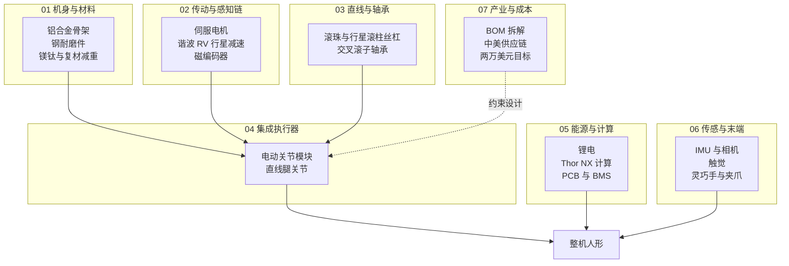

# Humanoid Hardware 101：七类子系统技术地图

> **本页定位**：为 [human five · Humanoid Hardware 入门 101](https://mp.weixin.qq.com/s/10hYwFzC1EuCypFVzC6QGQ) 提供 **按子系统组织的阅读坐标**；不复述全文，只保留 **分析框架、七组 hub 入口、与运控/选型 wiki 的挂接**。整机平台对比见 [人形硬件选型 Query](../queries/humanoid-hardware-selection.md)；运控软件栈见 [人形 RL 身体系统栈](./humanoid-rl-motion-control-body-system-stack.md)。

## 一句话观点

人形硬件最难降本的不是「多买几个便宜电机」，而是 **关节级耦合执行器**（电机×减速器×丝杠×轴承×编码器×热与公差）——在 RL 与可消耗件思维下，**扭矩透明、减自由度、简化手部** 比单纯压供应商报价更接近 2 万美元级 BOM 叙事。

## 为何单独做这张地图

- 公众号文长达 **~4 万字**，按 **第一性原理 + BOM** 写部件，而非按厂商软文堆参数。
- 本站已有 [开源整机对比](../entities/open-source-humanoid-hardware.md)、[硬件选型 Query](../queries/humanoid-hardware-selection.md)，缺 **部件级、供应链级** 横切面。
- 与 [身体系统栈](./humanoid-rl-motion-control-body-system-stack.md) 的关系：系统栈回答「控制/感知软件如何叠层」；本页回答 **「身体下面那层机械与电子成本从哪来」**。

## 流程总览：七类子系统

## 七类子系统分类节点（图谱 hub）

| 组 | 分类节点 | 公众号章节 |
|----|----------|------------|
| 01 机身与材料 | [机身与材料](./humanoid-hardware-101-chassis-materials.md) | 机身骨架 |
| 02 传动与感知链 | [传动与感知链](./humanoid-hardware-101-actuation-sensing-chain.md) | 电机、减速器、编码器 |
| 03 直线与轴承 | [直线传动与轴承](./humanoid-hardware-101-linear-transmission-bearings.md) | 丝杠、轴承 |
| 04 集成执行器 | [集成执行器](./humanoid-hardware-101-integrated-actuators.md) | 执行器 |
| 05 能源与计算 | [能源与计算电子](./humanoid-hardware-101-power-compute-electronics.md) | 电池、计算单元、PCB |
| 06 传感与末端 | [传感与末端执行器](./humanoid-hardware-101-sensing-end-effectors.md) | 通用传感器、触觉、末端执行器 |
| 07 产业与成本 | [产业与成本地缘](./humanoid-hardware-101-supply-chain-economics.md) | 产业格局、成本分析、地缘格局 |

## 三个贯穿全文的工程问题

| 问题 | 文内回答要点 |
|------|----------------|
| **瓶颈部件** | 谐波减速器、行星滚柱丝杠、交叉滚子轴承、高精度手部 |
| **路线分歧** | QDD（行星、高扭矩透明）vs 高减速比（谐波/RV、高扭矩密度） |
| **降本杠杆** | 架构（关节数、手部复杂度）> 垂直整合 > 单件压价 |

## 关联页面

- [Humanoid 执行器 102 技术地图](./humanoid-actuator-102-technology-map.md) — 姊妹篇：行走冲击、反射惯量与三大物种选型
- [人形硬件选型 Query](../queries/humanoid-hardware-selection.md)
- [开源人形硬件对比](../entities/open-source-humanoid-hardware.md)
- [电机驱动与总线协议概览](./motor-drive-firmware-bus-protocols.md)
- [人形电池热管理 Query](../queries/humanoid-battery-thermal-management.md)
- [人形 RL 身体系统栈](./humanoid-rl-motion-control-body-system-stack.md)
- [Agent Reach](../entities/agent-reach.md) — 本文抓取工具链

## 推荐继续阅读

- [人形机器人力学](https://arxiv.org/abs/2309.04329)（综述类背景）
- [摩根士丹利人形机器人供应链报告](https://www.morganstanley.com/)（文内引用，具体版本以原文脚注为准）

## 参考来源

- [wechat_human_five_humanoid_hardware_101.md](../../sources/blogs/wechat_human_five_humanoid_hardware_101.md) — 微信公众号编译（<https://mp.weixin.qq.com/s/10hYwFzC1EuCypFVzC6QGQ>）
- [wechat_humanoid_hardware_101_2026-06-01.md](../../sources/raw/wechat_humanoid_hardware_101_2026-06-01.md) — Agent Reach 原始 Markdown 落盘
