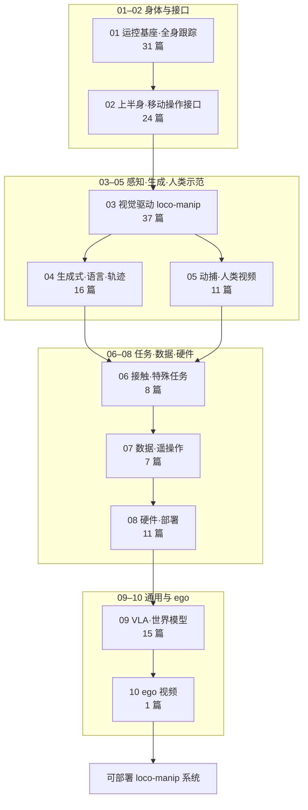

# 人形 Loco-Manip 161 篇技术地图

> **本页定位**：为 [具身智能研究室 · 161 篇人形移动操作长文](https://mp.weixin.qq.com/s/pACh9EhsISiyPGdiiR0C3A) 提供 **父节点阅读坐标**；不复述逐篇细节，只保留 **十类问题重框、能力形成顺序、与运动小脑/8 篇数据入口/身体系统栈的挂接**。姊妹篇 [运动小脑 64 篇](./humanoid-motion-cerebellum-technology-map.md)、[Loco-Manip 8 篇数据入口](./loco-manip-8-papers-technology-map.md)、[人形 RL 身体系统栈](./humanoid-rl-motion-control-body-system-stack.md)。

## 一句话观点

人形 loco-manip 的 161 篇工作可按 **能力形成顺序** 读：先 **运控底座与全身跟踪** 稳住身体，再建 **上半身移动操作接口**；随后接入 **视觉、生成式语言/轨迹、人类动捕视频**；再落到 **接触任务、数据采集、硬件部署**，最后汇聚到 **VLA/世界模型** 与 **ego 视频** 学习——十类不是时间线，而是 **落地链路上的分层模块**。

## 英文缩写速查

| 缩写 | 英文全称 | 简要说明 |
|------|----------|----------|
| Loco-Manip | Loco-Manipulation | 行走与操作动力学耦合的全身任务 |
| WBC | Whole-Body Control | 协调全身关节满足多任务/约束的控制层 |
| VLA | Vision-Language-Action | 视觉-语言-动作多模态策略 |
| WM | World Model | 学习环境动态以供想象/规划的世界模型 |
| RL | Reinforcement Learning | 通过与环境交互最大化长期回报来学习策略 |

## 为什么单独做这张地图

- [Loco-Manipulation](../tasks/loco-manipulation.md) 任务页覆盖方法与案例；本页聚焦 **2026-06 161 篇全景策展** 的 **十类横切面**。
- 与 [运动小脑 64 篇](./humanoid-motion-cerebellum-technology-map.md) 分工：运动小脑偏 **运控/跟踪/小脑接口**；本页覆盖 **移动操作全谱**（含 VLA、WM、硬件、ego）。
- **独立节点：** **161/161** 各建 [`paper-loco-manip-161-{NNN}-*`](../../wiki/entities/) 策展实体；与姊妹篇重叠的论文在 `related` 中 **交叉链既有深读页**，但本 survey 的图谱节点以 `paper-loco-manip-161-*` 为准。全量索引见 [catalog](../../sources/papers/humanoid_loco_manip_161_catalog.md)。

## 流程总览：十类能力形成顺序

## 十组分类节点（图谱 hub）

| 组 | 分类节点 | 篇数 | 核心问题 |
|----|----------|------|----------|
| 01 | [运控基座与通用全身跟踪](./loco-manip-161-category-01-motion-base-wbt.md) | 31 | **底层身体控制、运动跟踪、抗扰动与通用动作执行** |
| 02 | [上半身中心控制与移动操作接口](./loco-manip-161-category-02-upper-body-interface.md) | 24 | **手臂、躯干、根部和末端执行器之间的协同控制** |
| 03 | [视觉感知驱动的人形移动操作](./loco-manip-161-category-03-visuomotor.md) | 37 | **视觉完成目标定位、场景理解和操作闭环** |
| 04 | [生成式运动、语言控制与轨迹规划](./loco-manip-161-category-04-generative-language-trajectory.md) | 16 | **从语言、目标或条件输入生成全身动作和轨迹** |
| 05 | [动捕、人类视频与交互动作规划](./loco-manip-161-category-05-mocap-human-video.md) | 11 | **人类动作数据转成机器人可用的运动和交互先验** |
| 06 | [特殊任务、接触规划与视觉闭环](./loco-manip-161-category-06-contact-tasks.md) | 8 | **开门、推物、搬运、触碰等具体接触任务** |
| 07 | [数据采集与遥操作系统](./loco-manip-161-category-07-data-teleop.md) | 7 | **训练数据如何高效采集** |
| 08 | [硬件平台、感知配置与部署扩展](./loco-manip-161-category-08-hardware-deployment.md) | 11 | **本体、传感器和真实部署系统** |
| 09 | [人形 VLA、世界模型与通用操作](./loco-manip-161-category-09-vla-world-models.md) | 15 | **视觉、语言、动作和世界建模接到执行层** |
| 10 | [从人类第一视角视频学习](./loco-manip-161-category-10-ego-video.md) | 1 | **人类 egocentric 视频学习操作经验和行为先验** |

## 文内收束判断（策展）

| 判断 | 含义 |
|------|------|
| 分层 > 时间堆叠 | 十类按 **能力形成顺序** 读，而非按发表年份 |
| 底座优先 | 无运控/跟踪底座，上层 VLA/WM demo 难稳定落地 |
| 接口关键 | 02 组「上半身中心控制」是 loco-manip 与纯 manipulation 的分水岭 |
| 数据与硬件 | 07–08 组决定 **能否规模化复制** |
| 与姊妹篇 | 64 篇运动小脑、42 篇身体系统栈、8 篇数据入口 **交叉覆盖、视角不同** |

## 关联页面

- [Loco-Manipulation 任务页](../tasks/loco-manipulation.md)
- [VLA](../methods/vla.md)
- [Agent Reach](../entities/agent-reach.md) — 本文抓取工具链

## 参考来源

- [wechat_embodied_ai_lab_humanoid_loco_manip_161_survey.md](../../sources/blogs/wechat_embodied_ai_lab_humanoid_loco_manip_161_survey.md)
- [humanoid_loco_manip_161_catalog.md](../../sources/papers/humanoid_loco_manip_161_catalog.md)
- [wechat_humanoid_loco_manip_161_2026-06-26.md](../../sources/raw/wechat_humanoid_loco_manip_161_2026-06-26.md)

## 推荐继续阅读

- [Loco-Manip 8 篇数据入口地图](./loco-manip-8-papers-technology-map.md)
- [Loco-Manip 接触五段链路地图](./loco-manip-contact-technology-map.md)
- [运动小脑 64 篇技术地图](./humanoid-motion-cerebellum-technology-map.md)
