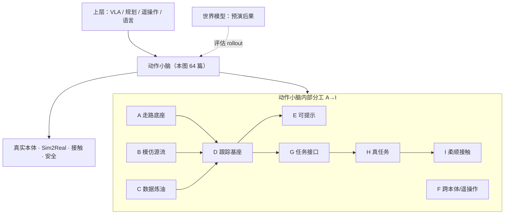

# 运动小脑技术地图：64 篇论文的九组视角

> **本页定位**：为 [具身智能研究室 · 运动小脑 64 篇长文](https://mp.weixin.qq.com/s/Kx9myecE1Z0eGqOapoqQnA) 提供 **父节点阅读坐标**；不复述逐篇细节，只保留 **问题重框、九组论文地图、与身体系统栈 / BFM / Loco-Manip 姊妹篇的挂接**。与 [八层身体系统栈](./humanoid-rl-motion-control-body-system-stack.md) **论文高度重叠、视角不同**：系统栈按管线分层，本页按「动作小脑」横切面（底座 → 模仿 → 数据 → 跟踪 → 可提示 → 跨本体 → 任务接口 → 真任务 → 柔顺）。

## 一句话观点

**走路是底座，全身跟踪是身体接口，Loco-Manip 是任务形态**——VLA 与世界模型 demo 再一致，也绕不开一层能把稀疏意图翻译成 **可执行、可恢复、可迁移** 全身运动的 **动作小脑**；它不一定最会讲故事，但很像人形机器人的基础设施。

## 英文缩写速查

| 缩写 | 英文全称 | 简要说明 |
|------|----------|----------|
| WBC | Whole-Body Control | 协调全身关节满足多任务/约束的控制基础设施 |
| VLA | Vision-Language-Action | 上层策略；文内强调其对身体 API 的依赖 |
| WM | World Model | 预测未来后果；与动作小脑分工不同 |
| Loco-Manip | Loco-Manipulation | 边走边操作的任务形态 |
| RL | Reinforcement Learning | 运控论文主流训练范式 |
| BFM | Behavior Foundation Model | 可提示身体基座，与 E 组论文强相关 |

## 为什么单独做这张地图

- [身体系统栈](./humanoid-rl-motion-control-body-system-stack.md) 回答「humanoid RL 系统在搭什么」；[BFM 41 篇](./bfm-41-papers-technology-map.md) 回答「运控基座如何被上层调用」；本页回答 **「动作小脑这条横切面 2026 如何把 64 篇工作串起来」**。
- **节点复用、避免重复：** 与姊妹篇重叠的论文 **链接到既有** `paper-hrl-stack-*`、`paper-loco-manip-*`、`paper-amp-survey-*`、`paper-bfm-*` 等实体；仅 15 篇尚无索引的工作使用 `paper-motion-cerebellum-*`（见 [catalog](../../sources/papers/motion_cerebellum_64_catalog.md)）。

## 流程总览：动作小脑在栈中的位置

## 九组分类节点（图谱 hub）

| 组 | 分类节点 | 篇数 | 核心问题 |
|----|----------|------|----------|
| A | [走路底座](./motion-cerebellum-category-01-locomotion-base.md) | 10 | 没有稳定步态、地形适配与高动态，后面跟踪与 loco-manip 都是空中楼阁 |
| B | [动作模仿源流](./motion-cerebellum-category-02-motion-imitation.md) | 5 | 从「照着做」到「补着做」：参考动作 + 先验 + 遮蔽补全 |
| C | [数据入口](./motion-cerebellum-category-03-data-pipeline.md) | 9 | 视频恢复、重定向、交互数据——policy 前面最脏也最关键 |
| D | [全身跟踪基座](./motion-cerebellum-category-04-wbt-base.md) | 13 | motion tracking 规模化、鲁棒、恢复与安全 |
| E | [可提示控制](./motion-cerebellum-category-05-promptable-control.md) | 4 | goal / reward / prompt 调用身体 |
| F | [跨本体与遥操作](./motion-cerebellum-category-06-cross-embodiment-teleop.md) | 5 | 身体经验不能锁死在一台机器人上 |
| G | [Loco-Manip 接口](./motion-cerebellum-category-07-loco-manip-interface.md) | 5 | 上层如何给紧凑命令、底层如何补全全身 |
| H | [真实任务](./motion-cerebellum-category-08-real-tasks.md) | 8 | 门、负载、爬梯与数据生成把 gap 一次性暴露 |
| I | [柔顺与接触](./motion-cerebellum-category-09-compliance-contact.md) | 5 | 进入真实环境后必须「和世界商量」 |

## 64 篇论文速查（完整索引见各分类 hub 与 catalog）

| # | 工作 | 组 | Wiki |
|---|------|-----|------|
| 01 | GuideWalk | A | [paper-motion-cerebellum-guidewalk](../entities/paper-motion-cerebellum-guidewalk.md) |
| 02 | T-GMP | A | [paper-motion-cerebellum-t-gmp](../entities/paper-motion-cerebellum-t-gmp.md) |
| 03 | PerceptiveBFM | A | [paper-perceptive-bfm](../entities/paper-perceptive-bfm.md) |
| 04 | MARCH | A | [paper-motion-cerebellum-march](../entities/paper-motion-cerebellum-march.md) |
| 05 | AMS | A | [ams](../methods/ams.md) |
| 06 | OmniXtreme | A | [paper-hrl-stack-16](../entities/paper-hrl-stack-16-omnixtreme.md) |
| 07 | PHP | A | [paper-hrl-stack-22](../entities/paper-hrl-stack-22-perceptive_humanoid_parkour.md) |
| 08 | Deep Whole-body Parkour | A | [paper-deep-whole-body-parkour](../entities/paper-deep-whole-body-parkour.md) |
| 09 | TAGA | A | [paper-motion-cerebellum-taga](../entities/paper-motion-cerebellum-taga.md) |
| 10 | SSR | A | [paper-ssr](../entities/paper-ssr-humanoid-open-world-traversal.md) |
| 11–15 | DeepMimic…MaskedMimic | B | 见 [B 组 hub](./motion-cerebellum-category-02-motion-imitation.md) |
| 16–24 | GVHMR…GenMimic | C | 见 [C 组 hub](./motion-cerebellum-category-03-data-pipeline.md) |
| 25–37 | OmniTrack…SafeFall | D | 见 [D 组 hub](./motion-cerebellum-category-04-wbt-base.md) |
| 38–41 | BFM-Zero…MotionWAM | E | 见 [E 组 hub](./motion-cerebellum-category-05-promptable-control.md) |
| 42–46 | Any2Any…CLOT | F | 见 [F 组 hub](./motion-cerebellum-category-06-cross-embodiment-teleop.md) |
| 47–51 | CEER…主动空间大脑 | G | 见 [G 组 hub](./motion-cerebellum-category-07-loco-manip-interface.md) |
| 52–59 | DoorMan…LadderMan | H | 见 [H 组 hub](./motion-cerebellum-category-08-real-tasks.md) |
| 60–64 | SoftMimic…WT-UMI | I | 见 [I 组 hub](./motion-cerebellum-category-09-compliance-contact.md) |

## 文内收束判断（策展）

| 判断 | 含义 |
|------|------|
| 小脑 ≠ VLA/WM | 不负责语言或画面预测，负责 **身体执行与恢复** |
| 播放器 → 补全器 | 稀疏目标下补全全身，才是动作小脑 |
| 数据炼油不可跳过 | 脚滑/穿地 reference 会污染 tracker |
| 闭环更短更实在 | 仿真→上机→失败录像→改数据，比单篇论文叙事更可信 |
| 土问题才是真问题 | 抗扰、换本体、接触反力、开门被拉回 |

## 按目标选入口

| 你的目标 | 从哪开始 |
|----------|----------|
| 理解「动作小脑」相对 VLA/WM 的分工 | 读本页流程图 → [BFM 概念](../concepts/behavior-foundation-model.md) |
| 已有系统栈背景，换横切面读 64 篇 | [身体系统栈](./humanoid-rl-motion-control-body-system-stack.md) ↔ 本页九组对照 |
| 稀疏目标补全全身 | [MaskedMimic](../entities/paper-bfm-17-maskedmimic.md) → D 组 |
| 视频→机器人可执行数据 | C 组 → [Motion Retargeting](../concepts/motion-retargeting.md) |
| 任务空间命令接口 | G 组 → [Loco-Manip 8 篇](./loco-manip-8-papers-technology-map.md) |
| 开门/负载/爬梯真任务 | H 组 → [Loco-Manipulation](../tasks/loco-manipulation.md) |

## 常见误区

1. **把本图当 64 篇全新论文** — 多数已在 [身体系统栈](./humanoid-rl-motion-control-body-system-stack.md) 或 [BFM](./bfm-41-papers-technology-map.md) 索引；本页是 **新组织透镜**，不是重复建 64 个新节点。
2. **「会走路就够用」** — 文内强调 locomotion 是 **底座**，不是旧技术；接口粗、难接任务。
3. **跟踪 = 跳舞后端** — D 组论点：规模化 tracking 正在变成 **身体基座**。
4. **VLA 跳过小脑** — 姊妹篇一致：语言调用身体是 **结果**，不是起点。

## 关联页面

- [人形 RL 身体系统栈](./humanoid-rl-motion-control-body-system-stack.md) — 42 篇姊妹篇（八层管线）
- [BFM 41 篇技术地图](./bfm-41-papers-technology-map.md) — 运控基座横切面
- [Loco-Manip 8 篇技术地图](./loco-manip-8-papers-technology-map.md) — 数据入口周报
- [人形 Loco-Manip 161 篇技术地图](./humanoid-loco-manip-161-papers-technology-map.md) — 移动操作全谱十类策展（2026-06）
- [AMP 运动先验综述](./humanoid-amp-motion-prior-survey.md) — B 组源流补充
- [Whole-Body Control](../concepts/whole-body-control.md)
- [Agent Reach](../entities/agent-reach.md) — 微信正文抓取工具链

## 参考来源

- [具身智能研究室：运动小脑 64 篇长文](../../sources/blogs/wechat_embodied_ai_lab_humanoid_motion_cerebellum_survey.md)
- [motion_cerebellum_64_catalog.md](../../sources/papers/motion_cerebellum_64_catalog.md)
- [原始抓取](../../sources/raw/wechat_motion_cerebellum_64_survey_2026-06-18.md)

## 推荐继续阅读

- [微信公众号原文](https://mp.weixin.qq.com/s/Kx9myecE1Z0eGqOapoqQnA)（可能需订阅）
- [人形运动跟踪方法选型](../queries/humanoid-motion-tracking-method-selection.md)
